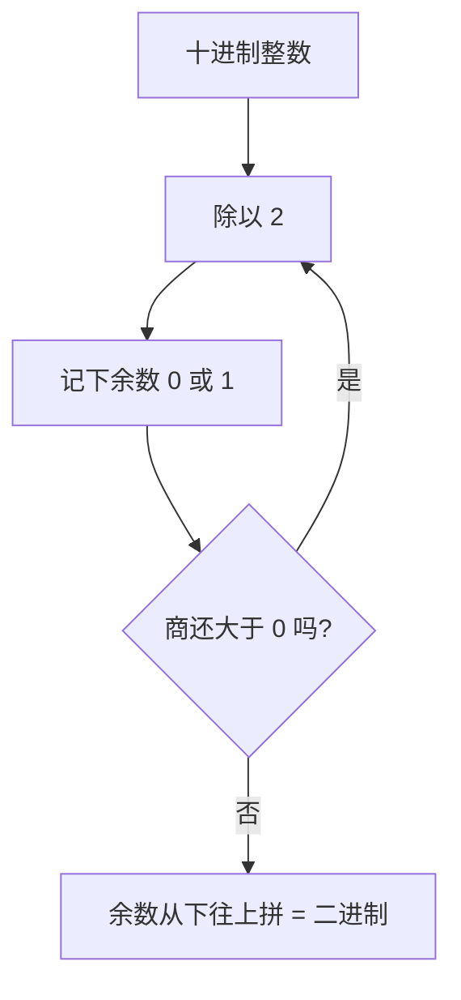

# 第 01 章 · 数——开关怎么表示量

> 本章从哪个问题出发：一台只会开和关的东西，凭什么装下一个数字？
> 推导到哪个结论：二进制不是天选，是工程将就；负数靠补码重编码成加法；这一切都是约定。

> 核心认知：机器只会开和关。你看到的每一个数字，都是人跟机器约好的一套编码——比特本身没有任何意义，意义来自约定。


## 引子

我把那台老电子表拆了。外壳撬开，露出里面一小块黑乎乎的芯片和几条走线，就再没有别的了。没有齿轮，没有刻度，没有一圈圈数字。这表上明明能显示 8:32、12:17，能计时，能倒着数——可我翻来翻去，只在里面找到一片不会说话的硅。

"就这么点东西，"我举着那块芯片冲老谟晃，"它凭什么记住'8 点 32 分'？它身上连个数字的影子都没有。"

老谟正给一台更旧的收音机拧螺丝，头也不抬："你这话说得好像数字是种长在机器里的东西。你自己想想——你把'3'这个念头，是怎么'放进'脑子里的？"

"我脑子……"我一愣，"我脑子里也没有一个写着'3'的小牌子啊。"

"那你凭什么觉得自己能记住'3'？"

这问题问得我胸口一堵。是啊，我凭什么？"3"不是颜色、不是气味、不是一块肌肉，我脑子里到底存了它的什么？

老谟终于抬头，把那颗拧下来的螺丝抛起来又接住："想明白'你的脑子怎么存 3'，你就想明白'这台表怎么存 8 点 32 分'了。二者是一回事——先把'3 长什么样'扔掉，只剩'3 和别的东西不一样'这一点。本章，就干这一件事。"


## 对话引擎

### 第 1 轮：凭什么非得是二进制

**老谟**："你一张口就'二进制'。可人天生爱十进制——十个指头数过来最顺手。机器是你造的，你凭什么不干脆让机器也用十进制？十个电压档位，对应 0 到 9，不行吗？"

**造物主**："因为……二进制简单？计算机算二进制快？"

**老谟**："快？二进制在数学上可一点都不比十进制'快'。你用二进制写个一百，得写七位（1100100），用十进制两位就完了。论省事，十进制才是省事的那个。你那'简单'两个字，是从哪儿偷来的？"

**造物主**："那……难道是电路上，两种状态比十种状态容易做？"

**老谟**："这才沾到点边。你想想：一根导线上的电压，要区分'开'和'关'，得留多少安全区？要区分十档，又得留多少？"

**造物主**："两态只要一个门槛——高过它就是 1，低过它就是 0，中间一大段都是安全区。可要区分十个档，0 到 9 每个档之间得留极窄的缝……稍有噪声、温度漂移、导线损耗，档位就串了。"

**老谟**："今天读出来是 7，明天变成 8。二极管能稳稳'开'和'关'，却很难'开到七分'。所以呢？"

**造物主**："所以是物理上不可靠，才退而求其次用两态？"

**老谟**："把'退而求其次'四个字给我划掉，换句话——**二进制不是数学的必然，是工程的便宜。** 机器选二进制，是因为它容错、便宜、好做，不是因为它'天生正确'。这一点你要刻进骨头里：计算机里绝大多数'理所当然'，都是人跟物理讨价还价后的将就。"

**造物主**：（还是不服气，小声）"可我总觉得，二进制里藏着什么更'根本'的东西……"

**老谟**："你这话我听完就想给你鼓掌——可惜掌声是给'听懂了'的人的。藏着更根本的东西？你觉得它'根本'，恰恰是因为只有两种状态最稳、最不容易被物理噪声推翻——**稳定，就是那个'根本'。** 稳定不是偶然的浪漫，是工程里最硬的事实。你先别急着给它披上哲学的外衣。"

---
**📐 知识锚点：为什么机器用二进制**

【历史溯源】二进制不是新发明，是"老"约定。早在 **1679 年，德国数学家戈特弗里德·莱布尼茨（Gottfried Leibniz）** 就在《二进制算术》里完整描述了二进制系统，甚至把它和中国的八卦（阴爻/阳爻）联系起来。但莱布尼茨当时只是把它当纯数学玩具——他绝没想过这东西会在三百年后统治全世界的计算机。**数学先想明白，工程后用它，中间隔了近三百年。**

【工程实践】工程上选二进制，图的不是"正确"，是**容错与成本**。一根导线上表示"开/关"（两态），只需一个电压门槛，门槛上下都是大片安全区，噪声、温漂、损耗都撼不动它；可要表示十档（0-9），十个电压区间就得紧贴在一起，每个档之间只留一条细缝，任何扰动都会让档位串号。**状态越少，越容错；越容错，越便宜、越好造。** 这就是为什么芯片里清一色两态电路。

【概念深挖】**二进制（binary）** 是一种只用 **0 和 1** 两个数字表示数的进制。人日常用十进制（逢十进一，0-9），机器用二进制（逢二进一，只有 0 和 1）。例如十进制的 **5**，写成二进制是 **101**（表示 1×2² + 0×2¹ + 1×2⁰ = 4+0+1 = 5）。**一个二进制位叫一个比特（bit）**，是信息的最小单位——它只回答一个问题：开，还是关。

---

### 第 2 轮：5 在二进制里到底长什么样

**老谟**："先别想着算。你告诉我，二进制的世界只有 0 和 1。你从 0 开始，一个一个往下写，写到 5，中间每个数怎么跳？"

**造物主**："从 0 开始……0、1，然后是 2。可 2 没有第二个数字用了，只能进位——10。然后 3 是 11，4 是 100，5 是 101？"

**老谟**："你写出来了。停在这儿，别往下写。盯着这排数，告诉我：最低位（最右边那一位）有什么规律？"

```text
0 → 0
1 → 1
2 → 10
3 → 11
4 → 100
5 → 101
```

**造物主**："……最低位在 0、1、0、1 地跳。奇数结尾是 1，偶数结尾是 0！"

**老谟**："对。二进制的最低一位，就是'这个数是奇数还是偶数'。那我现在问你：5 是奇数，它的最低位一定是 1——你把它抹掉，剩下的是谁？"

**造物主**："抹掉最低位……101 去掉 1 剩 10，就是 2？可 5 抹掉一位怎么是 2？"

**老谟**："你反过来想：二进制每往左一位，值是翻倍的（1、2、4、8…）。所以'5 抹掉最低位'，等于'5 除以 2 丢掉了那点零头'。5 除 2 商 2 余 1，商 2 就是 10，余 1 就是最低位。你顺着这个'除 2、取余'往下走，会得到什么？"

**造物主**："……5 除 2 余 1，商 2；2 除 2 余 0，商 1；1 除 2 余 1，商 0。余数从下往上读：1、0、1，就是 101！我这是把'最低位=奇偶'这条路倒着走回去了。"

**老谟**："对。你不是背了个'除二取余'的口诀，你是从'最低位是奇偶'这一步一步把它踩出来的。这口诀是**你推导出来的**，不是天上掉的。"

---
**📐 知识锚点：整数十进制 → 二进制**

【历史溯源】进制转换的方法不是凭空来的，它和**位值制计数法（place-value）** 一脉相承。十进制的"逢十进一"、二进制的"逢二进一"，本质都是**每一位代表一个固定的权值**：从右往左，十进制是 1、10、100…，二进制是 1、2、4、8…。这个"权值"思想源自古代位值计数系统（古巴比伦六十进制、古印度十进制），几千年后才被系统化成今天的进制换算规则。

【工程实践】工程师为什么从不用"除二取余"以外的方法？因为**除二取余**只靠重复的除法和取余就能完成——极其机械、可循环，特别适合交给计算机自动执行（一个 `while` 循环就能写完）。进制转换在工程里不是"心算游戏"，而是程序里一行代码的事。

【概念深挖】整数转二进制用**除二取余**：不断除以 2，记下余数（0 或 1），再从下往上拼。例：

```text
5 ÷ 2 = 2 余 1  → 最低位 1
2 ÷ 2 = 1 余 0  →        0
1 ÷ 2 = 0 余 1  → 最高位 1
从下往上读: 101
```

**最低位是奇偶，往左每一位翻倍**——抓住这两条，整数的二进制就是一张你随时能亲手画出来的表。


读图说明：这是一台"剥洋葱机"。每次从数的腰部剥下一层（最低位），剥下来的余数就是这一层的真相，剩下的商接着剥；一直剥到商变成 0，把剥下来的所有皮从里往外拼起来，就是二进制。机器只要会"除以 2、记余数、判断商是否为 0"三件事，就能无穷无尽地把整数转成二进制。

---

### 第 3 轮：负数，才是真正的坎

**老谟**："二进制装正数，你算是摸到门了。现在来硬的：开关只有 0 和 1，你怎么让它表示 '-5'？"

**造物主**："这还不简单？留一位当符号位，比如最左边是 1 就代表负号。10000101 表示 -5，00000101 表示 +5。"

**老谟**："听起来很讲道理。"他顿了顿，"那我问你，5 + (-5) 等于多少？"

**造物主**："等于 0 啊。"

**老谟**："用你的符号位法，让机器算一遍。它要把两个字节喂进加法电路：00000101 加 10000101。"

**造物主**："我算一下……00000101 加 10000101。个位 1+1=2，进 1……算完是 10001010，也就是 -10。等一下，5 加 -5 怎么会是 -10？"

**老谟**："你发现矛盾了。说说，你想怎么绕过去？你的符号位法，问题出在哪？"

**造物主**："我给它'贴了个标签'——最左边那位我单独当符号用。可贴了标签的数，和正数根本不是同一套逻辑。机器做加法时，得先看懂标签、判断谁正谁负、该加还是该减——一套电路被我拆成了两套。"

**老谟**："那怎么办？"

**造物主**："与其给负数贴标签，不如**把负数挪到正数圈里**，让加法电路一视同仁地加？"

**老谟**："挪？用一个固定长度，比如 8 位，能表示 0 到 255。你想怎么把 -5 挪进去？"

**造物主**："如果我把 -5 定义成 256 减 5，也就是 251？"

**老谟**："251 在 8 位里写成什么？"

**造物主**："11111011。"

**老谟**："那 5 + 251 等于多少？"

**造物主**："256。可 8 位装不下 256，最高位溢出了，剩下的……是 0。"

**老谟**："成了。你亲手把 -5 编码成 251（也就是 256-5），正数 5 就是 5，两者相加溢出后刚好归 0——**减法，被你变成加法了。** 这套把戏，叫补码（two's complement）。你刚才那一下'256 减它'，就是补码的灵魂。"

**造物主**："所以我不是发明了负数，我是发明了'怎么把负数藏进正数里'的编码。"

**老谟**："这就不赖了。你算是没白修那块表。"

---
**📐 知识锚点：补码（two's complement）**

【历史溯源】符号位法的坑，历史上整整一代机器都摔过。最早的商用存储程序计算机 **EDSAC（1949，剑桥，Maurice Wilkes 团队）** 用的就是"符号 + 幅度"（sign-magnitude）式的表示，结果 ±0 并存、加减要判符号，电路处处别扭。真正的转折是 **1964 年 IBM System/360**：这台机器正式把**补码（two's complement）**定为整数的标准表示，从此加减统一成一套逻辑，符号位不再特殊。有趣的是，补码的思想在 1945 年冯·诺依曼的《EDVAC 报告初稿》里就已现雏形。也就是说，你和冯·诺依曼撞上了同一堵墙，只是他比你早八十年想明白；而 System/360 在 1964 年一锤定音，成了今天每一块 CPU 的整数标准。

【工程实践】补码替硬件工程师**省了一块芯片**。如果按符号位法，ALU（算术逻辑单元）得同时备着"加法器"和"减法器"两套电路，再加一个判符号的开关在两者间切换。而补码把 -b 编码成 (2ⁿ - b) 后，a - b 就变成了 a + (2ⁿ - b)——**减法器整个消失，机器里只剩一个加法器**。你手机 CPU 那几十亿晶体管，因此少了一大块重复逻辑。你每充一次电，都在享用这个约定省下的功耗。

【概念深挖】补码（two's complement）是什么：

在 n 位二进制里，模是 2ⁿ。一个数 x 的（n 位）补码，**正数就是自己**，**负数 -x 定义为 2ⁿ - x**。于是 a - b = a + (2ⁿ - b)，只要结果再取低 n 位（溢出自然丢弃），就等价于减法。符号位不再是"标签"，而是补码最高位天然带出来的：最高位为 1 的数，按无符号读本来就大于 2ⁿ⁻¹，正好对应负数区间。

```text
❌ 符号位法（原码）:  -5 → 10000101   （加 +5 → 10001010 = -10，错）
✅ 补码法:            -5 → 11111011   （加 +5=00000101 → 1 00000000，溢出剩 00000000 = 0，对）
```

踩坑注释：原码（符号位法）还有个更尴尬的毛病——它有两个 0（00000000 和 10000000 都表示零），白白浪费一个编码，还让"比较是否为零"要多判一次。补码只有一种 0，且负数区间比正数多表示一个（如 8 位补码能表示 -128 到 127），这都是编码约定带来的红利。

---

### 第 4 轮：亲手造一次——从"看懂"到"能造"

**老谟**："补码你懂了，可'懂'和'能造'隔着一条河。现在把河蹚了——给你一个整数，你给我写出它在 8 位补码下的样子。来，-7。"

**造物主**："-7 的 8 位补码……按公式，256 减 7 得 249，249 的二进制是 11111001。我算出来了。"

**老谟**："算得对，但你是在'背公式'。真造补码的人，从不用'256 减它'——那太慢，硬件也没法直接做减法。硬件用的是另一招，你试着找找。"

**造物主**："另一招？我只知道 -x = 256-x……哦，等一下。补码的核心是'溢出归零'，那能不能从 +7 出发，反着把它翻过去？"

**老谟**："说下去。"

**造物主**："+7 是 00000111。要让它和某个数相加得 0……如果我把每一位都翻转，00000111 变 11111000，再……加 1？11111000 加 1 等于 11111001！这正好是刚才那个 249！"

**老谟**："成了。你不是背出来的，你是造出来的。**取反加一**（NOT 一下，再加 1）——这就是硬件造补码的真实动作。它只需要几个取反门加一个加法器，连减法都不用做，就把 -7 从 +7 翻出来了。"

---
**📐 知识锚点：补码的"取反加一"——数学 vs 工程**

【概念深挖】数学上，-x 定义为 2ⁿ - x，方便你理解"溢出后归零"。但硬件要"省"，就换了个**等价动作：按位取反再加 1（NOT + 1）**。对正数 x 取反得 ~x，~x + 1 恰好等于 2ⁿ - x（在 n 位内），所以两者是同一个补码，只是工程上更好造。把上面的"256 减它"展开，就是 249 = 128 + 64 + 32 + 16 + 8 + 1 = 11111001，但硬件不这样算。

【实现思考】把上面手动造补码翻译成代码，就是"看懂 → 能造"的落地：

```python
def to_twos_complement(x, n):
    mask = (1 << n) - 1
    if x >= 0:
        return x & mask           # 正数就是自己
    return (~x + 1) & mask        # 负数: 按位取反再加 1

print(bin(to_twos_complement(-7, 8)))    # 0b11111001
print((to_twos_complement(-7, 8) + 7) & 0xFF)  # 0
```

**为什么这么造**：`~x + 1` 只需几个 NOT 门（取反）接一个加法器，不需要减法电路。**换条路会怎样**：若按字面"256-x"做，硬件得先造减法器，又绕回原码的老路。同一个数学对象，为方便工程改个等价动作，这就是"约定"在硬件层面的又一次落子。

---

### 第 5 轮：会造还得会还原——补码的自洽

**老谟**："造补码你会了。现在反过来——给你一串补码 `11111001`，你怎么知道它代表 -7，而不是 249？"

**造物主**："8 位里最高位是 1，所以它是负数。可它到底是 -7 还是别的？我……得把它'还原'回原数？"

**老谟**："怎么还原？你刚才的取反加一是'造'，那'还原'该是什么？"

**造物主**："……再造一遍？取反加一，再取反加一，不就回来了？11111001 取反得 00000110，加 1 得 00000111，是 +7！所以它代表 -7。"

**老谟**："对。**补码对自己再'取反加一'一次，就能还原回原数的相反数。** 这正好说明补码是'自洽'的——同一个操作，造是它，还原也是它。你现在既会造、又会还原了。"

---
**📐 知识锚点：补码的自洽性——造与还原是同一个动作**

【概念深挖】补码最漂亮的性质是**自洽**：对任意补码再"取反加一"一次，就得到它的相反数。因为 (~x + 1) 再取反加一 = x（在 n 位内）。所以 `to_twos_complement(-7, 8)` 得 `11111001`，而 `to_twos_complement(11111001 按无符号读 = 249, 8)` 的结果在 8 位里就是 -7 的补码——同一个函数，造负数、还原负数，用的是同一个动作。这就是为什么硬件只需要"取反加一"这一个电路，既管编码又管解码。

【工程实践】若给你一个 16 位补码的电路图，要把"取反加一"的逻辑放进去，你会把它放在加法器的哪一侧？——答案：取反是"一堆 NOT 门"放在加数输入端，加 1 是给加法器最低位进一个"1"。你会发现，造和还原共用的就是这一小段：NOT 门 + 进位。这也解释了为什么补码能在硅上省下整整一个减法器。

---

### 第 6 轮：落点——比特不认识任何数

**老谟**："绕了一圈，回到你修表时的那个问题。你现在告诉我：那块表里，'8 点 32 分'到底被存成了什么？"

**造物主**："被存成一串比特。8 是 1000，32 是 100000……被存成若干个 0 和 1。"

**老谟**："那这串比特，自己知道它'是 8 点 32 分'吗？"

**造物主**："不知道。它连'几点'都不懂。同一串比特，按二进制读是个数，按别的方式读可能是别的……"

**老谟**："说到底——"

**造物主**："说到底，**机器只知道开和关。我写的每一个数字，全是我给比特串贴的标签。比特本身没有任何意义，意义来自约定。** 正数是一套约定，补码是把负数也藏进同一套约定里，让加法不必挑肥拣瘦。"

**老谟**："你终于把'数字'这两个字背后的皮给剥干净了。这一章，你让比特开口报了数。"他低头把那颗螺丝装回收音机，"可下一个问题马上砸过来——你报的是数，可机器还得装'字'。'A'、'你好'、'😊'这些不是数，怎么塞进 0 和 1？"


## 知识点总结

### 知识点（本章推出的核心概念）
- **二进制不是数学的必然，是工程的便宜**：两态比十态容错、便宜、好做，机器选它是因为物理上两态更可靠。
- **整数除二取余**：不断除以 2、记余数、从下往上拼；最低位是奇偶，往左每一位翻倍。
- **补码（two's complement）**：把负数重编码进正数区间（-x = 2ⁿ - x），让减法变成加法，省掉减法器；工程上等价动作为"取反加一"。
- **编码**：比特本身无意义，正数、负数都是人和机器约好的标签。

### 历史结论（本章涉及的史料）
- **二进制**：莱布尼茨 1679 年完整描述二进制系统，当时只是数学玩具，三百年后才统治计算机。
- **补码**：EDSAC（1949）用符号位法，±0 并存、加减判符号；IBM System/360（1964）定补码为整数标准，沿用至今。

### 工程实践结论（本章知识在真实工程里怎么用）
- **ALU 只需一个加法器**：因为补码把减法重写为加法，CPU 少一大块减法逻辑。
- **补码取反加一**：硬件只靠 NOT 门 + 加法器，就能既造负数又还原负数。


## 向导便签

> 这一章咱们干了什么：从拆开的那台电子表，一路逼到补码。你亲手重走了"怎么用开关装下一个数字"的路程——二进制、进制转换、负数补码，一路由最底层构筑。
>
> 钉死一句话：**比特本身是个哑巴，编码才是它开口说话的语法。** 同一个 101，你说是五，机器按补码读也是五，按符号位法读却是 -3——谁对？都"对"，因为"对"的意思是"照同一张表在读"。
>
> 记住：二进制不是天选，是工程将就；补码不是魔法，是把减法藏进加法的编码巧思。这一章，你让比特开口报了数。

## 造物主手记

**我曾踩的坑**：

我以为"计算机用二进制"是因为二进制在数学上更优雅、更"底层正确"。被老谟一句话戳穿——是物理上两态比十态容错、便宜，才退而求其次。我还会把"整数除二取余"当成一个要背的口诀，忘了它其实是从"最低位是奇偶"一步步踩出来的。最丢人的是符号位法：我给 -5 贴了个负号标签，就以为搞定负数了，结果 5+(-5) 在机器里算出 -10。这次我没等老谟指，自己算到一半就发现了矛盾。

**顿悟时刻**：

真正开窍是老谟逼我想"把 -5 藏进正数区间"那一刻。256-5=251，251 加 5 溢出成 0——减法凭空消失了。我突然懂了：负数从来不是"带负号的数"，而是"被重新编码、好让加法不挑肥拣瘦的数"。比特是哑的，约定让它开口。

## 自测题

1. **辨析**：有人说"计算机天生就该用二进制，因为这是最基础的进制"。这句话错在哪儿？（提示：回到第 1 轮的物理讨论。）
   *简答要点*：二进制是工程将就非数学必然；两态比十态容错、便宜、好做。

2. **换算**：把十进制 13 转成二进制，写出过程；再解释为什么除二取余要从下往上读。
   *简答要点*：13 = 1101；因为先除出来的是最低位（奇偶），得最后拼回去。

3. **找茬改错**：下面用 8 位原码（符号位法）算 -3 + 3，请指出结果错在哪，并用补码重算证明正确。
   ```text
   原码: -3 = 10000011,  +3 = 00000011
   相加: 10000011 + 00000011 = 10000110 = -6  （应当等于 0）
   ```
   *简答要点*：原码符号位使加减需判符号且 ±0 并存，补码统一为加法。

4. **编码补全**：写出 8 位补码下 -1、0、+1、+127、-128 的二进制表示，并指出为什么补码的负数比正数多表示一个。
   *简答要点*：-128 因模 2⁸ 余出额外负值。

5. **实现题**：补码的"取反加一"为什么比"256-x"更适合硬件？写一小段代码验证 -7 的 8 位补码。
   *简答要点*：取反加一只需 NOT 门+加法器，不需减法器。


## 预告

比特哑着，编码让它说话。这一章它开口报了数——0 和 1 能表示任何量。可光会"报数"还不够：机器总得对这几个数做出判断，比如"这个数字是不是负数""这两个条件成不成立"。数字有了，判断是下一层地基。下章，我们让比特从"会报数"升级到"会判断"。
