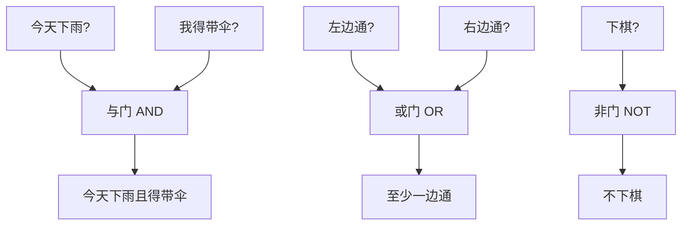

# 第 02 章 · 逻辑——开关怎么做判断

> 本章从哪个问题出发：比特只会开和关，它怎么"决定"一件事成不成立？
> 推导到哪个结论：所有复杂判断拆到底是一堆开关的合谋；而且这一切还能归一成一个 NAND。

> 核心认知：判断不是魔法，是把一堆"是否成立"的小问题，用与、或、非拼接起来；而拼到头，你只需要一种门，就能装下所有判断。


## 引子

我在下棋。不是和人对弈，是跟一台自动摆子的破机器较劲——它是我爸的老古董，只会按几个固定套路落子。我盯着棋盘上一角，它有两条边线都差点堵死，可它偏要往那儿放子。

"这破机器是不是瞎了？"我把棋子敲在棋盘上，"这儿明明走不通，它怎么还'决定'往这儿下？"

老谟靠在旁边看热闹，问了一句："那你来。就这一格，你要怎么让机器'决定'该不该落子？"

"那还不容易？先看左边通不通，再看右边通不通，两边都不通——那就别下。两边至少一边通——那才下。"

"行。"他点了点头，"那你刚才这句话里，藏着几个'判断'？"

"……一个？落不落子？"

"你再念一遍你刚说的那句话。"老谟慢悠悠地说，"'两边都不通就别下'——这里头是不是还藏着'两边都不通'这个判断？'两边至少一边通'——这里头是不是又藏着'至少一边'这个判断？"

我眨了眨眼，手里的棋子停在半空。原来一句话里，套着一层又一层的"成不成立"。机器要怎么一层层拆开、又一层层拼回去，最终"决定"一件事？本章，就干这一件事。


## 对话引擎

### 第 1 轮：一件事，成还是不成

**老谟**："先说最简单的。你让机器判断'今天下雨吗'——机器怎么知道？"

**造物主**："看传感器呗。湿度高就为'真'，湿度低就为'假'。反正就两个答案：成立，不成立。"

**老谟**："对。任何'判断'，拆到最底下，都只能是二选一：真，或者假；成立，或者不成立；1，或者 0。你上一章让比特表示数，这一章让比特表示'这件事成不成立'。一个比特，恰好装得下一个二选一。对吧？"

**造物主**："对啊，比特只会开和关，这不正好对应'成立/不成立'？"

**老谟**："那我问你——你光有一个比特，能表示'今天下雨'，但它能表示'今天下雨 而且 我得带伞'这个判断吗？"

**造物主**："这……是两个比特？一个管'下雨'，一个管'带伞'。可是这两个比特之间，怎么'合起来'变成一句话？"

**老谟**："问到点子上了。两个独立的'是/不是'，要拼成一个新的'是/不是'——这件事，叫**运算**。而人管这套'用是/不是 来算'的学问，先别急着问我叫什么，你先想想：这个'而且'，要怎么用两个比特算出来？"

---
**📐 知识锚点：把"判断"变成可以算的代数**

【历史溯源】把"判断"变成能算的代数，是**乔治·布尔（George Boole）** 在 **1854 年**的《思维规律的研究》里干成的事。他第一次提出：逻辑的"真/假"可以像数一样做运算，于是诞生了**布尔代数（Boolean algebra）**。但在布尔的时代，这只是哲学家和逻辑学家的玩具。真正的转折在 **1937 年，香农（Claude Shannon）** 在他的硕士论文《继电器和开关电路的符号分析》里，把布尔代数和电路开关画上了等号：一个开关的通/断，就是布尔代数里的 1/0。**从此，人的"判断"第一次能被物理电路算出来。** 你今天用的每一台电脑，底层都是这一纸论文。

【工程实践】为什么"判断"必须变成代数才能进机器？因为机器只会算，不会"想"。把"该不该落子""下不下雨"这种念头，翻译成"几个 0/1 怎么互相加减乘除"，机器才有得下手。**布尔代数就是'把人的判断翻译成机器的算术'的语法。** 它只有三个基本动词：与（AND）、或（OR）、非（NOT），其余一切复杂判断，都是这三个动词的组合。

【概念深挖】**布尔代数（Boolean algebra）** 研究的是 **真（1）/ 假（0）** 这两个值之间的运算，最基本的有三种：

- **与（AND）**：两个都为真，结果才为真。写作 `A ∧ B` 或 `A AND B`。表格里只有 `1 AND 1 = 1`，其余全为 0。
- **或（OR）**：只要有一个为真，结果就为真。写作 `A ∨ B`。表格里只有 `0 OR 0 = 0`，其余全为 1。
- **非（NOT）**：取反。真的变假，假的变真。写作 `¬A`。

这几种运算通常列成**真值表（truth table）**——把输入的所有组合和对应输出一张表列全。真值表是布尔代数最老实、最不会出错的工具。

---

### 第 2 轮：与、或、非，机器里长什么样

**老谟**："你刚才说'两个比特要合起来'。那你先告诉我，'今天下雨 而且 我得带伞'这个'而且'，两个比特怎么算？"

**造物主**："是不是……两个都是 1，结果才是 1？只要有一个是 0（不下雨，或者我不用带伞），那整句'下雨且带伞'就……不成立？"

**老谟**："你把'都真才真，一假就假'给说出来了。这就是**与（AND）**。那'下雨 或者 我没带伞我也走'这种'或者'呢？"

**造物主**："只要有一个是真就真？两个都假才假？"

**老谟**："对。这是**或（OR）**。再来个最难缠的——'不下雨'，就三个字，一个比特怎么表示？"

**造物主**："把它取反呗。下雨是 1，不下雨就是 0；下雨是 0，不下雨就是 1。一个开关反着接。这是**非（NOT）**。"

**老谟**："全对了。可现在要命的来了：你光会说'与或非'三个词，没用。机器里到底拿什么'算'？你上一章说机器只会开和关，那你总得告诉我，这个'与'，在电路里长什么样？"

**造物主**："长什么样……呃，我总不能拿两个开关并列接灯泡就算'与'吧？得有一个东西，两个输入进来，一个输出出去，按'与'的规则给出结果。这……就叫'门'？"

---
**📐 知识锚点：逻辑门——布尔代数住进电路**

【历史溯源】香农 1937 年那篇论文的核心，就是把布尔的"与/或/非"翻译成**电路里的开关网络**。顺着这条线，工程师造出了一种基础积木，叫**逻辑门（logic gate）**：它有若干输入端、一个输出端，输出严格按某一种布尔运算的规则决定。**逻辑门就是"布尔代数"和"物理电路"之间的接缝**——你在这头写逻辑，门在那头给你跑出真实的电压。

【工程实践】逻辑门不是图纸上的抽象符号，是真实的晶体管堆出来的。现代芯片用 **CMOS（互补金属氧化物半导体）** 工艺，用一组 PMOS + NMOS 晶体管组合实现每种门。工程师不手搓晶体管，而是用一套"标准单元库"（标准逻辑门），把 AND、OR、NOT 当作搭积木的模块用。**今天你看到的"芯片设计"，绝大部分是把几十亿个逻辑门摆布、连线、算时序。** 你手机里那个"判断"，最终就是几亿个门在 0.000000001 秒内各自算完、拼出结果的合谋。

【概念深挖】**逻辑门（logic gate）** 是按布尔运算规则工作的最小电路积木。三种基本门：

| 门 | 输入→输出规则 | 真值表（A, B → 输出）|
|----|--------------|----------------------|
| **与门 AND** | 都 1 才 1 | 00→0, 01→0, 10→0, 11→1 |
| **或门 OR** | 有 1 就 1 | 00→0, 01→1, 10→1, 11→1 |
| **非门 NOT** | 取反 | 0→1, 1→0 |

用一个 mermaid 图把"判断如何分进门"画出来：


读图说明：每个输入（"今天下雨?"）都是一路 0/1 信号，流进某个"门"，门按自己的规则吐出一个 0/1。你可以把整张图想象成一根水管网：每个门是一个阀门，输入是开/关，输出是阀门另一头有没有水。**任何复杂的判断，拆到最后，就是一张密密麻麻的"阀门图"。**

---

### 第 3 轮：复杂判断怎么拼——先拆开，再合谋

**老谟**："光会三个门还不够。你下棋那句'两边都不通就别下'——把这个判断，用门给我拼出来。你自己来。"

**造物主**："'两边都不通'——'左边不通'是 L，'右边不通'是 R。'两边都不通'就是 L 和 R 都是真，这是**与门**：L AND R。"

**老谟**："那'别下'这个结论呢？"

**造物主**："'两边都不通'才'别下'……哦，'别下'是把'下'取反。所以整句是 NOT ( L AND R )？就是'不要（两边都不通）'？"

**老谟**："慢着。你把它化简试试——'两边都不通就别下'，反过来是不是'只要有一边通就下'？"

**造物主**："……那不就是'左边通 或者 右边通'？那就是 OR 门？咦，我绕了半天 NOT(L AND R)，你怎么一眼就说它等于 L OR R？"

**老谟**："因为这两件事，数学上是同一个判断。你算出过矛盾吗？没有——你算出了两条路，它们给出同一个答案。这中间藏着一个很著名的对偶规律，我让你自己摸一遍。"

---
**📐 知识锚点：德·摩根定律——"取反"和"与或"的握手**

【历史溯源】"NOT(A AND B) 等于 (NOT A) OR (NOT B)"这条规律，叫**德·摩根定律（De Morgan's laws）**，得名于 19 世纪英国数学家**奥古斯都·德·摩根（Augustus De Morgan）**，他是布尔的同时代人，两人在逻辑代数上互相启发。德·摩根定律几乎是布尔代数的"另一半"，它告诉你：**"不成立（同时满足）" 等价于 "至少一个不满足"**——这比听起来重要得多，因为工程上经常需要把"取反"往里面塞，好让电路更省。

【工程实践】德·摩根定律在芯片设计里是天天用的"化简神器"：它可以帮你把一种门换成另一种门（比如把 AND 换成 OR + NOT），从而凑合硬件里"现成的门"。真实的电路库里，不是每种门都有，工程师经常靠德·摩根定律把表达式改造成"库里正好有"的样子，省下好几千个晶体管。

【概念深挖】德·摩根定律有两条（重点）：

- **NOT (A AND B) = (NOT A) OR (NOT B)**："不是（A 且 B）" ⇔ "（不是 A）或（不是 B）"
- **NOT (A OR B) = (NOT A) AND (NOT B)**："不是（A 或 B）" ⇔ "（不是 A）且（不是 B）"

一句话记法：**取反要从括号外"钻"进括号里，同时把 AND 和 OR 对调。** 用真值表可以逐行验证这两条恒成立——它俩不是猜的，是数学上铁的。

---

**造物主**："所以我把'别下'拼成 NOT(L AND R)，你用德·摩根把它翻成 L OR R，两个都对？"

**老谟**："都对。而且这不只是'对'——这说明**同一个判断，可以有好几种门法拼出来**。你想想这意味着什么？"

**造物主**："意味着……我不一定非要所有种类的门都造齐？"

**老谟**："你抓到根上了。这正是下一种要命的东西要登场的地方。"

### 第 4 轮：能不能只留一种门

**老谟**："工程师最抠门。你说，造芯片时，能不能只造一种门，剩下所有的判断都用它拼出来？"

**造物主**："一种门？那怎么拼'与''或'？我觉得不行，三种功能完全不一样。"

**老谟**："别急着下结论。我给你看一个反例——有一种门，叫**与非门（NAND）**，它就是在'与门'后面再接一个'非门'：先算 A AND B，再取反。它的输出是：只有 A、B 都是 1 时，才输出 0；其余情况全输出 1。"

**造物主**："那不还是'与'加'非'？跟只有一种门有什么关系……等等，你不会要说，光用 NAND 就能拼出 NOT 吧？"

**老谟**："你试试——一个 NAND，把它的两个输入并成同一个信号 A。"

**造物主**："A NAND A……按规则，A 和 A 都是 1 时输出 0，都是 0 时输出 1。那不就是 NOT A 吗？诶，我居然用一个 NAND 造出了非门！"

**老谟**："这就不错了。那再用 NAND 拼一个 AND 出来？"

**造物主**："AND 是'都 1 才 1'，NAND 是'都 1 才 0'——差了最后那一下取反。我先把 A NAND B 出来，再把它取一次反？那就得再接一个 NAND……接成 NOT(A NAND B)？可那不是又用回 NAND 当非门了吗——咦，A NAND B 再 NAND 一次……这不就是 A AND B 了吗？"

**老谟**："你绕明白了。来，把 OR 也给我造出来——就一句话提醒你：德·摩根。"

---
**📐 知识锚点：NAND 的完备性——一种门装下全部逻辑**

【概念深挖】**与非门（NAND，NOT-AND）**：先 AND 再取反，只有 A=B=1 时输出 0，其余输出 1。它的威力在于，**光用 NAND 一种门，就能造出 NOT、AND、OR 全部三种基本门**：

```text
NOT A  =  A NAND A                      （输入并起来）
A AND B  =  (A NAND B) NAND (A NAND B)  （先 NAND，再取一次反）
A OR B   =  (A NAND A) NAND (B NAND B)  （德·摩根：NOT(NOT A AND NOT B)）
```

既然 NOT/AND/OR 都能用 NAND 拼出来，而任何布尔表达式都只是这三种的组合，那么**任何布尔逻辑，都能用纯 NAND 电路实现**。这个性质叫 **NAND 的完备性（functional completeness）**。

【工程实践】NAND 完备性为什么值钱？因为它让芯片厂**只需要造一种门**。真实的硅片制造里，"门的种类越少越好"——一种门可以统一布局、统一工艺、统一布线，制造成本和设计成本都大幅下降。**事实上，标准单元库里几乎所有门（包括专门的 NAND 单元）最终都在物理上由 CMOS 晶体管实现，而理论上你完全可以只靠 NAND 这一种积木搭出整个 CPU。** 更夸张的是，另一个极端——**或非门 NOR 也同样是完备的**（OR + NOT 也能反推出全部），所以工程师常说"NAND 和 NOR 是万能门"。

【历史溯源】"只要一种门就能搭出所有逻辑"这个想法，不是现代芯片的突发奇想，而是**逻辑代数的理论基石**。早在布尔和德·摩根的时代，逻辑学家就注意到逻辑运算之间存在冗余——某些运算可以用另一些定义出来。到了 20 世纪，随着 **Sheffer（亨利·谢弗，1913）** 提出"非与"（NAND）和"非或"（NOR）这两种单一运算都能独立表达全部布尔逻辑，这一事实被理论化。**先有"一种门就够了"的数学证明，后有"芯片只造一种门"的工程选择**——又是约定先于实现的例子。


读图说明：这是一条"从需求到硅片"的流水线。任何再复杂的判断，第一步先拆成"与/或/非"三个动作（第 2 轮你干过）；第二步用德·摩根定律化简（第 3 轮）；第三步利用 NAND 完备性，把"与/或/非"全部翻译成同一种 NAND 门；最后，这一堆 NAND 就是可以在晶圆上造出来的电路。**从头到尾，积木只有一种。**

---

### 第 5 轮：亲手拼一次——拿 NAND 造一个判断

**老谟**："光看会了不算。来，给我出一个真的判断，你用 NAND 拼给我看。就你下棋那句：'只要左边通，或者右边通，就下。'"

**造物主**："这是 OR 判断：L OR R。按你给的公式，OR 用 NAND 拼是 (L NAND L) NAND (R NAND R)。我先造两个'非'，再把它们 NAND 在一起。"

**老谟**："你确定？你刚才自己说的公式，可别抄错了。L NAND L 是什么？"

**造物主**："L NAND L = NOT L。R NAND R = NOT R。然后 NOT L 和 NOT R 再 NAND：NOT( NOT L AND NOT R )……用德·摩根翻一下，就是 L OR R！对上了。"

**老谟**："你自己走通了。那你再想想——如果现在要拼'两边都不通才别下'（NOT(L AND R)），用 NAND 怎么拼？"

**造物主**："这就是 NAND 本身啊！L NAND R 就是 NOT(L AND R)，一个门搞定。"

**老谟**："漂亮。你发现没有——你绕了一圈，发现'两边都不通才别下'这个判断，本来就长着一副 NAND 的样子。有时候不是人刻意去造 NAND，而是 NAND 天生就在那儿等着你。"

---
**📐 知识锚点：亲手实现一个判断——从门到代码**

【实现思考】把上面的逻辑翻译成 Python，就是"看懂 → 能造"的落地。这里我们不画电路，直接用布尔运算模拟逻辑门：

```python
def nand(a, b):
    return not (a and b)     # 与非: 都真才假

def NOT(a):
    return nand(a, a)        # 输入并起来 = 取反

def AND(a, b):
    return NOT(nand(a, b))   # 先 NAND 再取反

def OR(a, b):
    return nand(NOT(a), NOT(b))  # 德·摩根: NOT(NOT a AND NOT b)

# 测试所有组合
for a in (False, True):
    for b in (False, True):
        print(a, b, "AND=", AND(a,b), "OR=", OR(a,b), "NAND=", nand(a,b))
```

**为什么这么造**：所有函数底层只调用一个 `nand`，这正是"NAND 完备性"的代码版——整段程序只有一种真正的原语。**换条路会怎样**：如果直接写 Python 的 `and`/`or`，当然更省事，但那是在"语言替你造好了门"的前提下；一旦你落到只能提供 NAND 的硬件上（某些极简 CPU 或密码学硬件），这套手搓函数就是你的全部武器。你会发现，'理解布尔代数'和'在只能用一种门的环境里生存'，是完全不同的两种能力，后者才是本章练的东西。

---

### 第 6 轮：落点——判断是一堆开关的合谋

**老谟**："下完这盘棋，你回头看看：从'今天下雨吗'这种最朴素的二选一，到你下棋时那句'两边都不通就别下'，中间发生了什么？"

**造物主**："我把一句人话，拆成了一堆 0/1 的信号，再用与、或、非这些门一层层拼回去，最后得到一个 0/1 的输出——下，还是不下。"

**老谟**："那这个'判断'，到底是哪个门'做'出来的？"

**造物主**："……哪个都不是。是它们合起来干的。每一个门只干自己那一丁点事，但一层套一层，最后就'决定'了一件事。"

**老谟**："说到底——"

**造物主**："说到底，**所有复杂判断，拆到底就是一堆开关的合谋。** 而这一堆开关，甚至可以归一成一种——NAND。不管是几百个门，还是一个 NAND 拆出来的几百个副本，道理都一样：判断不是魔法，是约定好的一套拼装规则。"

**老谟**："合谋，这个词用得好。这一章，你让比特学会了'判断'。"他看了看棋盘，"可下棋只是最简单的判断。真正的问题是——'判断'能不能反过来用？我这儿有几十个'和''或'堆在一起，能不能有个法子，一眼看出它到底成不成立、还能不能化简？下章，我们去找那个法子。"


## 知识点总结

### 知识点（本章推出的核心概念）
- **布尔代数（Boolean algebra）**：把"判断"变成能算的代数，只研究真(1)/假(0)，基本运算是与(AND)、或(OR)、非(NOT)。
- **逻辑门（logic gate）**：按布尔运算规则工作的电路积木，是布尔代数与物理电路的接缝。
- **德·摩根定律（De Morgan's laws）**：NOT(A AND B)=(NOT A) OR (NOT B)，NOT(A OR B)=(NOT A) AND (NOT B)；取反钻括号要翻转与或。
- **NAND 的完备性（functional completeness）**：只用与非门一种，就能造出 NOT、AND、OR，进而实现一切布尔逻辑。

### 历史结论（本章涉及的史料）
- **布尔 1854**《思维规律的研究》：开创布尔代数，当时只是逻辑学家的玩具。
- **香农 1937**《继电器和开关电路的符号分析》：把布尔代数与开关电路画上等号，"判断"第一次能被电路算出来。
- **德·摩根（19 世纪）**：提出取反对偶定律，与布尔同时代互相启发。
- **谢弗 1913**：证明 NAND（Sheffer stroke）与 NOR 各能独立表达全部布尔逻辑，奠定"一种门够用"的理论基础。

### 工程实践结论（本章知识在真实工程里怎么用）
- **芯片只造一种门**：利用 NAND 完备性，芯片厂可统一工艺，制造成本大幅下降；NOR 同样完备。
- **标准单元库 + CMOS**：现代芯片把几十亿逻辑门当积木摆布，底层用 CMOS 晶体管实现。
- **德·摩根是化简神器**：把表达式改造成"库里正好有"的门，省下大量晶体管。


## 向导便签

> 这一章咱们干了什么：从盯着棋盘较劲，一路逼到"NAND 一种门装下所有逻辑"。你亲手把一句"两边都不通就别下"，拆成与、或、非，又归一成 NAND。
>
> 钉死一句话：**判断不是魔法，是一堆开关说好了怎么合谋。** 而这场合谋，甚至只需要一种门——NAND 就够了。与或非是约定，德·摩根是约定，连"用哪种门当万能积木"也是约定。
>
> 记住：比特自己不会"想"，是"与或非怎么拼"的约定让它看起来会判断。这一章，你让比特学会了决定一件事成不成立。

## 造物主手记

**我曾踩的坑**：

我一开始以为"机器做判断"是机器有某种"智慧"，被老谟一句"你光会说与或非三个词没用"给拉回来——判断是拆成信号、用门拼出来的，不是凭空"想"的。我还不信"一种门就能装下所有判断"，结果自己把输入并起来，一个 NAND 就拼出了 NOT，当场愣住。最让我转不过弯的是德·摩根：我以为 NOT(L AND R) 和 L OR R 是两码事，结果一列真值表，它俩一模一样。

**顿悟时刻**：

真正开窍是发现"NAND 一种门就能造出与或非"那一刻。我亲手把两个输入并起来得到非门，再把非门和与非门叠一起得到与门——原来积木不用很多种，一种就够了。我突然懂了：复杂判断并不复杂，它只是无数个小"合谋"叠在一起；而这场合谋的底层语法，是人跟机器约定好的。

## 自测题

1. **辨析**：有人说"机器能判断，说明机器有思想"。错在哪？（提示：回到第 6 轮。）
   *简答要点*：判断是门电路的合谋，不是"想"；"怎么拼"是人与机器约定好的规则。

2. **真值表**：写出 A AND B、A OR B、A NAND B 三者的真值表，并指出 NAND 和 AND 差在哪一步。
   *简答要点*：NAND = AND 后再取反；只有 11 输出 0。

3. **化简**：用德·摩根定律把 NOT(A OR B) 改写成只用 AND 和 NOT 的形式，并验证。
   *简答要点*：NOT(A OR B) = (NOT A) AND (NOT B)。

4. **NAND 构造**：只用 NAND，分别写出 NOT、AND、OR 的表达式。
   *简答要点*：NOT A = A NAND A；A AND B = NOT(A NAND B)；A OR B = NOT(NOT A AND NOT B)。

5. **实现题**：用 Python 只基于一个 `nand` 函数实现 AND/OR/NOT，并跑一遍全组合验证。
   *简答要点*：所有函数只调用 nand，验证输出与标准真值表一致。


## 预告

比特学会了报数，也学会了判断——可"判断"一旦多了，就会乱成一团：几百个"与""或"缠在一起，到底谁和谁是一伙的？哪些输入该放一起、哪些该分开？下章，我们把这些"是/否"的判定圈成一堆一堆来管——一个东西在不在一个圈里，这件事本身就是数学的起点。
