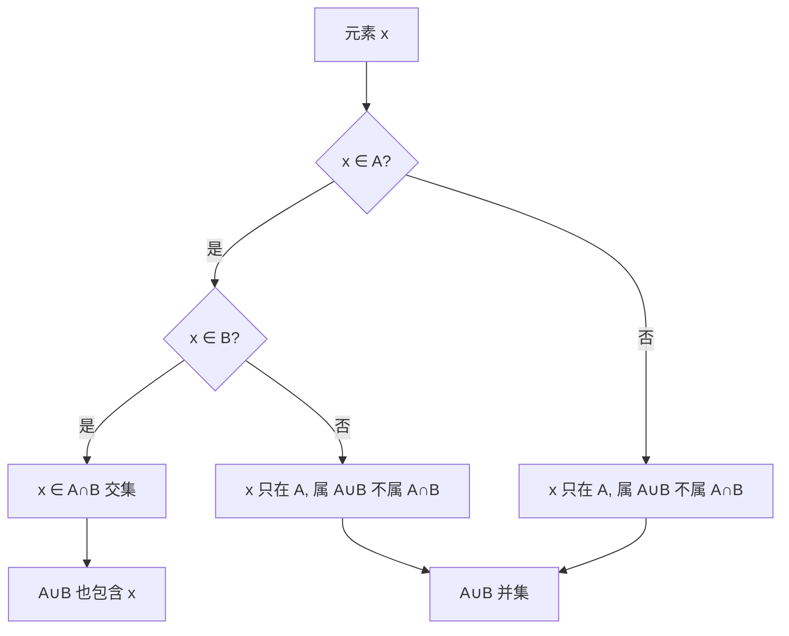

# 第 03 章 · 集合——把一堆东西圈起来

> 本章从哪个问题出发：一台只会开和关、会报数认字的机器，凭什么能问"这东西在不在那堆里"？
> 推导到哪个结论：集合的语言和逻辑的语言是同一件事；"在不在圈里"这一问，足以铺出整个数学的地基。

> 核心认知：任何一个判断，拆到底都是在回答"某个东西在不在某个圈里"——集合不是数学的一个角落，它就是数学怎么开口说"是不是"的那张嘴巴。


## 引子

周末大扫除，我蹲在客厅地板上，面前铺了一地杂物：三支笔、两颗纽扣、一把钥匙、半块橡皮，还有一只不知道哪天掉进沙发缝的耳机。我正犯愁怎么归置，老谟端着一杯咖啡从书房晃出来，居高临下看了三秒。

"你这不是在收拾屋子。"他抿了一口，"你是在做数学。"

我抬起头，一脸"你又在说什么鬼话"的表情。"我就是在捡东西，大哥。"

"那你说，这两颗纽扣，和那支笔，你凭什么把它们分开放？"他下巴朝地上一抬。

"因为它们……不一样呗。纽扣是纽扣，笔是笔，我总得分门别类。"

"'不一样'。"老谟把这三个字咬得很慢，"那你说说，'不一样'这三个字，到底是怎么个不一样法？是重量不一样，还是颜色不一样，还是——干脆就是'它俩不在同一个坑里'？"

我噎了一下，手里的纽扣差点掉下去。分门别类，我天天在做；"它俩不一样"，我张口就来。可"不一样"到底指的是什么，我还真没细想过。

"你先别急着收拾。"老谟把杯子往茶几上一放，坐了下来，"咱们今天不扫地，就研究一件事——**你凭什么说，一个东西，在不在另一个东西堆里。**"


## 对话引擎

### 第 1 轮：第一刀，把"在"和"不在"切出来

**老谟**："我问你一个最没出息的问题：地上这颗纽扣，在不在'笔'那一堆里？"

**造物主**："不在啊。它又没长笔的样子。"

**老谟**："那它'在'哪一堆里？"

**造物主**："在纽扣那一堆。三支笔归笔堆，两颗纽扣归纽扣堆，钥匙、橡皮、耳机各归各堆——这不就是分类吗？"

**老谟**："对，可你注意听——你刚刚说的是'各归各堆'。'归'这个词，让每样东西都有了归属。那你告诉我，一个人要能做到'归类'，他手里最低限度得握着几样东西？"

**造物主**："几样？得有一堆东西，还得有个'往哪儿放'的规则……可这规则也太虚了。"

**老谟**："虚？那我把话说死：要'归类'，你得先有一个**圈**——它不画在地上，画在脑子里。这个圈把'属于它的东西'圈进去，把'不属于它的东西'挡在外面。就这么简单。那颗纽扣，要么在'纽扣'这个圈里，要么不在，二选一，没有第三种。"

**造物主**："二选一……可万一一个东西既像纽扣又像笔呢？比如一颗长得特别像笔帽的纽扣？"

**老谟**："那就看这个圈是谁定的、怎么定的。圈是你划的，规矩是你写的——你想让它进，它就在；不想让，它就不在。问题不在东西本身，在你那把圈划清楚了没有。"

**造物主**："所以'在不在'这件事，不是东西说了算，是那个'圈'——也就是那个规则——说了算？"

**老谟**："你这句话，比你自己以为的沉得多。这一个圈，就够你玩出整座数学大厦。别急着下结论，我先给你把'圈'这个字钉成行话。"

---
**📐 知识锚点：集合（set）与属于关系（∈）**

【历史溯源】把"一堆东西圈起来"这件事正经当一门学问做，是 19 世纪后半叶的事。**格奥尔格·康托尔（Georg Cantor，1845-1918）**在 1874 年之后系统地创立了**集合论（set theory）**。他最初想解决的问题其实非常朴素——"无限到底有多大？"。要比较无限，就得先把"一堆东西"当成一个可以整体谈论的对象，于是集合论诞生了。但康托尔这个想法在当时被同行（尤其是直觉主义阵营的克洛内克）激烈反对，他一度被逼到精神崩溃。**你此刻觉得"把东西圈起来"如此理所当然，是因为你已经站在康托尔被骂了一辈子才铺好的地基上。**

【工程实践】程序员天天和集合打交道，只是不一定叫它"集合"：Python 的 `set`、SQL 里的 `IN`、去重、求交集并集、权限判断"某个用户是否属于管理员组"——全是"在不在圈里"。语言的语法千变万化，底层那一个"∈"的判断，几十年没变过。**工具一直在换，那个圈从没动过。**

【概念深挖】**集合（set）**：把某些确定的对象放在一起，形成一个整体。构成集合的对象叫**元素（element）**。判断"某个元素 x 是否属于集合 S"，记作 **x ∈ S**（∈ 读作"属于"）或 **x ∉ S**（读作"不属于"）。这就是集合论唯一的"原子动作"——它只有两个回答：**在，或不在**。康托尔对集合的定义强调两个词：**"确定"**（每个元素进不进圈，规则必须是清晰的，不能含糊）和**"整体"**（一堆东西被当成一个对象来谈论，而不是零散的一堆）。**这个"当成一个整体"的视角，是集合论的灵魂。** 一旦你学会把一堆东西捏成一个整体，你就能拿这个整体去做更大一层的事——比如，一个集合本身，也可以装进另一个集合当元素。

---

### 第 2 轮：两个圈，谁把谁装下了

**老谟**："你说'各归各堆'。那我换个问法——笔堆里那三支笔，'能写字的东西'堆里也有钢笔。那我能不能说，'笔堆'整个，是被'能写字'这个大圈**装进去**的？"

**造物主**："能啊。笔堆里每一支都是能写字的，所以笔堆整个就在'能写字'圈里。反过来不行——'能写字'里还有墨水、修正带，它们不是笔。"

**老谟**："那你发现没有，'笔堆 ⊂ 能写字堆'这句话，其实是你挨个检查了笔堆里的每一支笔，才敢说的。你把三支笔一支一支地问过'你在不在大圈里'，全对，才敢下这个结论。你说，这算不算一种'全员检查'？"

**造物主**："算。就是'笔堆里有没有哪一支不在能写字圈里'——只要有一支漏了，笔堆就不算整个被装进去。"

**老谟**："好。那我现在问你一个阴险的：地上这个'笔堆'，如果把它自己当'一个东西'，它能不能再被圈进一个更大的圈，比如'所有文具'圈？"

**造物主**："能啊，我把笔堆当整体，装进'文具'圈就行。可那里面装的就不是笔了，是一个'装着笔的堆'……这有点怪，但规则是我定的，我能这么圈。"

**老谟**："能，但我不让你现在深究这个——你记住'规则是我定的，我能这么圈'这句话就够了，它是后面更深一层的引子，今天先点到为止。咱们回到主线：**现在你能'挨个检查'两个圈谁装谁了。那我问你，怎么判断两个圈'完全一样'？**"

**造物主**："完全一样？就是谁装谁都得成立——笔堆装得下能写字堆，能写字堆也装得下笔堆，两边互相装，那俩圈就是一回事？"

**老谟**："对。'互相都装得下，才叫相等'——这句话是子集的灵魂。下面这段，把'谁装谁'给你钉成术语。"

---
**📐 知识锚点：子集（subset）与包含**

【概念深挖】**子集（subset）**：如果集合 A 的每个元素都是集合 B 的元素，就称 **A 是 B 的子集**，记作 **A ⊆ B**（读作"A 包含于 B"）。判断子集，本质是一次**"全员检查"**：把 A 里每个元素挨个问一遍"你在不在 B 里"。**A 和 B 相等，当且仅当 A ⊆ B 且 B ⊆ A**——两个方向都装得下，才叫两个圈完全重合。**空集（empty set）**记作 **∅**，是"一个元素都没有"的集合。空集有个反直觉的性质：**∅ 是任何集合的子集**——因为"A 里每个元素都在 B 里"这个要求，对空集来说自动满足（没有一个元素需要检查，当然不会抓出错来）。

> 补充一笔（不是主线）：因为"规则是你定的"，所以一个集合也能**把自己当元素，装进另一个更大的集合**，形成"集合的集合"嵌套。这套"层楼"能造出自然数（冯·诺依曼序数），也能解释工程里的嵌套结构——但今天的焦点先放在"∈ 和 ⊆"上，嵌套留给更深的地方。

【历史溯源】"子集"和"谁装谁"不是新词，它正是**康托尔（Cantor，1874 起）**创立集合论时的地基之一：要比较两个集合"谁大谁小"，第一步就是定义"包含"。而"集合能当元素"这套**嵌套（ZF 公理，1908 起）**，后来甚至被用来**从集合构造出整个自然数**（冯·诺依曼序数：0=∅，1={∅}，2={∅,{∅}}…）。你此刻学的"⊆"这一刀，正是那座大厦的第一块砖。

【工程实践】"⊆"在工程里就是"是不是包含关系"：Python 的 `set <= set`、SQL 的"一张表的所有外键都在另一张表的键里"、权限判断"某个角色组是否是管理员组的子集"。判断子集要**全员检查**，所以代码里常常写成一次遍历/一次集合差运算。**"两个圈相等"在工程里就是"双向都包含"，写代码查相等时最容易漏掉反向那一半。**

---

### 第 3 轮：两个圈怎么并、怎么交

**老谟**："现在地上有两堆东西——笔堆，和'能写字的东西'堆。可笔堆里那支钢笔，它又写字又能当笔；橡皮不写字，但你说它是'能擦掉字的东西'。你说，怎么用两个圈，把这些乱糟糟的归属说清楚？"

**造物主**："我看看……笔堆里有笔，能写字的堆里有钢笔和圆珠笔。钢笔既在笔堆，又能在写字堆。橡皮不在笔堆，但它在'能擦字'堆。这俩圈有重叠的地方——钢笔——也有各自独立的地方。"

**老谟**："你说到'重叠'了。那你想想，一个人同时要'既是笔、又能写字'，他该去哪个圈找？"

**造物主**："去两个圈都够得着的地方——重叠那块。"

**老谟**："那一个人只要'是笔'就行，不管能不能写字，他该去哪个圈？"

**造物主**："把笔堆整个拿走就行，不用管能不能写字。"

**老谟**："成了。你刚才手上其实在干两件不一样的事：一个是要'两个圈都占'，一个是要'两个圈都算进来'。数学上，这俩是不同动作，名字也不同——但名字先放放，你先告诉我，这两个动作，哪个更像'挑'，哪个更像'凑'？"

**造物主**："'又要笔、又要能写字'，是挑——两个条件都得满足，得去交集里挑。'是笔就行'，是凑——只要是笔的都进来，拼成一大撮。一个是取'都占的那块'，一个是取'全都要的那堆'。"

**老谟**："你分得清。那最后一个——'这两个圈，到底有几样东西完全不一样'？比如纽扣堆和耳机堆，压根不挨着。我要的是'这两个圈加起来到底有多少种东西'，可我不想把重复的算两遍，怎么办？"

**造物主**："那就……把两个圈都拉过来，凡是出现过一次的都算上，重复的只算一遍？"

**老谟**："这就是'凑'的另一种用法——把所有东西都合进来，但**去重**。现在你手里有了三个动作：挑（两圈都占）、凑（全都要）、合并去重（全都要但只算一遍）。我把它们三个钉成术语，你看名字贴不贴。"

---
**📐 知识锚点：并集、交集与韦恩图**

【历史溯源】把集合的关系"画成重叠的圆圈"，是英国逻辑学家**约翰·韦恩（John Venn，1834-1923）**在 1880 年发表的，后来这种图就叫**韦恩图（Venn diagram）**。但重叠圆圈的直观想法，更早可追溯到欧拉和莱布尼茨。韦恩的贡献在于把它做成了一套可以承载逻辑推理的**可视工具**——它不只是好看，是能让"且、或、非"这些抽象逻辑**在纸上直接看出来**。

【工程实践】并集交集在工程里无处不在：SQL 的 `UNION`（并集、去重）与 `JOIN`（交集、连表）、Python 集合的 `|`（并集）和 `&`（交集）、推荐系统"看了 A 也看了 B"的用户交集、垃圾邮件过滤器"同时命中多个规则"的与逻辑。**每当你纠结"是都要、还是都算"，你就是在做集合运算。** 记住一个区分：**交集像"且"（AND，两个都得满足），并集像"或"（OR，满足一个就行）。** 这个对应关系，下一轮你会亲手看到它有多重要。

【概念深挖】**交集（intersection）**：A ∩ B，由"既属于 A 又属于 B"的元素组成，记作 {x | x ∈ A 且 x ∈ B}。**并集（union）**：A ∪ B，由"属于 A 或属于 B"的元素组成，记作 {x | x ∈ A 或 x ∈ B}。若 A 与 B **没有公共元素**，则 A ∩ B = ∅，称 A、B **不相交（disjoint）**。注意并集要**去重**——公共元素只算一份，所以笔堆 ∪ 钢笔所在堆 = 笔堆（钢笔本来就在笔堆里），而笔堆 ∩ 钢笔堆 ≠ 空。**交集是"都要"，并集是"全要但去重"，这个口算最容易混，钉死它。**

```text
❌ 错误：把"并集"当成"两个堆直接拼在一起、允许重复"
✅ 正确：并集 = 两个堆全拉过来，重复元素只算一遍
```



读图说明：从元素 x 出发，先问"在不在 A"，再问"在不在 B"。两条"是"都走通，x 落进**交集** A∩B；只要其中一条是"是"，x 就落进**并集** A∪B。**注意并集包含交集**——交集的元素本来就在并集里。这就是"圈越画越大"的关系：交集 ⊂ 并集。

---

### 第 4 轮：圈，和"是/不是"是一回事

**老谟**："绕了这么多圈，我们得回头干一件更要命的事。你说'在不在圈里'，那'在'和'不在'，跟'是'和'不是'——是不是同一回事？"

**造物主**："……是同一回事？'这颗纽扣在纽扣堆里'，跟'这颗纽扣是纽扣'，说的差不多是一件事吧。"

**老谟**："好，那我问你一句数学史上最狠的话：'他是数学家'。这句话，能不能翻译成'他属于某一个圈'？"

**造物主**："能啊。'数学家'就是个圈，把古今所有搞数学的都圈进去。'他是数学家' = '他 ∈ 数学家这个集合'。"

**老谟**："那你再翻译这句：'这颗纽扣是圆的，而且它是黑色的。'——一个'而且'，你打算怎么用圈说？"

**造物主**："'而且'就是'两个条件都得满足'……那不就是两个圈的交集？'圆的'是一个圈，'黑色的'是另一个圈，又圆又黑 = 两个圈的交集！"

**老谟**："那'这颗笔是蓝色的，或者是钢笔'呢？"

**造物主**："'或者'是满足一个就行……并集！蓝色圈 ∪ 钢笔圈，占任何一个都算。哦——'且'是交集，'或'是并集，我上一轮刚亲手分出来的那两个动作，原来就是逻辑里最要命的两个字！"

**老谟**："你现在看出来了。'且'（AND）、'或'（OR）这两个词，不是逻辑的专利，它们在集合里长着同一张脸。你翻回上一轮自己说的话——'交集像且，并集像或'——那不是比喻，那就是字面事实。那最后一个词呢：'不是'，怎么用圈说？"

**造物主**："'不是'……就是不在这个圈里。比如'这颗纽扣不是黑色的'，就是它 ∉ 黑色圈。"

**老谟**："那'所有不是黑色的东西'，又是谁？"

**造物主**："把黑色圈从'全部东西'这个大圈里挖掉，剩下的那部分。哦——这就是'补'，把不黑的全留下来。"

**老谟**："补集。你刚刚一个人，从'圈'里生出了逻辑的全部三个基本词：且（交集）、或（并集）、非（补集）。这套对应，数学上叫'德·摩根'守着的宝贝，但你先别急着记人名，先记住你此刻看见了什么——**你画的每一个圈，都在替逻辑说话；逻辑的每一句话，都能画成一个圈。**"

---
**📐 知识锚点：集合与逻辑的互译——布尔结构**

【历史溯源】"且/或/非"和"交集/并集/补集"是同一件事，这个洞见藏在**乔治·布尔（George Boole，1815-1864）**1854 年那本《思维规律的研究》里。布尔发现：**逻辑推理可以像代数一样被形式化地运算**，他把"真/假"当作两个值，把"且/或/非"当作运算，于是诞生了**布尔代数（Boolean algebra）**。多年后（1937），**克劳德·香农（Claude Shannon）**在他的硕士论文里证明：布尔代数可以直接用电路开关实现——**"且"是一个串联开关，"或"是一个并联开关，"非"是一个反相器**。从布尔的"思想"到香农的"电路"，中间隔了 83 年；而你只要再往前翻两章，就知道那一章我们用 0 和 1 的比特是怎么做的判断——**逻辑、集合、电路，是同一件事的三副面孔。** 康托尔管它叫集合，布尔管它叫逻辑，香农管它叫电路——他们说的是同一个"圈"。

【工程实践】**德·摩根定律（De Morgan's laws）**：¬(A ∧ B) = ¬A ∨ ¬B，¬(A ∨ B) = ¬A ∧ ¬B。翻译成圈：**"不是（既在A又在B）" = "不在A，或不在B"**。这条定律在工程里极常用：你写 `if not (a and b)`，编译器/大脑常常会把它改写成 `if (not a) or (not b)`——因为硬件实现"或"比实现"且的否定"更便宜。**索引优化、查询改写、逻辑简化，背后全是德·摩根。** 判断条件写多了你就会发现，最坑的 bug 往往出在"取反"时忘了把"且"翻成"或"。

【概念深挖】**补集（complement）**：相对于某个全集 U，集合 A 的补集记作 **Aᶜ**（或 ∁UA），由"属于 U 但不属于 A"的元素组成，记作 {x | x ∈ U 且 x ∉ A}。于是三个基本逻辑词全部落地：
- **且（AND，∧）** → **交集（∩）**
- **或（OR，∨）** → **并集（∪）**
- **非（NOT，¬）** → **补集（ᶜ）**

**"属于（∈）"就是一句"是"，"不属于（∉）"就是一句"不是"。** 一个命题是不是真的，等价于问：这个对象在不在对应的集合里。**这就是本章那句"在不在圈里能构成整个数学地基"的含义——因为一切判断，拆到底都是这一个"∈"。**

---

### 第 5 轮：亲手造一次——用代码问"在不在"

**老谟**："光在纸上画圈，你说你会了。可'懂'和'能造'隔着一条河。现在给你真家伙：地上有三支笔 A、B、C，其中 A 和 B 是黑色的，C 是蓝色的。你写一句话，让机器回答——'是不是所有的黑笔都在'能写字'那堆里？'"

**造物主**："这就是个'子集'问题啊——把'黑笔'圈出来，看它是不是'能写字'圈的子集。可我得先把这两个圈用代码建出来……"

**老谟**："建呗。你别背 API，先想清楚：'判断一个圈是不是另一个圈的子集'，最低限度要循环几次？"

**造物主**："要遍历'黑笔'圈里的每一支，挨个问'你在不在'能写字'圈里'。只要有一支不在，就是 False；全在才是 True。"

---
**📐 知识锚点：把"在不在"写成代码**

【实现思考】"判断在不在"翻译成代码，最直观就是集合类型 + 一次遍历。但这里的"工程味"在于：**你怎么判断快、怎么判断省**，直接决定程序能不能扛住海量数据。

```python
# 方案一：朴素——把元素全塞进列表，逐个比
black = ["A", "B"]
writable = ["A", "B", "C", "D"]

def is_subset(small, big):
    for x in small:          # 每问一次，遍历一次 big
        if x not in big:     # list 的 not in 是 O(n)
            return False
    return True

print(is_subset(black, writable))   # True
```

```python
# 方案二：用哈希集合，把"在不在"变成 O(1)
black_set = {"A", "B"}
writable_set = {"A", "B", "C", "D"}

def is_subset_fast(small, big):
    return small <= big        # 集合的内置子集判断，靠哈希

print(black_set <= writable_set)   # True
```

**为什么这么造**：方案一里 `x not in big` 对列表是**逐个比**（O(n)），n 一大就卡；方案二把 `big` 换成哈希集合，`in` 判断降到 **O(1)**，整个子集判断接近线性。**"在不在"这道题本身不变，变的只是你拿什么结构去存"圈"。** 数据结构选得对，"在不在"就是一瞬间；选得糙，就是一场灾难。**换条路会怎样**：如果圈里的元素要求有序（比如要按字典序输出），那哈希集合并集会乱序，得改用有序结构——这就是"工程里每个选择都换来一点代价"的又一个例子。

---

**老谟**："你代码写出来了。那我再问你一个绕的——'判断两个圈是否完全一样'，跟'判断两个圈互为子集'，是一件事还是两件事？"

**造物主**："……一件事！我上一轮自己说的——A 和 B 相等，当且仅当 A ⊆ B 且 B ⊆ A。所以判断相等，就是**两次**子集判断：A 是不是 B 的子集，B 是不是 A 的子集，都对才相等。"

**老谟**："那你现在闭着眼，把'相等'这个判断里最容易被忽略的边界找出来——如果一个是空集呢？"

**造物主**："空集！∅ ⊆ 任何集合都成立，所以 ∅ ⊆ B 自动为真。那判断 A 和 B 相等时，如果 A 是空集，我只要再查 B ⊆ A——也就是 B ⊆ ∅——只有 B 也是空集才成立。空集这个'自动为真'，藏得可真深，不专门想根本发现不了。"

**老谟**："你刚才那句话，值一整章。**边界条件不是'考虑不周到'，是'空集这类特殊的圈'天然会骗你。** 你现在已经把'在不在''子集''相等'都从代码里亲手踩出来了。"

---

### 第 6 轮：落点——整个数学，就长在一个"圈"字上

**老谟**："回头看看，你从一堆杂物开始，到最后你手里攥着什么？"

**造物主**："一个'圈'——一个集合。它能装东西，能被装，能并、能交、能补，能当子集被检查。而最重要的一步是：我发现'是不是''且''或''非'这些逻辑词，全都能翻译成圈。逻辑不是在圈之外的另一套东西，逻辑就是圈的另一种写法。"

**老谟**："那你说，数学为什么管'在不在'叫地基？"

**造物主**："因为……任何一句话，拆到底都在回答'某个东西在不在某个圈里'。你说'2 加 2 等于 4'，是在说'2+2 这个数，属于'等于 4 的数'这个圈'；你说'这个三角形是直角'，是在说'这个图形 ∈ 直角三角形圈'。数学里所有的'判断''推理''证明'，都是在划圈、查圈、套圈。"

**老谟**："而且你注意，这个圈是**你划的**——规则是你定的，不是天上掉的。'圈谁进谁不进'，这个决定权在你手里，这就是约定。你上一章学的是'怎么让哑巴比特开口说话'，这一章你学的是'怎么用一句话问出是或不是'。这两件事接在一起——你既能让机器懂你在说什么，又能让它替你判断对错。"

**造物主**："所以下一章，我要让'圈和圈的对应'动起来？把一圈东西，变成另一圈东西？"

**老谟**："你猜得挺远。但先别急着往前跑——你现在手里有一个圈，里面装着一堆数。下一章我要问你：怎么把一个数，变成另一个数，而且还得**有规则**，不能乱变。从'圈'到'圈之间的变换'，就差临门一脚。歇够了，咱们下一章踢进去。"


## 知识点总结

### 知识点（本章推出的核心概念，3 条主线）
- **集合与属于关系（∈）**：把确定的对象圈成一个整体；判断"x 是否属于 S"记作 x ∈ S / x ∉ S，这是集合论唯一的原子动作，只回答"在/不在"。**由此推出子集（⊆）**：A ⊆ B 当且仅当 A 的每个元素都在 B；A = B 当且仅当 A ⊆ B 且 B ⊆ A；**空集 ∅ 是任何集合的子集**（隐藏的边界）。
- **交集、并集、补集（集合的运算）**：A ∩ B 取"两圈都占"（像"且"）；A ∪ B 取"全要但去重"（像"或"）；Aᶜ 取"圈外剩下的"（像"非"）。
- **集合与逻辑的互译**：且→交集、或→并集、非→补集；任何命题都是"对象 ∈ 某集合"——逻辑的语言和集合的语言是同一件事。

> 补充一笔（非主线）：因为"规则是你定的"，一个集合也能把自己当元素装进更大的集合（"集合的集合"嵌套），这套"层楼"能造出自然数（冯·诺依曼序数），也能解释工程里的嵌套结构——但本章主线仍压在"∈ → 交并补 → 逻辑互译"上。

### 历史结论（本章涉及的史料）
- **康托尔（1874 起）**：系统创立集合论，为研究"无限有多大"而把"一堆东西"当整体，一度遭同行激烈反对。
- **布尔（1854）**：《思维规律的研究》，发现逻辑可像代数一样运算，诞生布尔代数。
- **韦恩（1880）**：把集合关系画成重叠圆圈，韦恩图成为逻辑可视工具。
- **香农（1937）**：证明布尔代数可用开关电路实现——"且"=串联、"或"=并联、"非"=反相。
- **ZF 公理（1908 起）**：策梅洛、弗兰克尔把"集合能当元素""并集""幂集"等操作公理化，集合论成为数学的底座。

### 工程实践结论（本章知识在真实工程里怎么用）
- **"在不在"是底层判断**：Python `set`、SQL `IN`、权限判断、去重、交集并集，全是"一个 ∈"。
- **数据结构选对，"在不在"才快**：哈希集合把 `in` 降到 O(1)，朴素列表是 O(n)，海量数据下天差地别。
- **嵌套结构 = 集合的集合**：文件夹套文件夹、JSON 套 JSON、外键连表，都是"装不下就包一层"。
- **德·摩根定律**：¬(A∧B)=¬A∨¬B；取反时把"且"翻成"或"，否则容易写错，SQL/索引优化全靠它。


## 向导便签

> 这一章咱们干了什么：从一地板杂物怎么归类，一路逼到"在不在圈里"这个原子动作。你亲手把"圈"（集合）从地上划到纸上，再划到代码里——能圈、能比（子集）、能并、能交、能补，最后发现逻辑的每一个词都能翻译成一个圈。
>
> 钉死一句话：**"是不是""且""或""非"——逻辑的每一个词，都是一个圈。** "他是数学家"就是"他 ∈ 数学家圈"，"又圆又黑"就是两个圈的交集。你问的一切"在不在"，数学都用一个 ∈ 来回答。
>
> 记住：那个圈是**你划的**，规则是你定的，这就是约定。从哑巴比特会说话，到会替你判断对错——你已经让机器不只是"懂"，还能"裁断"。

## 造物主手记

**我曾踩的坑**：

我一开始以为"集合"是数学里的一个小角落，跟逻辑是两码事。被老谟逼着把"是/不是""且/或/非"一句句翻译成圈，才发现这俩压根是一张脸。我还栽在"空集是任何集合的子集"上——这个"自动为真"的边界，如果没人点醒，我写代码的时候绝对会漏。最让我意外的是"集合本身能当元素"——我一开始觉得这不合逻辑，后来发现规则是我定的，我凭什么不能把它当元素？只是老谟提醒我这套"嵌套"今天的焦点不在它身上，先把"在不在"这条主线走透再说。

**顿悟时刻**：

真正开窍是那句"交集像且，并集像或"从比喻变成字面事实那一刻。我上一轮亲手分的"挑"和"凑"，原来就是逻辑里的 AND 和 OR。原来我不用新学一套"逻辑"，我只是换了个名字看同一件事。那一刻我突然明白，为什么老谟说"在不在圈里"是数学的地基——因为所有的判断，都是这一个 ∈。

## 自测题

1. **辨析**：有人说"集合就是分类，逻辑就是推理，它俩没关系"。错在哪？
   *简答要点*：且→交集、或→并集、非→补集；任何命题都可写成"对象 ∈ 某集合"，逻辑与集合是同一件事的两副面孔。

2. **判断**：为什么 ∅（空集）是任何集合的子集？结合"子集"的定义回答。
   *简答要点*：子集要求"A 里每个元素都在 B 里"；空集没有元素需要检查，所以自动满足，故 ∅ ⊆ 任何集合。

3. **翻译**：把句子"这个数是正数，或者是偶数"用集合的运算符写出来（用 + 表示正数集合、E 表示偶数集合）。
   *简答要点*：句子是"正数 ∨ 偶数"，对应并集 + ∪ E。

4. **找茬改错**：某人判断 A ⊆ B，只检查了"A 的每个元素都在 B 里"就断言 A = B。错在哪？
   *简答要点*：相等还要求 B ⊆ A，单向包含只是子集，不是相等；漏了反向检查。

5. **实现题**：写一个函数判断两个集合是否相等，并说明为什么空集是隐蔽的边界条件。
   *简答要点*：`A <= B and B <= A`；当 A 为空时 A ⊆ B 自动为真，必须靠反向 B ⊆ A 来"兜底"，否则会误判。

6. **开放推导**：用韦恩图画出 ¬(A ∪ B) 的区域，并用德·摩根定律写出它的等价集合。
   *简答要点*：¬(A∪B) = ¬A ∩ ¬B（既不在 A 也不在 B），即"圈外的、且两边都不占"的区域。

## 预告

你会划圈了，也会问"在不在"了。可一个圈里装着一堆数，光会"装"和"问"还不够——下一章，我们让圈动起来：怎么把一个数，**有规则**地变成另一个数？从一堆，到另一堆，中间那条"对应"的路，凭什么能走通？下一章，我们第一次让"变换"登场。
