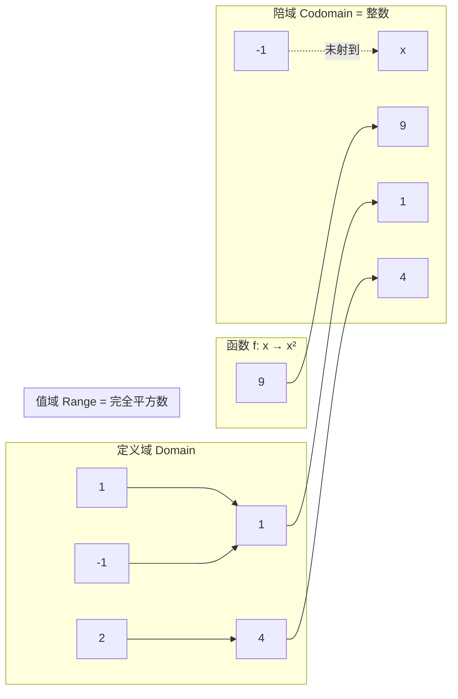

# 第 04 章 · 函数——从一个到另一个

> 本章从哪个问题出发：你刚学会了圈（集合），可一个数凭什么能"变成"另一个数？这里头那条"对应"的路，规则从哪来？
> 推导到哪个结论：函数是"有规则的对应"；双射是"能反着走回去"的对应——这是后续一切"变换、映射、矩阵"的种子。

> 核心认知：把一圈东西变成另一圈东西，人人都会，但只有"每个进来的都恰好对应一个出去的、且规则不能含糊"的对应，才配叫函数；而当这条对应能原路折返时，你就握住了数学里最值钱的那把钥匙——可逆。


## 引子

书房的角落里，老谟不知从哪儿弄来一台手摇磨豆机，正喀啦喀啦地磨咖啡。我走过去，看见他把一勺豆子倒进去，摇了几圈，底下就淌出棕色的粉末。

"这玩意儿，"我指了指磨豆机，"跟集合有关系？"

"你觉得呢。"老谟眼皮都没抬，"豆子进去，粉末出来——你说，这是不是'从一个东西变成另一个东西'？"

"是。可这跟我上周学的圈有什么关系？"

"关系大了。"他停下手，"你上周学会了画圈，把一堆东西圈成一个集合。那现在我问你——**每一个进去的豆子，是不是都能确定地变成一份粉末？**"

"当然能啊，磨豆机又不是薛定谔的。"

"那如果这台磨豆机有个毛病：同一颗豆子，有时候磨成粗粉，有时候磨成细粉，全凭它心情呢？"

我手一顿。"那它就不是个好磨豆机……它没谱。"

"没谱。"老谟把这两个字嚼了嚼，"这话够分量，够你记一年。因为你无意中说出了数学里一个要命的要求——**对应可以随便定义，但每一个进去的东西，出去的那份，得是确定的、唯一的，不能看心情。** 今天我们不磨豆子，我们就把'从一个圈到另一个圈的对应'，给它从头到脚拆开看一遍。"


## 对话引擎

### 第 1 轮：什么样的"对应"才配叫函数

**老谟**："先别急着记术语。你手上有两个圈：A 圈装着你口袋里那几枚硬币的面值，B 圈装着"能买到的饮料"。你说"一枚一块钱硬币，投进售货机，出来一罐水"——这就是个对应。那我问你：一个合格的对应，最要紧的是哪一条？"

**造物主**："……得对上号？一块钱投进去，出来的必须是能买的，不能投一块钱跑出个汉堡又跑出个空气，那不对。"

**老谟**："你抓到一半。那我给你拆个更狠的——A 圈里有 1 元、5 元、10 元，B 圈里有汽水、矿泉水、咖啡。我定个规则：'1 元→汽水，5 元→矿泉水，10 元→咖啡'。你再定个规则：'1 元→汽水，1 元→咖啡'。你说，哪个是合格的对应？"

**造物主**："我那个不是啊！1 元怎么既出汽水又出咖啡？同一个东西进来，出去的是两个，这对应就乱了。规则必须保证：**一个进来的，只能对应一个出去的。**"

**老谟**："'一个进，只能出一个'——记住这句，这是函数的命根子。那我现在再补一刀：A 圈里那枚 5 元硬币，和另一枚 5 元硬币，是同一个进来的，还是两个？"

**造物主**："两枚都是 5 元……但它们不是同一个东西啊。可它们面值一样，投进去都出矿泉水？"

**老谟**："对。注意区分——**函数看的是'这个进来的对象'，不是'它长得像谁'。** 5 元硬币每一枚都是独立的元素，可它们'属于同一个 5 元'，所以 5 元→矿泉水这条，对每一枚 5 元都成立。你搞混了'元素'和'元素的值'，后面会吃大亏。下面这段，把'函数到底是个什么'给你钉死。"

---
**📐 知识锚点：函数（function）的定义——"有规则的对应"**

【历史溯源】"函数"这个词，中文翻自**function**，而 function 源自莱布尼茨 1694 年前后用的 **functio**，原意是"执行、运作"。早期（17 世纪）人们理解函数，还是"一条公式、一条曲线"，**牛顿、莱布尼茨时代的函数是"一个算式的名字"**。真正的转变在 19 世纪——**狄利克雷（Dirichlet，1837）**给出函数最现代的、最不依赖公式的定义：**两个集合之间的一种对应，把第一个集合里每个元素，恰好对应到第二个集合里的唯一一个元素。** 他把"函数"从"一堆公式"解放成了"一种纯粹的对应关系"。这一步极其重要：**一旦函数不再依赖"有没有公式"，你就能对任何集合（哪怕是一堆人名、一堆颜色）谈函数，只要规则确定。**

【工程实践】程序里的"函数"（function）其实就是这个定义的**直接落地**：输入参数进，返回值出。一个合格的程序函数必须"**同一输入，永远同一输出**"（程序员管这叫**纯函数 pure function**）——这跟函数定义里"每个进只能出唯一一个"是同一个要求。**不纯的函数（每次调用结果随机、或改了全局状态）之所以难调 bug，就是因为它违反了"确定"这条命根子。** 你写 `def f(x): return x*x`，写的是数学函数；你写 `def f(): return random()`，写的是数学上的"非函数"——它不确定。

【概念深挖】函数（function）的现代定义：**设 A、B 是两个非空集合，函数 f 是从 A 到 B 的一种对应规则，使得对每个 x ∈ A，都存在唯一一个 y ∈ B 与之对应。** 记作 **f: A → B**。A 叫**定义域（domain）**，B 叫**陪域（codomain）**；x 对应的那个 y 记作 **f(x)**，叫 **x 的像（image）**；所有被"踩到"的 y 组成的集合（即 {f(x) | x ∈ A}）叫**值域（range）**。**注意陪域和值域的区别：陪域是"你声明它往哪射"的整个圈，值域是"真的被射到的那些"**——这是最容易混淆的一对，后面你会亲眼看到。

---

### 第 2 轮：定义域、陪域、值域——三个圈谁是谁

**老谟**："你知道了函数是从 A 到 B 的对应。那我现在给你一个具体函数，你自己把它的三个圈圈出来。函数是'平方'——把任意一个整数 x，对应到 x²。你说，它从哪个圈出发，射到哪个圈？"

**造物主**："从整数圈出发，射到……也是整数圈吧？x² 只要是整数，平方完还是整数。"

**老谟**："整数平方完还是整数，对。但我要问的是——所有整数被平方之后，'射到'的那些数，是不是把整个整数圈都填满了？"

**造物主**："那没有！x² 只可能是 0、1、4、9、16……负整数比如 -1，它就不是谁的平方。所以这个函数射到的是'完全平方数'那一小块，不是整个整数。"

**老谟**："好。那现在两个圈出现了：一个是'平方会射到的地方'——你刚说的完全平方数那一小块；一个是'函数被声明要射向的整个整数圈'——它是完整的。这两个圈，一样大吗？"

**造物主**："不一样大。完全平方数是整数圈的一个子集。"

**老谟**："这就对了。数学上，**'被声明要射向'的那个圈，叫陪域；'真的被射到'的那个圈，叫值域。** 值域 ⊆ 陪域，而且常常是严格小于。你现在知道为什么我上一轮警告你别把'元素'和'元素的值'搞混了吧——'平方'这个函数的陪域是整数，值域却只有完全平方数，**同一个函数，两个圈不一样大。** 很多人的糊涂，就是栽在这个'值域比陪域小'上。"

**造物主**："所以我必须分开记：定义域是'进来的'，陪域是'声明要射到的'，值域是'真被踩到的'？"

**老谟**："记是记住了。但记住不等于会用——下面这段，给你把这三个圈摆一张图上。"

---
**📐 知识锚点：定义域、陪域、值域，一图分清**



读图说明：注意 -1 和 1 两个定义域元素**都射向同一个 1**（f(1)=1、f(-1)=1）——这在函数里完全合法，多个进可以对应一个出，只要不违反"一个进只出一个"。再看右下角那个被虚线标出的 -1：它是陪域（整数）里的一个元素，但**没有任何 x 的平方等于 -1**，所以它落在值域之外。**陪域是"你宣布的战场"，值域是"你真正打到的地盘"**，值域永远被陪域包含。

【概念深挖】把定义域、陪域、值域做对比，最容易出错的三处：
- **值域 ⊆ 陪域**，常常严格小。值域大不大，取决于"每个陪域元素是不是都被踩到"。
- **一个进只能对应一个出**（函数的要求），但**多个进可以对同一个出**（f(1)=f(-1)=1），这不是矛盾。
- **定义域里的每个元素都必须有一个像**——函数不允许"某个进来的没出去"，这是"每个进都有唯一出"的另一面。

---

### 第 3 轮：复合——把一个函数接在另一个后面

**老谟**："你现在会看单个函数了。那我给你两个：f 是'加 1'，g 是'乘 2'。你说，先加 1 再乘 2，跟先乘 2 再加 1，结果一样吗？"

**造物主**："肯定不一样啊！3 先加 1 变 4，再乘 2 变 8；先乘 2 变 6，再加 1 变 7。一个是 8 一个是 7。"

**老谟**："很好，你自己算出了差别。那我问你——先加 1 再乘 2，这一整串，能不能整体看成一个'新函数'？"

**造物主**："能啊。任何一个数进去，先加 1、再乘 2，出来的结果是确定的，这不就是一个'对应规则'吗？就是 f(g(x)) 还是 g(f(x))……我有点绕不清了。"

**老谟**："绕不清就动手写。你给我写清楚：'先加 1 再乘 2'，到底是把哪个函数套进哪个函数里。"

**造物主**："先加 1——那是先做 f；再乘 2——那是后做 g。所以整个过程是'先把 x 喂给 f，把 f 的结果再喂给 g'，写成 g(f(x))。哦！是先做 f 再套 g，但从外往里写是 g(f(x))——**里层先算，外层后算，但括号从最外面开始套。**"

**老谟**："你把这层'先做里层、从外往里写'的别扭劲儿看透了。这种'一个函数接在另一个后面'的套娃，数学上叫**复合（composition）**。你刚才亲手发现了一件大事——复合的顺序不能随便换，先加一再乘二，和先乘二再加一，是两个不同的函数。"

**造物主**："所以复合不是'把两个函数拼一起'这么简单，得看谁在里谁在外，顺序错了结果就变。"

**老谟**："对。这个'顺序不能乱'，后面你学矩阵、学变换、学求导链式法则的时候，会一次次撞到它。现在先把复合的记号给你钉死。"

---
**📐 知识锚点：复合函数（composition）**

【历史溯源】复合不是新发明，但它把一个朴素的直觉"一步一步来"抽象成了可运算的对象。**把函数当作可以互相组合、叠加的对象**，是函数式思想的重要一步，而这在**范畴论（category theory，20 世纪中叶）**里被推到了极致：范畴论直接把"对象"和"对象之间的箭头（函数）"当作唯一的研究对象，**复合箭头成了公理级别的操作**。今天编程里的"管道（pipe）""函数式组合（compose）"、前端的数据流处理，全都是"把函数一个接一个串起来"这个古老动作的现代化身。

【工程实践】复合在工程里的价值是**把大动作拆成小函数再串起来**：Unix 管道 `cat file | grep x | sort`，每个命令是一个函数，`|` 就是复合；React 的 `compose`、Redux 的中间件、函数式编程的 `pipe`，全是复合。**复合的核心好处是可复用**——你不需要写一个巨大的"先这样再那样"的函数，而是写两个小函数，再在需要时把它们串起来。代价是**顺序一旦错了，结果就错**（想想 8 vs 7），所以复合要求你严格分清谁在外、谁在里。

【概念深挖】**复合函数（composition）**：设 g: A → B、f: B → C，则"先 g 后 f"得到的新函数记作 **f ∘ g**（读作"f 复合 g"），定义为 **(f ∘ g)(x) = f(g(x))**。**注意记号：f ∘ g 里 g 在最内层先算，f 在外层后算**——从右往左读，先执行最右边的。**复合一般不可交换**：f ∘ g ≠ g ∘ f（你刚用 8 vs 7 亲手验证了）。复合是可结合的：(f ∘ g) ∘ h = f ∘ (g ∘ h)，但这在"顺序敏感"的前提下只是一种括号怎么摆的自由，不改变执行顺序。

---

### 第 4 轮：单射、满射——函数的两副"胃口"

**老谟**："你上一轮画图时，f(-1)=f(1)=1，两个进同一个出。这在函数里合法。那我现在要问一个更挑的问题：有没有一种函数，它'胃口很刁'——**每一个出，都只被一个进踩到，绝不重样**？"

**造物主**："……就是不能有两个不同的 x 射到同一个 y？像 f(x)=x 这种，1 射 1、2 射 2、3 射 3，每个 y 都只有一个进。"

**老谟**："对，f(x)=x 就是这种。它把每一个进都'一对一'地送出去，没有一个出被两个进共享。那另一个方向呢——有没有一种函数，**把整个陪域都填满了**，值域=陪域，一个都不漏？"

**造物主**："那就是'每个 y 都至少被一个 x 踩到'。比如 f(x)=2x，从整数射到偶数……但偶数只是整数的一个子集，没填满。"

**老谟**："那你给我想一个'填满整数'的。从整数到整数，哪个函数能把整个整数都射到？"

**造物主**："f(x)=x 就行啊！每个整数都能作为某个 x 的像，1 是 f(1)，-5 是 f(-5)，全被踩到了。"

**老谟**："好。那你现在发现了，f(x)=x 这家伙，**又'一对一'，又'填满'**——两个苛刻要求它全占了。这就是函数里最金贵的一种：**既每出唯一进（单射），又全被填满（满射）。** 这种函数，数学上有个专门的名字，你先别急着问名字，先想——一个'既一对一又填满'的函数，意味着什么？"

**造物主**："意味着……每一个进都有一个出，每一个出也都有一个进，**两边是一一对应的，谁也找不到落单的。** 就像把一堆钥匙和一堆锁，每个钥匙配一把锁，不多不少。"

**老谟**："'不多不少'——记住这个词。你把钥匙锁配清楚了，就摸到了本章最值钱的东西的门口。下面这段，把这两种'胃口'给你钉死。"

---
**📐 知识锚点：单射、满射、双射**

【历史溯源】区分"一对一"和"填满"这两种性质，是 19 世纪函数理论成熟时的核心工作之一。**理查德·狄德金（Richard Dedekind）**、康托尔在分析"无限集合的大小"时，把"是否能建立一一对应"当成了判定两个无限集合是否"一样大"的标准——**两个无限集合元素一样多，当且仅当存在一个满的双射（一一对应）**。康托尔正是靠"双射"这个工具，证明了自然数和有理数一样多、但和实数不一样多，从而打开了"无限也有大小"的领域。**"一一对应"这个词，是数学家衡量无限时手里最锋利的一把刀。**

【工程实践】工程里"单射/满射/双射"听着抽象，其实天天用：
- **单射（一对一）**：数据库主键、身份证号——保证一个记录只有一个唯一标识，没有两个记录共用同一个主键。密码哈希函数（理想情况下）是单射的：不同明文对应不同哈希。
- **满射（填满）**：彩虹表、编码表——你希望每个"目标值"都至少能被某个输入产生。
- **双射（一一对应且填满）**：**编码与解码、加密与解密、压缩与解压**——双射意味着可逆：压了能解回来、加密能解密、编码能还原，因为**两边不多不少、一一对应**。这就是为什么"UTF-8 编码"和"解码"能互相还原——它们构成一对互逆的双射。

【概念深挖】设 f: A → B：
- **单射（injection，一一映射）**：对任意 x₁≠x₂，都有 f(x₁)≠f(x₂)。即**没有两个不同的进射向同一个出**。判定口诀：看值域，每个值都只被一个进踩到。
- **满射（surjection，满映射）**：对任意 y ∈ B，都存在 x ∈ A 使 f(x)=y。即**值域 = 陪域**，整个陪域被填满，不漏一个。
- **双射（bijection，一一对应）**：**既是单射又是满射**。即每个进都有唯一出、每个出都被唯一进踩到，两边一一对应。

```text
❌ 错误：以为"值域等于陪域"才叫函数（那是满射，不是所有函数都如此）
✅ 正确：任何函数都有定义域→陪域；值域⊆陪域；满射要求值域=陪域
```

---

### 第 5 轮：亲手造一次——求逆，看看能不能原路折返

**老谟**："你说双射是'钥匙配锁、不多不少'。那我问你——**有了这样一副一一对应的函数，你能不能把它反着走回去？** 比如 f 把 1 变 3、2 变 5、3 变 7。现在给你一个 7，你能找到是谁变的吗？"

**造物主**："7 是 3 变的啊，因为 f(3)=7，所以反着查，7 回到 3。"

**老谟**："那如果这个函数不是双射——比如 f(x)=x²，给你一个 4，你反着找，能找到几个 x？"

**造物主**："f(2)=4，f(-2)=4，两个！4 既可能是 2 变的，也可能是 -2 变的，反着走回去，我不知道该回到 2 还是 -2。"

**老谟**："你发现矛盾了。要反着走回去，得保证'每一个出，都能确定地回到唯一一个进'——这就是双射里'单射'那一条在起作用。那反过来呢，如果是满射没单射呢？比如 f 从整数射整数，x²，它的值域只有完全平方数，你拿一个 -1 想反着走，结果呢？"

**造物主**："-1 根本不在值域里，没有任何 x 的平方是 -1，我连'从哪里出发'都不知道——反着走的第一步就断了。所以不光要'一对一'，还得'全都填满'，两头都得照顾到。"

**老谟**："你这一句话，等于自己把'逆函数存在的前提'给证出来了。那现在我把话说满——**一个函数能'反着走回去'，当且仅当它是双射。** 双射之外的函数，要么反着走有两个答案（不是函数了），要么反着走没处可走（第一步就断）。这个'能反着走回去'的对应，叫逆（inverse），我这就给你把它造出来看看。"

---
**📐 知识锚点：逆函数（inverse function）——双射的回报**

【实现思考】"反着走回去"听起来很简单，但造一个逆函数有个工程上的陷阱。先看正着走和反着走的代码：

```python
# f: x → 2x+1，是个双射（一对一且填满）
def f(x):
    return 2*x + 1

# 求逆：解方程 y = 2x+1 得 x = (y-1)/2
def f_inv(y):
    return (y - 1) / 2

# 验证：正着走再反着走，回到原点
for x in [0, 1, 2, -3]:
    y = f(x)
    assert f_inv(y) == x      # f_inv(f(x)) = x，成立
    print(f"{x} --f--> {y} --f_inv--> {f_inv(y)}")
```

**为什么这么造**：因为 f 是双射，`f_inv(f(x)) == x` 对每个 x 都成立，所以它能"原路折返"。**换条路会怎样**：如果 f 是 `x → x*x`（不是单射），那 `f_inv(4)` 就有 2 和 -2 两个候选，`f_inv` 就不是一个合格函数了——**逆函数求不出来的根子，在于原函数不是双射**。工程上，凡是"解压/解密/解码"成功的前提，都是编码器是双射：压缩和解压、加密和解密，全依赖"两头一一对应、能原路折返"。

【历史溯源】"逆"的思想古已有之——**加法与减法、乘法与除法，自古就成对出现**，只是人们用了几千年都没意识到它们是"正反函数"。把"反着走回去"统一抽象成"逆函数（inverse function）"这个对象，是函数理论成熟后的产物。而真正把"可逆"推到极致、变成一门学科的是**密码学**：所有加密算法本质上都是构造一对互逆的双射（加密、解密），只是要保证"正着好算、反着难猜"（单向陷门）。**你此刻学的一个"能不能反着走"，正是后世整座安全大厦的地基。**

【概念深挖】**逆函数（inverse）**：若 f: A → B 是双射，则存在唯一的函数 f⁻¹: B → A，使得对任意 x ∈ A、y ∈ B，都有 **f⁻¹(f(x)) = x** 且 **f(f⁻¹(y)) = y**。f⁻¹ 叫 **f 的逆函数（inverse function）**。**逆函数存在，当且仅当 f 是双射**：
- 缺单射 → 反着走有多个答案，f⁻¹ 不是函数；
- 缺满射 → 反着走第一步（某些 y 无对应）就断。

**这是"可逆"这个概念第一次在本书登场，它是后续所有'变换''矩阵''求导''反演'能成立的共同前提**——你后面会遇到的所有"能不能逆推回去"的问题，问的其实都是同一个问题："这个对应，是不是双射？"

---

### 第 6 轮：落点——双射，是一切"变换"的种子

**老谟**："绕了一圈，你回头看看，从磨豆机到逆函数，你手里现在攥着什么？"

**造物主**："一个'函数'——一种有规则的对应。它得有定义域，有陪域，有值域；它必须'一个进只出一个'；它可以被复合，也可以被看单射、满射。而最值钱的，是那个又单射又满射的双射——因为只有它，能反着走回去，有逆函数。"

**老谟**："那你现在能不能用一句话，把'为什么双射这么值钱'说给我听？"

**造物主**："因为**能反着走回去**。一个对应要是不能反着走，它就把信息给丢了——x² 把 -2 和 2 压成同一个 4，反着走就认不出谁是谁了。只有双射，两头一一对应、不多不少，正着走、反着走都不丢东西。这就是可逆。"

**老谟**："'可逆'，这个词你总算说到根上了。那我再问你最后一刀——你现在手里的函数，还只是'一个数变一个数'。可如果我不是变一个数，而是**把一个圈里的所有数，一起按同一个规则挪动、拉伸、旋转**，你觉得，那是什么？"

**造物主**："那就是……把整个圈批量变换？每个 x 都走同一个 f，但一整批一起动。那会是一种'批量的函数'？"

**老谟**："你猜得够远了。记住今天——**函数是单点的变换，而变换是批量的函数。** 下一章，我们要让整个圈一起动起来：一个方向、两个方向，甚至一个平面被拉伸、旋转——那一次'批量变换'，就是线性代数里最要紧的矩阵在做的事。而它为什么能反着走回去、能不能解回来，全靠你今天就学会的那个词：**双射，可逆。**"

**造物主**："所以我今天学的不是'函数'，是'任何变换能不能反着走回去'的判据。"

**老谟**："你总算把这句话说出来了。今天这章，你可以毕业了。"


## 知识点总结

### 知识点（本章推出的核心概念，3 条主线）
- **函数的定义（映射）**：从集合 A 到集合 B 的"有规则的对应"，每个 x ∈ A 都恰好对应唯一一个 f(x) ∈ B。命根子：**一个进，只能出一个。** 定义包含三圈：**定义域**（进来的）、**陪域**（声明射向的整个圈）、**值域**（真被踩到的），且**值域 ⊆ 陪域**，常常严格小。
- **复合（函数的运算附属）**：把一个函数接在另一个后面，记作 (f∘g)(x)=f(g(x))，从右往左执行；**一般不可交换**，顺序错了结果就变。它是"把函数串起来"这一运算动作，不是独立的函数种类。
- **函数类型与可逆（单射 / 满射 / 双射 → 逆函数）**：单射=每个出只被一个进踩到；满射=值域填满整个陪域；双射=既单又满，即"一一对应、不多不少"。**逆函数（inverse）能"原路折返"，存在当且仅当 f 是双射**——这是"可逆"概念的首次登场，也是后续一切变换的前提。

### 历史结论（本章涉及的史料）
- **函数定义演变**：17 世纪（牛顿、莱布尼茨）函数还是"一个算式/一条曲线"的名字；**狄利克雷（1837）**给出不依赖公式的现代定义——两个集合间的对应关系。
- **双射与无限**：康托尔用"一一对应"判定无限集合是否一样大，证明自然数与有理数一样多、但与实数不一样多。
- **逆的思想**：加减、乘除自古成对，但抽象成"逆函数"是函数理论成熟后的产物；密码学把"可逆但正反不对称"推到极致。
- **复合与范畴论**：把"对象+箭头（函数）"当唯一研究对象的范畴论，把复合提到公理级别。

### 工程实践结论（本章知识在真实工程里怎么用）
- **纯函数 = 数学函数**：同一输入永远同一输出，才叫合格函数；不纯函数难调 bug，因为它违反了"确定"这条命根子。
- **主键 = 单射**：数据库主键、身份证号保证一对一，不共用；理想密码哈希是单射。
- **编码/加密/压缩 = 双射**：能"解回来、解密、解压"，前提是编码器是双射；否则信息在途中丢失、无法还原。
- **复合 = 管道/函数式组合**：Unix 管道、`compose`、`pipe` 都是函数串联；顺序敏感，先加一后乘二 ≠ 先乘二后加一。
- **可逆是一切变换的前提**：后续的矩阵、求导、反演，能否"反着走回去"问的都是同一句——"这个对应是不是双射"。


## 向导便签

> 这一章咱们干了什么：从一台磨豆机，一路逼到"可逆"这个词。你亲手走完了函数从出生到毕业的全路程——定义、定义域/陪域/值域、复合、单射满射双射、逆函数。
>
> 钉死一句话：**函数是"有规则的对应"；双射是"能反着走回去"的对应。** 一个进只能出一个，是函数的命根子；而能不能原路折返、不丢信息，则要看它是不是双射。这把"可逆"的钥匙，你会在后面的矩阵、变换、求导里反复握到。
>
> 记住：函数不是公式，是一种对应；逆函数不是魔法，是双射天然附赠的"原路折返"。今天你握住了"变换能不能反着走回去"的判据。

## 造物主手记

**我曾踩的坑**：

我最开始以为"函数就是一条公式"，被老谟用磨豆机怼回来才发现，函数是"一种对应关系"，哪怕没有公式也算。我还把"陪域"和"值域"混成一团，直到亲眼看到 x² 射出的只是完全平方数、而陪域是完整的整数，才分清楚"声明要射到的"和"真被踩到的"。最让我栽跟头的是复合——我一直以为"先加一后乘二"就是"f(g(x))"，结果发现里外顺序搞反了，8 和 7 差了整整一个数。还有那个最隐蔽的坑：我以为"能反着走回去"是理所应当的，结果 f(x)=x² 反着走 4 能回到 2 也能回到 -2，才明白不是所有函数都能折返。

**顿悟时刻**：

真正开窍是"双射才能有逆函数"那一下。我亲手验证了"单射保证反着走不撞车、满射保证反着走有路可走"，才明白"可逆"不是一句空话，而是两个苛刻条件同时满足的回报。那一刻我突然懂了老谟说的"双射是一起变换的种子"——原来数学里所有"能不能反着走回去"的问题，最后都会落到这一个判断上。

## 自测题

1. **辨析**：有人说"函数就是一条能算的公式，没有公式就不是函数"。错在哪？
   *简答要点*：函数是"集合间的有规则对应"，不依赖公式（狄利克雷定义）；只要每个进有唯一出，哪怕是一张查表也叫函数。

2. **区分**：f(x)=x²（整数→整数）的定义域、陪域、值域分别是什么？值域和陪域为什么不相等？
   *简答要点*：定义域=整数，陪域=整数，值域=完全平方数；因为 -1 等在陪域但没被任何 x² 踩到，值域 ⊊ 陪域。

3. **找茬改错**：某人说"f(1)=1 且 f(-1)=1，所以 f 不是函数"。判断对错并说明理由。
   *简答要点*：错；函数要求"一个进只出一个"，不禁止"多个进对同一个出"。f 仍是合格函数，只是不是单射。

4. **推算**：g(x)=x+1，f(x)=2x。求 (f∘g)(3) 和 (g∘f)(3)，并说明为什么结果不同。
   *简答要点*：(f∘g)(3)=f(4)=8；(g∘f)(3)=g(6)=7；复合不可交换，先做里层、从外往里写。

5. **判断**：下列哪个函数有逆函数？(a) f(x)=x²（整数→整数）；(b) f(x)=2x（整数→整数）；(c) f(x)=x（整数→整数）。
   *简答要点*：(a) 不是单射（且非满射），无逆；(b) 单射但非满射（值域为偶数），无逆；(c) 双射，有逆。

6. **实现题**：写代码实现 f(x)=2x+1 及其逆函数，并验证 f_inv(f(x))==x 对多个 x 成立。
   *简答要点*：f_inv(y)=(y-1)/2；因为 f 是双射，所以能原路折返，对任意整数 x 成立。

7. **开放推导**：如果用一个"非双射"的函数做压缩，为什么解压时一定会丢信息？结合"反着走回去"解释。
   *简答要点*：非单射会把多个不同输入压成同一输出，反着走有多个候选、无法唯一还原；非满射则有些输出无对应输入，反着走第一步就断。只有双射才能无损还原。

## 预告

你会划圈（集合），也会把圈里的东西一个一个地、有规则地变换（函数）了。可你回头看看这一路——圈里装的全是整数：1、2、3、-5……它们整整齐齐。可现实里，谁只跟整数打交道？一杯 0.625 升的水，一段 3.14 秒的时间，这些"半个数"、甚至永远写不完的数（0.1 其实无穷无尽），怎么塞进那台只会开和关的机器？函数的圈再会变换，也得先有个能装"小数"的家。下一章，我们把数的版图补全——从整数，走到实数与浮点。
