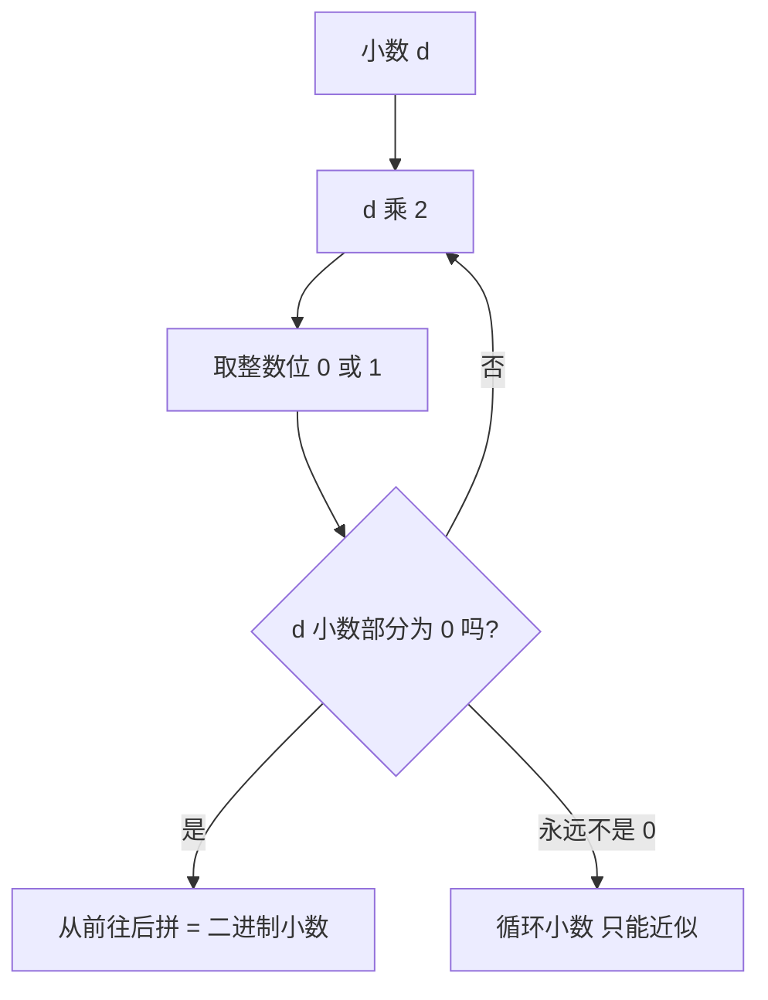

# 第 05 章 · 实数与浮点

> 本章从哪个问题出发：整数会编码了，可 0.1 这种"半个数"怎么塞进比特？
> 推导到哪个结论：小数和整数用的是不同的约定；浮点是"有限位装下无限连续"的工程妥协；误差不是 bug 是取舍。

> 核心认知：比特天生是离散的（非开即关），可数轴是连续的（中间永远还有半个）。浮点就是拿有限的离散，去硬装无限的连续——装不下是常态，误差是付给这个妥协的代价。


## 引子

我在木工台上比划一根木条，要锯成"三又五分之三寸"。尺子搁在木条上，我却下不了手——五分之三寸，标尺上偏偏没有这一格。

"刻度都到六十四分之一了，怎么还是没有五分之三？"我把尺子翻了个面，想找找有没有更细的刻度。

老谟路过，扫了一眼："你要是把这根木条，换成 0.1 这个数，你就知道我为什么说你这是白翻尺子。"

"0.1？"我放下尺子，"0.1 不就是十分之一吗，多干净的数啊。"

"干净？"他笑了，"那你用手里的尺子，给我量出 0.1 寸——用二分法。每次只有一半，能不能量准？"

"一半、一半、再一半……"我拿起另一把只有两个刻度的笨尺比划，"0.1 寸，先量 0.5 超了，量 0.25 超了，量 0.125 超了，量 0.0625……差一点，再量 0.09375……这好像永远追不完？"

"你追不完，是因为每折一刀，只能减半。"老谟拍拍木条，"这世界上有多少个'0.1'这样的数，是你这一把'只会对半折'的尺子永远量不出来的？本章，就问这一个问题。"


## 对话引擎

### 第 1 轮：从整数到"半个数"，哪里变了

**老谟**："你上一章把整数塞进比特，已经会了。现在来硬的：比特只有 0 和 1，你想让机器表示 0.5，怎么表示？"

**造物主**："0.5……不就是二分之一吗？整数里最低位代表 1，那我在它右边再开一位，代表二分之一？"

**老谟**："右边？你仔细说说，这个'右边'是往哪边开。"

**造物主**："整数是从右往左翻倍：1、2、4、8……那往右走，就是反着来：1/2、1/4、1/8？小数点右边第一位是 1/2，第二位是 1/4？"

**老谟**："那你把这串数写出来——从小数点往右，每一位代表多少？"

**造物主**："……1/2、1/4、1/8、1/16，一直往右就是一直对半折下去？0.5 是 0.1，0.25 是 0.01，0.75 是 0.11？"

**老谟**："你看，你刚摸出来的，不是'整数那套往左翻倍'，是**往右对半折**的一套新规矩。这就是我说的'变了'：整数和小数，是两套约定。"

---
**📐 知识锚点：小数的位权——往右是对半折**

【概念深挖】二进制小数和二进制整数，走的是相反的方向：

- **整数**：最低位是 1，往左每位翻倍（1、2、4、8…），越往左越大。
- **小数**：小数点后第一位是 1/2，往右每位减半（1/2、1/4、1/8…），越往右越小。

所以二进制小数 `0.101` 表示：1×1/2 + 0×1/4 + 1×1/8 = 0.5 + 0.125 = **0.625**。

一个关键直觉：**二进制小数，本质上就是"用一把只会对半折的尺子去量数"**。每一位都是"折一刀"，只能决定"这一段落在上半还是下半"，所以它只能精确表示那些恰好能被一堆 1/2、1/4、1/8… 拼出来的数（比如 0.5、0.25、0.625），而像 0.1、0.2、0.3 这样"不对齐"的数，就量不准。

【工程实践】为什么用"对半折"而不是别的？因为这跟硬件一拍即合：整数往左翻倍对应"进位"，小数往右减半对应"二分"，都只靠最基础的移位和判断就能实现。**没有哪个进制天生适合小数，只是二进制的"对半折"恰好最便宜。** 这不是数学必然，是又一次工程选择。

---

### 第 2 轮：0.1 到底写了多少位？

**老谟**："你现在觉得 0.5 好办。可你刚才那把尺子告诉我——0.1 追不完。那我来问你：0.1 这个数，在二进制里到底能写成多少位？"

**造物主**："我刚才二分二分地追，追到 0.09375，还差 0.00625……然后接着往下二分，好像永远差那么一丁点。是不是写不完？"

**老谟**："先别急着下结论。你手上不是有'整数除二取余、小数乘二取整'的直觉吗——虽然你上一章只练了整数那半边。现在小数这半边，你猜猜该怎么做？"

**造物主**："整数除二，那小数就……乘二？0.625×2=1.25，取个 1，剩 0.25；0.25×2=0.5 取 0，剩 0.5；0.5×2=1.0 取 1，剩 0。读下来是 0.101？"

**老谟**："你自己摸出来的，整数和小数方向正好相反：整数除二取余从下往上，小数乘二取整从上往下。方向对了。那你现在用这招算 0.1，给我看看，算到哪儿停？"

**造物主**："0.1×2=0.2 取 0，剩 0.2；0.2×2=0.4 取 0，剩 0.4；0.4×2=0.8 取 0，剩 0.8；0.8×2=1.6 取 1，剩 0.6；0.6×2=1.2 取 1，剩 0.2……咦，剩回 0.2 了！又回到开头了！"

**老谟**："你算到循环了。这说明什么？"

**造物主**："说明 0.1 的二进制，是个**无限循环小数**！它没有'写完'的那一天——就像十进制里 1/3 = 0.333… 一样。"

---
**📐 知识锚点：为什么 0.1 的二进制写不完**

【历史溯源】"写不完"不是二进制的毛病，是**进制固有的性质**。任何进制里都有"写不完的小数"：十进制的 1/3 = 0.333…，二进制的 0.1 = 0.0001100110011…。判断一个分数在某进制下能不能写尽，看的是它的**分母能不能被该进制的基数整除**：十进制基数 10 = 2×5，所以分母只含 2 或 5 的因子（如 1/2、1/5）能写尽；二进制基数 2 只有因子 2，所以只有分母是 2 的幂的数（1/2、1/4、1/8…）才能写尽，其余全是循环小数。**0.1 的分母是 10，10 里带了个因子 5——2 整除不了 5，于是它注定在二进制里循环。** 这个结论不是谁偷懒，是数论上的铁律。

【概念深挖】**乘二取整**把小数转二进制：

```text
0.625 × 2 = 1.25 → 取 1，剩 0.25
0.25  × 2 = 0.50 → 取 0，剩 0.50
0.50  × 2 = 1.00 → 取 1，剩 0.00（到 0，结束）
从前往后读: 0.101
```

而 0.1 会永远循环下去，机器里永远只有它的一段**近似**。**整数除二取余、小数乘二取整，方向相反、不能混用；且小数这一侧，很多数天生写不完。**


读图说明：这是一台"倒水机"。每次把小数翻倍，溢出来的整数位（0 或 1）就是一位二进制小数，从前往后一滴一滴接。绝大多数数会卡在右下角那个岔路——小数部分永远清不干净，于是永远接不完，只能收到某个位置就停。

一个直观对照——同一个"0.5"，在十进制和二进制里都写得很干净；但"0.3"在二进制里就循环。判断一个分数能不能写尽，不看它"看起来多整齐"，只看**分母能否被基数整除**。这正是上一章"整数除二取余"的镜像：整数那半边怎么都能转干净，小数这半边却常常半路卡死。

---

### 第 3 轮：写不完，怎么办——只能截断

**老谟**："0.1 写不完，可机器不能存'永远'。那你告诉我，工程师该怎么处理这个 0.1？"

**造物主**："……截断？存前面的几位，后面的舍掉？比如就存 0.00011 这么几位，剩下的不要了？"

**老谟**："舍掉，那 0.1 在机器里，还是那个精确的 0.1 吗？"

**造物主**："不是了。0.00011 转回十进制是 0.09375，跟 0.1 差着一截。存的越少，差得越多。"

**老谟**："那要是存得多一点呢？"

**造物主**："存得越多，越接近 0.1，但永远到不了 0.1——因为它根本没有尽头。机器再大方，也只能给 0.1 一个'足够接近'的替身。"

**老谟**："你抓住了整章的要害：**机器存不下'精确的 0.1'，只能存一个'足够接近 0.1'的数。** 那这个'足够接近'，是打算怎么决定的？总不能每台机器自己拍脑袋吧。"

**造物主**："总得有个统一的标准？不然我存 10 位、你存 20 位，两台机器读同一个数，结果都不一样。"

**老谟**："标准这东西，迟早要来的。"

---
**📐 知识锚点：存不下精确，就约定一种"近似"的格式**

【历史溯源】浮点数的历史，是一段"各家乱定标准、最后被逼着统一"的历史。早期各机器厂各自定义自己的浮点格式，同一段程序换台机器，结果就对不上——这就是著名的"浮点混乱"年代。真正的转折是 **1985 年 IEEE 754 标准**的发布：它用统一的格式（符号、阶码、尾数怎么排、各占几位、边界怎么处理）终结了乱象，成为今天所有 CPU、所有编程语言浮点的共同地基。

【工程实践】为什么必须统一？因为浮点不能"想存几位存几位"——它得**定长**。定长意味着：位数是死的，精度是有限的，溢出、下溢、舍入都有明确规则。IEEE 754 把这些规则写成标准，让"同样的代码、换任何机器、结果一致"。你今天写 `0.1 + 0.2`，在任何语言、任何机器上几乎都是同一个答案，靠的就是这份标准。

【概念深挖】机器存 0.1 的做法，是把无限循环截到**固定的位数**：比如截成 0.0001100110011… 前 N 位，后面的全部舍掉。这个"舍掉"的过程叫**舍入（rounding）**，通常按"最近的值"来舍。于是机器里那个"0.1"，其实是一个跟 0.1 差一点点、但已经足够接近的数。**精度有限，是所有定长表示的宿命——你存的不是数，是这个数的一个替身。**

---

### 第 4 轮：能不能换一套更聪明的存法

**老谟**："截断会丢精度，那有没有聪明点的办法，让'有限的位'装下'很大的范围'？比如 10 的负 300 次方、10 的正 300 次方这种极端的数，光靠一位一位存，得存多少位？"

**造物主**："那得存几百位吧？0.000……0001 那一串零就得写半天。"

**老谟**："那你记一个数，是记'0.00000000000000000001'省事，还是记'10⁻²⁰'省事？"

**造物主**："10⁻²⁰！记成'10 的负二十次方'，几个字就完了——跟科学计数法一样！"

**老谟**："对。数的规模，用'几次方'来记，比一个个位数省多了。那你说，一个数 = 符号 + 一个尾数 + 一个"10 的几次方"（指数），这样拆成三段，机器是不是就能用有限的位，装下极大的范围？"

**造物主**："……你这不就是科学计数法吗？我记 3.14 × 10²，把'3.14'、'10 的二次方'、还有正负号，分开存，范围一下就大了。"

**老谟**："你摸到了。这套'尾数 + 指数 + 符号'的存法，就是浮点数的骨架。先别急着给它起名字——你先告诉我，这里头哪个地方，还是会丢精度？"

**造物主**："……尾数！尾数只能存固定的几位，0.1 的尾数那串无限循环，存进尾数还是得截断。指数再聪明，救不了尾数那一截。"

**老谟**："你一句话说穿了：**浮点能扩大'范围'，却救不了'精度'。** 范围变大了，可 0.1 照样存不准。"

---
**📐 知识锚点：浮点数——符号 + 阶码 + 尾数**

【概念深挖】你刚才摸出来的"尾数 + 指数 + 符号"三段式，正是**浮点数（floating-point number）**的结构（"浮点"指小数点位置随指数浮动，不像定点数那样固定）。它的正式三部分（这里给正式名字，都是你推导到的）：

- **符号位（sign）**：1 位，表示正负。
- **阶码（exponent）**：记"10 的几次方"（二进制里是"2 的几次方"），决定数的**范围**（能到多大/多小）。
- **尾数（mantissa / significand）**：记"那个有效数字"，决定数的**精度**（能有多精确）。

常见的两种定长格式（IEEE 754）：

| 格式 | 总位数 | 阶码位 | 尾数位 | 约能表示的十进制有效位 |
|------|--------|--------|--------|------------------------|
| **单精度 float32** | 32 | 8 | 23 | 约 7 位 |
| **双精度 float64** | 64 | 11 | 52 | 约 16 位 |

关键：**范围由阶码撑大，精度由尾数决定，二者不可兼得。** 尾数位固定了，有效位数就固定了——这就是为什么 0.1 无论存成 float32 还是 float64，都只能是近似。

【历史溯源】IEEE 754 还顺手解决了一个哲学问题：它规定了**特殊值**——正负零、正负无穷、以及 **NaN（Not a Number，非数）**，用来表示 0/0、无穷减无穷这类"数学上无意义"的结果。这相当于把"出错了"也变成一种可以编码、可以传播的状态，而不是让程序当场崩溃。这是工程上的一次高明约定：**连错误，都要有一个"名字"可以放进比特里。**

【工程实践】选 float32 还是 float64，是一场"精度 vs 内存/速度"的取舍：图像、游戏、神经网络里动辄几亿个数，通常用 float32 省内存换速度（损失那点精度肉眼分辨不出）；而科学计算、金融、需要多步累积不失控的场景，宁可多花一倍内存用 float64。**没有"哪个更对"，只有"这个场景够不够"**——选错位数的代价，往往到运算累积出肉眼可见的误差时才后悔。

---

### 第 5 轮：亲手验证一次——0.1 + 0.2 到底等于几

**老谟**："说了这么多，你亲手算一遍。你不是已经知道 0.1 和 0.2 在二进制里都是近似了吗？那 0.1 + 0.2，在机器里等于多少？"

**造物主**："两个近似数加起来，还是近似？大概……不是精确的 0.3？"

**老谟**："别猜，你手头有 Python 的话，跑一下。要是没跑，你就当自己跑了——想一下，两个都差一点的数相加，误差会怎么样？"

**造物主**："误差会……叠加？0.1 差一点，0.2 差一点，加起来差的更多一点，所以结果不是 0.3，而是 0.3 附近的一个数，比如 0.30000000000000004？"

**老谟**："你自己说出来 0.30000000000000004 了。那你觉得，这是机器算错了吗？"

**造物主**："……不是算错。是 0.1 和 0.2 从一开始就不是精确的，是我要它存的。机器把两个'替身'加起来，得的当然是替身，不是真身。"

**老谟**："你能分清'真身'和'替身'，这章你就没白学。这句 0.30000000000000004，不是你算错，是**你亲手签下的近似协议的账单**。"

---
**📐 知识锚点：浮点误差不是 bug，是取舍**

【工程实践】`0.1 + 0.2` 在几乎所有语言里都等于 `0.30000000000000004`，这不是 bug，是**二进制无法精确表示 0.1 的必然结果**。工程上的应对之道，分几种：

- **金额计算**：绝不能用浮点。用专门表示十进制小数的类型（Python 的 `decimal`、数据库的 `DECIMAL`），内部按十进制精确存储，避免 0.1+0.2 的误差。
- **比较浮点**：不要直接判 `a == b`，而是判 `|a - b| < 一个很小的阈值`（如 `1e-9`）。
- **科学计算**：追求的是"足够接近"，浮点本来就够用，但要清楚每一次运算都可能累积误差，数值分析就是专门研究怎么控制这种累积的学问。

【实现思考】下面这段，就是把你刚才的推理变成能跑的验证——"看懂"到"能造"：

```python
# 1. 亲眼看看浮点误差
print(0.1 + 0.2)          # 0.30000000000000004

# 2. 用 decimal 精确做十进制，避开误差
from decimal import Decimal
print(Decimal("0.1") + Decimal("0.2"))   # 0.3

# 3. 比较浮点要用"足够近"，不要用"等于"
a, b = 0.1 + 0.2, 0.3
print(a == b)              # False
print(abs(a - b) < 1e-9)   # True
```

**为什么这么造**：第一条直接展示误差；第二条说明"要精确就用十进制类型"；第三条说明"要比较就比'接近'而非'相等'"。**换条路会怎样**：如果坚持用 `a == b` 判断浮点相等，生产环境里会踩出无数隐蔽的 bug——这正是无数程序"莫名不相等"的根源。你知道了取舍，就能避开坑。

---

### 第 6 轮：光知道"浮点会错"还不够——真正的坑，是拿它去"比相等"

**老谟**："你知道 0.1+0.2≠0.3 了，觉得自己挺清醒。那我给你一个真实的场景：**你的程序算了半天，想判断'算出来的结果是不是 0.3'，于是写了 `if result == 0.3:`。你说，这个 if，会不会永远不触发？**"

**造物主**："……会！因为 result 是 0.30000000000000004，不是 0.3，`==` 一比就是 False。**所以光知道'浮点会错'还不够，我还得小心'拿它去比相等'——这一比，等于拿'精确'的标准去要求一个本来就是'近似'的东西。**"

**老谟**："你自己把这第二个坑挖出来了：**浮点误差的麻烦，不只在它'不准'，更在它让你'比相等'时意外翻车。** 那你说，想判断'这俩浮点差不多'，该怎么写？"

**造物主**："……不判相等，判'离得够不够近'？比 `abs(a - b)` 是不是小于一个很小的数，比如 `1e-9`？只要差得比这个数还小，就当它们一样。"

**老谟**："你这个思路对了一半。那我再考你一个更刁的——**如果 a、b 都是很大的数，比如 1 000 000 和 1 000 000.1，它俩的差是 0.1，比 1e-9 大，你当它们不相等；可这 0.1 相对那 100 万来说，才是一百万分之一，根本可以忽略。反过来，如果 a、b 是 0.0000001 和 0.0000002，差 0.0000001，比 1e-9 大，你也当不相等——可这俩数本身就在极小的量级上转。** 你说，光用一个'固定的小阈值'去比，够用吗？**"

**造物主**："……不够！同样的差 0.1，在'100 万附近'可以忽略，在'0.1 附近'却很大。**我得看这个'差'是相对谁来说的——不能只用一个固定的数当标准，得看它跟被比较的数比，占多大比例。**"

**老谟**："你自己把这个'比例'想出来了——这正是关键。下面这段，把'看差值'和'看比例'两把尺子，连同它们的取舍，钉成一套工程判据。"

---

**📐 知识锚点：浮点比较的工程判据——别用"等于"，要用"容差"**

【工程实践】造物主亲手踩中了两个坑：一是浮点不能直接用 `==` 比相等，二是"固定小阈值"对大小悬殊的数都失灵。这里把一套标准的工程判据钉下来：

**为什么不能直接 `==`**：因为 `a == b` 要求两个数"一位不差地相等"，可浮点存的是近似——`0.1 + 0.2` 得到的 `0.30000000000000004`，跟 `0.3` 就差在最后几位。拿"精确相等"的标准去审"本就有误差"的数，等于要求替身和真身逐位一样，必然翻车。

**工程判据第一步：用"容差"而不是"相等"**。判断两个浮点"够不够近"，标准写法是：
```python
if abs(a - b) < eps:   # eps 是容差（epsilon），一个"多大算够近"的阈值
    ...
```
其中 `eps`（读作"epsilon"，容差/阈值）是"你愿意接受多大误差"的那个数，通常取一个很小的量级（如 `1e-9`）。

**但"固定容差"有个致命盲区——绝对误差 vs 相对误差**：
- **绝对误差（absolute error）**：就是 `|a - b|`，看"差的绝对值多大"。它适合衡量"数量级本来就差不多"的数。
- **相对误差（relative error）**：把差值除以"被比较数的大小"，看"差占多大比例"，即 `|a - b| / max(|a|, |b|)`。它适合衡量"大小悬殊"的数——同样是差 0.1，在 100 万附近（占亿分之一）可忽略，在 0.1 附近（占 100%）却天差地别。
- **取舍**：绝对误差简单、但对大数过严、对小数过松；相对误差能自适应大小，但遇到"被比较的数接近 0"时会爆掉（除以一个近乎 0 的数，比值无限大）。**所以工程上常常两者结合用。**

**工程判据第二步：`np.isclose` 的 rtol / atol——把"绝对 + 相对"做成标准工具**。NumPy 提供的 `np.isclose(a, b)` 正是把两把尺子合起来的现成判据，它的判断是：
```python
np.isclose(a, b, rtol=1e-5, atol=1e-8)
# 返回 True 当 |a - b| <= atol + rtol * |b|
#   atol（absolute tolerance）控制"绝对容差"，管小数附近；
#   rtol（relative tolerance）控制"相对容差"，管大数附近。
```

```python
# 工程判据示例
import numpy as np

a, b = 0.1 + 0.2, 0.3
print(a == b)                      # False（直接比相等，翻车）
print(abs(a - b) < 1e-9)           # True（固定容差，量级相近时够用）
print(np.isclose(a, b))            # True（atol + rtol 组合判据）

# 大小悬殊的数：固定容差会误判，isclose 更稳健
print(abs(1_000_000.0 - 1_000_000.1) < 1e-9)   # False（绝对差0.1>1e-9，误判"不相等"）
print(np.isclose(1_000_000.0, 1_000_000.1))     # True（相对差亿分之一，可忽略）
```

**为什么这么造**：`np.isclose` 把"绝对容差 atol"和"相对容差 rtol"合成一条判断——`|a-b| ≤ atol + rtol·|b|`。当数很大，相对误差主导（rtol 管大数）；当数很小接近 0，绝对误差兜底（atol 管小数），避免"除以近 0 的数"爆掉。**代价**：atol/rtol 该取多大，本身要按业务定——科学计算、图像、物理的"够近"标准天差地别，不能照抄一个值。**换条路会怎样**：只用绝对容差，大数会误判（100 万那例）；只用相对容差，数近 0 会爆；只靠 `==`，什么都不对。**"先看量级、再定容差"才是稳妥的姿势——你判断两个浮点'一样'，本质上是在问'它们差得够不够小、小到在我的场景里无所谓'。**

【工程实践】这套判据，是真实代码里几乎每天都踩到的雷：
- **累积运算后的断言**：循环算了很多步，最后想判断"结果是不是收敛到 0"，绝不能用 `== 0`，得用 `abs(x) < eps` 或 `np.isclose`。
- **游戏/物理的碰撞检测**：两个位置"够不够近"才算撞上，用的是容差而不是精确相等，否则会因为浮点抖动而漏判或误判。
- **神经网络/优化**：判断"梯度是不是接近 0"（是否收敛），用的是 `np.isclose` 或相对容差，因为梯度可能小到 `1e-10` 这种量级，绝对容差反而说不清。
**"别比相等、要比接近；接近的标准还得看量级定绝对/相对容差"——这三句话，能帮你躲掉一大片隐蔽的浮点 bug。**

---

### 第 7 轮：落点——有限位装不下无限连续

**老谟**："回到你那把木工尺。0.1 这寸，为什么你永远量不准？"

**造物主**："因为尺子只会对半折，而 0.1 不对齐——它需要无限次对折才追得完，可我手里的尺子是有限的。"

**老谟**："那浮点数，就是那把'有限位的尺子'。它能量大数，能量小数，可它量任何数都只能量到某个精度，多出来的全是'替身'。你接受它，是因为你和机器约好了：'我们就这么近似着用。'——说到底——"

**造物主**："说到底，**小数和整数，用的是两套不同的约定**：整数是往左翻倍、能精确表示；小数是往右减半、绝大多数只能近似。**浮点是拿有限的离散，去硬装无限的连续——装不下是常态，误差不是 bug，是我跟机器签的取舍协议。**"

**老谟**："你算是把这层皮也剥干净了。"他把那根木条往桌上一搁，"记住：机器不欠你精确，它只按约定给。你那一寸 0.1，不是它偷懒，是它本就量不出来。"


## 知识点总结

### 知识点（本章推出的核心概念）
- **二进制小数**：往右是对半折（1/2、1/4、1/8…），与整数往左翻倍方向相反；**乘二取整**把小数转二进制。
- **很多小数写不完**：分母不能整除 2 的分数在二进制里是无限循环小数（0.1 = 0.0001100110011…）。
- **浮点数（floating-point）**：符号 + 阶码 + 尾数三段式，用有限的位撑大数的范围；范围由阶码决定、精度由尾数决定，二者不可兼得。
- **浮点误差**：0.1 和 0.2 都只是近似，相加误差累积得 0.30000000000000004；这不是 bug，是"有限位装无限连续"的取舍。
- **浮点比较的工程判据**：不能直接用 `==`（那拿"精确相等"审"本就是近似"的数必然翻车）；要用"容差"判 `|a-b| < eps`（epsilon）。**绝对误差**（`|a-b|`）简单但对大数过严、对小数过松；**相对误差**（`|a-b|/max(|a|,|b|)`）能自适应大小、但数近 0 会爆。工程上常用 `np.isclose(a,b,rtol,atol)`（`|a-b| ≤ atol + rtol·|b|`）把绝对 + 相对两把尺子合起来。

### 历史结论（本章涉及的史料）
- **IEEE 754（1985）**：统一浮点格式（符号/阶码/尾数、各占几位、舍入规则），终结了各厂乱定标准的"浮点混乱"年代，并规定正负零、正负无穷、NaN 等特殊值。

### 工程实践结论（本章知识在真实工程里怎么用）
- **金额计算**用 decimal/DECIMAL，不用浮点。
- **比较浮点**用"足够接近"（`|a-b| < 阈值` 或 `np.isclose`），不用 `==`；容差大小要按业务量级定（绝对/相对误差的取舍）。
- **单精度 float32** 约 7 位十进制有效位，**双精度 float64** 约 16 位——精度由尾数位决定。
- **常见雷区**：累积运算后的收敛判断、游戏/物理碰撞检测、优化里判断"梯度≈0"是否收敛，都不能用 `==`，要用容差 / `np.isclose`。


## 向导便签

> 这一章咱们干了什么：从木工台那把只会对半折的尺子，一路逼到浮点。你亲手摸出"往右减半"的小数规则，算出 0.1 的无限循环，再推出浮点"符号+阶码+尾数"的骨架，亲手验证了 0.1+0.2≠0.3，最后补上"浮点比较的工程判据"——别用 `==` 比相等、要用容差、还得看绝对/相对误差的取舍、用 `np.isclose` 的 rtol/atol。
>
> 钉死一句话：**比特是离散的，数轴是连续的，浮点就是拿有限的离散去硬装无限的连续。** 装不下不是 bug，是取舍；误差不是机器偷懒，是你跟它签的近似协议。
>
> 记住：小数和整数是两套约定；浮点能撑大范围，却救不了精度；而判断两个浮点"一样"，不能比相等、要比接近，还得按量级定绝对/相对容差。你那一寸 0.1，本就是尺子量不出来的。

## 造物主手记

**我曾踩的坑**：

我以为"0.1 是个干净的数，机器肯定存得准"。结果在木工台上一量，才发现 0.1 这种分母带 5 的数，在二进制里根本写不完。我还差点以为"存多点就能精确"——老谟一句"存得多只是更接近，永远到不了"，把我拽回现实：没有尽头的东西，给再多位数也装不下。最坑的是我下意识会用 `a == b` 去比浮点，差点在程序里埋雷；更没想到的是，就算换成 `abs(a-b)<阈值`，遇到 100 万和 100 万.1 这种"差很小但比例更小"的大数，固定阈值也会误判——才知道还要看相对误差。

**顿悟时刻**：

真正开窍是"尾数管精度、阶码管范围，二者不可兼得"那一刻。我原以为换个聪明的存法就能又大又准，结果发现范围再大也救不了尾数那一截。我突然懂了：0.1+0.2≠0.3 不是谁算错了，是我从一开始就跟机器说"近似着来"——这不是 bug，是一笔我主动签下的取舍。而补上"浮点比较判据"后我更清醒：**判断两个浮点"一样"，不是比相等，是问"差得够不够小、小到在我的场景里无所谓"**——这问题得看量级，得用绝对/相对容差，而不是一个写死的 `==`。

## 自测题

1. **辨析**：有人说"0.1 这么简单的数，计算机肯定能精确存储"。错在哪？
   *简答要点*：0.1 分母含因子 5，二进制写不完，只能存近似替身。

2. **换算**：用乘二取整把 0.75 转成二进制，并解释为什么 0.1 是循环小数而 0.75 不是。
   *简答要点*：0.75 = 0.11；0.75 分母是 4（2 的幂）可写尽，0.1 分母带 5 只能循环。

3. **辨析**：浮点能表示极大极小的数，那是不是就"又大又准"了？为什么不能？
   *简答要点*：范围由阶码撑大、精度由尾数决定，尾数位固定则精度固定，不可兼得。

4. **改错**：下面代码想判断两个浮点是否相等，哪里有问题？该怎么改？
   ```python
   if 0.1 + 0.2 == 0.3:
       print("相等")
   ```
   *简答要点*：浮点比较不能用 `==`；改判 `abs(a-b) < 1e-9`，或金额用 decimal。

5. **实现题**：用 Python 验证 0.1+0.2 的误差，并分别用 `==` 和"阈值接近"两种方式比较，观察结果差异。
   *简答要点*：`==` 得 False，`abs(...)<1e-9` 得 True，说明浮点要按"接近"比较。

6. **辨析**：有人说"比较浮点只要 `abs(a-b)<1e-9` 就行，一个阈值走天下"。为什么不够？
   *简答要点*：固定容差对"大小悬殊"的数会误判：100 万和 100 万.1 绝对差 0.1 > 1e-9，被判"不相等"，可相对差才亿分之一、可忽略；反之小数量级的差会被放大。要看量级，用相对误差或 `np.isclose` 的 rtol/atol 组合。

7. **换算**：`np.isclose(a, b, rtol=1e-5, atol=1e-8)` 的判断式是什么？为什么它既管大数又管接近 0 的数？
   *简答要点*：判断 `|a-b| ≤ atol + rtol·|b|`。数大时 rtol·|b| 主导（相对误差管大数）；数接近 0 时 atol 兜底（避免"除以近 0 的数"爆掉）。两把尺子合起来比单一固定阈值稳健。

8. **改错**：循环累加了很多步后想判断"结果是否收敛到 0"，下面写法错在哪？该怎么改？
   ```python
   if total == 0:
       print("收敛了")
   ```
   *简答要点*：浮点累积后几乎不可能精确等于 0，`==` 永远不触发。应判 `abs(total) < eps`（按业务量级定 eps），或用 `np.isclose(total, 0)`。

## 预告

整数、小数、判断，比特都装下了——可这些都还是"静态的量"：一个固定的数、一个固定的"是/否"。可这个世界不只是静止的量。水在流，车在动，屏幕上的点在移动——**变化**本身就是另一门学问。下一章，我们离开单个的数，去看"变化"本身：一个点在某一刻的速度，到底是"哪个瞬间"的速度？数不动了，动的那个，是下一幕的起点。
