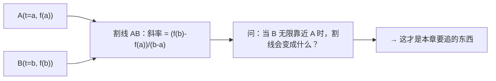
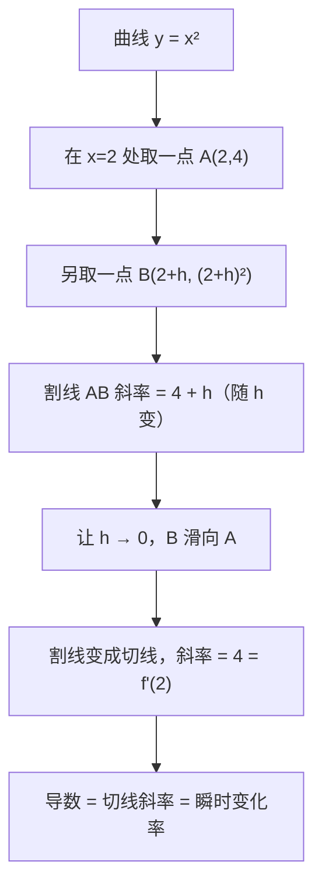

# 第 06 章 · 导数——瞬间的变化有多快

> 本章从哪个问题出发：自行车码表上那个"速度"，到底是"哪一段路"的速度？
> 推导到哪个结论：速度不是某段路程的平均，是"某一个瞬间"的瞬时变化率；而"瞬时"这个词，其实是"把平均的区间缩到无限小"的极限——这个东西，数学上叫导数。

> 核心认知：慢与快，从来不是一段路的事，而是一瞬间的事。可"瞬间"没有长度，你没法拿一段路去量它。唯一的出路是：先量一段很短很短的路，再问——当这段路缩到无限短时，那个平均速度逼近的那个数，才是"此刻"真正的速度。给"变化率"装上一个"无限小"的刻度，就装出了导数。


## 引子

我把车把往下一压，车轮碾过一段缓坡，链条绷得咯咯响。坡不算陡，可挡位挂得太沉，膝盖发酸，汗顺着鬓角往下淌。我低头瞄了一眼车头那个老式码表——数字跳了一下，显示 13.2，单位是公里每小时。

"13.2。"我自言自语，"可我这一脚下去，到底是快还是慢？"

老谟今天没骑车，站在坡顶的路沿边，正拿矿泉水瓶盖拧着喝。他听见了，把瓶盖拧回去，慢悠悠开口："你刚才爬这段坡，用了四分钟。四分钟骑了一千二百米，平均下来是十八公里每小时。可你表上写的是 13.2。你自己觉得，哪个是'你的速度'？"

我梗了一下。四分钟一千二百米，笔一算就是 18；可码表指着 13.2，俩数都不像是假的。

"都……都对？"我试探着说，"一个是这一段路平均下来的，一个是——我不知道它是什么。"

"你也不知道。"老谟重复了一遍，语气里带着点"你总算说了句实话"的意思，"你天天骑车，天天看码表，可你从头到尾没弄明白，那 13.2 到底是个什么东西。它既不是全程平均，也说不清是哪一秒。那你凭什么信它？"

我把车支在路沿上，喘匀了气。"那……你倒是说说，13.2 是多少个 13.2？是这一秒的？可一秒也是'一段时间'，一秒里我的车速也一直在变，凭什么拿它当'这一下'的速度？"

"你问到点子上了。"老谟把瓶盖往兜里一揣，"一秒是一段时间，一秒里你还在加速，所以'一秒的速度'本身也是扯淡。可你要是问'这一瞬间'呢？瞬间没有长度，你怎么量？"他顿了顿，"本章，就解决这一个问题——**到底有没有'某一瞬间的速度'这回事，如果有，它又该怎么算。**"


## 对话引擎

### 第 1 轮：先别急着谈瞬间，把"平均"说清楚

**老谟**："你刚才说四分钟骑一千二百米，平均十八。这个'平均速度'，你总不陌生吧？那我现在考你——平均速度是怎么算出来的？"

**造物主**："这不简单？总路程除以总时间。一千二百米除以四分钟，一分钟三百米，一小时就是一万八千米，十八公里每小时。"

**老谟**："那如果我只截其中一段——比如从第 2 分钟到第 3 分钟，这一分钟里你骑了二百米。这一分钟的平均速度是多少？"

**造物主**："二百米除以一分钟，等于……十二公里每小时。"

**老谟**："好。那你再截一小段——从第 2 分钟到第 2 分半，这半分钟你骑了九十五米。这段的平均速度又是多少？"

**造物主**："九十五除以零点五，一分钟一百九十米……十一点四公里每小时？"

**老谟**："你发现没有，同样是'你的速度'，你算出来 18、12、11.4 三个数。那问题来了——**你每一段截出来的平均速度都不一样。那你说，'你'到底有多快？**"

**造物主**："……那就看我怎么截了。截得不一样，答案就不一样。这算哪门子'我的速度'？"

**老谟**："所以你发现了第一个真相：**所谓'速度'，没有一个固定的值，它依赖于你截哪一段。** 你截的区间一变，平均速度就变。这就怪了——我们明明觉得'此刻我有此刻的速度'，可一动手算，就只有一段一段的平均。那这个'此刻的速度'，难道只是个幻觉？"

---

**📐 知识锚点：平均速度 = 路程差 ÷ 时间差，也就是割线的斜率**

【概念深挖】把骑车这件事，用上一章学过的"函数"画出来。横轴是时间 t（分钟），纵轴是走过的路程 s（米），那么"位置随时间变化"就是一条曲线 s = f(t)。现在我们算"从 t=a 到 t=b 这段时间的平均速度"：

平均速度 = (b 时刻的路程 − a 时刻的路程) ÷ (b − a) = **(f(b) − f(a)) ÷ (b − a)**

在几何上，这个比值不是别的，正是曲线上 A(a, f(a))、B(b, f(b)) 两个点之间那一条**割线（secant line）**的斜率。所以：

- **平均速度 = 割线的斜率**。
- 你每截一段区间，就是在图上取两个点、连一条割线，算它的陡峭程度。

这就是"平均"的真相：它永远属于一段区间，永远连着两个点，永远绕不开"这一段到底有多长"。割线斜率图见下方：


读图说明：左边两个点 A、B 是同一段路程曲线上的两个瞬间，连起来就是割线，它的斜率就是这段时间的平均速度。右下角那个问题才是关键——如果我们让 B 一路"跑"向 A，割线会越来越像一条贴着 A 点的直线，这条贴着曲线的直线，就是"切线"的雏形。

【历史溯源】"用一段路程除以一段时间得到速度"，这种想法早于数学本身——巴比伦人测日影、伽利略算自由落体，用的都是"总路程 ÷ 总时间"。但伽利略（17 世纪）就撞上了一堵墙：**他算自由落体，得知道"每一个瞬间"的速度，可"瞬间"没有长度，拿一段路程去除以一个"没有长度的瞬间"，得到的是个"0/0"**。他把这个问题糊弄过去了（后人说他"用平均速度糊弄了无穷小"），可这个"0/0"的坑，在数学里埋了两百年。你现在问的，正是伽利略当年没答上来的那个问题。

---

### 第 2 轮：区间越小，越接近"此刻"

**老谟**："你说平均速度依赖截哪段，那自然有个念头冒出来——**我要是不想依赖它，想让这个平均速度'接近'某一瞬间的速度，该怎么办？**"

**造物主**："……那就把区间截得短一点？我算全程平均是 18，算某一分钟是 12，算半分钟是 11.4。好像截得越短，越像是'那一瞬间'的速度？"

**老谟**："那你试试，再往短里截。从第 2 分钟到第 2 分 10 秒，这十秒你骑了三十一米。这段的平均速度是多少？"

**造物主**："三十一米除以六分之一分钟，一分钟一百八十六米……十一点一六公里每小时？"

**老谟**："再截短点呢？从第 2 分钟到第 2 分 5 秒，这五秒骑了十五点五米。"

**造物主**："十五点五除以十二分之一分钟，一分钟一百八十六米……咦，还是十一点一六？怎么一样了？"

**老谟**："是巧合吗？你再截短点，从第 2 分钟到第 2 分 2 秒，这 2 秒骑了多少米，你算算平均速度。"

**造物主**："我得先知道 2 秒里骑了多远……如果还是按这个趋势，那 2 秒大概骑了六点二米，除以三十分之一分钟……一分钟一百八十六米，还是十一点一六！这不是巧合，它稳定在十一点一六附近了！"

**老谟**："你发现了一个了不起的东西：**区间缩得越短，平均速度就越趋于一个稳定的值——它不再乱跳了，它凝住了。** 这个'凝住的数'，就是你自己说的'那一瞬间的速度'。你先别急着高兴，我问你——它是凭空蹦出来的吗？"

**造物主**："不是！它是把区间缩得越来越短，那些平均速度一个比一个更接近它，最后就贴着它了。就像……我用越来越小的格子去描一条线，格子越小，描出来的线越清楚。"

**老谟**："'格子越小越清楚'——这个词用得妙。你摸到极限的门缝了。可我得提醒你：你刚才算的，是我编的数字，不严谨。真要到'无限小'，光靠'越来越接近'还不够，得有一个能把'无限'这件事钉死的说法。我们下一轮就来钉。"

---

**📐 知识锚点：从"平均"到"瞬时"，差的不是一个数，是一个过程**

【概念深挖】当区间长度 h（记 h = b − a）从 4 分钟缩到 1 分钟、半分钟、10 秒、5 秒……对应的平均速度 18、12、11.4、11.16、11.16 越来越稳定。这个现象的关键词是**逼近（approach）**：一个平均速度列出的序列，随着区间变短，**无限地贴近**某一个固定值，但区间只要还没缩到零，它就和这个固定值差那么一丝丝。

注意这里的分野：
- **区间不为零**（哪怕只有 0.001 秒）：平均速度还是一个"一段路的比值"，还在连一条割线，还没到"瞬间"。
- **区间"趋近于零"（process of tending to zero）**：平均值不再固定，而是"朝某一个数逼近"，我们把这个被逼近的数，定义为"这一瞬间的速度"。

**这里有一个全书的要害：'瞬间的速度'不是一个可以直接量出来的东西，它是一个'趋近'出来的极限。** 你没法说"瞬间有多长"去量它，你只能问："当我让平均区间缩到无限小时，那个平均速度会逼近哪个数？"——那个数，就是我们追的东西。

【工程实践】"区间越小越准"这个朴素直觉，在工程里是几乎所有"数值逼近"方法的雏形：天气预报里测某一点的瞬时风速，是取极短时间窗口的平均；股票里算"瞬时涨速"，取的是最近几笔的价格差除以时间差；传感器采样里，要测"此刻的变化率"，都是取相邻两次采样的差值再除以采样间隔。**你不是在发明什么高深的东西，你只是在把"格子划细"，这事从古到今的工程师都在做。**

---

### 第 3 轮：把"无限小"钉死——用趋近，不用等于

**老谟**："你说区间缩得越小越接近。那我问你——区间能缩到零吗？h 等于 0 的时候，那个平均速度是多少？"

**造物主**："h 等于零……那不就是 b 等于 a，同一个点？路程差是 0，时间差也是 0，0 除以 0，没意义啊。"

**老谟**："0 除以 0 没意义，你早看出来了。那你还敢说'让区间缩到零'？"

**造物主**："我……我说的不是真的变成零，是'越来越接近零'。它永远差那么一点点，但差的那点越来越小，小到几乎可以忽略。"

**老谟**："'几乎可以忽略'——可忽略到底是多小？你要是说'小到看不见'，那跟没说一样。数学不能靠'肉眼看不见'混过去。你得给'越来越接近'一个不耍赖的说法。"

**造物主**："那……是不是可以这样：我先取一个 h=0.1，算出平均速度；再取 h=0.01，再算；再取 h=0.001……只要我能保证'不管你要多接近，我都能取到足够小的 h，让平均速度和那个目标数差得比你要的还小'，那这个数就是极限？"

**老谟**："你刚才那番话，把数学里最要紧的一个词给说出来了——**'不管你要多接近，我都能做到'。** 这叫**趋近（limit）**。注意，它从头到尾没说 h 等于 0，它说的是'h 无限接近 0 时，平均速度无限接近某个数'。0/0 是个没意义的坑，但我们绕着坑走过去，走到了坑对面那个数——**这才是极限的真面目：不是算出 0/0，而是逼近到 0/0 门口那个'该有的值'。**"

**造物主**："所以极限不是'等于那个瞬间'，是'无限逼近那个瞬间'？可它俩好像又没什么区别——反正最后答案都是同一个数。"

**老谟**："区别大了。**'等于'是静态的，'逼近'是一个过程。** 你可以在纸上画出这个过程，可以让机器一步步算，可以看它收敛到哪。而'等于'做不到，因为瞬间根本没有长度可除。你想通这一层，才算没白问这个问题。"

---

**📐 知识锚点：极限——"无限逼近"的严谨说法**

【概念深挖】刚才造物主自己提出的判据，正是极限的现代定义（ε-δ 定义）的人话版：

> 我们说"当 h 趋于 0 时，平均速度 **趋于** 某一个数 L"，意思是：无论你要求的误差多小（随便给一个小到不能再小的数 ε），我都能找到一个足够小的 h，使得"只要 |h| 比这个 h 还小，平均速度就和 L 的差小于 ε"。

关键要分清三件事：
1. **极限不是"代入 h=0 算出来的值"**——h=0 时 0/0 无意义，我们不代入。
2. **极限是"把 h 不断放小、观察结果去向"这个过程锁定的目标**。它描述的是"越来越近"，不是"等于"。
3. 因为过程无限、而你的要求是有限的，所以这个定义才真正把"无限逼近"从口号变成了可检验的规矩。

一个直观对照：你站在一堵墙前，一次次迈出"剩下距离的一半"。你永远到不了墙，可你离墙的距离无限逼近 0。极限说的，就是这个"无限逼近"——**不保证到，但保证可以要多近有多近**。

【历史溯源】"0/0 无意义，但我们可以绕着逼近"这个念头，是被牛顿和莱布尼茨（17 世纪末）点燃的——两人几乎同时发明了微积分，但都说不清"无穷小到底是不是 0"。牛顿嘴里的"瞬"（fluxion）、莱布尼茨的"无穷小量"，都被后来的主教贝克莱（Berkeley，1734）痛批为"已死量的鬼魂"——"先让它们不是零，最后又让它们等于零，这算什么？"**这个批评戳中了要害：早期微积分不严谨。** 直到 19 世纪，柯西（Cauchy）和魏尔斯特拉斯（Weierstrass）才把"极限"从"鬼魂"改造成上面这个"不管多接近都能做到"的清晰定义，微积分才从"好用的魔法"变成了"站得住脚的数学"。**你刚才自己说出的话，正是数学家吵了两百年才吵明白的东西。**

---

### 第 4 轮：亲手算一个真实的极限——f(x) = x²

**老谟**："理论说得再漂亮，不如你亲手算一个。别骑车了，我们用最简单的一个函数：**f(x) = x²**。我要你告诉我，在 x = 2 这个地方，这个函数的'瞬间变化率'是多少。"

**造物主**："x²……就是 x 乘 x。在 x=2 那里，x² 等于 4。可'变化率'，我得先取一个区间啊。我取从 2 到 2+h，那 f(2+h) = (2+h)² = 4 + 4h + h²，f(2) = 4。平均变化率就是 (4+4h+h² − 4) ÷ h = (4h + h²) ÷ h。"

**老谟**："(4h + h²) ÷ h，你把这式子化干净。注意，这时候 h 不是 0，你可以大胆约掉。"

**造物主**："h 不是 0，那 (4h+h²)÷h = 4 + h！平均变化率是 4 + h。"

**老谟**："漂亮，你现在有了一个'随 h 变'的平均变化率：4 + h。那我现在问你——**当 h 无限趋近于 0 时，4 + h 会趋近于哪个数？**"

**造物主**："4 + h……h 越小，越接近 4。h 趋近 0，4+h 就趋近……4！所以 x=2 那里，瞬间变化率是 4！"

**老谟**："你把这个'瞬间变化率=4'亲手算出来了。注意你怎么算的——**你没有把 h 直接塞成 0**（那会变成 0/0），而是先把 (4h+h²)/h 约成 4+h，**在约简之后、代入之前**，问它趋近哪个数。这个'先化简再趋近'的顺序，就是求极限的标准姿势。你记住这套动作，本章你就毕业了一半。"

**造物主**："所以我刚才约掉 h，是因为 h 不是 0，我有资格约；约完得到一个 4+h，再让它趋近 0，就得 4。**约简可以，但约完之后那一步，我不再让它等于 0，只让它趋近 0。**"

**老谟**："你把最要紧的分寸拿捏住了。下面这段，把你刚才做的事，正式给它起个名字。"

---

**📐 知识锚点：导数——瞬时变化率的正式名字**

【概念深挖】刚才你做的事，数学上有一个正式称呼：**导数（derivative）**。

设 y = f(x) 是上一章学的函数，那么在某个点 x₀ 处，f 的**导数**定义为：

**f′(x₀) = 当 h 趋于 0 时，( f(x₀+h) − f(x₀) ) ÷ h 的极限**

就是你刚才在 x=2 处算的那件事。它读作"f 在 x₀ 的导数"，几何上就是曲线在 x₀ 处**切线（tangent line）的斜率**——割线 AB 让 B 无限靠近 A 之后，那条"贴上去"的直线，就是切线，它的斜率就是导数。

我们算出的具体结果，值得记一下（这是你亲手推的）：
- **f(x) = x² 在任意点 x 的导数是 f′(x) = 2x**。为什么？因为把上面的计算里的"2"换成"任意 x"，平均变化率会化简成 2x + h，让 h 趋近 0，得 2x。在 x=2 处，f′(2) = 2×2 = 4——和你刚算的一致。

用一张图看清"导数=切线斜率"：


读图说明：沿着曲线，B 点不断"滑"向 A 点，那条割线的斜率从"随 h 变的 4+h"一路稳定到 4。当 B 完全贴上 A 时，割线成了切线，这个 4 就是导数。**导数的几何含义再简单不过：它是曲线在某一点的陡峭程度，也就是这一点切线的斜率。**

【历史溯源】"导数"这个词，源自拉丁语 **derivare（导引、引出）**。牛顿把它叫 **fluxion（流数）**，强调"量在流动时的变化速率"；莱布尼茨用记号 dy/dx，读作"y 对 x 的微分"，强调"两个无穷小增量的比"。**莱布尼茨那套 dy/dx 记号太顺手了，一直沿用到现在**——你后面会看到，这个记号本身就把"变化率"的意思写得明明白白。而"切线斜率=导数"这个几何直觉，则是牛顿——他在研究曲线运动、求极值点时，发现"曲线的切线斜率"和"运动的速度"是同一件事。

---

### 第 5 轮：动手造——让计算机自己逼近导数

**老谟**："你算 x² 是很爽，因为它能化简。可要是碰到一个化简不了的函数——比如 f(x) = sin(x)，或者 x³ 乘上某个乱七八糟的东西——你还能靠手化简出 4+h 这种式子吗？"

**造物主**："那够呛。化简不了，我没法先约掉 h，就没法干净地趋近。"

**老谟**："那你打算怎么办？别忘了，你这本书的目的，是'能造出来'。造不出来的东西，跟没有一样。"

**造物主**："……那我就让计算机替我逼近？我不化简，我直接取一个很小的 h，比如 h=0.001，算 (f(2.001) − f(2)) ÷ 0.001，把结果当成导数的一个近似？"

**老谟**："你这条路完全通。可你得想清楚——h 取 0.001，得到的是不是'精确的'导数？"

**造物主**："不是精确的。h 只要不是 0，算出来就比真值差那么一点。h 越小越接近，但我没法让它真的等于 0。"

**老谟**："所以呢？计算机能造出'精确的'瞬间速度吗？"

**造物主**："不能。**计算机只能造出'足够接近'的导数——取一个很小的 h，算出近似值。** 真正的极限，是数学里的概念；机器里跑出来的，永远是它旁边那个够近的邻居。"

**老谟**："你认清了'数学精确'和'机器近似'的分界，这是工程师的清醒。那你就动手，把'让机器逼近导数'给我造出来。"

---

**📐 知识锚点：【实现思考】用 Python 数值逼近导数**

【实现思考】"看懂导数"到"能造出导数"，中间只差这几行代码。我们直接对 sin(x) 这个没法靠手化简的函数下手：

```python
import math

def derivative(f, x, h=1e-6):
    """用中心差分逼近 f 在 x 处的导数：
       前向差分 (f(x+h)-f(x))/h 也行，但中心差分 (f(x+h)-f(x-h))/(2h) 误差更小"""
    return (f(x + h) - f(x - h)) / (2 * h)

# 求 f(x) = sin(x) 在 x=0 处的导数
# 精确值：sin 的导数是 cos，cos(0)=1
h_vals = [0.1, 0.01, 0.001, 1e-6]
for h in h_vals:
    approx = derivative(math.sin, 0.0, h)
    print(f"h={h:<8} 近似导数={approx:.12f}  离真值1差={abs(approx-1):.2e}")
```

运行结果大概是：

```
h=0.1      近似导数=0.998334166468  离真值1差=1.67e-03
h=0.01     近似导数=0.999983333417  离真值1差=1.67e-05
h=0.001    近似导数=0.999999833333  离真值1差=1.67e-07
h=0.000001 近似导数=0.999999999998  离真值1差=1.67e-12
```

**为什么这么造**：我们没去化简 sin，而是直接用"很小的 h + 求差 + 除以 h"这套你推导出的动作，让机器去逼近。中心差分 `(f(x+h)-f(x-h))/(2h)` 比前向差分 `(f(x+h)-f(x))/h` 误差小一个量级，因为它的误差和 h² 成正比、而不是 h——这是工程师选差分公式的常见理由。**代价**：h 不能取得太小（比如 1e-16），否则浮点精度会把差的那点吞掉（还记得第5章的浮点坑吗），误差反而变大。**换条路会怎样**：如果坚持手化简，那 sin 这种函数你就寸步难行；如果 h 取太大，你又离真值太远。**"取一个不大不小的 h"本身就是数值计算的学问**——这也正是为什么真正造导数，既要懂数学的极限，又要懂机器误差的边界。

【工程实践】这个"用差值除以小间隔逼近导数"的招，在工程里叫**数值微分（numerical differentiation）**，是无数算法的心脏：自动驾驶里估算车辆在某一帧的加速度（两次测速差值除以采样间隔）、控制系统里 PID 的"微分项"（用最近两次误差之差除以采样周期，判断误差是在变大还是变小）、图像边缘检测的梯度算子（对相邻像素灰度做差分）。**所有没法写公式算导数的场景，全靠这一招。** 它不快、它近似、它会放大噪声，但它是你在真实世界唯一能拿到的"导数"。

---

### 第 6 轮：有的函数能写公式——那就别再靠机器逼近，练一套"手算"的计算体系

**老谟**："你刚说 sin(x) 这种化简不了的，只能让机器逼近。可这话只对了一半。**sin(x) 单独一个，你确实没法化简；可如果是 sin(x) 乘上 x²，或者 sin(x²) 这种'套了一层'的函数呢？** 你手里已经会求 x² 的导数是 2x，可你还不认识 sin、cos、还有一堆别的函数。你说，碰到这些，你是不是就只能指望机器了？"

**造物主**："……好像是。x² 我能手算，可 sin、cos、还有那种套在一起的，我不会，只能交给机器。"

**老谟**："那你甘心吗？机器算得快，可你连'它的导数长什么样'都说不上来。**假如你想从公式上直接看出来'这个函数随 x 怎么变'，你就得有一套'手算'的本事。** 我问你一个最笨的：你手里已经有 f(x)=x² 的导数 2x 了。那要是函数是 x² 加上一个常数 c，比如 f(x)=x²+5，它的导数是多少？"

**造物主**："……加个常数，就是整个图像往上挪了 5 个单位，形状一点没变，每个点的陡峭程度当然也不变。所以导数还是 2x？"

**老谟**："你自己推对了——**加常数不改变变化率，因为常数根本不'变'。** 那再进一步：f(x)=x²+x 呢？它是由 x² 和 x 加起来的。你说，它的导数，能不能由'x² 的导数 2x'和'x 的导数'凑出来？"

**造物主**："……能吧？x 的导数，我套定义算一下：( (x+h)−x )÷h = h÷h = 1，让 h 趋近 0，还是 1。所以 x 的导数是 1。那 x²+x 的导数，是 2x+1？**加起来的函数，求导就是把各自求导再加起来？**"

**老谟**："你自己推出'加法：和函数的导数 = 各导数之和'这一条了。那问题来了——**x² 和 x 是'加起来'，那要是'乘起来'呢？比如 f(x)=x²·x³？** 你会不会想当然地说'导数就是各自导数相乘'？"

**造物主**："……x²·x³ = x⁵，x⁵ 的导数……我先记着 2x+1 那个套路，会不会是 2x × 3x²？让我试试：x² 的导数是 2x，x³ 的导数是 3x²，乘起来 6x³。可我又知道 x⁵ 的导数应该是 5x⁴。**6x³ ≠ 5x⁴，我算错了！**"

**老谟**："你亲手把自己那个'想当然'给撞翻了。**'和的导数 = 导数的和'是对的，可'积的导数'绝不只是'导数的积'——否则你会算出 6x³ 这种错的答案。** 那你自己说，这个'乘起来'的函数的导数，到底该怎么凑？别急着让我给公式，你先想：x²·x³ 这个'变'，跟 x²、x³ 各自单独'变'，到底差在哪儿？"

**造物主**："……两个都在变？x 变一点，x² 变一点、x³ 也变一点，两个'变'叠在一起，中间还有个交叉的……我得把'这一份变'和'那一份变'都算进去，还得加上'两个同时变'那一小块？"

**老谟**："你自己把这个'交叉项'给说出来——这就是'乘积的导数'里那多出来的一块。这段知识锚点里，我把它钉成公式。你先把这三条（加常数、和的导数、乘积那个'交叉'）收好。"

---

**📐 知识锚点：求导的计算体系——把"任何函数"拆成"几块拼起来"**

【概念深挖】造物主在上一轮摸到了"加常数"和"和的导数"两条，又在"乘积的导数"上亲手撞翻了一个想当然。这里真正要立起来的，是**求导其实是一套"拆解 + 拼装"的计算体系**，不是靠背一长串结果。它的思路是：**任何能写出来的函数，都是由很少几种"基本积木"（常数、幂、指数、对数、三角）通过"加、减、乘、除、嵌套"拼出来的。** 所以我们只需要记住少数几个"积木的导数"，再记住"拼装规则"，就能对几乎任何函数手算出导数。

**第一块积木：基本初等函数的导数公式**（这些是"起点"，由定义推出来，可直接用）：

| 函数 | 导数 | 备注 |
|------|------|------|
| 常数 c | 0 | 常数不变，变化率 0 |
| xⁿ | n·xⁿ⁻¹ | 幂函数，你亲手推出 x²→2x，x³→3x² |
| eˣ | eˣ | 指数函数，导数还是自己（下章再细看） |
| aˣ（a>0） | aˣ·ln a | 一般底数 |
| ln x | 1/x | 对数 |
| sin x | cos x | 三角，你数值逼近过它 |
| cos x | −sin x | 三角 |

**第二块：拼装法则**（把"积木"拼成复杂函数的规则）：
- **和的法则**：`(u+v)′ = u′ + v′`（你已经推出）
- **常数倍**：`(cu)′ = c·u′`
- **积的法则（乘法法则）**：`(u·v)′ = u′·v + u·v′`——就是你发现的那个"交叉项"：先让 u 变、v 不动（u′·v），再加 u 不变、v 变（u·v′），两个贡献加起来，跟"两个同时变"那一小块（二阶小量，趋近 0 时忽略）一致。
- **商的法则**：`(u/v)′ = (u′·v − u·v′) / v²`
- **链式法则（chain rule）**：`(u(v))′ = u′(v) · v′`——当你遇到"套了一层"的函数（如 sin(x²)），就是"外层先求导（里面的先当整体），再乘内层求导"。

**为什么这些是"技能"而不是"死记"**：因为求导的目的从来不是"背出某个函数的答案"，而是**"给我一个陌生的函数，我能当场算出它的变化率"**。这套体系给的是"拆解 + 拼装"的通用打法：先认出它由哪些积木拼成，再用法则逐层拆开。**会拆、会拼，你就不再需要为每个函数单独记答案，也不需要动不动就靠机器。**

【概念深挖：隐函数求导】有时候函数不是"y = 明晃晃的式子"，而是藏在"x 和 y 纠缠在一起"的等式里（比如 x² + y² = 1，这是圆的方程）。这种叫**隐函数（implicit function）**。它的求导套路是：**对等式两边同时关于 x 求导，把 y 当成"x 的函数"来对待（求导时 y 会带着 dy/dx），然后解出 dy/dx。** 比如对 x²+y²=1 两边求导：2x + 2y·(dy/dx) = 0，解得 dy/dx = −x/y。这就是"隐函数求导"——它的本质，还是"链式法则"：y 是 x 的函数，所以对 y² 求导要带上 dy/dx。

【概念深挖：高阶导数】导数还能再求导：**f′ 的导数叫二阶导数 f″**，表示"变化率的变化率"——也就是"变快得有多快"。再往下有三阶、四阶……统称**高阶导数（higher-order derivative）**。它的直觉：一阶导数是"此刻变多快"（速度），**二阶导数就是"此刻变快/变慢得多剧烈"（加速度）**。二阶导数的符号特别有用：**在极值点（一阶导数为 0）处，看二阶导数的正负，就能判断这个点是"山峰"还是"山谷"**（二阶导 < 0 是局部最大、> 0 是局部最小）。这一条，正是后面"最优化"里判断停在哪的关键。

【工程实践：中值定理与洛必达——计算体系的两个"边界说明"】这套计算体系非常强大，但它有几个"后台运行"的定理支撑，这里只轻提，不喧宾夺主：
- **拉格朗日中值定理（Lagrange's mean value theorem）**：它说的是"在一段曲线上，总存在某个点，它的瞬时变化率等于整段曲线两端连线的平均变化率"。它"保证"了你学的"平均速度"和"某个瞬间的速度"之间那座桥确实存在——是导数理论的地基，也是后面证明很多公式的依据。工程里你很少直接用它算数，但它是"导数为什么能代表一段区间变化"的底气。
- **洛必达法则（L'Hôpital's rule）**：当你求极限撞上"0/0"或"∞/∞"这种没意义的形（还记得第 1 轮那个坑吗），洛必达法则说：**这类极限，可以用"分子、分母各自求导再比"来算。** 它是求极限的"急救刀"，专门处理"约不干净"的 0/0。工程上碰到不确定型极限，它就是第一选择。这两样都是"给计算体系兜底"的工具，你知道它们存在、知道它们干嘛，就够了，细节留到更深的课程。

【工程实践】这套"手算求导"的体系，在真实工程里是"公式级分析"的标配：物理里由位置函数求速度和加速度、经济里求边际成本/边际收益、控制里求系统对输入的敏感度，全是用这套规则当场算出解析公式，而不是靠机器逼近一堆数字。**"能写公式的函数用规则手算、写不了公式的函数用数值差分逼近"，是工程师求导的两条腿**——你这一章两条都摸到了。

---

### 第 7 轮：导数不只是斜率——它是"变化率"的通用语言

**老谟**："你算 x²、算 sin，都是在'位置随时间'这种语境里。那我要给你换个战场——**假设一个水池，蓄水量随时间在变；再假设你在训练一个模型，误差随某个参数在变。** 你说，这两种'变'，跟骑车的速度，是一回事吗？"

**造物主**："……表面上不是一回事。一个是水，一个是误差，一个是速度。可好像又都是一回事——都是'一个东西随另一个东西在变'，都在问'变得有多快'。"

**老谟**："那你给'变得有多快'找一个通用的说法。别管是水、是误差、还是路程，它都在回答同一个问题——"

**造物主**："……都在问'某一个量，对另一个量，变化有多快'？如果那个量是路程、另一个是时间，那就是速度；如果那个量是蓄水量、另一个是时间，那就是进水速率；如果那个量是误差、另一个是某个参数，那就是误差随参数的变化率。"

**老谟**："把'速度''速率''变化率'这堆词，收进同一个筐里——这个筐叫什么？"

**造物主**："叫……**变化率**。不管具体是啥，它们全是'一个量对另一个量的变化率'，全都用同一个动作算：取很小的区间，看这个量变了多少，除以区间长度，再让区间缩到无限小。"

**老谟**："你一句话把这章的本质说穿了。**导数的本质，不是'速度'，是'变化率'——它是一把通用的尺子，量任何'一个东西随另一个东西变多快'。** 骑车时它是速度，装水时它是速率，调模型时它是梯度方向上的快慢。你手里现在握着的，不是'怎么算速度'，是'怎么量变化'的通用标尺。"

**造物主**："所以我把 x 换成'任意输入'、把 f(x) 换成'任意结果'，问'结果随输入变化多快'，那就是求导？不管这是位置、是水位、是误差？"

**老谟**："正是。而这一点，是下一件大事的门把手。你想想——如果你手里有个函数，你想找到'它最大/最小'的那个点，你会怎么办？"

**造物主**："最大最小……那不就是曲线最高、最低的地方？可我怎么知道它在哪？"

**老谟**："你想啊，最高点、最低点，那里的'变化率'——就是切线斜率——会是个什么样的数？"

**造物主**："到顶了之后要往下走……最顶上那一下，既没往上也没往下，切线是平的，**斜率是 0**！所以最高最低点，导数是 0？"

**老谟**："你刚自己推出了'**极值点的导数为 0**'这个结论。别小看它——后面你要训练模型、要找误差最小的那组参数，全靠这一句：**顺着导数找、在导数等于 0 的地方停下来。** 那件事，后世管它叫'梯度下降'。你现在握住的钥匙，就是它的第一道齿。"

---

**📐 知识锚点：【工程实践】导数 = 变化率 = 梯度下降的第一把钥匙**

【概念深挖】把"变化率"这个通用含义铺开，你就能看到导数在机器学习里的位置：

- 训练一个模型，本质是找一组参数，让"预测误差"这个函数最小。
- 误差函数随每个参数在变，于是每个参数都有一个"误差随它变多快"的导数（多个参数时叫**偏导数**，一束偏导数拼成**梯度 gradient**）。
- **要减小误差，就往导数指的反方向调整参数**——因为导数告诉我们"误差在哪边涨得快"。反复这么挪，误差一路下坡，最终停在"导数≈0"的地方，也就是局部最小点。

这就是**梯度下降（gradient descent）**，是所有深度学习训练的发动机。它之所以能跑起来，靠的就是你这一章发明的这把尺子：**测量'结果随参数变化多快'，然后顺着它往低处走。** 你现在看它，只是一句"极值点导数为 0"，可它正是让神经网络学会一切的那个朴素念头。

【历史溯源】"求极值点看导数为 0"——这个想法费曼曾总结为物理学里最常见的一句话"求极值"。它最早被系统化使用，是在**微积分诞生之初**：牛顿用导数找行星轨道的极值、费马（Fermat）更早用"切线水平"来找最值点，比牛顿还早几十年。而把它变成"顺着梯度下山"这种**迭代算法**的，是近代的优化理论——尤其是 1950 年代开始、到深度学习爆发的今天，梯度下降成了"让机器学会"的同义词。**你今天推出来的'极值点斜率是 0'，正是这条两百年长链的第一环。**

---

### 第 8 轮：落点——瞬时变化率，就是"平均区间缩到无限小"的极限

**老谟**："回到你车头那个码表。现在你告诉我，那个 13.2，到底是什么？"

**造物主**："它不是全程平均（那是 18），也不是某一秒的平均（那一秒我还在变速）。它是——我把区间缩得越来越短，那些平均速度无限逼近的那个数。它是**这一个瞬间的变化率**，也就是这一点的导数。"

**老谟**："那你现在能回答'到底有没有某一瞬间的速度'了吗？"

**造物主**："能了。**有，但它不是'量出来的'，是'逼近出来的'。** 没有哪一瞬间有长度，所以我没法直接量；我只能取一个很短很短的平均，再问它无限逼近哪个数。那个被逼近的数，就是那个瞬间的速度。它真实存在，只是存在的方式不是'一段'，而是'极限'。"

**老谟**："'存在的方式是极限'——这句话我收下。那你还记得，这一切的起点是什么吗？"

**造物主**："起点是'变化率'。**先有平均变化率（割线斜率），再问当区间缩到无限小、割线变成切线时，斜率会趋近哪个数——那个数就是导数，就是瞬时变化率。** 而它落到工程上，就是一把通用的尺子：量任何'一个东西随另一个东西变多快'，甚至能用来找极值、训练模型。"

**老谟**："你把你这一章的收获说全了。那我现在要问一个'反着走'的问题——**你既然能把'变化有多快'算出来，那反过来呢？如果我只知道'每一刻变化得多快'，我能不能把它'拼回去'，拼出总共变了多少？**"

**造物主**："拼回去？我只知道每一秒的速度，怎么知道一共走了多远……每一秒乘一下，加起来？可那样还是'一段一段'的近似啊。"

**老谟**："你又撞上'一段一段'了。记不记得你这一章怎么对付'一段一段'的？——**把它缩到无限小。** 下一章，我们就干这件事：把无数个无限小的变化，拼回一个整体。"

**造物主**："……把无限小的变化拼起来，那不就是积少成多到极限？这跟导数，怎么像是一对反着走的路。"

**老谟**："你说到点子上了。下一章，我们就把这条路走完——**它和导数，是同一枚硬币的两面。**"

---

### 📐 知识锚点·计算速查：求导法则怎么算

【适用场景】给你一个能写出公式的函数，当场算出它的导数（不用靠机器逼近）。

【基本初等函数导数速查表】（这些是"积木"，直接套用）：

| 函数 | 导数 | 函数 | 导数 |
|------|------|------|------|
| 常数 c | 0 | eˣ | eˣ |
| xⁿ | n·xⁿ⁻¹ | aˣ | aˣ·ln a |
| sin x | cos x | ln x | 1/x |
| cos x | −sin x | | |

【求导计算步骤——先认出"拼装结构"，再按法则拆】：
1. **先看结构**：这个函数是"几个积木怎么拼的"？是相加、相乘、相除，还是套了一层？
2. **按法则逐层拆**：
   - 和的法则：`(u+v)′ = u′ + v′`——各求导再加起来。
   - 常数倍：`(c·u)′ = c·u′`——常数提出来不管。
   - 积的法则：`(u·v)′ = u′·v + u·v′`——**别漏交叉项，别写成 u′·v′**。
   - 商的法则：`(u/v)′ = (u′·v − u·v′)/v²`。
   - 链式法则：`(u(v))′ = u′(v)·v′`——**外层先求导（里面当整体），再乘内层导数**。碰到"套了一层"的（如 sin(x²)、e^(x³)），这步必用。
3. **化简**：把结果整理干净。

【导数值计算】求"在某个点 x₀ 的导数"（如 f′(2)），两步：先按上面规则求出 f′(x)，再把 x₀ 代入。**先求导函数、再代点，别把点先代进去再求导。**

【记忆口诀】和则各导相加、积则交叉各导、商则上导下减下导上、链则外导乘内导。

### 🔧 工程实践·计算案例：训练模型时，误差对参数的导数

训练神经网络要沿着"误差下降最陡"的方向调参，而"误差随参数变多快"正是那个参数的导数。下面用 `sympy` 对一个极简的误差函数算导数——这几乎是每个 ML 工程师天天在做的事：

```python
import sympy as sp

# 一个样本的平方误差（MSE 里的单项）：L = (w*x - y)^2
w, x, y = sp.symbols('w x y')
L = (w*x - y)**2

# 误差 L 对参数 w 的导数 dL/dw（链式法则: 外层平方 -> 内层 w*x-y）
dLdw = sp.diff(L, w)
print("L 对 w 的导数:", sp.simplify(dLdw))   # 2*x*(w*x - y)

# 代入具体数值：w=1, x=2, y=3
dLdw_val = sp.simplify(dLdw).subs({w: 1, x: 2, y: 3})
print("在 w=1,x=2,y=3 时的导数值:", dLdw_val)  # -4
```

运行结果：`L 对 w 的导数: 2*x*(w*x - y)`，代入 w=1,x=2,y=3 得 `-4`。

**为什么这么造**：`sympy` 的 `sp.diff` 直接按你学的求导法则算出导数，适合"写公式、想一眼看明白结构"的场景；数值上代入就算出"此刻误差随 w 变多快"。**代价**：符号求导对复杂函数可能很慢、表达式膨胀；换 `scipy.misc.derivative` 这种数值差分则快但只是近似。**实战里**，训练大模型用的是反向传播（自动求导）算梯度，但理解"这个误差对参数 w 的导数是多少"，正是 `sp.diff` 干的事——你这一章的手算体系，就是它的原理。

### 💡 造物主手记·计算踩坑：链式法则忘了乘"内层导数"

算 `f(x) = sin(x²)` 的导数时，我一度只写了 `cos(x²)`，觉得"外层 sin 求导变 cos，里面照抄"，然后得意地交卷。老谟一句"里面那层 x² 自己也在变，你把它当死常数了？"点醒我——**外层求导只完成一半，还得乘上内层 x² 的导数 2x**。正确的答案是 `2x·cos(x²)`。我踩的这个坑，正是链式法则那句"外导乘内导"里最容易被吞掉的"乘内导"。这也解释了为什么梯度下降里，误差对深层参数的导数要一层一层乘过去（反向传播），少乘一层，梯度就错了。

### 📝 自测题·计算类

1. **场景**：造物主要算一辆车的速度函数 `v(t) = 3t² + 2t`（t 秒时）的"加速度"，也就是 `v` 对 `t` 的导数。请写出计算过程。
   *简答要点*：用和的法则拆：`(3t²)′ = 6t`，`(2t)′ = 2`，故 `v′(t) = 6t + 2`。加速度随时间线性增大。

2. **场景**：误差函数 `L(w) = (w²·x)²`，想算 `L` 对 `w` 的导数（这里 x 是常数）。请写出步骤。
   *简答要点*：先外层平方：`(w²x)²` 对 `w` 求导 = `2·(w²x)·(w²x)′`，而 `(w²x)′ = 2wx`，故结果 `= 2(w²x)(2wx) = 4x²w³`。关键：链式法则乘内层 `w²` 的导数 `2w`。

3. **场景**：造物主想算 `f(x) = x·sin(x)` 在 `x = π` 处的导数。先求导函数，再代入。
   *简答要点*：积的法则：`f′ = 1·sin(x) + x·cos(x) = sin(x) + x·cos(x)`；代入 `x=π`：`sin(π) + π·cos(π) = 0 + π·(−1) = −π`。

---

## 知识点总结

### 知识点（本章推出的核心概念）
- **变化率 / 平均速度 = 割线斜率**：一段时间的速度 = (f(b)−f(a))÷(b−a)，几何上就是曲线上两点连成的**割线**的斜率。它永远依赖你截哪一段。
- **极限（limit）**：把区间 h 不断放小，观察平均变化率**无限逼近**的某个数，就是极限。**它描述"越来越近"，不是"等于"**；0/0 无意义，我们不代入，只绕着逼近。现代定义是"无论要求多接近，都能取到足够小的 h"。
- **导数（derivative）**：f 在 x₀ 处的导数 f′(x₀) = 当 h→0 时 (f(x₀+h)−f(x₀))÷h 的极限，几何上就是**切线的斜率**、物理上就是**瞬时变化率**。我们亲手推出 **f(x)=x² 的导数 = 2x**。
- **导数 = 通用的"变化率"标尺**：不只是速度，任何"一个量随另一个量变多快"都用同一套动作量；**极值点的导数为 0**，是梯度下降的第一把钥匙。
- **求导的计算体系**：任何能写出的函数，都由少数"积木"（幂、指数、对数、三角）+ "拼装法则"构成。**基本初等函数公式表**（常数→0、xⁿ→n·xⁿ⁻¹、eˣ→eˣ、sin→cos…）+ **拼装法则**（和的法则、常数倍、积的法则、商的法则、**链式法则**）。造物主亲手推出"加常数不变""和的导数=导数之和"，并亲手撞翻"积的导数=导数的积"这个想当然。
- **链式法则（chain rule）**：`(u(v))′ = u′(v)·v′`，处理"套了一层"的函数（如 sin(x²)）；**隐函数求导**本质也是链式法则（y 当作 x 的函数，带 dy/dx）。
- **高阶导数**：f′ 的导数叫二阶导数 f″，是"变化率的变化率"（加速度）；**在极值点看二阶导数的正负判断峰/谷**。

### 历史结论（本章涉及的史料）
- 伽利略（17 世纪）算自由落体撞上"0/0"之墙，用平均速度糊弄过去，坑埋了两百年。
- 牛顿（fluxion，流数）与莱布尼茨（dy/dx）几乎同时发明微积分，但都说不清"无穷小"；贝克莱主教（1734）痛批为"已死量的鬼魂"。
- 柯西、魏尔斯特拉斯（19 世纪）用"极限"的 ε-δ 定义把微积分从"好用的魔法"变成"站得住脚的数学"。
- 费马更早用"切线水平"找最值点；求极值点看导数为 0，后来演变成梯度下降。
- **求导"拆解+拼装"体系**的完备，是 17-18 世纪微积分成型的核心工程：它让"对任何函数求导"从"每次从定义硬算"变成"按规则拆装"，是微积分从"几个人的天才"变成"人人可用的工具"的关键一步。

### 工程实践结论（本章知识在真实工程里怎么用）
- **数值微分**：无法手化简的函数，用"很小的 h + 差值 ÷ h"让机器逼近；中心差分比前向差分误差更小（误差~h² 而非 ~h），但 h 不能小到被浮点精度吞掉。
- **手算求导体系**：物理（由位置求速度/加速度）、经济（边际成本）、控制（对输入的敏感度），全是"能写公式就用规则手算"；写不了公式才上数值差分——**两条腿都要会**。
- **瞬时变化率无处不在**：瞬时风速、PID 的微分项、图像边缘梯度，全是"短窗口差值 ÷ 短间隔"。
- **梯度下降**：训练模型就是让"误差随参数"的导数下坡，在导数≈0 处停下找最小——导数是一切学习的发动机。
- **中值定理 / 洛必达法则**：前者保证"平均变化率与某瞬时变化率那座桥"存在（导数理论地基），后者是求 0/0 型极限的"急救刀"（分子分母各自求导再比）——是给计算体系兜底的两个工具。

## 向导便签

> 这一章咱们干了什么：从一辆爬坡的自行车、一个 13.2 的码表，一路逼到"瞬时变化率"。你亲手摸出"平均速度=割线斜率"，发现区间越短越接近"此刻"，再用"无限逼近"把"瞬间"钉成极限，用 x² 亲手算出 f′(2)=4，用 Python 让机器逼近 sin 的导数，最后补上"手算求导"的计算体系——基本公式表、四则/链式法则、隐函数、高阶导数。
>
> 钉死一句话：**瞬时变化率，不是"某一段"的平均，是"让平均区间缩到无限小"的极限。** 割线缩成切线，平均缩成瞬时，0/0 我们不碰，只绕着逼近那个该有的数。
>
> 记住：导数不只是"速度"，是一把量"任何东西变多快"的通用尺子；求导也不只是"算一个答案"，是一套"拆积木 + 按法则拼装"的手算体系，能写公式就手算、写不了才上机器。而你下一个问题已经冒出来了——**知道每一刻变化多快，能不能把它们拼回一个整体？** 那是下一章的事。

## 造物主手记

**我曾踩的坑**：

我最开始以为"速度"是个固定的数，结果一算，全程平均是 18、某一分钟是 12、半分钟是 11.4，全都不一样，差点怀疑速度是幻觉。我还差点想"把 h 直接设成 0 算导数"，幸好想到 0/0 没意义。最大的坑是我老以为"计算机能算精确导数"——老谟一句话把我拉回现实：机器里跑出来的永远是"够近的邻居"，真正的极限只在数学里。还有浮点那个坑，h 取太小会被精度吞掉，我又差点栽进去。补"计算体系"时我又栽了一回：求 x²·x³ 的导数，我差点想当然"各自求导再相乘"，结果算出来 6x³、跟 x⁵ 的真导数 5x⁴ 对不上，才明白"积的导数"有那个交叉项。

**顿悟时刻**：

真正开窍是"极限是绕着 0/0 走过去，不是钻进 0/0 里"那一下。我先化简出 4+h，再让 h 趋近 0，得 4——那一刻我才懂，求极限的标准姿势是"先化简、后趋近"，而不是"代入"。更让我震动的是"极值点导数为 0"：原来找最值、调模型、让机器学会东西，靠的全是我这一章造出来的那把尺子。补"手算体系"后我明白，求导不是背结果，是"认出积木、按法则拼装"——会拆会拼，任何能写出的函数都能当场算，不用每个都靠机器。

## 自测题

1. **辨析**：有人说"某辆车的速度是 60 公里每小时"。这句话严谨吗？为什么？
   *简答要点*：不严谨。速度依赖所取的区间；"60"只能是某段区间（或瞬时逼近的极限）的速度，孤零零一个数不说明取哪段。严格地说，若指瞬时，它是"让平均区间缩到无限小"的极限。

2. **换算**：f(t) 是位置函数，从 t=2 到 t=2.5 走了 3 米。这 0.5 秒的平均速度是多少？它等于 f'(t) 在某一刻的值吗？
   *简答要点*：平均速度 = 3÷0.5 = 6 m/s；这是割线斜率，不是导数。只有当区间缩到无限小时的平均速度才等于瞬时导数。

3. **找茬**：有人说"导数就是 f(x+h)−f(x) 除以 h，把 h 设成 0 就得了"。错在哪？
   *简答要点*：h=0 时是 0/0，无意义。正确做法是先把商式化简（约掉 h），再让 h 趋近 0 取极限。

4. **推算**：用导数定义求 f(x)=x² 在 x=3 处的导数，并说明它是几。
   *简答要点*：f′(3) = 当 h→0 时 ((3+h)²−9)/h = (9+6h+h²−9)/h = 6+h → 6。即 f′(3)=6（也符合 f′(x)=2x 得 2×3=6）。

5. **判断**：曲线在最高点的导数是多少？为什么？
   *简答要点*：最高点处切线水平，斜率为 0，故导数为 0；因为到顶后由升转降，那一瞬间"既不升也不降"。

6. **实现题**：用 Python 数值微分逼近 f(x)=x³ 在 x=1 处的导数（真值=3），观察 h 取 0.1、0.001、1e-6、1e-16 时误差的变化，解释为何 1e-16 误差反而变大。
   *简答要点*：h 越小近似越准（误差~h²），但 h 小到 1e-16 时被浮点精度吞掉，差值失真，误差反而变大——体现"数学极限"与"机器近似"的分界。

7. **开放推导**：水库水位 h(t) 随时间变化。如何用"导数"描述"此刻水位上涨有多快"？如果要知道"哪一刻涨得最猛"，又该怎么办？
   *简答要点*：此刻上涨速率 = h(t) 在 t 处的导数；涨得最猛的时刻是"上涨速率最大"处，对应导数取极大值（此时二阶导数为 0 或考察导数变化）。核心都是"用导数量变化率"。

8. **计算**：用"计算体系"求 f(x)=sin(x²) 的导数（提示：链式法则，外层 sin、内层 x²）。
   *简答要点*：f′(x) = cos(x²) × 2x = 2x·cos(x²)。外层 sin 的导数 cos(x²)（里面先当整体），再乘内层 x² 的导数 2x。

9. **计算**：用"积的法则"求 f(x)=x²·sin(x) 的导数。
   *简答要点*：(x²)′·sin(x) + x²·(sin(x))′ = 2x·sin(x) + x²·cos(x)。注意是 u′v+uv′，不是 u′v′。

10. **判断**：曲线在极值点（导数为 0）处，如何用二阶导数判断是峰还是谷？
   *简答要点*：二阶导数 f″<0 说明变化率在减小（此处是山峰/局部最大）；f″>0 说明变化率在增大（山谷/局部最小）。这就是用高阶导数判断极值类型。

## 预告

你学会量"变化有多快"了——骑车是速度，装水是速率，调模型是梯度。可导数只回答了半边问题：**我知道此刻变得多快，但我怎么知道"总共变了多少"？** 只知道每一秒的速度，能不能拼回"一共走了多远"？只知道每一刻的升温速度，能不能拼回"汤总共吸收了多热"？

拼回去，得把无数个"无限小"的变化加总起来——可"无限多的小段加起来"，到底是几？这又是一个"一段一段"的老问题，但这一次，我们不再把它缩到无限小就停，而是**把它缩到无限小，再全部加回来**。下一章，我们干这件反着走的事——它跟导数，是同一枚硬币的两面。
