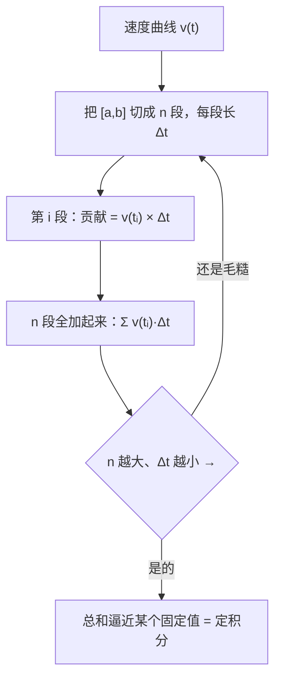
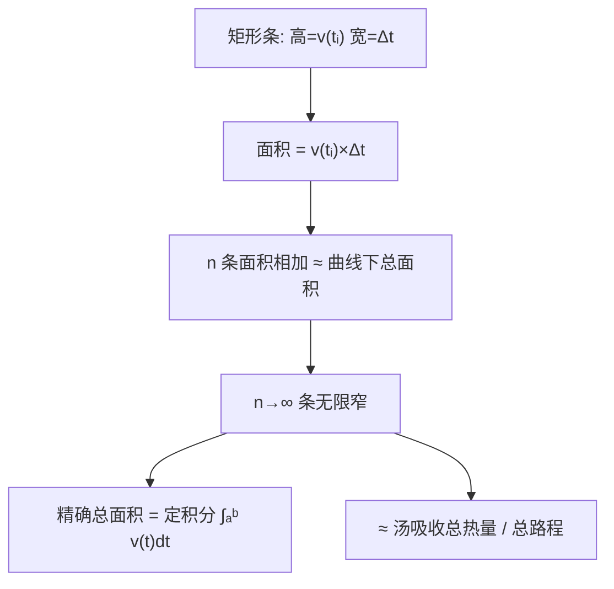

# 第 07 章 · 积分——把碎变化拼回整体

> 本章从哪个问题出发：我只知道汤每一刻的"升温速度"，怎么拼出它"总共吸收了多少热"？只知道每段路程的速度，怎么拼出"总共走了多远"？
> 推导到哪个结论：积分是把"无数个无限小的变化"加总成一个整体；定积分 = 把区间切成小条、求和、再让条无限细的极限；而它跟导数，是同一枚硬币的两面。

> 核心认知：你上一章学会问"此刻变得多快"（导数），这一章要回答"加起来总共变了多少"。答案不是把几段粗算一加就完事，而是把变化切成一万片、十万片，再问"当每一片都缩到无限薄时，加总逼近哪个数"。把"积少成多"做到极限，就是积分；而"先拼出整体、再求它变多快"和"先知道多快、再拼出整体"，是同一个东西的两张脸。


## 引子

砂锅在灶上咕嘟咕嘟地响，白汽顶着锅盖沿往上冒。我拿木勺搅了搅，尝了一口——淡了，还没到时候。这锅汤已经熬了一个钟头，从凉水 20 度慢慢爬到现在的 70 度，火一直没断。

"70 度，还得再熬到 95 度才出味。"我对着锅自言自语，"可这一路烧上来，一共吸收了多少热？"

老谟不知道什么时候进了厨房，靠在门框上，手里端着杯白开水。"你说'吸收了多少热'。"他重复了一遍，"那我问你——热量是怎么进这锅汤的？"

"火烤的啊。"我理所当然地回答，"火一直在烧，热量一点一点往里进。"

"那你是打算怎么算'总共进了多少'？"

"……我看温度啊。从 20 度到 95 度，差 75 度，这不就是吸收的热量？"

老谟放下杯子，慢悠悠地开口："那你记不记得上一章，你怎么对付'速度'的？速度不是全程平均，是'某一刻'的瞬时率。可你现在想算'总共的热量'，你却想用'首尾两个温度一减'就糊弄过去。你觉得，这中间缺了什么？"

我直勾勾盯着那锅翻涌的白汽，一时接不上话。上一章我好不容易才弄明白"瞬时"和"平均"不是一回事，可这一章一开口，我又滑回"看首尾"的老路上了。

"你是说……"我端着勺子，有点迟疑，"火的强度不是一直一样的？升温也不是均匀的？"

"你自己看看这锅汤。"老谟指了指，"凉水刚下锅，火再大它也升得慢；到四五十度，升得快起来；快到 90 度，汤快开了，又开始升得费劲。**它的'升温速度'，在每一刻都不一样。** 那你怎么用'首尾两个温度一减'，算清楚这一路上到底进了多少热？"

我盯着锅里翻涌的气泡，说不出话。我知道每走一步"变了多少"，可我发现自己根本不知道"总共变了多少"——除非我把每一步都记下来，再一个不落地加在一起。

"这得……"我挠了挠头，"把每一小步都记下来，然后全加起来？"

"你终于说到正题了。"老谟把水杯往灶台边一放，"这一章，就干这一件事——**把无数个'每一刻的小变化'，一个不落地拼回一个整体。** 你上一章学会把它拆碎，这一章，学会把它拼回去。"


## 对话引擎

### 第 1 轮：别只看首尾——"每一小步"都漏不得

**老谟**："你说用首尾两个温度一减，就算出总热量。那我现在给你一个最简单的例子，你自己看看这个算法坑在哪。**假设这锅汤，升温速度恒定是每分钟 2 度，从 20 度烧 10 分钟。** 你说总热量（这里就用温度升高来代替热量，反正成正比）是多少？"

**造物主**："恒定每分钟 2 度，烧 10 分钟……那就是升高 20 度，从 20 度到 40 度？首尾一减，40 减 20，也是 20 度。这个算法没问题啊。"

**老谟**："因为这里速度恒定，首尾一减恰好对。那我换一个——**前 5 分钟升温速度是每分钟 1 度，后 5 分钟是每分钟 3 度。** 首尾看，从 20 度开始，你告诉我 10 分钟后是多少度？总升高多少？"

**造物主**："前 5 分钟每分钟 1 度，升 5 度；后 5 分钟每分钟 3 度，升 15 度。总共升 20 度，到 40 度。"

**老谟**："那你用'首尾一减'能算出来吗？"

**造物主**："……不能。因为只看首尾，我根本不知道中间 5 分钟那个'1 度每分钟'和'3 度每分钟'的换挡。首尾一减只能告诉我'净变化 20'，可这 20 是怎么一步步凑出来的，它不说。"

**老谟**："你发现第一个真相了：**首尾一减，只告诉你'结局'，不告诉你'这一路上是怎么变的'。** 而当速度在变化时，'总共变了多少'就绝不只是看首尾——你得把每一段的速度，都派上用场。"

**造物主**："那我只能一段一段地算，再全加起来？前 5 分钟升 5，后 5 分钟升 15，加起来 20。"

**老谟**："那你现在是在把'两段'加起来。如果我把速度分成十段、每一段的升速都不一样，你会怎么做？"

**造物主**："那就十段各算各的，再加起来？"

**老谟**："十段是十次加法，那如果我把速度分成一万段呢？"

**造物主**："……一万次加法。手会断，但道理对。"

**老谟**："道理对，可你还没抓到最要紧的那个问题。你想想——**'速度在每一刻都变'，那我分成十段、一万段，每一段里那一点点的速度，还是'变'的呀。我把一分钟当成一段，可这一分钟里速度也在变。你说，怎么破？**"

**造物主**："……又来了。上一章的速度，就是个"每一刻都在变"的东西。我切成一段一段，每段里还是有个"变"在作祟。要真正干净，是不是得让每一段小到……速度在段里几乎不变？"

**老谟**："你自己把上一章的老朋友（无限小）又请回来了。别急着往前走，先把你'一段段算再加总'这个动作，给它个说法。"

---

**📐 知识锚点：把变化切成小条——从"分几段"到"分成小片"**

【概念深挖】你现在做的，是把"速度随时间"这个函数，切成一小段一小段，每段用"这一段的速度 × 这一段的时长"算出这一段的贡献，再把所有贡献加起来。这一整套"切条 + 相乘 + 求和"的动作，有一个正式名字叫**黎曼和（Riemann sum）**。

设速度函数是 v(t)，我们想看从 t=a 到 t=b 一共走了多远（或汤吸收了多少热）。做法：

1. 把 [a, b] 切成 n 小段，每段长 Δt。
2. 在第 i 段里，取一个代表速度 v(tᵢ)。
3. 这一段的贡献 = v(tᵢ) × Δt（速度 × 时间 = 路程）。
4. 把所有贡献加起来：**总路程 ≈ Σ v(tᵢ) · Δt**（Σ 是希腊字母"西格玛"，读作 sigma，表示求和）。

这张图把"切成小条求和"画得明明白白：


读图说明：最上面的速度曲线，先被切成 n 个竖条，每个竖条的"高"是这段的速度、"宽"是 Δt，"高×宽"就是这一小段的贡献（面积）。把 n 个竖条的面积全加起来，就得到"总共变多少"的一个近似。右下角那个问号是关键——**切得越细，竖条越窄，加总越逼近一个稳定的值，这个值就是定积分**；要是还觉得毛糙，就继续加段数，回到 B 再切一次。

【历史溯源】"把变化切成小片、再求和"这个思路古已有之——**古希腊的阿基米德（Archimedes，公元前 3 世纪）**用"穷竭法"算圆的面积：把圆切成越来越细的扇形片，再拼成一个近似矩形，片越细越接近真面积。他在没有微积分的年代，就把"切细求和逼近"这条路走通了。但阿基米德只能对少数特别规则的形状（圆、抛物线）用这招，因为他每换一个形状都要重新想一套切法。**"能不能有一套通用的、能对任何函数都这么切的办法"——这个问题，要等到两千多年后的牛顿和莱布尼茨才彻底解决。**

---

### 第 2 轮：把条切到无限细——"求和"变成"定积分"

**老谟**："你现在的算法是：切 n 段，每段算 v×Δt，全加起来，得到一个近似。那我问你，这个近似，准吗？"

**造物主**："不准。因为每段里头的速度还是在变，我用这一段的一个代表速度去算整段，肯定有误差。段越粗，误差越大。"

**老谟**："那要让它准，怎么办？"

**造物主**："段数 n 取大一点？n 越大，每段 Δt 越小，每段里速度越接近不变，误差就越小。"

**老谟**："那 n 取一万、一亿……n 无限大、Δt 无限小，会怎么样？"

**造物主**："……那每一段就小到极限，每段里的速度几乎就是'那一瞬间'的速度，误差也小到极限。加总出来的数，就不再是近似，而是——一个精确的总量？"

**老谟**："你等一下。n 无限大，意味着你要加无限多项。无限多项加起来，不会是无穷大吗？"

**造物主**："不会吧？每段贡献是 v×Δt，Δt 越来越小，每一项也越来越小。无限多项加起来，每一项小到趋近 0，总和却趋近一个有限的数——就像上一章 4+h 在 h 趋近 0 时趋近 4 一样，这里也是趋近一个固定的总量。"

**老谟**："你说对了——**无限多项，每一项都趋近 0，但加起来却可能趋近一个有限的值。** 这件事本身，就是上一章你学会的'极限'在'求和'这边的孪生兄弟。那我把话说满：**当 n 趋近无穷大、Δt 趋近 0 时，那个黎曼和 Σ v(tᵢ)·Δt 所逼近的极限，叫定积分。** 它不再是个近似，而是一个精确的"总共变了多少"。"

**造物主**："所以定积分 = 切条求和 + 把条切到无限细？"

**老谟**："你把定义一口说出来了。可你别光背这句，你得知道它'长什么样'、'能干什么'——下面这段，给你把定积分和它的'面积'身份钉死。"

---

**📐 知识锚点：定积分 = 切条求和取极限 = 面积**

【概念深挖】**定积分（definite integral）**的定义，就是你刚才那句话的正式版：

> **∫ₐᵇ v(t) dt = 当 n 趋近无穷大、Δt 趋近 0 时，黎曼和 Σ v(tᵢ)·Δt 的极限。**

记号里那个拉长的 "S"（∫）就是"求和"的符号，a、b 是积分的**下限、上限**，v(t) 叫**被积函数**，dt 是"对 t 求和时那一小段的记号"。这个 ∫ 符号是莱布尼茨发明的，他把"Summa（求和）"的首字母 S 拉长成了 ∫。

定积分有一个极其直观的身份——**它是曲线下的面积**。回到我们那张"切成竖条"的图：每个竖条 v(tᵢ)×Δt 的"高×宽"，正是一个小矩形的面积。所以：

- **黎曼和 = n 个细长矩形面积的总和**（速度曲线下的阶梯形面积）。
- **定积分 = 当矩形无限窄时，这块总面积所逼近的那个数**。

这就是为什么"定积分"常被简单称作"曲线与横轴围成的面积"。你算汤吸收的总热量、算总路程，本质上都是在算"速度（或升温速度）曲线下的面积"。一个图看懂：


读图说明：竖条的高是"此刻的速度"，宽是"一小段时长"，所以每个竖条的面积就是"这一小段的贡献"。所有竖条拼起来，占满速度曲线下方的整个区域。条越细，阶梯越贴紧曲线，拼出来的总面积就越接近真值；条无限细时，这块面积就精确地等于定积分——也就是"总共变多少"。

【工程实践】把"面积"这个身份跟真实世界一挂钩，积分就到处都是了：
- **总路程**：把"速度曲线下的面积"算出来，就是走了多远。
- **总热量 / 总电量**：电流 i(t) 对时间积分，得到通过的总电量 Q；功率对时间积分，得总能量。
- **医学**：血药浓度曲线下的面积（AUC），代表药物在体内的总暴露量，是药代动力学最核心的指标。
- **音频 / 信号**：一段波形对时间的积分，代表它的"总面积"（直流分量），滤波里天天用。

**凡是"知道每一刻的变化速度，想知道总共变了多少"，答案都是同一个动作：对速度积分。** 你的直觉"把每一小步记下来再全加起来"，正是积分最朴素的来历。

---

### 第 3 轮：亲手算一个真实的积分——把"路程"拼出来

**老谟**："理论说够，你亲手算一个。**假设一辆车，速度随时间线性增加：v(t) = 2t（单位略）。从 t=0 开到 t=3。** 你算算，这辆车一共走了多远？"

**造物主**："速度是 2t，越开越快。我把它切成 n 段算黎曼和，再让 n 趋近无穷大？"

**老谟**："好，那你自己动手。n 段，每段长 Δt = 3/n。第 i 段里，速度大概取多少？"

**造物主**："取段末那个时刻 tᵢ = 3i/n，那速度 v(tᵢ) = 2×(3i/n) = 6i/n。每段贡献 = v×Δt = (6i/n)×(3/n) = 18i/n²。"

**老谟**："n 段全加起来，Σ (18i/n²)，i 从 1 加到 n。你给我算出来。"

**造物主**："18/n² 提出来，就是 (18/n²) × (1+2+…+n)。1 加到 n 等于 n(n+1)/2。所以总和 = (18/n²) × n(n+1)/2 = 9 × (n+1)/n = 9(1 + 1/n)。"

**老谟**："你得到一个随 n 变的总和：9(1+1/n)。那现在让 n 趋近无穷大，它趋近哪个数？"

**造物主**："9(1+1/n)，n 越大 1/n 越趋近 0，所以总和趋近……9！所以从 t=0 到 t=3，一共走了 9 个单位路程！"

**老谟**："你亲手把一个黎曼和求了极限，得到定积分的值 9。那你回头看看——从 v(t)=2t 的 0 到 3，这个积分 ∫₀³ 2t dt = 9。**你用'切条、求和、让条无限细'这条路，走出了一个精确的总量。** 这就是积分的威力：它把'每一刻都在变的速度'，精确地拼成了一个整体。"

**造物主**："所以我不需要知道每一刻的具体速度，只要知道'速度怎么随 t 变'（也就是 v(t) 这个函数），就能算出总共走多远。关键是要会求和、会取极限。"

**老谟**："求和取极限，说难也不难，可你注意到没有——你这一章算得很费劲：要设段、要写黎曼和、要化简、要取极限。**万一每次求积分都这么折腾，那也太累了。** 你难道不想要一条'不这么费劲'的路？"

**造物主**："……有省力的路吗？这已经很像我上一章求导数那套'取很小 h'的动作了。它俩该不会有什么联系吧？"

**老谟**："你问到最关键的地方了。下一轮，我们就来挖这个'联系'。"

---

**📐 知识锚点：【实现思考】用 Python 算黎曼和，逼近积分**

【实现思考】手动切条、求和、取极限，一次可以；次次这样会疯。所以工程师直接让机器来逼近积分——这几乎就是积分的"可造"形态：

```python
def riemann_sum(f, a, b, n):
    """把 [a,b] 切成 n 条，每条取左端点高度，矩形面积相加"""
    dt = (b - a) / n
    total = 0.0
    for i in range(n):
        t = a + i * dt          # 第 i 条的左端点
        total += f(t) * dt      # 高×宽 = 这一小条的贡献
    return total

# 算 v(t)=2t 从 0 到 3 的总路程（真值 = 9）
f = lambda t: 2 * t
for n in [10, 100, 1000, 100000]:
    print(f"n={n:<7} 黎曼和={riemann_sum(f, 0, 3, n):.6f}")

# 顺手算 sin 曲线下的面积（0 到 π，真值 = 2）
import math
g = lambda t: math.sin(t)
print("sin(0→π) 面积≈", riemann_sum(g, 0, math.pi, 100000))
```

运行结果大概是：

```
n=10      黎曼和=8.100000
n=100     黎曼和=8.910000
n=1000    黎曼和=8.991000
n=100000  黎曼和=8.999910
sin(0→π) 面积≈ 1.999980  （真值就是 2）
```

**为什么这么造**：我们完全没去解方程、没找原函数，只是把"切成 n 条、高×宽、相加"这段你推导的动作翻译成循环，让机器去逼近。n 越大越接近真值 9。**代价**：这是近似，不是精确；n 要足够大才够准，而 n 太大又慢。**换条路会怎样**：可以取右端点（得到另一个近似），或取中点（误差更小）。取左端点会产生系统性偏差——每个矩形都比真面积小一点，所以 n=10 时只有 8.1、明显偏低。这就是数值积分的取舍：**用"切多细"换"够不够准、够不够快"**。而下一轮你会发现，有一条完全不靠切条的省力路。

【历史溯源】阿基米德的穷竭法切到无限细，本质就是在算积分——只不过他只能用这套"笨办法"对特定形状一个个试。**让"切条求和"成为一门统一的学科，是牛顿和莱布尼茨的功劳**：他们找到了一个能对几乎所有函数直接套用的"省力公式"，从而把阿基米德那只"每次都重新磨的刀"，换成了一把通用的快刀。你下一轮要挖的"联系"，正是这把快刀本身。

---

### 第 4 轮：反着走——积分和导数，原来是同一件事

**老谟**："你上一章算导数，要取很小的 h；这一章算积分，要切很细的条。你有没有觉得，这两个'取小'的动作，像是一对？"

**造物主**："是有点像……可一个是'拆碎'，一个是'拼起来'，方向好像是反的。"

**老谟**："方向反的，不代表没关系。我先给你看一个东西。**一辆车，从 t=0 出发，速度是 v(t)=2t。我问你，它的'位置' s(t) 这个函数，你能猜出来吗？** 它从 t=0 开始，开 t 秒之后，一共走了多远？"

**造物主**："开了 t 秒，路程就是把速度从 0 积到 t……那就是 ∫₀ᵗ 2u du。可我不会算这个带 t 的积分啊。"

**老谟**："那你就用上一章那招，或者用这一章的黎曼和。你刚才已经会算 ∫₀³ 2t dt = 9 了，现在把 3 换成 t，你猜结果是什么形式的？"

**造物主**："把 3 换成 t……我猜大概是 t² 的多少倍？因为 9 = 3²，所以 ∫₀ᵗ 2u du 大概等于 t²？"

**老谟**："你猜对了——∫₀ᵗ 2u du = t²。那我现在问你一件怪事：**这个 s(t) = t²，你给它求个导，看看会得到什么。**"

**造物主**："求导！s(t)=t² 的导数，上一章我刚推过——就是 2t！而 2t 正是速度 v(t)！"

**老谟**："你看清楚发生了什么：**你先把速度 v(t) 积分，得到位置 s(t)；再把 s(t) 求导，居然又回到了 v(t)。** 积分之后求导，转了一个圈，回到了原点。"

**造物主**："这……这不是巧合吧？我把速度拼成路程，路程的导数又变回速度。那意思是，**积分和求导，是互逆的？**"

**老谟**："你自己说出了微积分里最漂亮的那句话。**积分和求导互为逆运算**——就像加法和减法、乘法和除法一样。你上一章学的导数，这一章学的积分，是同一个硬币的两面。你看着这枚硬币，它正面是'怎么把变化拆成瞬间'，背面是'怎么把瞬间拼成整体'。"

**造物主**："那我岂不是可以用'求导'来'省力地求积分'了？既然 s(t)=t² 的导数是 2t，那我遇到'要积 2t'，只要反着想——'谁的导数等于 2t'，答案是 t²，那 ∫ 2t dt 就是 t²！"

**老谟**："你不但发现了互逆，还当场发现了一条省力的路。**求积分，可以反着来：找一个函数，它的导数正好是被积函数。** 这就像'解方程'一样，把'难加的积分'，变成'好找的导数'。这条路，是牛顿和莱布尼茨手中那把最快的刀。"

---

**📐 知识锚点：微积分基本定理——积分与导数互逆**

【概念深挖】你刚才发现的"积分再求导回到原点"，正是微积分里最核心的一条定理——**微积分基本定理（Fundamental Theorem of Calculus）**。它有两半，其实你都已经摸到了：

1. **第一基本定理（积分是导数的逆）**：如果 F 的导数等于 f（即 F′(x) = f(x)），那么 ∫ₐᵇ f(x) dx = **F(b) − F(a)**。
   - 这句的威力在于：**求积分不用再切条求和了，只要找到一个"导数等于被积函数"的函数 F（叫原函数），首尾相减就完事。**
   - 回到你的例子：要找 ∫₀³ 2t dt，因为 t² 的导数是 2t，所以直接 = 3² − 0² = 9，和你累死累活切条求极限的结果一模一样。

2. **第二基本定理（导数可以复原成积分）**：F(x) = ∫ₐˣ f(t) dt，那么 F′(x) = f(x)。即"变上限积分"的导数等于被积函数——**积分把导数复原了回来**。

一句话：**求导和积分，一个拆、一个拼，互为逆运算。** 你这一章开头为"切条求极限"发愁，到这儿有了救星——大多数积分，靠"反着求导"就能轻松算出。

【历史溯源】这条"反着想"的省力路，是牛顿和莱布尼茨**几乎同时、独立**发现的，也因此埋下了数学史上一场著名的"优先权之争"。**牛顿（1680 年代，英国的流数法）和莱布尼茨（1684 年发表，德国的微积分）** 各自发明了这套互逆的工具，却为"谁先发明"吵了几十年，甚至引发了英欧数学界长达百年的隔阂——**英国坚持用牛顿那套记号，孤立于欧陆数学发展之外，代价是英国数学落后了近一个世纪。** 而莱布尼茨那套 ∫ 和 dy/dx 记号，因为更顺手，最终成了全球通用的标准。**你此刻手里这套漂亮的符号，是这场历史之争的胜者。**

【工程实践】基本定理在工程里是"金矿"，因为**"先找原函数再相减"比"切条求和"快得多、准得多**：
- 电路里算功率积分、能量，物理里算功、算质心，都用原函数直接算。
- 但要注意：**并不是所有函数都找得到"漂亮的原函数"**（比如 sin(x²)、e^(−x²)）。这时候工程师又得退回数值积分（切条、或用更高级的辛普森法）。所以**两条路都要会**：能找原函数就快刀，找不到就上数值刀。这跟你这一章亲手写的黎曼和代码是一脉相承的。

---

### 第 5 轮：定积分的"两副面孔"——从具体到通用

**老谟**："你现在会求一些积分了。那我问你——定积分 ∫ₐᵇ f(x) dx，它到底是'一个数'，还是一个'函数'？"

**造物主**："……一个数吧？我从 0 积到 3，得到一个 9，这不就是个数吗？"

**老谟**："那如果我把上限 b 留成变量呢？我写成 ∫ₐˣ f(t) dt，x 可以取 0、取 1、取 3、取任意值——你说，这是不是一个随 x 变化的'函数'？"

**造物主**："……是！上限一变，积出来的数就变，这就是一个以 x 为自变量的函数。"

**老谟**："对。所以定积分有两副面孔：**上限固定时，它是个数（某个区间的总面积）；上限是变量时，它是一个函数（'从固定起点积到 x 的累计量'）。** 而正是这第二副面孔，让你上一轮发现的那条'反着求导'的路有了坚实的地基——因为那个'累计函数'的导数，正好就是被积函数。"

**造物主**："所以基本定理不是魔法，是因为那个'累计函数'的导数天生就等于被积函数，我才可以用原函数去算定积分。原来它不是'捷径'，它是一开始就注定成立的性质。"

**老谟**："你把'捷径'这个词收起来了，换成'性质'。这很好。因为理解它是'性质'，你才不会在遇到'找不到原函数'时崩溃——那只是'这条性质没法被漂亮地用出来'，不是微积分坏了。"

**造物主**："那我懂了。遇到能找原函数的，就用基本定理快算；遇到找不到的，就退回切条求和的数值办法。**两条路我都得握在手里。**"

---

**📐 知识锚点：【概念深挖】定积分的两副面孔与"累计量"**

【概念深挖】把"定积分是数 vs 是函数"理清，是理解积分的关键一步：

- **定积分 ∫ₐᵇ f(x) dx（上限固定 b）**：是一个**确定的数**，表示 [a, b] 区间上曲线下的总面积。比如 ∫₀³ 2t dt = 9，一个数。
- **变上限积分 F(x) = ∫ₐˣ f(t) dt（上限是变量 x）**：是一个**函数**，表示"从 a 积到 x"的累计量，随 x 增大而增长。比如从 0 积到 x 的 2t，得 x²，这就是位置函数。

这两个"面孔"由基本定理连起来：**F′(x) = f(x)**——累计量函数的导数，就是被积函数。这解释了为什么原函数能用来算定积分：

```text
累计函数 F(x) = ∫ₐˣ f(t)dt   （上限变量）
       ↓ 它的导数等于 f(x)
定积分 ∫ₐᵇ f(x)dx = F(b) − F(a)   （用原函数相减，省掉切条）
```

一个对照——**"累计"这个视角无处不在**：银行的存款"从开户到今天的总额"就是每日利息的累计（积分）；水表"从月初到今天的总用量"就是每日流量的累计；汤"从凉到 95 度吸收的总热"就是每一刻升温速度的累计。**只要把"每一刻的变化"攒成一个"到此刻的累计量"，你就在做积分。**

【工程实践】为什么要在"数"和"函数"之间分这么清楚？因为工程里两种都用：**要一个总账**（这个月总电量、这段路总长）就用"数"的积分；**要一个累计曲线**（随时间增长的累计电量、位置随时间的位置函数）就用"变上限积分"这个函数。**你上一章学的导数、这一章的积分，正好是"累计函数"和"它的变化率"这对逆运算**——在控制、物理、金融里，这对逆运算几乎是所有"总量 vs 流量"问题的骨架。

---

### 第 6 轮：光知道"反着求导"还不够——有的积分，得靠"换元"和"拆项"来对付

**老谟**："你上一轮发现了一条省力路：求积分 = 反着想，找一个导数等于被积函数的函数。可这条路有个前提——**你得'认得出'那个原函数。** 那我考你：∫ x·cos(x) dx，你能一眼看出'谁的导数等于 x·cos(x)'吗？"

**造物主**："……看不出。sin(x) 的导数是 cos(x)，可这儿前面还乘了个 x。还有 ∫ e^(x²)·x dx 这种，我更抓瞎。**光'反着想'，凑不出来的多了去了。**"

**老谟**："那你就只能对每一个都'碰运气'了？当然不是。你上一章刚学完'怎么手算求导'——那套'拆积木 + 按法则拼装'。**现在求积分，就是它的逆运算。你能'顺着'求导，就一定能'反着'用那套法则。** 我问你一个最基础的——如果被积函数是 cos(x²)·2x，你上一章能算出它是谁的导数吗？"

**造物主**："……cos(x²)·2x？我记得上一章求 sin(x²) 的导数，用了链式法则：cos(x²)×2x！所以**cos(x²)·2x 的积分，就是 sin(x²)**！这跟我求导正好反过来！"

**老谟**："你自己发现了：**链式法则的正向是求导，反着用就是'换元'——你把里面那层 x² 当成一个新变量，外层积分完，再把它换回去。** 那再问你一个更刁的——∫ x·cos(x) dx，它既不是简单的链式反着用，也不是一眼能凑出来。你想想，你上一章还学过哪个求导法则，可以反着用来对付这种'两个东西乘在一起'的积分？"

**造物主**："……两个东西乘在一起……我上一章学了'积的法则'（乘法法则）：(u·v)′ = u′·v + u·v′。**如果把它反着用，是不是能把'u·v 的导数'拆开，挪一挪项，就把不好积的 ∫ x·cos(x) 变成好积的？**"

**老谟**："你摸到门了。这两个反着用的招——一个对付'套了一层'的（链式反着用=换元），一个对付'两个乘一起'的（乘法反着用=分部积分）——就是求积分计算体系里最要紧的两把刀。我们下面把它们钉成套路。"
---

**📐 知识锚点：积分的计算技巧——换元法与分部积分法，是求导法则的"反向使用"**

【概念深挖】造物主在上一轮亲手发现"链式法则反着用"能算 cos(x²)·2x 的积分，又隐约想到"乘法法则反着用"能对付 ∫ x·cos(x)。这两招，正是求积分计算体系里最核心的两个技巧：

**1. 换元法（substitution，也叫变量代换）**——链式法则的逆：
- 链式求导是"外层导 × 内层导"，换元就是把它倒过来：**遇到形如 f(g(x))·g′(x) 的被积函数，把内层 g(x) 换成新变量 u，那么 g′(x)dx 就成了 du，原积分变成 ∫ f(u) du，就好积了，最后再把 u 换回 g(x)。**
- 例：∫ cos(x²)·2x dx，令 u=x²，则 du=2x·dx，原式 = ∫ cos(u) du = sin(u) = **sin(x²)**——正好是你上一章推出的 sin(x²) 的导数，分毫不差。
- 为什么"能看出来"：因为你得先认出"里面有一层 + 外面正好是那层的导数"这种结构，这就是链式法则反着用的标志。

**2. 分部积分法（integration by parts）**——乘法法则的逆：
- 乘法法则 (u·v)′ = u′·v + u·v′ 移项可得 **∫ u·v′ dx = u·v − ∫ u′·v dx**（常记作 **∫ u dv = uv − ∫ v du**）。
- 它的用意：**把"不好积的两个东西相乘"（如 ∫ x·cos(x)）变成"好积的另一对"**。关键在于选哪个当 u、哪个当 dv——通常选"求导会变简单"的当 u（如 x）、"能直接积分"的当 dv（如 cos(x)）。
- 例：∫ x·cos(x) dx，取 u=x、dv=cos(x)dx，则 du=dx、v=sin(x)，代入得 x·sin(x) − ∫ sin(x) dx = **x·sin(x) + cos(x)**。

**为什么这两招是"技能"**：因为求积分不像求导那样"规则齐全、无脑套用"。**求导是机械的（任何函数都能套规则算出），求积分是手艺的（你得观察结构、挑对方法、甚至多次组合）。** 换元法管"套了一层"，分部积分法管"两个相乘"，这两把刀配合基本公式表，就能对付绝大多数"能写出来"的积分——这也是"积分计算体系"的骨架。

【工程实践：牛顿-莱布尼茨公式的正式名分】你第 4 轮摸到的"找原函数相减"（∫ₐᵇ f dx = F(b)−F(a)），数学史上有一个专属名字——**牛顿-莱布尼茨公式（Newton–Leibniz formula）**，它就是"微积分基本定理"最常被引用的那个样子。**"先求原函数、首尾相减"之所以叫'公式'而不叫'技巧'，是因为它把"求积分"这个看起来需要切条求极限的活，直接变成"求原函数 + 代端点"，是整个积分计算的地基。** 换元、分部这两招算出的都是"原函数"，算完照样代端点用这条公式——所以这条公式和这两把刀是"地基 + 工具"的关系，密不可分。

【概念深挖：反常积分】前面我们积分的区间都是有限的 [a, b]。可现实里常常有"区间无限"或"被积函数在某点无穷"的情况，这叫**反常积分（improper integral）**。它的处理套路，是把"无限"或"无穷"当成"极限"来处理：
- **区间无限**（如 ∫ₐ^∞ f(x) dx）：先算有限上限 ∫ₐᵀ f dx，再让 T→∞ 取极限。若极限存在，称这个反常积分收敛（比如 ∫₁^∞ 1/x² dx 收敛于 1）；若极限发散（如 ∫₁^∞ 1/x dx），就没有有限值。
- **函数在某点无穷**（如 ∫₀¹ 1/√x dx）：同理，先在"无穷点"附近取一个小 δ，算 ∫_δ¹，再让 δ→0 取极限。
**反常积分在工程里很常见**：概率里的正态分布曲线下的总面积（整条实轴）、信号的直流分量、放射性物质的总衰变量，都要算"无限区间上的积分"。它不神秘——就是把上一章的"极限"和这一章的"积分"再叠一次。

【工程实践：定积分的几何应用——面积与体积】定积分既然是"曲线下的面积"，它最能打的用途就是算几何量：
- **面积**：曲线 y=f(x) 与 x 轴围成的面积 = ∫ₐᵇ f(x) dx（f≥0 时）；两条曲线之间的面积，是"上面那条减下面那条"再积分。
- **体积**：把一块平面绕某轴旋转（比如花瓶、圆台），得到的旋转体体积，可以用**切片法**：把立体切成无数薄片，每一片近似一个小圆柱，厚度 dx、底面积 π·(半径)²，再对所有片积分——这又是"切条求和"的老朋友，只是这次"条"变成了"圆片"。
**面积、体积、质心、弧长，全是同一招：切小片、每片算贡献、再积分。** 你这一章的"切条求和"本领，在几何世界里几乎无所不能。

【工程实践】这套"计算体系"在真实工程里是"能出公式的解"：物理里由加速度积分求速度、再由速度积分求位移（两次积分），电路里由电流积分求电量，概率里算期望（x·p(x) 对全空间积分）、算方差。**凡是"累积、总量、面积、体积、期望"这类词，底层都是积分**；而算它们，就是"先找原函数 + 换元/分部"这套手艺，实在找不到原函数才退回数值积分。

---

### 第 7 轮：落点——积分与导数，同一枚硬币的两面

**老谟**："把锅端回来。你最初想问'一共吸收了多少热'，现在你告诉我，答案该怎么找？"

**造物主**："不能光看首尾两个温度一减。因为升温速度每一刻都在变。我得把'升温速度随时间'那条曲线，从凉到 95 度切成无数小条，每条的贡献是'那一刻的升温速度 × 那一小段时间'，全加起来——这就是定积分，也就是曲线下的面积。而这个面积，就是总共吸收的热。"

**老谟**："那你有没有更省力的算法？"

**造物主**："有。因为积分和求导互为逆运算，我可以找一个函数，它的导数正好是那个升温速度——那个函数就是'累计吸热量随温度/时间'的曲线，用它首尾一减，就得到总热，不用一根根切条。"

**老谟**："你把这章的两条路都说全了：**一条是硬切（黎曼和 + 取极限，万能但费劲），一条是反着求导（基本定理，省力但有条件）。** 那你还记得，这一切的起点是什么吗？"

**造物主**："起点是上一章的导数——我学会了问'此刻变得多快'。而这一章，我学会了问它的另一半：**'把每一刻的变化拼起来，总共变了多少'。** 拼的过程是切条求和取极限（积分），而拼和拆互为逆运算。**求导把整体拆成瞬间，积分把瞬间拼回整体，它们是一枚硬币的两面。**"

**老谟**："'一枚硬币的两面'——你这句话，就是微积分的全部。那你再往前想一步：**你这两章，一直在跟'一个输入、一个输出'打交道——x 变了，f(x) 跟着变，你量它怎么变、怎么拼。可这个世界，常常不是一个输入，而是一堆输入一起变。** 一辆车，要同时看它的方向、位置、速度；一片图像，有一万个像素一起动。那时你这套'一个量随一个量变'的尺子，还够用吗？"

**造物主**："一个输入……一堆输入……那不得把每一个输入都单独量一遍？可它们又互相影响，我怎么分得开？"

**老谟**："分不开，那就别硬分——你需要的，是能同时处理'一堆输入一起变'的新家伙。下一章，我们就要造它。你先把今天这枚硬币收好，它不会白学的。"

**造物主**："所以导数教我'看瞬间'，积分教我'拼整体'，而下一章……要把'一个'变成'一堆'。"

**老谟**："你已经开始想下一章的事了。先把这锅汤熬完——你的积分，该到 95 度了。"

---

### 📐 知识锚点·计算速查：积分怎么算

【适用场景】给你一个被积函数，算定积分/求原函数。先认"结构"，再挑方法。

【常用原函数速查表】（求导表的逆，直接套用）：

| 被积函数 | 原函数 | 被积函数 | 原函数 |
|----------|--------|----------|--------|
| k（常数） | kx + C | eˣ | eˣ + C |
| xⁿ (n≠−1) | xⁿ⁺¹/(n+1) + C | 1/x | ln\|x\| + C |
| sin x | −cos x + C | cos x | sin x + C |

【牛顿-莱布尼茨公式计算步骤】（求定积分 ∫ₐᵇ f(x) dx）：
1. 找原函数 F(x)（满足 F′(x)=f(x)，用上表或换元/分部凑出来）。
2. 代入端点相减：**∫ₐᵇ f(x) dx = F(b) − F(a)**。
3. 记忆口诀：**找原函，代上下，后减前**。

【换元法计算步骤】（对付"套了一层"的，如 ∫ 2x·cos(x²) dx）：
1. 认出结构 f(g(x))·g′(x)：内层 g(x)、外面正好有它的导数 g′(x)。
2. 令 u=g(x)，则 du = g′(x)dx，把原积分换成 ∫ f(u) du。
3. 用速查表积出 F(u)，再把 u 换回 g(x)，得到 F(g(x))。
4. 若是定积分，记得把端点也跟着换成 u 的端点（或换回后再代）。
5. 记忆口诀：**令内层，换微分，积完换回**。

【分部积分法计算步骤】（对付"两个相乘"的，如 ∫ x·cos(x) dx）：
1. 认出一对相乘，选一个当 u（求导会变简单的）、另一个当 dv（能直接积分的）。
2. 套公式 **∫ u dv = uv − ∫ v du**。
3. 新的 ∫ v du 往往比原来好积，再积一次。
4. 例：∫ x·cos(x) dx，取 u=x、dv=cos(x)dx，得 x·sin(x) − ∫ sin(x) dx = x·sin(x) + cos(x)。
5. 记忆口诀：**选好 uv，套公式，后项好积再收尾**。

### 🔧 工程实践·计算案例：概率密度曲线下的面积必须"归一化"

机器学习/统计里，一个概率密度函数 `p(x)` 曲线下的总面积必须等于 1（概率之和为 1）。算这个"总面积"正是定积分——下面用 `sympy` 符号积分 + `scipy` 数值积分，验证一个简单分布确实归一化：

```python
import sympy as sp
from scipy import integrate
import numpy as np

# 一个"三角形"分布密度: p(x) = 2x 在 [0,1] 上（其余为 0）
x = sp.symbols('x')
p = 2 * x

# 符号积分（牛顿-莱布尼茨）: 总面积 ∫₀¹ 2x dx = x² |₀¹ = 1
total_sym = sp.integrate(p, (x, 0, 1))
print("符号积分总面积:", total_sym)          # 1

# 数值积分验证（scipy 求定积分）: 应该是 1
total_num, err = integrate.quad(lambda t: 2*t, 0, 1)
print("数值积分总面积:", total_num, "误差估计:", err)

# 顺便算期望 E[X] = ∫₀¹ x·p(x) dx = ∫₀¹ 2x² dx = 2/3
expect = sp.integrate(x * p, (x, 0, 1))
print("期望 E[X]:", expect)                  # 2/3
```

运行结果：`符号积分总面积: 1`、`数值积分总面积: 1.0`、`期望 E[X]: 2/3`。

**为什么这么造**：`sp.integrate` 走你学的"找原函数相减"（牛顿-莱布尼茨），`scipy.integrate.quad` 走数值积分，两条路结果一致、互相印证。**代价**：`sp.integrate` 对复杂函数可能算不出原函数（比如 `sin(x²)`），此时只能靠 `quad` 数值近似。**实战里**，神经网络训练大量用数值积分（损失对时间/参数的累积）、贝叶斯方法里算归一化常数也常退到数值积分——但你得先知道"理论值该是 1"，才能判断数值结果对不对，这正是 `sp.integrate` 给你的基准。

### 💡 造物主手记·计算踩坑：换元后忘了"换回"、或把积的法则当积分用

算 ∫ 2x·cos(x²) dx 时，我一换元 `u=x²`、积出 `sin(u)` 后，直接写了答案 `sin(u)` 就交卷，忘了把 `u` 换回 `x²`——结果答案里还挂着一个本不该出现的 `u`。老谟一挑眉："你积的是 x 的函数，还是 u 的函数？" 我这才想起**换元最后一步必须把 u 换回 g(x)**，答案是 `sin(x²)`。另一个坑是我曾想用"积的法则"反着硬套 ∫ x·cos(x)，以为 `= (x²/2)·sin(x)`，被老谟点破"积的法则移项是分部积分，不是各积各的相乘"——那只会让你越算越远。这两个坑，都栽在"把求导的顺手习惯错当成求积分的"上，而这正是这一章手艺的核心：**求积分是逆着来的，得先认结构、再挑对工具。**

### 📝 自测题·计算类

1. **场景**：造物主想算车从 t=0 到 t=3 匀加速走的路程，速度 `v(t)=2t`。用牛顿-莱布尼茨公式求 ∫₀³ 2t dt。
   *简答要点*：原函数 F(t)=t²；∫₀³ 2t dt = 3² − 0² = 9。找原函、代上下、后减前。

2. **场景**：归一化一个"二次"概率密度 `p(x)=3x²` 在 [0,1] 上，验证总面积是不是 1。
   *简答要点*：∫₀¹ 3x² dx = x³|₀¹ = 1³ − 0³ = 1。归一化成立。

3. **场景**：造物主用换元法求 ∫ 2x·e^(x²) dx。写出令 u=？以及最终原函数。
   *简答要点*：令 u=x²，du=2x dx；∫ 2x·e^(x²) dx = ∫ e^u du = e^u = e^(x²)。最后一步要换回 x²。

4. **场景**：用分部积分法求 ∫ x·sin(x) dx（提示：取 u=x、dv=sin(x)dx）。
   *简答要点*：u=x、dv=sin(x)dx → du=dx、v=−cos(x)；∫ x·sin(x) dx = x·(−cos(x)) − ∫(−cos(x)) dx = −x·cos(x) + sin(x)。

---

## 知识点总结

### 知识点（本章推出的核心概念）
- **黎曼和（Riemann sum）**：把区间切成 n 小段，每段用"这段的值 × 段的长度"算贡献，再全部相加 Σ f(xᵢ)·Δt，是定积分的数值近似。
- **定积分（definite integral）**：∫ₐᵇ f(x) dx = 当 n→∞、Δt→0 时黎曼和的极限，是"把无数个无限小的变化拼回整体"的精确结果；几何上是**曲线下的面积**。我们亲手推出 ∫₀³ 2t dt = 9。
- **微积分基本定理 / 牛顿-莱布尼茨公式（Fundamental Theorem of Calculus / Newton–Leibniz formula）**：积分与求导**互为逆运算**。第一基本定理：若 F′=f，则 ∫ₐᵇ f dx = F(b)−F(a)（找原函数相减，省掉切条）；第二基本定理：变上限积分 F(x)=∫ₐˣ f dt 的导数等于 f。**我们亲自验证：∫ 2t dt 得到 t²，t² 求导又回到 2t。** "先求原函数、首尾相减"这个最常用的样子，就叫牛顿-莱布尼茨公式。
- **定积分的两副面孔**：上限固定是一个数（区间总面积），上限是变量是一个函数（到此刻的累计量）。
- **换元法（substitution）**：链式法则的逆。遇到形如 f(g(x))·g′(x) 的被积函数，令 u=g(x) 把内层换掉，∫ f(u) du 好积后换回。**造物主亲手推出 ∫ cos(x²)·2x dx = sin(x²)。**
- **分部积分法（integration by parts）**：乘法法则的逆。∫ u·v′ dx = uv − ∫ u′·v dx（即 ∫ u dv = uv − ∫ v du），把"不好积的两个相乘"变成"好积的另一对"。例：∫ x·cos(x) dx = x·sin(x) + cos(x)。
- **反常积分（improper integral）**：区间无限或函数在某点无穷时，用"极限"处理（先算有限区间再取极限）；收敛则有限值、发散则无。**正态总曲线面积、信号直流分量都要算无限区间积分。**
- **定积分的几何应用**：面积 = 曲线下积分（两曲线之间用"上减下"）；旋转体体积 = 切片法（切薄片当圆柱、每片积分）。

### 历史结论（本章涉及的史料）
- 阿基米德（公元前 3 世纪）用"穷竭法"切圆算面积，是切条求和的鼻祖，但只能对特定形状逐个算。
- 牛顿与莱布尼茨（17 世纪末）几乎同时独立发现积分与导数的互逆，引发"优先权之争"；英国坚持牛顿记号导致数学落后近百年，莱布尼茨的 ∫、dy/dx 记号成为全球标准。
- **牛顿-莱布尼茨公式**因此得名——它把"切条求极限"的定积分，和"找原函数相减"连成一座桥，是两位微积分奠基人各自独立发现、又殊途同归的那条路。
- 贝克莱对早期微积分"无穷小"的质疑，后由柯西、魏尔斯特拉斯用极限定义补严（衔接上一章）。

### 工程实践结论（本章知识在真实工程里怎么用）
- **总路程 / 总电量 / 总能量 / 血药 AUC**：凡是"知道每一刻的变化速度、问总共变了多少"，答案都是对速度积分（面积）。
- **求积分的手艺**：能认出原函数就用牛顿-莱布尼茨公式直接算；认不出的，先用**换元**（对付套层）或**分部**（对付相乘）把它变能认；实在不行才退回数值积分（黎曼和、辛普森法）。
- **反常积分**：概率期望/方差（对全空间积分）、信号直流分量、放射性总衰变量，都在"无限区间"上算积分。
- **几何应用**：算面积、旋转体体积、质心、弧长，全是"切小片、每片算贡献、再积分"。
- **累计函数**：变上限积分就是"到此刻的累计量"，工程里"总量 vs 流量""累计 vs 当前"的骨架。

## 向导便签

> 这一章咱们干了什么：从一锅咕嘟咕嘟的汤，一路逼到"把碎变化拼回整体"。你亲手发现"首尾一减"会漏掉中间的换挡，摸出"切条求和"（黎曼和），再把条切到无限细得到定积分（面积），亲手算出 ∫₀³ 2t dt = 9，用 Python 让机器逼近，发现积分和导数互为逆运算（微积分基本定理/牛顿-莱布尼茨公式），最后补上"求积分的手艺"——换元法（对付套层）、分部积分法（对付相乘）、反常积分与面积体积应用。
>
> 钉死一句话：**积分 = 把无数个无限小的变化，一个不落地拼回一个整体 = 切条求和取极限 = 曲线下的面积；而它和导数，是同一枚硬币的两面。** 求导把整体拆成瞬间，积分把瞬间拼回整体。
>
> 记住：求积分有两条路——硬切（黎曼和，万能但费劲）和反着求导（牛顿-莱布尼茨公式，省力但有条件）；反着求导也不是干瞪眼，换元和分部就是它的两把刀。而下一章，这套"一个输入"的尺子，要去对付"一堆输入一起变"的世界。

## 造物主手记

**我曾踩的坑**：

我又犯了上一章的老毛病——开口就想"首尾一减"算总量。老谟用一个"前 5 分钟每分钟 1 度、后 5 分钟每分钟 3 度"的例子就让我露了馅：首尾一减只知道净变化，不知道中间怎么换挡。我还差点担心"无限多项加起来会不会是无穷大"，结果发现每项小到趋近 0、总和却趋近有限值。最绕的是我把"定积分是数"和"是函数"搞混，直到老谟说"上限是变量它就是函数"，我才分清两副面孔。补"计算技巧"时我又卡在 ∫ x·cos(x) 上——光靠"反着想"凑不出原函数，差点以为只能硬切，直到想到上一章的"乘法法则反着用"，才摸到分部积分这把刀。

**顿悟时刻**：

真正开窍是"积分再求导回到原点"那一下。我把速度 v(t)=2t 积分，得到位置 t²，再把 t² 求导，居然又变回 2t——那一刻我整个人懵了。我原以为积分的每一章都是新动作，结果发现它跟上一章的导数是一对逆运算，就像加减、乘除一样。更震撼的是，这个"互逆"不是魔法，而是"累计函数的导数天生等于被积函数"这个性质的必然结果。原来我上一章磨的那把"求导"的刀，这一章直接就能反过来切积分。而换元、分部那两下，更让我看清：**求积分不是死记，是"认出它由什么法则'拼'出来，再把那法则倒着用回去"**——求导和求积分的计算体系，本来就是同一套积木的正反两面。

## 自测题

1. **辨析**：有人说"总共走了多远，用终点位置减起点位置就行"。为什么这样会出错？
   *简答要点*：首尾一减只给净变化，忽略中间速度如何变化；当速度不恒定、中途换挡时，只有把每一段速度的贡献加起来（积分）才得到正确总路程。

2. **换算**：一辆车速度 v(t)=3 恒定，从 t=0 开到 t=4，总共走多远？用黎曼和和直接乘法分别算，为什么一样？
   *简答要点*：恒速 v=3，总路程=3×4=12；黎曼和每段贡献都是 3×Δt，加起来也是 3×4=12。恒速时切不切条结果一样，因为每段值都相等。

3. **找茬**：有人说"定积分就是黎曼和，不需要取极限"。错在哪？
   *简答要点*：黎曼和是 n 段、Δt 有限时的近似；定积分是 n→∞、Δt→0 时黎曼和的极限，是精确值。二者近似与精确之分。

4. **推算**：用基本定理求 ∫₀² 3x² dx（提示：x³ 的导数是 3x²）。
   *简答要点*：因 x³ 导数 =3x²，故 ∫₀² 3x² dx = 2³ − 0³ = 8。

5. **判断**：∫₀³ 2t dt 的结果是多少？为什么"积分再求导"能回到被积函数？
   *简答要点*：= 3²−0²=9；因为累计函数 F(x)=∫₀ˣ 2t dt = x²，其导数 F′(x)=2x 正是被积函数（基本定理第二半）。

6. **实现题**：用 Python 黎曼和逼近 ∫₀^π sin(x) dx（真值=2），比较 n=10、100、1000、100000 的结果，并解释为什么取左端点会系统性偏低。
   *简答要点*：n 越大越接近 2；取左端点时每个矩形都比曲线下面积略小（正弦上升段），故 n 小时系统性偏低，n→∞ 才收敛到真值 2。

7. **开放推导**：水表从月初到今天的"累计用量"，如何用积分描述？如果想知道"哪一天用水最凶"，又该怎么用导数？
   *简答要点*：累计用量 = 日流量函数对时间的积分（变上限积分的函数值）；"哪一天最凶"看日流量最大处，对应累计曲线（流量积分）上升最陡处，即导数最大——正好用回导数的尺度。总量与流量的关系正是积分与导数互为逆运算。

8. **计算**：用换元法求 ∫ 2x·cos(x²) dx（提示：令 u=x²）。
   *简答要点*：令 u=x²，则 du=2x·dx，原式 = ∫ cos(u) du = sin(u) = sin(x²)。这是链式法则反着用。

9. **计算**：用分部积分法求 ∫ x·eˣ dx（取 u=x、dv=eˣ dx）。
   *简答要点*：u=x、dv=eˣdx，则 du=dx、v=eˣ；∫ x·eˣ dx = x·eˣ − ∫ eˣ dx = x·eˣ − eˣ = eˣ(x−1)。这是乘法法则反着用。

10. **判断**：为什么"求积分"比"求导数"更挑手艺？换元和分部各对付哪一类被积函数？
   *简答要点*：求导是机械的（任何函数套规则即可），求积分得观察结构、挑对方法。换元对付"套了一层"（形如 f(g(x))·g′(x)）；分部对付"两个相乘"（如 x·cos(x)）。二者是求积分计算体系的两把刀。

## 预告

你学会了把"一个量随一个量变"拆成瞬间（导数），也学会了把它拼回整体（积分）。可这两章，你一直在和"有限的几段"打交道——切有限刀、拼有限块。

但这个世界，很多变化是"无穷无尽"的：一整个周期函数可以无限延展，sin、eˣ 这样的函数没有终点。**如果你要"拼回整体"的对象，本身就是无穷多项相加呢？** 那到底等于一个有限的数，还是会越加越大、没有归宿？更要命的是——机器只会加减乘除，可它要怎么算出 sin(0.8)、e² 这种函数的值？难道每次都要手算无穷多项？

下一章，我们把"无限相加"本身立成规矩——搞清它什么时候会收敛到有限的数，再用它造出一把更狠的武器：让机器用加减乘除，逼近任何复杂函数。
