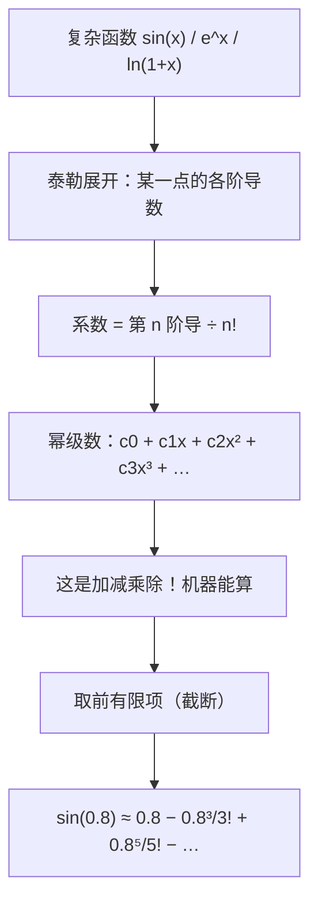

# 第 08 章 · 数列与级数·Taylor 展开——用加减乘除逼近任何函数

> 本章从哪个问题出发：上一章你在算期望时撞上一个坑——"无限多个数加起来，到底等于几"。而现实里更常见的坑是：**一个复杂的函数，比如 sin(x)、eˣ、ln(x)，我只有一台只会加减乘除的破计算器，怎么算出它的值？** 这两个问题，其实是同一个问题。
> 推导到哪个结论：把"一串数一项一项加起来"当项数变无限时，得到的叫级数——它可能收敛到一个有限的数（否则叫发散）。而幂级数把"一个多项式"无限延展成"无穷多项的多项式"。**泰勒展开（Taylor expansion）**告诉我们：任何一个"够光滑"的复杂函数，都能在某一点附近，用它的各阶导数"级联"出一个无穷多项式去逼近——而且只取前面几项，就已经准得惊人。**这就是计算机算 sin、exp、ln 的根本方法：把复杂函数，换成加减乘除。**

> 核心认知：你这一册已经会算很多了，可你有没有想过——**计算机到底是怎么算 sin(1)、算 e 的 3 次方、算 log 的？** 它内部没有一本"数学函数表"，它只有加法、减法、乘法、除法。那它是怎么算出一个你按一下就能出来的值的？答案藏在上一章末尾那个坑里：**无限多个数相加**。把"多项式"无限延展，就得到一个**幂级数**；而**泰勒展开**告诉你——任何够光滑的函数，都能在某一点附近，用"它的各阶导数"去拼出一个无穷多项式。于是 sin 不再神秘：它就是一个加减乘除的无限长公式，机器取前面有限几项就足够准。**泰勒展开是"把一个函数，变成一堆幂的叠加"——它是计算机里一切数学计算的根基，也是机器学习里无数模型的地基。**

## 引子

夜里十一点，工地值班室。灯"啪"地灭了，跳闸了。

我摸黑找到手电，一照——桌上那台老式计算器还亮着，用的是电池。可我要算的东西，它多半算不了。我举着计算器对老谟晃："我正算一座桥的受力，要算 sin(0.8) 这个值。可这破机器，按键上只有数字、加减乘除、等于，还有个百分号。它上哪给我算 sin 去？"

老谟靠在折叠椅上，手电光把他的脸照得半明半暗："你说它算不了 sin。那我问你——**这台机器，算得了 1+1 吗？算得了 2×3 吗？**"

"那当然算得了。"我随口答，"加减乘除嘛，小学生都会。"

"那它算得了 1 + 1/2 + 1/4 + 1/8 吗？"

"也算得了啊，四个数加起来，慢慢按就行。"

"那 1 + 1/2 + 1/4 + 1/8 + 1/16 + …"老谟停了停，"**一直加到无限多项呢？**"

我手里的计算器停在半空，嗓子发涩。"……无限多项？那我不是按到天亮都按不完？再说了，无限多项加起来，那不得涨到无穷大吗？"

"你怕它涨到无穷大。"老谟盯着我，"可你上一章刚算过——**期望是'把概率×结果'加起来，如果结果无限多，这串加法怎么办？** 你现在这台只会加减乘除的机器，恰好逼你面对同一个问题：**无限多个数加起来，到底等于几？** 而这个问题一旦有了答案，sin 就有救了。"

我愣了愣："……sin 和无限相加，有关系？"

"关系大了。"老谟把手电往桌上一搁，"你以为 sin 是机器里藏着的神奇魔法。可这一章结束你会发现——**sin 不是魔法，它就是一个加减乘除的无限长公式。** 你只要能算无限相加（或者说，算它的前很多项），你就能算出 sin。我们从头，把'无限多个数相加'这条规矩立起来。"

## 对话引擎

### 第 1 轮：级数——把"一串数加起来"推到无限

**老谟**："你说 1 + 1/2 + 1/4 + 1/8 + … 加到无限会涨到无穷大。那我们别空口吵。**你一步步加，看它到底往哪走。** 加第一项是 1，加 1/2 是 1.5，加 1/4 是 1.75，加 1/8 是 1.875……你算几项，看看它在逼近哪个数？"

**造物主**："……1、1.5、1.75、1.875、1.9375、1.96875……它越来越接近 2！而且每加一项，它离 2 就差一半——好像永远到不了 2，但越走越近。"

**老谟**："你发现了——**这串数加起来，不是涨到无穷大，而是'越加越接近 2'。** 那我问你，这个'2'，是怎么来的？它是你加到某一项"正好等于 2"算出来的吗？"

**造物主**："……不是。我加多少项都到不了 2，它只是'无限逼近'2。可这个'2'明明就在那儿，我算的每一项都在向它靠近……好像它就是这串无限相加'该有的值'。"

**老谟**："你把这串'一项一项加起来'的东西，叫**数列（sequence）**；把它'一直加到底'的结果，叫**级数（series）**。那我现在给你一个完全不同的——**1 + 1/2 + 1/3 + 1/4 + 1/5 + …**，你加几项看看，它逼近哪个数？"

**造物主**："……1、1.5、1.833、2.083、2.283、2.45……它好像一直在涨，越涨越慢，但始终在涨。它是不是会逼近某个数？可它涨得这么慢，我怕它涨到天荒地老。"

**老谟**："你先别怕。我问你——**这两个级数，一个'逼近 2'，一个'好像一直在涨'，它们有什么本质区别？**"

**造物主**："……第一个，每一项越来越小（1/2、1/4、1/8，缩得飞快），所以加到头是有界的；第二个，每一项虽然也变小（1/2、1/3、1/4），可缩得没那么快，加着加着就……没底了？"

**老谟**："你摸到命门了。**第一个收敛（converge）到 2，第二个发散（diverge）到无穷大。** 可你要小心——**"每一项都变小"并不保证收敛**。1/2、1/3、1/4 每一项也在变小，可它照样发散了。那你说，光看'变小'靠不靠谱？"

**造物主**："……不靠谱。我还得看它'缩得多快'。缩得够快的，收敛；缩得不够快的，照样涨到天上去。可我怎么判断'够不够快'？"

**老谟**："这个问题，数学家用了几百年才钉死。你先记住结论——**级数的核心问题只有一个：它收敛还是发散？收敛到几？** 下面这段，把'收敛'这件事给你说透，顺便告诉你一个反直觉的事实。"

---

**📐 知识锚点：数列与级数——"无限多个数相加"的规矩**

【概念深挖】**数列（sequence）** 就是一串按顺序排开的数：a₁, a₂, a₃, …。**级数（series）** 就是把这串数一项一项加起来：a₁ + a₂ + a₃ + …。

级数最核心的问题：**它收敛还是发散？**

- **收敛（converge）**：部分和（加前 n 项的结果）随着 n 增大，**无限逼近一个有限的数 S**。例：1 + 1/2 + 1/4 + … = 2。
- **发散（diverge）**：部分和要么涨到无穷大（如 1 + 1/2 + 1/3 + …），要么乱跳不逼近任何数。

**一个极其反直觉的事实（造物主差点踩进去）**：

> **调和级数 1 + 1/2 + 1/3 + 1/4 + … 发散到无穷大！** 尽管每一项都趋于 0。

这就是著名的**调和级数**。它告诉我们：**"每一项趋近 0"是收敛的必要条件，但不是充分条件**——有些级数每一项都趋近 0，却照样发散发散。造物主问的"怎么判断缩得多快才够"，正是级数理论的核心课题，数学家用**比较判别法、比值判别法、积分判别法**等一堆工具来判断收敛。

**几何级数**（每一项乘同一个比值 r）：a + ar + ar² + ar³ + …
- 当 |r| < 1 时**收敛**：a + ar + ar² + … = **a / (1 − r)**。（如 1 + 1/2 + 1/4 + … = 1/(1−1/2) = 2）
- 当 |r| ≥ 1 时**发散**。

**为什么级数重要**：因为"无限相加"能装下"连续"——上一章你学积分是把"无限个无限小"拼起来，级数是把"无限个数"加起来，两者是近亲。**而级数最重要的应用，就是这一章的主角：用多项式去逼近复杂函数。**

【历史溯源】"无限多个数相加"看似简单，却困扰了人类两千多年。**古希腊的芝诺（Zeno）**用"阿基里斯追不上乌龟"的悖论暗示了无限分割的难题；**阿基米德（公元前 3 世纪）**用"穷竭法"求抛物线面积时，其实已经在悄悄用级数——他把面积拆成无穷多个越来越小的三角形，加起来。但**真正把级数的"收敛/发散"分清楚，是 19 世纪的事**：**柯西（Cauchy）**在 1821 年前后给出了"收敛"的严格定义（呼应第6章他给极限下定义），**阿贝尔（Abel）**等继续完善。而**调和级数发散发散**这个反直觉事实，最早由**法国数学家尼古拉·奥雷姆（Oresme，14 世纪）**发现，比柯西早了五百年——他用分组法证明它涨到无穷大。**"无限相加到底等于几"这个问题，让人类在'无限'面前谦卑了两千年，最后才用'极限'两个字钉死。**

【工程实践】工程里几乎不真的"加到无限项"，而是**加到一个"够用"的项数就停**。所以工程上真正关心的不是"级数收敛吗"，而是**"加多少项，误差小到我接受"**。这就是**数值近似**：用有限项的"截断"去代替无限项的"真值"。你会看到，这一章的泰勒展开，靠的全是这套"加到够用就停"的思路。

---

### 第 2 轮：幂级数——把"多项式"无限延展

**老谟**："你现在知道级数能收敛了。可我们说好要算 sin。**sin 不是一个'数'，它是个函数——输入一个 x，输出一个值。** 那问题来了：一台只会加减乘除的机器，怎么算 sin(x)？我提示你——**你觉得，机器会不会是'用一堆 x 的幂加起来'去逼近 sin 的？**"

**造物主**："……用 x 的幂？你是说，像 x⁰、x¹、x²、x³ 这种，乘上一些系数，再加起来？可 sin(x) 是那个波浪形的曲线，一堆 x 的幂加出来的，怎么会是波浪形？"

**老谟**："你别先入为主。你想想——**x⁰=1，是条平线；x¹=x，是条斜线；x² 是条弯的抛物线；x³ 更弯。** 你把一条平线、一条斜线、一条抛物线、一条更弯的曲线……**一层一层叠上去，能不能叠出一条波浪形？**"

**造物主**："……一层一层叠？平线加斜线，是一条斜的直线；再叠抛物线，就弯起来了；再多叠几条更弯的……好像确实能叠出越来越复杂的形状？可要叠出 sin 那种波浪，那不得叠无穷多条？"

**老谟**："你抓到关键了——**要叠出 sin 这种函数，可能需要'无穷多项的幂'。** 这种"把 x 的各次幂按系数加起来、一直加到无限项"的东西，叫**幂级数（power series）**。它长这样：

```
c₀ + c₁x + c₂x² + c₃x³ + …  （一直加下去）
```

现在问题只剩一个——**这一堆系数 c₀、c₁、c₂…… 到底怎么定？** 你给我讲讲，你想怎么找出这些系数，让这个幂级数正好等于 sin(x)？"

**造物主**："……怎么定系数？我完全没头绪。我只知道它该'逼近 sin'，可'逼近'这两个字，到底要怎么变成'系数是多少'，我想不出。"

**老谟**："你卡住很正常——**"逼近"要变成一个"算得出系数的公式"，正是下一轮要解决的事。** 而那个答案，藏在你这一册很早以前学过的一件家伙里。你先想想——**要描述一个函数在某一点的'样子'，除了它本身的值，还有什么？**"

**造物主**："……除了本身的值？那我第一反应是它在那个点的'陡不陡'——就是**导数**，我在第6章学的！导数告诉我它在那点"变得有多快"。可光一个导数，能定无穷多个系数吗？"

**老谟**："你只想到第一阶导数。**你想想，导数还能再求导吗？**"

**造物主**："……能！导数的导数，就是二阶导，告诉我'陡峭程度变化得多快'；三阶导，四阶导……**我可以用'在某个点的一阶导、二阶导、三阶导……'来层层描述这个函数在那附近的样子！** 每一阶导数，就像给它'套娃'——一层比一层更精细地描述它。"

**老谟**："你这条路找对了——**函数在某一点附近的全部信息，其实就藏在它的各阶导数里。** 那我们要做的，就是想办法让这无穷多个系数 c₀、c₁、c₂…… **正好对应上这些导数**。这个"对应"，我们下一轮亲手把它造出来。"

---

**📐 知识锚点：幂级数——多项式无限延展**

【概念深挖】**幂级数（power series）**，就是"把多项式无限延展"：

```
f(x) ≈ c₀ + c₁x + c₂x² + c₃x³ + …  （c 是常数系数，x 是变量）
```

它的直觉是：**一条平线 + 一条斜线 + 一条抛物线 + 一条更弯的曲线…… 一层层叠起来，能叠出任何复杂的形状。** 加的项越多，叠出的曲线越精细。

- **每一项 xⁿ 是一个"零件"**，系数 cₙ 决定这个零件"用多大力"。
- **用越多项，逼近越精细**——有限项是"近似"，无限项（如果收敛）就"等于"原函数。

**为什么幂级数这么有用**：因为它是**加减乘除**！你只要会算 x 的幂、会乘系数、会相加，你就能算这个级数——这正是"只会加减乘除的机器"能算一切的基础。**复杂函数 sin、eˣ、ln，都可能写成幂级数，于是机器就能算它们了。**

**每个函数都能这么展开吗？** 不。要能展开成幂级数（且收敛），这个函数得"够光滑"——在展开点附近无限可导，而且各阶导数不能太疯。**我们关心的 sin、eˣ、cos、ln(1+x) 这些"好函数"，都满足条件。** 而那些"不够好"的函数（比如有尖角的、断裂的），就没法用幂级数光滑地逼近——这也是为什么数学里要区分"光滑函数"和"病态函数"。

用一张图，把"复杂函数怎么变成加减乘除"这条主线画清楚：


读图说明：最上面是复杂函数，先用泰勒展开取出它在某一点的各阶导数，每阶导数除以阶乘变成系数，就拼成一个幂级数。这个幂级数只是加减乘除，机器算得了；再取前有限项截断，就得到足够准的近似值。**"复杂函数 → 各阶导数 → 系数 → 幂级数 → 加减乘除 → 有限项近似"，这就是计算机算一切数学函数的真面目。**

【历史溯源】幂级数的思想，萌芽于**17 世纪末的牛顿和格雷戈里**——牛顿在研究二项式时，发现 (1+x)^n 可以展开成无限多项的幂。但真正把"幂级数"系统化、并揭示它能逼近任意"好函数"的，是**18 世纪的数学家们**：**泰勒（Brook Taylor）**在 1715 年给出了"用导数构造幂级数"的公式（这就是泰勒展开），**麦克劳林（Maclaurin）**把展开点取在 0 处，得到"麦克劳林级数"。而**这个幂级数什么时候收敛、收敛到哪**，则是**柯西、阿贝尔在 19 世纪**严格解决的。**"函数能写成幂级数"这件事，是 18-19 世纪数学最伟大的成就之一——它把"函数"这个抽象的东西，变成了"一串加减乘除"，让机器（和人）都能计算。**

【工程实践】幂级数就是"数学函数表的自动化"：**在计算机出现之前，工程师用幂级数手工查表算 sin、算对数；计算机出现之后，内置的数学库（如 `math.sin`）内部也是用近似幂级数（或等价的查找+插值）来实现的。** 你现在按一下 `sin(0.8)`，计算机其实是在算"某个幂级数的前很多项"。**"函数值不是魔法，是幂级数算出来的"** ——这一句话，就是整章工程价值的缩影。

---

### 第 3 轮：泰勒展开——用"各阶导数"拼出一个多项式

**老谟**："你说要用各阶导数去定系数。那咱们就真造。**我要在 x = 0 这个点附近，造一个幂级数来逼近 f(x)。** 级数是 c₀ + c₁x + c₂x² + c₃x³ + …，我要你定出 c₀、c₁、c₂…… 要求是：**这个幂级数在 x=0 处的值、一阶导、二阶导…… 都要和 f(x) 在 x=0 处的一样。** 先定 c₀——你想怎么定？"

**造物主**："……要让级数在 x=0 的值等于 f(0)。级数在 x=0 的时候，除了 c₀，其它项 c₁x、c₂x² 全变成 0 了。所以**c₀ 就得等于 f(0)**。这个简单。"

**老谟**："c₀ = f(0)，对。那 c₁ 呢？**我要这个级数的一阶导在 x=0 等于 f 的一阶导。你先说，这个级数求个导，会变成什么？**"

**造物主**："……对 x 求导：c₀ 是常数，导成 0；c₁x 导成 c₁；c₂x² 导成 2c₂x；c₃x³ 导成 3c₃x²。所以**级数的导数 = c₁ + 2c₂x + 3c₃x² + …**。它在 x=0 的时候，除了 c₁，其它项 2c₂x、3c₃x² 也全变 0。所以**c₁ 等于 f'(0)**（f 的一阶导在 0 处的值）。"

**老谟**："漂亮。那 c₂ 呢？**我要是再对级数求一次导（二阶导），在 x=0 处会留下什么？**"

**造物主**："……再求一次导：c₁ 导成 0；2c₂x 导成 2c₂；3c₃x² 导成 6c₃x；… 所以**二阶导 = 2c₂ + 6c₃x + …**。在 x=0，只有 2c₂ 留下。要让这等于 f''(0)，那**2c₂ = f''(0)，所以 c₂ = f''(0)/2！** 咦，这里出来了个 '2'……为什么是除 2？"

**老谟**："你发现了一个规律——**x² 求两次导，会掉出个 2！** 那你猜 c₃ 会是什么？"

**造物主**："……x³ 求三次导，3×2×1=6，所以 c₃ = f'''(0)/6？那 xⁿ 求 n 次导，会掉出 n×(n−1)×…×1，就是**阶乘 n!**！所以 **cₙ = f 的 n 阶导在 0 处 ÷ n!**！我摸出来了！"

**老谟**："你亲手把泰勒展开的公式推出来了！**一个函数在 x=0 附近，可以展开成：**

```
f(x) = f(0) + f'(0)·x + f''(0)/2! ·x² + f'''(0)/3! ·x³ + …
```

**每一项的系数，就是它那一阶导数在 0 处的值，除以阶乘。** 这个公式，叫**泰勒展开**（在 0 处展开也叫**麦克劳林级数**）。你先别急着欢呼——**你想想，为什么系数里会蹦出阶乘来？这不是巧合吧？**

**造物主**："……不是巧合！因为 xⁿ 求 n 次导正好掉出 n!，我为了让级数的第 n 阶导刚好等于 f 的第 n 阶导，就得把系数除以 n! 去抵消它。**阶乘不是凭空冒出来的，是我'求导求出来的'。** 原来泰勒展开不是背公式，是"让每一阶导数都对上号"的必然结果。"

**老谟**："你这句话，就是本章的魂——**泰勒展开不是魔法，是'让各阶导数逐一对上号'的记账。** 下一轮，我们用这个公式，真的把 sin 展开出来，看看它怎么落到那台破计算器上。"

---

**📐 知识锚点：泰勒展开——用导数"级联"出一个多项式**

【概念深挖】**泰勒展开（Taylor expansion）**：把一个函数在某一点 x₀ 附近，用它的各阶导数拼成一个幂级数。在 x₀=0 处展开（最常用），叫**麦克劳林级数（Maclaurin series）**：

```
f(x) = f(0) + f'(0)·x + f''(0)/2! ·x² + f'''(0)/3! ·x³ + …
```

**这条公式不是背的，是"让每一阶导数对号入座"推出来的**：

- **c₀ = f(0)**：级数在 0 处的值要等于 f(0)。
- **c₁ = f'(0)**：级数一阶导在 0 处要等于 f'(0)。
- **c₂ = f''(0)/2!**：因为 x² 求两次导掉出 2，所以要除 2! 抵消。
- **cₙ = f⁽ⁿ⁾(0)/n!**：因为 xⁿ 求 n 次导掉出 n!，所以要除 n! 抵消。

**核心洞察**：
1. **阶乘的出现是"求导"的必然结果**，不是凑出来的——每求一次导，xⁿ 的指数就降 1、前面多乘一个数，降 n 次正好得到 n!。
2. **各阶导数，就是函数在该点"一层套一层"的信息**：一阶导说"多陡"，二阶导说"弯的方向和程度"，三阶导说"弯曲的变化"……每多取一阶，逼近就精细一层。
3. **在展开点 x₀ 附近**，这个级数（如果收敛）就越接近原函数。**离展开点越远，需要取的项越多**——但这里有个大前提（下一轮会讲）：**幂级数只在展开点周围某个范围内收敛**，离得远了可能根本不收敛。

**"级联"这个词**，说的是泰勒的构造方式：**一阶导拼出线性部分，二阶导拼出二次部分，三阶导拼出三次部分…… 像搭积木一样，一层一层"级联"上去**，每层补上一种更精细的形状。

【历史溯源】**泰勒（Brook Taylor）**在 1715 年发表《增量方法》，给出了这个"用导数展开函数"的公式。有趣的是，**泰勒本人当时并没有完全意识到这个公式的威力**，是后来的**欧拉（Euler）**把泰勒级数发扬光大——欧拉用泰勒展开证明了著名的**欧拉公式 e^{ix} = cos x + i·sin x**，还用它算出 sin、eˣ 的值。**麦克劳林（Maclaurin）**则专门研究在 0 点展开的情形。而"泰勒展开是否收敛、收敛到哪"，到 19 世纪才由**柯西**严格化。**"把函数展开成幂级数"这个念头，从牛顿到泰勒、再到欧拉，撑起了整个 18 世纪分析数学的半边天。**

【工程实践】泰勒展开的工程价值无与伦比：
- **计算函数值**：`math.sin`、`math.exp`、`math.log` 内部，全是用泰勒（或等价的多项式）近似实现的——**函数值不是查表，是算多项式**。
- **数值求导/积分**：用泰勒展开可以推导出更精确的差分公式（呼应第6章的数值微分）。
- **机器学习**：**反向传播**里的求导、**牛顿法**求极值、**模型的可解释近似**，全都建立在"用多项式局部逼近函数"的泰勒思想上。
- **物理**：**简谐近似**（把势能展开到二次项）让无数非线性问题变成可解的线性问题。
**"任何够光滑的函数，在局部都能用一个多项式代替"** ——这一句，是科学计算和机器学习的共同地基。

---

### 第 4 轮：亲手把 sin 展开——机器怎么算 sin

**老谟**："公式你推出来了。现在咱们真刀真枪，把 sin(x) 在 0 处展开。**sin 的各阶导数，你还记得第6章的结论吗？sin 的导数是 cos，cos 的导数是 -sin……** 你先把 sin 在 0 处的各阶导数列出来。"

**造物主**："……sin(0)=0。sin 的导数是 cos，cos(0)=1，所以 f'(0)=1。再求导：cos 的导数是 -sin，-sin(0)=0，所以 f''(0)=0。再求导：-sin 的导数是 -cos，-cos(0)=-1，所以 f'''(0)=-1。再来：-cos 的导数是 sin，sin(0)=0，所以 f⁗(0)=0……"

**老谟**："你发现没有——**sin 的各阶导数在 0 处，是 0、1、0、-1、0、1、0、-1…… 这样循环的。** 那把它代进泰勒公式，会得到什么？"

**造物主**："……奇数阶（1、3、5）是 ±1，偶数阶全是 0。所以只有 x¹、x³、x⁵ 这些奇数次项留下来：**sin(x) = x − x³/3! + x⁵/5! − x⁷/7! + …**！那些 x²、x⁴ 的项全因为系数是 0 消失了！"

**老谟**："就这么几个符号，把 sin 的底裤扒了个干净——**sin(x) = x − x³/3! + x⁵/5! − x⁷/7! + …**。现在我问你——**这台只会加减乘除的破计算器，能算这个式子吗？**"

**造物主**："……能！x 是 0.8，那我算 0.8 − 0.8³/6 + 0.8⁵/120 − 0.8⁷/5040 + …，全是用加减乘除！**它真的能算 sin 了！** 可我只算了前几项，够准吗？"

**老谟**："这正是关键。**你只取前几项，得到的是近似；项数越多越准。** 那你说，我要算 sin(0.8)，取前几项、误差能小到哪？你先自己估估——**0.8⁷ 这个数，是不是已经小得可怜了？**"

**造物主**："……0.8⁷ = 0.8×0.8×… 大概 0.21？再除以 5040，那才 0.00004！**才取到第七项，误差已经小到小数点后四位了！** 难怪机器只要取前面几项就够准——因为后面的项小到根本不用管。"

**老谟**："你把这个'取前面几项就够准'的现象看穿了。**x 越小（或者离展开点越近），收敛越快，要的项越少。** 下一轮，我们把这个'取多少项、误差多大'，用机器验证一下，顺便把 eˣ、ln 也展开给你看。"

---

**📐 知识锚点：sin 的泰勒展开——机器算 sin 的真面目**

【概念深挖】造物主亲手推出了** sin 的麦克劳林级数**：

```
sin(x) = x − x³/3! + x⁵/5! − x⁷/7! + x⁹/9! − …（只有奇数次项，正负交替）
```

**为什么只有奇数次项**：因为 sin 是奇函数（sin(−x)=−sin(x)），而奇函数展开里不可能出现偶数次幂；更直接地，sin 的各阶导数在 0 处的值，奇数阶是 ±1、偶数阶是 0，所以偶数次项系数全为 0。

**精度规律（工程关键）**：
- 第 n 项大约含有 xⁿ，当 |x|<1 时，xⁿ 随 n 增大飞快变小——**所以项数越多越准，且 x 越小收敛越快**。
- 取前几项：sin(0.8) ≈ 0.8 − 0.8³/6 + 0.8⁵/120 ≈ 0.717…，和真值（约 0.7174）已经差在第四位小数。

同理可得其他常用函数的泰勒展开（都在 0 处）：

```
eˣ = 1 + x + x²/2! + x³/3! + x⁴/4! + …   （所有阶导数都是 eˣ，e⁰=1）
cos(x) = 1 − x²/2! + x⁴/4! − x⁶/6! + …
ln(1+x) = x − x²/2 + x³/3 − x⁴/4 + …
```

**eˣ 的展开尤其漂亮**：因为 eˣ 求多少阶导都是 eˣ，在 0 处全是 1，所以每一项系数都是 1/n!。**你能用这个式子，仅靠加减乘除，把 e 的任意次幂算出来。**

**⚠️ 一个必须点破的陷阱：收敛半径（radius of convergence）**

上面造物主那句"离展开点越远，取越多项就行"只对了一半——**幂级数并不是在整个数轴上都能用，它只在"展开点周围某个范围内"才收敛**。这个范围有多大，就是**收敛半径**：

- **sin、eˣ、cos 是"好函数"里的特例**：它们的收敛半径是**无穷大**——在整个数轴上都能收敛，随便你怎么取项都行。所以"离多远都只要取够多项"对它们成立。
- **但 ln(1+x) 不是**：它的展开 **ln(1+x) = x − x²/2 + x³/3 − x⁴/4 + … 只在 |x| < 1 附近可信**（收敛半径 = 1）。你拿 x=0.5 去算没问题，可你要拿 x=−1 去代——`ln(0)` 根本无意义，级数在 x=−1 处直接发散。**同理，哪怕在收敛半径内，越靠近边界也越慢；出了边界，加再多项也是错的。**

**一句话记住**：**幂级数 = 局部有效。sin、eˣ 恰好"全程有效"是特例，不是常态。** 工程里要算 ln 或别的函数，绝不会硬套一个固定展开点，而是会**换展开点 / 分段 / 换元**，把要算的 x 归化到收敛半径之内——这正是第 5 轮"换元分段"那条工程经验的由来。

【历史溯源】**收敛半径**这个概念，是 19 世纪分析学严格化时的产物。**柯西（Cauchy）**最早在 1821 年前后给出了"幂级数何时收敛"的清晰判定（**柯西-阿达玛公式**，后由法国数学家**阿达玛（Hadamard，1892）**给出最一般形式），算出了收敛半径。**阿贝尔（Abel）**进一步研究了幂级数在收敛半径边界上的行为。**"幂级数只在半径内收敛"**这个事实，让 19 世纪的数学家意识到：**展开成级数不是"把函数重写一遍"那么简单，它自带一个"有效范围"**——这为后来"解析函数""复分析"的诞生埋下了伏笔。

【历史溯源】**sin、cos、eˣ、ln 的幂级数展开**，是 **17-18 世纪数学家**（牛顿、格雷戈里、欧拉等）陆续得到的。其中**欧拉**是集大成者——他不仅用泰勒级数算出大量函数值，还发现了那个"最美公式" e^{iπ}+1=0（由欧拉公式而来），其证明正依赖泰勒展开。**"把 sin 写成 x − x³/3! + …"这件事，让'三角函数'从'几何量角'变成了'纯代数计算'——这是数学从几何走向代数分析的一座里程碑。**

【工程实践】这就是计算机算数学的**真面目**：
- **`math.sin(x)`、`math.exp(x)`、`math.log(x)`** 内部，几乎都是"某个多项式（幂级数的前若干项）+ 一些技巧"。你按一下，它算的是多项式，不是魔法。
- **为什么不用真值**：因为计算机只有加减乘除和有限的浮点精度，它没法"定义"一个连续函数，它只能"算多项式"。
- **硬件层面**：很多 CPU 有**查表+插值**的硬件指令（用泰勒/多项式插值），本质上还是"多项式近似"。
**"复杂函数 = 多项式近似"** 是计算数学的根基，也是你理解"机器到底在算什么"的关键。

---

### 第 5 轮：亲手造——用 Python 数值验证泰勒逼近

**老谟**："你说泰勒能逼近 sin，那你别光说。**写段代码，用泰勒展开的前几项去算 sin(0.8)，和 Python 内置的 math.sin 比一比，看到底差多少。** 顺便把 eˣ 也展开几项，算算 e 的 1 次方。你打算怎么写？"

**造物主**："……那我先写个循环，把 sin(0.8) 的泰勒展开，一项一项加，加到第 n 项，看看逼近 0.7174 没有。然后 eˣ 的展开，每一项是 xᵏ/k!，我也循环加起来。最后跟 math.sin、math.exp 比误差。"

**老谟**："思路对。动手吧——用代码让泰勒的'前几项'和'真值'贴在一起，亲眼看看'取多少项够用'。"

---

**📐 知识锚点：【实现思考】用 Python 数值验证泰勒逼近**

【实现思考】"看懂泰勒"到"验证泰勒"，就差几行代码。我们亲手算泰勒展开的前几项，和内置函数对比，亲眼看见"取有限项就够准"：

```python
import math

def taylor_sin(x, terms):
    """用 sin 的麦克劳林级数前 terms 项逼近 sin(x)"""
    s = 0.0
    for k in range(terms):
        n = 2 * k + 1          # 奇数次项：1, 3, 5, ...
        coef = 1 if k % 2 == 0 else -1   # 正负交替
        term = coef * (x ** n) / math.factorial(n)
        s += term
    return s

def taylor_exp(x, terms):
    """用 e^x 的级数前 terms 项逼近 e^x"""
    s = 0.0
    for k in range(terms):
        s += (x ** k) / math.factorial(k)
    return s

x = 0.8
for terms in [1, 2, 3, 4, 6]:
    approx = taylor_sin(x, terms)
    print(f"sin(0.8) 取前{terms}项 = {approx:.8f}  真值={math.sin(x):.8f}  误差={abs(approx-math.sin(x)):.2e}")

print()
for terms in [2, 3, 5, 8, 10]:
    approx = taylor_exp(1.0, terms)
    print(f"e^1 取前{terms}项 = {approx:.8f}  真值={math.exp(1):.8f}  误差={abs(approx-math.exp(1)):.2e}")
```

**为什么这么造**：我们完全没调 `math.sin`，只是老老实实把"x − x³/3! + x⁵/5! − …"用循环加起来。你会发现：
- sin(0.8) 取前 3 项误差已经 ~1e-4，取前 6 项误差 ~1e-9——**机器只要取前面几项就足够准**。
- e^1 取前 8 项误差约 ~3e-5，取到前 10 项才 ~1e-6——因为 eˣ 的项 1/k! 虽然缩得快，但要到 10! 附近才小到 1e-6 量级。

**代价与清醒**：这是"有限项截断"，永远带误差；**x 越大（离展开点 0 越远），收敛越慢，需要越多项**——所以真实库里不是死磕一个展开点，而是会做**换元/分段**（把任意 x 归化到收敛快的区间），这是工程师的优化。**换条路会怎样**：若用阶乘计算遇到浮点溢出，可以迭代地更新项（每项由前一项乘个系数得到，呼应第7章"循环逼近"），更快更稳。**"取多少项"本身是个精度与速度的权衡**，这就是数值方法的本质。

【工程实践】这段代码就是**所有数学库的原型**。真实 `math` 库会在泰勒基础上加**Remez 算法、切比雪夫多项式、查表+插值**等更高级的手段，把精度和速度做到极致，但核心思想不变：**用多项式近似函数。** 这也是**机器学习**的根基——**神经网络的"万能逼近定理"**（一个足够宽的网络可以逼近任何连续函数）和泰勒"用多项式逼近任何好函数"是同一血脉。**"函数 = 可计算的多项式近似"，让一切复杂的数学，都能在有限内存、有限时间里算出来。**

---

### 第 6 轮：落点——用加减乘除逼近任何函数

**老谟**："把值班室那台计算器再掏出来。它按键上只有加减乘除，现在你告诉我——**它到底是怎么算出 sin(0.8) 的？**"

**造物主**："……它不用查表，也不用魔法。它用**泰勒展开**：把 sin(x) 展开成 x − x³/3! + x⁵/5! − …，然后把 x=0.8 代进去，用加减乘除算前面几项——因为后面的项小到可以忽略，所以取前几项就够准了。**sin 不是魔法，是一个加减乘除的无限长公式，机器取前面有限项就算出来了。**"

**老谟**："那你把这一整条路，从头说一遍——从'无限相加'到'sin'，我们造了什么？"

**造物主**："我们先是给'无限多个数相加'立了规矩——**级数**：它可能收敛到一个有限数，也可能发散。然后发现**幂级数**能把一个多项式无限延展，用平线、斜线、抛物线一层层叠出复杂形状。最后，**泰勒展开**告诉我们怎么定那些系数——**用函数在某一点的各阶导数，除以阶乘**，就能拼出一个多项式去逼近它。而 sin、eˣ、ln 这些"够光滑"的函数，都逃不出这招——**只是得记着幂级数有收敛半径，sin、eˣ 全程好使，ln 得在半径里用。** 复杂函数，变成了加减乘除。"

**老谟**："你把这一章的地基说全了。那我想问你一个'反着走'的问题——**你这一章一直在'逼近'：用多项式逼近函数。可你有没有想过，如果你手里只有一堆离散的数据点，而不是一个'公式'，你想知道中间的值，该怎么办？** 那也是一种'逼近'。"

**造物主**："……只有离散的数据点，没有公式？那我想算中间没测到的值，就只能……在已知的点之间'猜'？可那靠什么猜？"

**老谟**："猜，也是逼近。而且这一章的思想——**"局部用简单的东西去代替复杂的东西"**——会一路陪你走到机器学习。你想想，一个模型面对一堆数据，想'逼近'背后那个看不见的函数，靠的不正是这个思路吗？那件事，后世管它叫'拟合'。你今天握住的泰勒，就是它的第一颗种子。"

**造物主**："……从'用多项式逼近函数'，到'用模型逼近数据'？这跨度是不是有点大……可好像内核又很像——都是'用一个简单的、可算的东西，去代替一个复杂的、看不见的东西'。"

**老谟**："你把这条线摸到了。这一册，从数、集合、函数，到导数、积分，到矩阵，到概率统计，到这一章的级数和泰勒——你一路在学'怎么用可算的，去逼近不可算的、去描述不确定的'。**而这一切，正是机器学习的地基。** 你先把'泰勒=用加减乘除逼近函数'收好——它不会白学的。"

---

### 📐 知识锚点·计算速查：级数求和与泰勒展开怎么算

【适用场景】要算 sin/eˣ/ln 的函数值，或判断一个级数收敛不收敛。

【常用函数的泰勒展开速查表】（都在 x=0 处展开，即麦克劳林级数）：

| 函数 | 展开 | 收敛半径 |
|------|------|----------|
| sin(x) | x − x³/3! + x⁵/5! − x⁷/7! + … | ∞（全程收敛） |
| cos(x) | 1 − x²/2! + x⁴/4! − x⁶/6! + … | ∞ |
| eˣ | 1 + x + x²/2! + x³/3! + … | ∞ |
| ln(1+x) | x − x²/2 + x³/3 − x⁴/4 + … | 1（只在 |x|<1 可信） |

【几何级数求和公式】（每一项乘同一个公比 r）：**a + ar + ar² + … = a/(1−r)**，当且仅当 |r|<1。这是最常用的"求和→一个数"公式。

【泰勒展开计算步骤】（手算某函数在某点附近的值）：
1. 写出该函数的麦克劳林展开（用上表或自己求各阶导数）。
2. 把 x 代进去，用加减乘除逐项求和。
3. 取前几项截断：**x 越小、取项越多，越接近真值**。

【收敛半径判据——比值判据（ratio test）】想判断一个幂级数 ∑cₙxⁿ 在多大范围内收敛，看相邻两项系数的比：
- 算 **R = lim |cₙ/cₙ₊₁|**（或看 |aₙ₊₁/aₙ| 是否 <1）。
- |x|<R 内收敛、|x|>R 发散、|x|=R 边界要另行判断。
- 例：ln(1+x) 的系数 cₙ=1/n，R = lim |(1/n)/(1/(n+1))| = lim (n+1)/n = **1**，所以收敛半径是 1——这正是"ln 只在 |x|<1 可信"的由来。
- 记忆口诀：**相邻系数比一比，取倒数就是半径。**

### 🔧 工程实践·计算案例：用 numpy 验证泰勒逼近 + 收敛半径

机器内部算函数值就是"算多项式"——我们用 numpy 亲手把泰勒展开"算多项式"这件事做出来，并验证 sin 全程收敛、ln(1+x) 只在半径内收敛：

```python
import numpy as np
import math

def taylor_sin(x, terms):
    """sin 的麦克劳林展开前 terms 项：x - x³/3! + x⁵/5! - ..."""
    s = 0.0
    for k in range(terms):
        n = 2*k + 1                     # 只取奇数次项: 1,3,5,...
        coef = 1.0 if k % 2 == 0 else -1.0
        s += coef * x**n / math.factorial(n)
    return s

# 1) 验证 sin(0.8) 取前几项就逼近真值
x = 0.8
for terms in [2, 3, 4, 6]:
    approx = taylor_sin(x, terms)
    print(f"sin(0.8) 前{terms}项={approx:.8f}  真值={np.sin(x):.8f}  误差={abs(approx-np.sin(x)):.2e}")

# 2) 验证收敛半径: ln(1+x) 在 x=0.5(半径内)可信, 在 x=2(半径外)发飘
def taylor_ln(x, terms):
    s = 0.0
    for k in range(1, terms+1):
        s += (-1)**(k+1) * x**k / k    # x - x²/2 + x³/3 - ...
    return s

print("\nln(1+0.5)=?", np.log(1.5), "泰勒前20项=", round(taylor_ln(0.5, 20), 6))  # 都≈0.405465
print("ln(1+2)=?", np.log(3), "泰勒前20项=", round(taylor_ln(2.0, 20), 6))        # 真值≈1.0986, 但级数发散→差得远
```

期望输出（要点）：
- sin(0.8) 取前 4 项误差已 ~1e-4、取前 6 项误差 ~1e-9——**机器只要取前面几项就够准**。
- `ln(1+0.5)`：真值 `np.log(1.5)` ≈ 0.405465，泰勒前 20 项也 ≈ 0.405465，对得上（在收敛半径内）。
- `ln(1+2)`：真值 `np.log(3)` ≈ 1.0986，可泰勒前 20 项却远远对不上（因为 x=2 在收敛半径 1 之外，级数发散）——**亲眼看见"越出半径就全错"**。

**为什么这么造**：我们没调 `np.log`，只是老老实实把级数项加起来，然后跟真值对账。**sin 那一组证明"取有限项就够准"；ln 那一组证明"级数有收敛半径，出界就崩"。** 这正是真实数学库的取舍：在收敛半径内用多项式，出了半径就换展开点或分段，把 x 归化进安全区。**代价**：截断永远带误差、x 越大要项越多；数值库用更高级的切比雪夫/Remez 逼近优化，但"多项式近似 + 半径内用"的骨架不变。

### 💡 造物主手记·计算踩坑：把 x=−1 代进 ln(1+x)，直接"炸"了

我算级数算上瘾，想偷懒用 `ln(1+x) = x − x²/2 + x³/3 − …` 算 `ln(0)`，直接把 x=−1 代进去。结果每一项都在涨（−1 + 1/2 − 1/3 + 1/4 − … 乱跳），根本不给个数——我一度以为是自己算错了。老谟一句话点醒我："**收敛半径 1 忘了？x=−1 正好压在边界上，这个级数在那根本不收敛，还指望它给 ln(0)？**" 我这才想起 ln(0) 本来就没定义，而展开式只在半径内有效。**这个坑让我彻底记住：泰勒/幂级数是'局部有效'的，代值前先看 x 在不在收敛半径里**——sin、eˣ 全程好使是特例，不能想当然照搬。

### 📝 自测题·计算类

1. **场景**：造物主想用级数算 `sin(0.5)`，写出 sin 的麦克劳林展开前三项，并估计误差趋势。
   *简答要点*：sin(x) ≈ x − x³/3! + x⁵/5!；代入 x=0.5：0.5 − 0.125/6 + 0.03125/120 ≈ 0.4794，逼近真值 sin(0.5)≈0.47943。x 越小、项越多越准。

2. **场景**：级数 `1 + 0.3 + 0.09 + 0.027 + …`（公比 r=0.3）收敛到几？
   *简答要点*：几何级数，|r|=0.3<1，收敛到 a/(1−r) = 1/(1−0.3) = 1/0.7 ≈ 1.4286。

3. **场景**：用比值判据算 `ln(1+x)` 的收敛半径，并说明为什么不能用它算 `ln(3)`。
   *简答要点*：系数 cₙ=1/n，R=lim|cₙ/cₙ₊₁|=lim(n+1)/n=1，收敛半径=1。ln(3)=ln(1+2) 需 x=2，超出半径，级数发散，不能用这个展开算。

---

## 知识点总结

### 知识点（本章推出的核心概念）

- **数列（sequence）与级数（series）**：数列是一串按顺序排开的数；级数是把数列一项一项加起来。**级数的核心问题是"收敛还是发散"。**
- **收敛 vs 发散**：收敛（如 1+1/2+1/4+…=2）逼近一个有限数；发散（如调和级数 1+1/2+1/3+…）涨到无穷大。**反直觉事实：每一项都趋近 0 不等于收敛**（调和级数每一项趋近 0 却发散）。
- **幂级数（power series）**：把多项式无限延展——c₀ + c₁x + c₂x² + c₃x³ + …，用平线、斜线、抛物线一层层叠出复杂形状。**它是加减乘除，所以机器能算。**
- **泰勒展开（Taylor expansion）**：**f(x) = f(0) + f'(0)·x + f''(0)/2!·x² + f'''(0)/3!·x³ + …**。每一项系数 = 那一阶导数在展开点的值 ÷ 阶乘。**阶乘的出现是"求导"的必然结果**（xⁿ 求 n 次导掉出 n!）。
- **sin 的泰勒展开**：sin(x) = x − x³/3! + x⁵/5! − x⁷/7! + …（只有奇数次项）。**取前面几项就够准（x 越小收敛越快）**——这就是机器算 sin 的真面目。
- **收敛半径（radius of convergence）**：幂级数**只在展开点周围某个范围内收敛**。sin、eˣ、cos 收敛半径是无穷大（全程有效，是特例）；**ln(1+x) 只在 |x|<1 附近可信**，越界加再多项也是错。工程上要"换展开点/分段/换元"把 x 归化进半径内。
- **用加减乘除逼近任何"够光滑"的函数**：sin、cos、eˣ、ln(1+x) 都能泰勒展开，机器用有限项截断近似。

### 历史结论（本章涉及的史料）

- **芝诺（古希腊）**用"追不上乌龟"悖论触及无限分割；**阿基米德（公元前 3 世纪）**用穷竭法求面积，暗含级数思想。
- **奥雷姆（14 世纪）**最早证明调和级数发散（比柯西早约五百年）。
- **牛顿、格雷戈里（17 世纪末）**研究二项式，得到幂级数雏形。
- **泰勒（1715）**《增量方法》给出用导数展开函数的公式；**麦克劳林**研究在 0 点展开（麦克劳林级数）。
- **欧拉（18 世纪）**把泰勒级数发扬光大，证明欧拉公式 e^{ix}=cos x+i·sin x，算出大量函数值。
- **柯西、阿贝尔（19 世纪）**严格化"收敛"的定义，厘清级数何时收敛。
- **柯西、阿达玛（19-20 世纪）**给出收敛半径（柯西-阿达玛公式），阐明幂级数只在半径内收敛——为复分析埋下伏笔。

### 工程实践结论（本章知识在真实工程里怎么用）

- **数学库 = 多项式近似**：`math.sin`、`math.exp`、`math.log` 内部都是泰勒（或等价多项式/查表+插值）实现的，**函数值不是魔法，是算多项式**。
- **数值求导/积分**：泰勒展开用于推导更精确的差分公式（呼应第6章数值微分）。
- **机器学习**：万能逼近定理、反向传播的求导、牛顿法求极值，都建立在"用简单可算的东西逼近复杂函数"的泰勒思想上。
- **物理简谐近似**：把势能泰勒展开到二次项，让非线性问题可解。
- **"取多少项"是精度与速度的权衡**：x 越大收敛越慢，且幂级数有**收敛半径**（sin、eˣ 全程收敛是特例；ln(1+x) 只在 |x|<1 内可信）。真实库会换元/分段把 x 归化到收敛快、且在半径内的区间。

## 向导便签

> 这一章咱们干了什么：从停电值班室一台只会加减乘除的计算器、一个算不出的 sin，一路逼到"无限相加"和"泰勒展开"。你亲手立起"级数"收敛/发散的规矩，发现调和级数每一项趋近 0 却发散的反直觉事实；摸出"幂级数"是多项式无限延展；亲手推出泰勒公式（系数 = 各阶导数 ÷ 阶乘），把 sin 展开成 x − x³/3! + x⁵/5! − …；最后用 Python 验证泰勒前几项就逼近真值。
>
> 钉死一句话：**级数是把无穷多项相加，泰勒展开把任何"够光滑"的函数在某一点附近，用它的各阶导数"级联"出一个多项式去逼近——于是复杂函数，都能靠加减乘除算出来。**
>
> 记住：阶乘不是背的，是"求导"掉出来的；sin 不是魔法，是一个无限长的加减乘除公式。机器算一切数学函数，靠的都是"用多项式逼近"这一招——这招也是机器学习逼近数据的第一颗种子。

## 造物主手记

**我曾踩的坑**：

我最开始想当然地以为"无限多个数加起来，那肯定涨到无穷大"，结果 1+1/2+1/4+… 越加越接近 2，把我自己吓了一跳。我差点以为"每一项都变小就会收敛"，被调和级数（1+1/2+1/3+… 每一项趋近 0 却发散）狠狠打脸——**缩小不等于收敛，还得看缩多快**。推泰勒系数时我完全没头绪怎么定那堆系数，直到老谟引导我用"求导"去对号，我才发现阶乘是求导掉出来的，不是凑数的。

**顿悟时刻**：

真正开窍是"系数 = 各阶导数 ÷ 阶乘"那一下。我本以为泰勒公式是数学家背出来的魔法，可当我亲手让"级数求 n 次导在 0 处的值"等于"f 的第 n 阶导"，发现 xⁿ 求 n 次导正好掉出 n!，为了抵消它就得除 n!——**那一刻我才懂，泰勒不是背公式，是"让各阶导数逐一对上号"的必然结果。** 更震撼的是 sin 的展开：原来 sin 真的可以写成 x − x³/3! + x⁵/5! − …，全是加减乘除。**原来机器算 sin，靠的就是这么一套减法除法。** 这让我对"机器到底在算什么"有了全新的认识——连 sin 都不是魔法，那还有什么不能算？

## 自测题

1. **辨析**：有人说"无穷多个数加起来一定等于无穷大"。对吗？为什么？
   *简答要点*：不对。级数可能**收敛**到有限数（如 1+1/2+1/4+…=2），也可能**发散**（如调和级数 1+1/2+1/3+…→∞）。判断关键是"部分和是否逼近有限数"。

2. **找茬**：有人说"级数每一项都趋近 0，它就一定收敛"。错在哪？
   *简答要点*：**每一项趋近 0 是收敛的必要条件，不是充分条件**。反例：调和级数 1+1/2+1/3+… 每一项都趋近 0，却发散到无穷大。还得看它"缩得多快"。

3. **推算**：几何级数 1 + 1/3 + 1/9 + 1/27 + … 收敛到多少？
   *简答要点*：公比 r=1/3，|r|<1，收敛到 a/(1−r) = 1/(1−1/3) = 1/(2/3) = 1.5。

4. **换算**：用泰勒展开，写出 sin(x) 在 0 处的前三项，并说明为什么没有偶数次项。
   *简答要点*：sin(x) ≈ x − x³/3! + x⁵/5!。因为 sin 是奇函数、且 sin 在 0 处的偶数阶导数值为 0（0、1、0、−1、…循环），所以偶数次项系数全为 0。

5. **推算**：泰勒系数里为什么会出现"阶乘"（如除以 3!）？
   *简答要点*：因为 xⁿ 求 n 次导会掉出 n!（3×2×1），为了让级数的第 n 阶导在展开点处恰好等于 f 的第 n 阶导，必须用 n! 去抵消——**阶乘是"求导"的必然结果，不是凑的**。

6. **实现题**：用 Python 写函数，用 sin 的泰勒展开前 6 项算 sin(0.8)，与 `math.sin(0.8)` 对比误差；再算 e^1 分别取前 8 项、前 10 项的误差。
   *简答要点*：`s = Σ (coef * x**n / factorial(n))`（n 取奇数次，正负交替）；sin(0.8) 前 6 项误差 ~1e-9，e^1 前 8 项约 ~3e-5、前 10 项约 ~1e-6——验证"取有限项就够准"，也说明项数要取够。

7. **开放推导**：为什么说"计算机算 sin 不是魔法，是算多项式"？这对理解机器学习有什么用？
   *简答要点*：因为计算机只有加减乘除，`math.sin` 内部就是泰勒（多项式）近似，sin 被展开成 x − x³/3! + … 的加减乘除式。机器学习同理——**用简单可算的模型（多项式/神经网络）去逼近复杂的数据和函数**，泰勒的"局部用简单代替复杂"正是"模型拟合数据"（万能逼近）的思想种子。

## 预告

你这一章，把"无限相加"立成了规矩，又用泰勒展开把 sin、eˣ 这些"复杂函数"变成了加减乘除——**机器从此能算很多函数了**。可你回头看看，这一路的微积分（导数、积分、级数、泰勒），始终只对付一个输入、一个输出——x 变了，y 跟着变。

但这个世界，很少只有一个变量在动。一辆车同时有位置、方向、速度；一张照片几百万个像素一起亮暗；一个模型几百个参数一起被调整。**当函数不再是"一个 x 对应一个 y"，而是"一堆 x 一起决定一个 y"时，你那套单变量的尺子还够用吗？** 变化不再沿着一条线，而是在一个平面上、一个空间里，四面八方地涌来。

下一章，我们从"一条线上的变化"，走向"有方向的变化"——导数变成偏导，变化率变成一支能指着"最陡方向"的箭。那个家伙，会是你面对高维世界、也是后面梯度下降的第一块地基。
