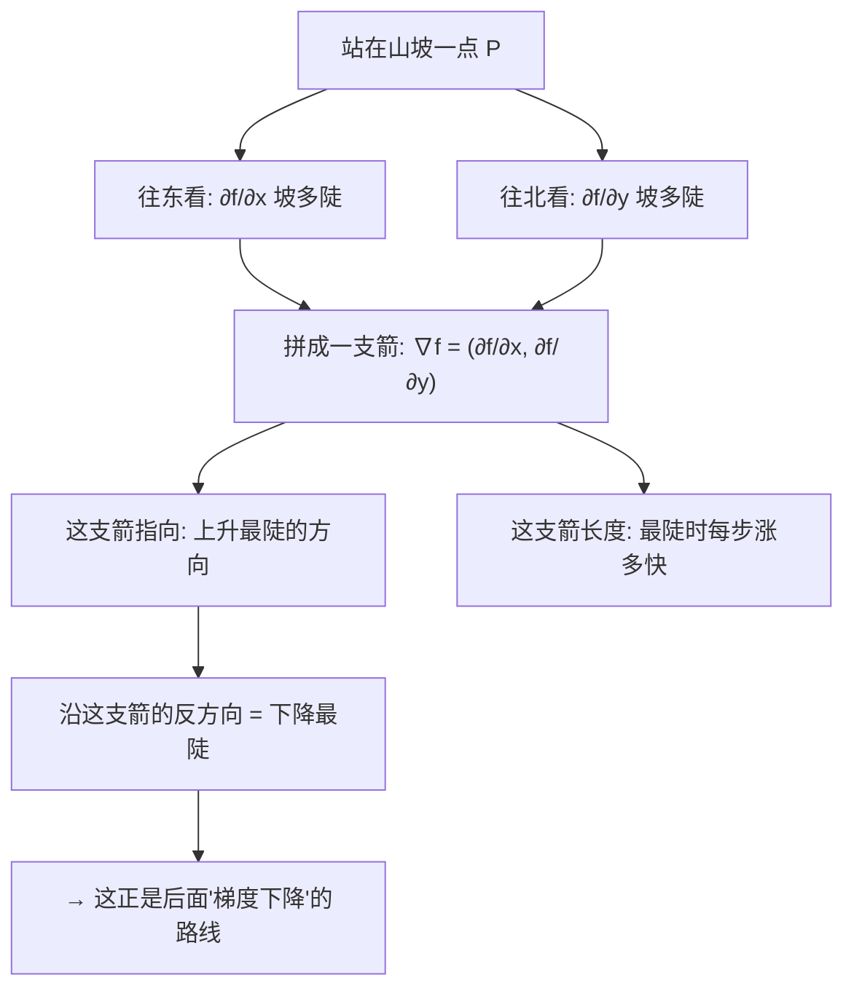

# 第 09 章 · 多元微积分——不只一个变量的变化

> 本章从哪个问题出发：这一册我第6章学会了量"一个量随另一个量变多快"（导数），可现实里的函数往往一口吃进好几个数——一片山坡的高度同时受"往东走多少、往北走多少"两个量决定。一个函数吃进好几个数，它"变"起来，该往哪个方向看？
> 推导到哪个结论：多变量函数的"变化"不止一个方向。偏导数告诉你"只朝这一个方向看，变多快"；把所有方向上的变化率拼成一个向量，就得到那个"上升最陡的箭头"——梯度。方向导数问"朝任意一个方向走，变多快"，全微分则是把"变化"拆成"各方向贡献之和"。这一章，是后面"梯度下降"的数学根。

> 核心认知：你之前学会的导数，总是一根线上一件事——x 变了，f(x) 跟着变。可一旦函数吃进好几个数，事情就"长角"了：同一片山坡，朝东走是下坡、朝北走是上坡，你站在坡上，根本没法说"这坡是往上还是往下"——**你得先问"朝哪个方向"。** 数学给出的回答分三层：**偏导数**是"把别的变量都按死、只看这一个方向，变多快"；**梯度**是"把每个方向上的变化率收集起来，拼成一根最陡的箭头，它指向上升最急的方向"；**方向导数**问"朝任意一个指定的方向走，变多快"，而**全微分**把"总的变化"拆成"每个方向贡献一小份，加起来"。多变量的"变化"从来不是一个数，而是一张"方向图谱"——而这张图谱的正中心，就插着那根"最陡上升"的箭头，也就是后面让你一步步下山的**梯度**。

## 引子

山顶的风很大，吹得我手里的地图边角直翻。我蹲在半山腰一块突出的岩石上，膝盖抵着一片被晒白的草皮，把那张等高线图按平，看了半天。

"老谟，"我抬起头，"你说这座山，我站这儿，往哪走是'最省力'的上山路？"

老谟正背靠着不远处一棵歪脖子松树，嘴里嚼着一根草茎，慢悠悠地瞥了我一眼，没直接答，反问："你先说说，'省力'是什么意思？"

"就是……"我低头重新看那圈一圈的等高线，"等高线密的地方，说明坡陡，走起来费劲；等高线稀的地方，坡缓，省力。我要上山，就该挑坡缓的地方绕。可我这半山腰，朝哪儿坡缓、朝哪儿坡陡，图上又不会只标一个方向。"

老谟把草茎往旁边一吐，站直了。"那你发现没有——你刚说'朝哪儿'。**上一个山坡，只有'上'和'下'两个方向；可这儿是一个山头，站在这半山腰，你面前有三百六十度可以走。** 一个函数如果只吃一个数，变起来就是一条线、只有两个方向；可它要是吃进好几个数——比如这山头的高度，既由'往东走多少'决定、又由'往北走多少'决定——那它'变'起来，方向可就多了去了。这一章，我们就来回答这个：**一个吃进好几个数的函数，它'变'起来，到底该怎么看？**"

我握着地图的手微微一紧，盯着那圈一密一疏的等高线出了神——上一章我一直以为"变化"就是一条线上的事，现在这三百六十度的山坡，把我那套直觉给顶翻了。

## 对话引擎

### 第 1 轮：先别急着看整座山，先把"一个方向"钉住

**老谟**："你说这山头的高度，由'往东走多少'和'往北走多少'两个数一起决定。那我先考你一个最笨的问题——**如果我只想知道'往东走，高度变得多快'，这个'变得多快'，跟第6章你学的那个'导数'，有没有关系？**"

**造物主**："……有吧？我第6章学的导数，就是'一个量随另一个量变多快'。现在我把'往北'给按住不动，只让我自己往东走，那'高度随往东的距离变多快'，不就又是一根线上的导数吗？"

**老谟**："'把往北按住不动'——你把这句话再说一遍，说清楚点，什么叫'按住不动'？"

**造物主**："……就是我先假装北边那个变量压根没在动，把它当成一个固定死的常数，然后就只剩下'往东走多少'这一个变量在变。高度随这一个变量变多快，就是第6章的导数。可这样会不会太'作弊'了？明明北边的数也会影响高度，我这么一按，不是把一半的影响给扔了吗？"

**老谟**："你先别急着给自己扣'作弊'的帽子。我问你——**你这一步，是'看错了整座山'，还是'只看准了其中一个方向'？**"

**造物主**："……是只看准了其中一个方向。我没说整座山就这一个变化，我只是先盯着'往东'这一条线，把别的不看。可我有点心虚，这样算出来的'变多快'，到底是不是这山真实的'变多快'？"

**老谟**："你问到了点子上。你把'按死其他方向、只看一个方向'这件事，从一个'作弊'的偷懒，愣是问成了一个'方向'的问题。那我告诉你——**你没作弊，你只是看得很'窄'。你看到的那条线上'变多快'，是真实存在的，只不过它只属于'往东'这一个方向。** 你现在把这个想法再往深里抠一步：那我要是换个方向看——只看'往北'呢？"

---

**📐 知识锚点：偏导数——"把别的变量按死、只看这一个"**

【概念深挖】老谟逼着造物主承认：**"看一个方向"不是作弊，是"只看这一个方向"。** 这一步，正是本章第一块砖。一个吃进两个数的函数，比如 f(x, y) 表示"高度随往东的距离 x、往北的距离 y 变化"，它"变起来"是一个有方向的玩意儿——但你没法一口吞下整个方向，于是你**先拿一个变量开刀**：

- **固定住 y（往北不动），只让 x 变**：高度 f(x, y) 随 x 变多快——这个变化率，就叫 **f 对 x 的偏导数**，记作 ∂f/∂x（读作"偏 f 偏 x"，那个奇怪的 ∂ 符号，是专门为"其他变量按住不动"这件事设计的记号，跟第6章单变量导数的 d 区分开）。
- **固定住 x（往东不动），只让 y 变**：就是 f 对 y 的偏导数，记作 ∂f/∂y。

**为什么需要"偏"这个字**：因为导数（derivative）本来是一条线上的事，只有 x 在动；可这里 x、y 都能动，你"偏"要只看其中一个，别的全按住，于是用"偏导（partial derivative）"来强调——**这是"只看一个方向、别的都不动"的导数。** 偏导数回答的问题永远是："假如别的变量都被冻住，只动这一个，变化有多快？"

**它俩拼起来，才是一张完整的"方向图"**：∂f/∂x 告诉你"往东看，坡多陡"，∂f/∂y 告诉你"往北看，坡多陡"。两个数，就是两根"只看一个方向"的标尺。可你站在半山腰，想走的方向往往是斜着的——**光有这两根标尺还不够，你还得知道'斜着走'怎么由它俩拼出来。** 这就是后面梯度要干的事。

【历史溯源】把"导数"从一根线推广到一片面，是微积分从牛顿、莱布尼茨那儿长出来之后的自然延伸。**18 世纪的欧拉（Euler）和拉格朗日（Lagrange）**在研究力学时，函数常常同时受位置和时间两个量支配，于是他们需要"只对其中一个量求变化率、把其他的当常数"这种操作——**这就是偏导数的源头。** 而那个专门的记号 ∂，最早由法国数学家**孔多塞（Condorcet，1770 年代）**引入，后来被**雅可比（Jacobi，19 世纪）**大力推广——∂ 就是为了提醒你："这里有一堆变量，我偏偏只看这一个，别的全冻住。"**"看一个方向、冻住其余"这个念头，数学家也花了近一个世纪，才给它配上专属记号。**

【工程实践】偏导数不是学院派的玩具。在气象站，同一时刻的气温是"经度、纬度、海拔"三个量的函数——"气温随海拔变多快"就是 ∂T/∂z，登山爱好者都靠它知道"每爬高一百米，冷几度"。在图像处理里，一张灰度照片的亮度是"横坐标、纵坐标"的函数，**"亮度随横向坐标变多快"就是 ∂I/∂x，这正是图像边缘检测梯度的第一步。** 在机器学习里，一个模型的误差函数同时吃进成千上万个参数——"误差随某一个参数变多快"，就是那一个参数的偏导数。**"冻住其余、只看一个"这一招，是让'很多个变量一起变'变得可算的第一道门。**

---

### 第 2 轮：两个方向都看清楚了，可"斜着走"怎么办——把两个偏导"拼"起来

**老谟**："你手里现在有∂f/∂x、∂f/∂y两根标尺，一根告诉你往东多陡、一根告诉你往北多陡。那我现在问你一个斜着的——**我不往正东、也不往正北，我往'东北偏一点'这种斜方向走，这个方向上的变化率，能不能用你手里那两根标尺拼出来？**"

**造物主**："……斜着走，既有往东的分量、又有往北的分量。那是不是……往东那块贡献 ∂f/∂x、往北那块贡献 ∂f/∂y，把这两份加起来，就是这个斜方向的变化率？"

**老谟**："你这个'拼'字，用得有点意思。那我追问一句——**是'两份加起来'就行，还是得'按照每个方向的'分量''乘一下再加？** 你往正东走、一步跨一丈，跟往东北走、一步里只含半丈往东，同样是'走一步'，往东那部分贡献的'变多快'，能一样吗？"

**造物主**："……不一样！斜着走一步，里面真正'往东'的部分只有一步的一部分。我得看这一步里'往东占了几成、往北占了几成'，然后把∂f/∂x乘上'往东的分量'、∂f/∂y乘上'往北的分量'，再加起来——这才是这个斜方向的变化率！"

**老谟**："你自己把这层窗户纸捅破了。那我现在给你一个更狠的问题——**我要是想找'往上爬得最猛的那个方向'，也就是这三百六十度里，走哪一个方向，高度涨得最快？** 你先猜猜，这个'最陡'的方向，跟那两根标尺 ∂f/∂x、∂f/∂y，会是什么关系？"

**造物主**："……最陡的方向？那我是不是得把这三百六十度每个方向都试一遍，看哪个变化率最大？可方向有无数个，我哪试得过来……等等，老谟，你是不是想说，这个'最陡'的方向，其实不用一个个试，就藏在那两根标尺里？"

**老谟**："你话说到这份上，就停在门口了。我再推你一把——**你手里有两个数：往东变化率 ∂f/∂x、往北变化率 ∂f/∂y。你把它俩想象成一支箭的'横分量'和'纵分量'，拼起来，那支箭指向哪儿？**"

---

**📐 知识锚点：梯度——把所有方向的变化率拼成"最陡上升"的那支箭**

【概念深挖】造物主自己摸到了"斜方向的变化率 = 往东贡献 + 往北贡献"，又隐约觉得"最陡方向藏在两根标尺里"。老谟让他把两根标尺拼成一支箭——这一步，就是**梯度（gradient）**。

- 把 ∂f/∂x 当成箭的**横分量**，把 ∂f/∂y 当成箭的**纵分量**，拼起来得到一支向量：
  **∇f = ( ∂f/∂x , ∂f/∂y )**（读作"grad f"，∇ 是梯度符号）。
- 这支箭指向的方向，正是**上升最陡的方向**；这支箭的长度，就是**沿着这个方向每走一步，高度涨得最快有多快**。

**为什么"最陡方向"恰好是把两个偏导拼起来的这支箭**：因为任意一个方向的变化率，等于"∂f/∂x 乘上该方向的横分量 + ∂f/∂y 乘上该方向的纵分量"（这叫方向导数，下面详谈）。你想让它最大，就得让这个方向尽量"顺着"∇f 这支箭——当方向跟∇f 完全同向时，变化率取到最大值，也就是梯度的长度。**所以"梯度"不是随便拼出来的，它是"在哪个方向上升得最急"这个问题的最优解。**

一支山腰的箭头图，把它画出来更直观：



读图说明：站在山坡一点，先往东看、再往北看，各得一根"变多快"的标尺。把这两根标尺当横、纵分量拼成一支箭 ∇f，这支箭指向**上升最陡**的方向；而顺着它反过来，就是**下降最陡**的方向——注意右下角那一步，这正是下一章"梯度下降"要走的路。

【历史溯源】**"gradient"这个词，来自拉丁语 gradus（步、台阶），本是"坡度"的意思。** 把偏导数拼成"指向最陡上升的向量"，这个想法在 19 世纪随着多元微积分成型而确立，**物理学家和工程师最先拥抱它**：热力学里"热量往哪儿流得最猛"、流体里"气压哪儿掉得最快"、电学里"电势哪儿降得最陡"，全指着这一支向量。**"最陡的方向"几乎是物理世界的共同直觉**——球往哪滚、水往哪流、电荷往哪跑，都是沿着梯度的反方向。而它真正爆发出改变世界的力量，是在一个世纪后：**当"最陡下降的方向"变成让机器学习的算法（梯度下降）时，这支山坡上拼出来的箭，成了所有神经网络训练的路线图。**

【工程实践】梯度在真实工程里几乎是"方向"的代名词。图像处理里，对亮度函数求梯度，**梯度大的地方就是"边缘"（灰度骤变处），这是所有边缘检测算法的地基**。气象里，对气压场求梯度，箭头指向"气压升得最猛处"，逆着它就是风的方向。而最要紧的用途在机器学习——**误差函数吃进成千上万参数，它的梯度就指向"误差涨得最猛的方向"；要减小误差，就沿梯度的反方向调参数。** 这一章拼出来的这支箭，正是下一章"梯度下降"的第一步台阶。

---

### 第 3 轮：可方向是斜的，凭什么能用这两根标尺"拼"出来——先把"任意方向的变化率"算给造物主看

**老谟**："你把最陡方向定成'拼起来那支箭'了，可我这儿还有个不服气的点——**你说'斜方向的变化率 = 往东贡献 + 往北贡献'，这是你猜的。你怎么证明它？** 我给你一个具体的：假设 f(x,y) = x² + y²（这山是个碗形，中心最低），站在点 (1, 1) 那里。你告诉我，往'东北'（也就是 45° 斜向右上）这个方向走，变化率是多少？"

**造物主**："……得动手算。f 对 x 求偏导，2x，在 (1,1) 是 2；f 对 y 求偏导，2y，在 (1,1) 也是 2。往东北走一步，往东分量和往北分量……各占二分之根号二。所以变化率 = 2×(√2/2) + 2×(√2/2) = √2 + √2 = 2√2？"

**老谟**："那你现在告诉我——**这 2√2，是不是比'往正东走'(变化率 2) 要快？是不是也比'往正北走'(变化率 2) 快？**"

**造物主**："是！2√2 约等于 2.83，比 2 大。所以东北这个斜方向，比我往正东、正北都快！咦……这有点意思，斜着走居然比直着走涨得还快。"

**老谟**："那你再顺着这个思路想——**难道东北就是最快了吗？还有没有比东北更快的方向？** 你手里那支拼出来的箭 ∇f = (2,2)，它指向哪儿？"

**造物主**："……∇f = (2,2)，横分量、纵分量都是 2，那它指向……正东北，45°！而东北方向的变化率正好是 2√2，也就是 (2,2) 这支箭的长度！**所以最陡的方向，真的就是拼出来那支箭 ∇f，它的方向是东北，它的长度 2√2，就是那个最大的变化率！**"

**老谟**："你自己动笔，把这支'最陡方向 = 梯度那支箭'给验穿了——这是算出来的，不是听我背给你的。我信你，你也该信它。现在你再想想——**我把'往任意方向走的变化率'这件事，用 '∂f/∂x 乘横分量 + ∂f/∂y 乘纵分量' 来算。这个'任意方向的变化率'，你想给它起个什么名字？**"

**造物主**："……这是'朝着某个指定方向走，变多快'，跟偏导那种'只朝坐标轴方向'不一样，它是'带方向的导数'？可它又是用两根偏导乘上分量拼出来的……"

---

**📐 知识锚点：方向导数——"朝任意一个指定方向走，变多快"**

【概念深挖】造物主亲手算出了"东北方向变化率 = 2√2"，发现它正好等于梯度 (2,2) 的长度，也验证了"最陡方向就是梯度方向"。这里冒出来的核心概念，是**方向导数（directional derivative）**：

- 偏导数只回答"朝正 x 或正 y（坐标轴）方向，变多快"。
- 现实里你往往朝一个**任意指定的斜方向**走，方向导数就是"朝这个方向走，单位步长下，函数变多快"。
- 它的算法就是造物主自己摸出来的那句：**方向导数 = ∂f/∂x × (该方向的横分量) + ∂f/∂y × (该方向的纵分量)**。横、纵分量越大的方向，把那两部分的偏导"借"得越多，变化率就越大。

**方向导数跟梯度的关系，一句话说透**：朝任意方向走的变化率，等于**梯度 ∇f 投影到那个方向上的长度**。所以：
- 方向跟 ∇f 同向 → 方向导数最大，等于梯度长度（上升最陡）。
- 方向跟 ∇f 反向 → 方向导数最小，等于负的梯度长度（下降最陡）。
- 方向跟 ∇f 垂直 → 方向导数为 0（沿着等高线走，高度不变）。

**这是"多变量变化"的完整答案**：偏导数是"只看坐标轴方向"的特例，方向导数是"任意方向"的一般情形，而梯度是所有方向导数里"最大那一个"的方向与数值。**梯度不是凭空冒出来的，它本来就是"方向导数取最大值"的那把钥匙。**

【工程实践】方向导数在工程里帮你回答"这个方向划不划算"。自动驾驶判断"沿着这个弯道方向，车道偏差是变大还是变小"，算的就是"偏差函数沿该方向的方向导数"；经济里判断"往这个产品方向投入，利润变多快"，也是方向导数。**偏导数告诉你"标准方向"多快，方向导数告诉你"你真正想走那个方向"多快——后者才是决策要用的那一个。**

---

### 第 4 轮：把"变化"拆开看——全微分，就是"各方向贡献加起来"的账单

**老谟**："你现在有了偏导、梯度、方向导数，我看你有点飘。那我问你一个'加总'的问题——**假设我同时往东挪一小步 dx、往北挪一小步 dy（两个都动），这一下高度总共变了多少？** 你别把脑子绕晕，就用你刚才那句'往东贡献 + 往北贡献'来拆。"

**造物主**："……同时动？那高度总变化，就是'往东挪 dx 带来的变化'加上'往北挪 dy 带来的变化'。往东每走一小步，涨 ∂f/∂x 那么多，走了 dx 步，所以贡献是 ∂f/∂x × dx；往北同理是 ∂f/∂y × dy。总变化就是这两份加起来：∂f/∂x·dx + ∂f/∂y·dy。"

**老谟**："你刚才把'总的变化'，拆成了'东边贡献一份 + 北边贡献一份'。这两个方向如果都动一点点，总变化就是两份相加——**这就是'变化可以被拆开、被加起来'这句话的全部含义。** 你想想，这个'总变化的账单'，在工程里能干点什么？"

**造物主**："……如果我知道每个方向对结果各贡献多少，那我就能反过来：**我想让结果往某个方向偏，就知道该主要调哪个变量。** 比如这山头，我想爬到更高的地方，就该主要往梯度方向挪；想让高度变化最少（贴着等高线走），就往垂直梯度的方向挪。"

**老谟**："你把这个'拆开的账单'，用在了'该往哪儿动'的决策上——这正好是本章的落点。那你给这个'总变化 = 各方向贡献之和'的账单，起个名字。"

**造物主**："……这是把'一个小小的总变化'，拆成'每一小份方向各自贡献的和'。既然偏导是'偏'着看一个方向，那这个把所有方向的贡献加起来的……是不是可以叫'全'一点的微分？就跟它是'全部方向合起来的账'一样。"

---

**📐 知识锚点：全微分——"总变化 = 各方向贡献之和"的账单**

【概念深挖】造物主自己拆出了"总变化 = 往东贡献 + 往北贡献"，并给了它"全一点的微分"这个直觉——这正式的名字就是**全微分（total differential）**：

- 当所有变量同时动一点点（x 动 dx，y 动 dy），函数的总变化 df，等于各方向贡献之和：
  **df = (∂f/∂x) dx + (∂f/∂y) dy**
- 它的含义是：**变化可以被拆开、被线性加起来。** 只要每一步 dx、dy 足够小，这个"账单"就足够准；步子一大，非线性成分（dx² 之类）就进来捣乱，账就算不准了。

**全微分 vs 偏导 vs 梯度，三者的分工**：
- **偏导数**：只算"冻住其他、动一个"，是单方向的变化率。
- **梯度**：把所有偏导拼成"最陡上升方向"的箭头，是方向的统领。
- **全微分**：把所有变量都动一点时，"总变化"怎么由各方向贡献加起来，是变化的"总账本"。

**这一章的脉络**：先学会"只盯一个方向"（偏导），再把它们合成"最陡的那支箭"（梯度），由此问出"任意方向多快"（方向导数），最后把各方向贡献加总成"总变化"（全微分）。**多变量的"变化"从此不再是一根线，而是一张方向图谱；图谱正中，就是那根最陡上升的箭头——梯度。**

【历史溯源】**"微分"这个总账思想，跟第6章极限是同源的**：牛顿和莱布尼茨的微积分里，本来就藏着"微小变化可线性相加"的直觉，只是单变量时只有 dx 一份、无从显形。**当欧拉、拉格朗日把微积分推广到多变量后，"总变化拆成各方向贡献之和"就成了标配**——这就是全微分的来历。**它跟单变量的 d f = f′(x) dx 是一家人，只是多了几个"方向"的项。**

【工程实践】全微分在工程里是"误差传递"的计算器：一个测量结果由好几个变量决定，每个变量都有测量误差，**"总误差"就用全微分把各变量的误差贡献加起来**。摄影师算"对焦偏差对照片清晰度的影响"、工程师算"零件的尺寸公差叠加起来零件还能不能装得上"，全是全微分。"把总变化拆成各方向贡献"这一招，是分析"很多个量一起波动"的通用账本。

---

### 第 5 轮：动手造——让计算机自己算偏导、拼出梯度

**老谟**："你把这套'方向图谱'讲得头头是道，可这一册的老规矩你知道——**造不出来，等于没学会。** 我现在给你一个没法靠手化简的函数：f(x,y) = sin(x)·cos(y) + 0.5·x·y 这种，你还能像 x² 那样手算偏导吗？"

**造物主**："……够呛。手算我得先会求 sin 和 cos 的偏导，还得乘起来、加起来，麻烦得很。可我记得第6章对付'化简不了'的办法——**用很小的 h 逼近！偏导不就是'冻住一个变量、对另一个取很小的差分'吗？** 我能不能让机器用这套差分，把偏导、甚至梯度，一个个算出来？"

**老谟**："你自己把第6章那招给搬过来了，这是聪明的。那你动手，**让机器算出这个函数在某个点的梯度**——也就是 ∂f/∂x 和 ∂f/∂y 两个数。"

---

**📐 知识锚点：【实现思考】用 Python 数值算偏导、拼出梯度**

【实现思考】"看懂梯度"到"能造出梯度"，就差把第6章的中心差分搬到"每个变量"上。多变量只是把"冻住其他、只对这一个求差分"重复几遍：

```python
import math

def partial(f, k, x, h=1e-6):
    """对第 k 个变量求偏导：冻住其他变量，只让第 k 个动一小步"""
    def inc(*args):
        a = list(args); a[k] += h; return tuple(a)   # 第 k 个变量 +h
    def dec(*args):
        a = list(args); a[k] -= h; return tuple(a)   # 第 k 个变量 -h
    return (f(*inc(x)) - f(*dec(x))) / (2 * h)       # 中心差分

def grad(f, x):
    """梯度 = 把每个变量的偏导拼成一支向量"""
    return [partial(f, k, x) for k in range(len(x))]

# f(x,y) = sin(x)*cos(y) + 0.5*x*y
f = lambda x, y: math.sin(x) * math.cos(y) + 0.5 * x * y

p = (1.0, 0.5)
g = grad(f, p)
print("在点", p, "处的梯度 =", g)
# 期望输出: 梯度约 = [0.7241..., 0.0966...]
# 手算验证: ∂f/∂x = cos(x)*cos(y)+0.5*y ≈ 0.7241
#           ∂f/∂y = -sin(x)*sin(y)+0.5*x ≈ 0.0966
```

**为什么这么造**：对每个变量，都执行一次"第6章的中心差分"——冻住别的、只让这一个动 ±h，看函数变多少。把每个变量的偏导算出来，**拼成一支列表，就是梯度**。**代价**：中心差分需要算 2n 次函数值（n 个变量每个算两次），变量一多开销就上来；而且 h 太小会被浮点精度吞掉（第5章那个坑），太大又离真值远。**换条路会怎样**：如果坚持手推公式，sin·cos 这种函数就要人老命；如果只用前向差分（只加不减），误差更大。**"数值梯度"是你在真实机器上唯一能拿到的梯度——深度学习里那些没法手推的误差函数，全靠这一招逼近。**

【工程实践】"数值梯度"最经典的工程用途，是**当"验证工具"**：深度学习里，你没法轻易手推梯度公式，于是工程师常用数值梯度去"对账"——用 `∂f/∂x ≈ (f(x+h)-f(x-h))/(2h)` 逼近出来的梯度，跟公式算出来的梯度比一比，差得不大就说明公式写对了。**这招在 PyTorch、TensorFlow 的调试里天天用。** 而真正上线时，为了省算力，会用反向传播的解析梯度；但**"数值梯度"永远是那个靠谱的基准**——它慢，但它对。

---

### 第 6 轮：落点——多变量的"变化"是一张方向图谱，正中心插着梯度那支箭

**老谟**："我把你那套地图收起来了。你现在闭上眼睛，光用嘴，把这座山'变起来'该怎么说，从头给我捋一遍——不许偷看第6章那个'一根线上一个数'的老说法。"

**造物主**："……我不看也知道，那套说法不够用了。这山的高度同时受往东、往北两个量决定，它'变'起来是有方向的。**我先看'往东变多快'（对 x 的偏导）、再看'往北变多快'（对 y 的偏导），把它们拼成一支箭——梯度，它指向上升最陡的方向。** 想看任意一个斜方向多快，就看梯度往那个方向的投影（方向导数）；想把总变化拆开看，就是全微分，各方向贡献加起来。"

**老谟**："那你手里这张'方向图谱'，最有用的那根箭头是哪支？"

**造物主**："……是梯度那支箭。它指向上坡最急的方向；**反过来，指着下坡最陡的方向。** 我要是想爬得最快，就往它指的方向走；我要是想找谷底、想往下走，就逆着它走。"

**老谟**："'逆着梯度走，就是下坡最陡'——你把这句话记住了。那我问你一个往前的话——**你手里有一座'函数山'，你想找到它最低的那个谷底（让函数最小），而你只知道脚下每一处的梯度。你要怎么一步步走到谷底？**"

**造物主**："……我每走一步，就看这儿的梯度，然后往梯度的反方向（下坡最陡）走一步，走到新地方，再看新的梯度，再往下坡走……一步一步，应该就能一路下坡，摸到谷底？"

**老谟**："你这句话，把下一章的门撞开了。**'看着梯度、往下坡最陡的方向一步步走'，这个朴素到极点的念头，就是让所有神经网络学会一切的那个算法。** 下一章，我们就来较真这件事——怎么走、走多大步、会不会走过头、路上撞到'不能越的边界'又该怎么办。"

**造物主**："……原来我这一章拼出来的那支箭，不只能看山，还能'下山'。"

---

### 📐 知识锚点·计算速查：偏导与梯度怎么算

【适用场景】给一个吃进好几个变量的函数，算出它在某点的"各方向变化率"和"最陡方向"。

【偏导数计算步骤】（求 ∂f/∂x）：
1. 把 x 之外的所有变量**当成常数**（"冻住其余"）。
2. 用第6章的求导法则，只对 x 求导。
3. 例：f(x,y)=x²·y，∂f/∂x = 2x·y（y 当常数），∂f/∂y = x²（x 当常数）。
4. 若要求"在某点的偏导"，先把偏导函数求出来，再代该点的坐标。

【梯度计算步骤】：
1. 分别求出对每个变量的偏导：∂f/∂x、∂f/∂y、…
2. 把它们拼成一列向量：**∇f = (∂f/∂x, ∂f/∂y)**。
3. 这支箭**指向上升最陡的方向**；它的长度 = 最陡时每步涨多快。

【方向导数计算步骤】（朝指定方向走，变多快）：
1. 写出该方向的单位方向向量（分量）。
2. 套公式：**方向导数 = ∂f/∂x ×(横分量) + ∂f/∂y ×(纵分量)**。
3. 沿梯度方向最大（=梯度长度）、逆梯度最小（=−梯度长度）、垂直为 0（沿等高线）。

【数值梯度（写不出公式时）】对每个变量分别做中心差分 `∂f/∂x ≈ (f(x+h,…)−f(x−h,…))/(2h)`，把各偏导拼起来就是数值梯度。**记忆口诀：冻其余、导一个、拼成箭；最陡上升看梯度，下降走反方向。**

### 🔧 工程实践·计算案例：用 numpy 算数值梯度，验证"梯度方向是上升最陡"

机器学习里误差函数复杂到写不出公式，工程师就用数值梯度当"基准"。下面用 numpy 对一个能手算的多变量函数，数值算梯度并跟手推对比，再验证"沿梯度方向上升最陡"：

```python
import numpy as np

def partial(f, k, x, h=1e-6):
    """中心差分: 冻住其他变量, 只让第 k 个动 ±h"""
    def shift(sign):
        a = list(x); a[k] += sign*h; return tuple(a)
    return (f(*shift(+1)) - f(*shift(-1))) / (2*h)

def grad(f, x):
    return np.array([partial(f, k, x) for k in range(len(x))])

# f(x,y) = x² + y²  (碗形, 谷底在原点), 手推梯度 = (2x, 2y)
f = lambda x, y: x*x + y*y
p = (3.0, 4.0)
g = grad(f, p)
print("数值梯度 ∇f =", g, "  手推 (2x,2y) =", (2*p[0], 2*p[1]))   # 都是 [6,8]

# 验证梯度方向上升最陡: 在 p 点, 沿梯度单位方向(6,8)/10 走一步, 比沿任意方向走得都高
u = g / np.linalg.norm(g)          # 梯度单位方向 = (0.6, 0.8)
d_steep = (f(p[0]+0.1*u[0], p[1]+0.1*u[1]) - f(*p)) / 0.1        # 沿最陡方向变化率
d_east  = (f(p[0]+0.1, p[1]) - f(*p)) / 0.1                       # 沿正东变化率
print("沿梯度方向变化率 ≈", round(d_steep, 4), "  沿正东变化率 ≈", round(d_east, 4))
# 期望: 沿梯度 ≈ 10 (=梯度长度), 沿正东 ≈ 6, 沿梯度最陡
```

期望输出：
- `数值梯度 ∇f = [6. 8.]`，手推 `(2x,2y)=(6,8)`——数值梯度与公式对得上（作验证基准）。
- 在 p=(3,4) 处，梯度 (6,8) 的长度 = √(36+64)=10。沿梯度单位方向走，变化率 ≈10（=梯度长度，**上升最陡**）；沿正东走只有 6。**亲眼确认"梯度方向涨得最快"。**

**为什么这么造**：我们用中心差分分别对每个变量求偏导、拼成梯度，跟手推公式对账——这正是深度学习里"数值梯度验证解析梯度"的标准操作。**代价**：数值梯度要算 2×变量数 次函数值、且 h 太小会被浮点精度吞掉（第5章的坑）。**换条路会怎样**：若坚持手推，f(x,y)=sin(x)cos(y)+0.5xy 这种就要人老命；若用前向差分误差更大。**实际训练大模型用反向传播算梯度，但"数值梯度"永远是那个慢但靠谱的验证基准。**

### 💡 造物主手记·计算踩坑：求偏导时忘了"冻住"另一个变量

算 f(x,y) = x²·y 对 x 的偏导，我一激动把 y 也当成变量一起求了，写成了"2x·y + x²"（那是全微分 d f，不是偏导 ∂f/∂x）。老谟一句"你求的是'只看 x 这一条线'的斜率，还是'两个一起动'的总账？"点醒我——**偏导必须把 y 冻成常数，∂f/∂x = 2x·y，绝不会多出 x² 那一项**。我这一下才分清：偏导是"一条线"，全微分才是"总账"。这直接关系到我拼梯度时会不会多塞进一根错误的"箭"——**偏导漏冻一个变量，整支梯度箭的方向就歪了**，后面的梯度下降自然走错路。

### 📝 自测题·计算类

1. **场景**：f(x,y)=3x²·y，求 ∂f/∂x 和 ∂f/∂y，并在点 (1,2) 处的值。
   *简答要点*：∂f/∂x=6xy（y 当常数），∂f/∂y=3x²（x 当常数）；在 (1,2)：∂f/∂x=12，∂f/∂y=3。

2. **场景**：f(x,y)=x²+y² 在点 (1,2) 处的梯度是什么？指向哪个方向？
   *简答要点*：∇f=(2x,2y)=(2,4)；指向"东北偏北"方向，长度 √(4+16)=√20≈4.47，即上升最陡方向。

3. **场景**：想算 f(x,y) 沿"正东"方向走的变化率（已知 ∂f/∂x=3、∂f/∂y=5）。方向导数是几？
   *简答要点*：正东单位方向向量=(1,0)；方向导数 = ∂f/∂x×1 + ∂f/∂y×0 = 3×1+5×0 = 3（等于偏导 ∂f/∂x，因为正东就是只往 x 方向走）。

---

## 知识点总结

### 知识点（本章推出的核心概念）
- **偏导数（partial derivative）**：把其他变量都"冻住"、只让这一个变量动，看函数变多快。∂f/∂x 是"只看 x 这一个方向的变化率"。**它回答"冻住其余、只看一个方向，变多快"。**
- **梯度（gradient）**：把所有变量的偏导拼成一支向量 **∇f = (∂f/∂x, ∂f/∂y)**，它指向**上升最陡的方向**，长度就是最陡时每步涨多快。**它是"方向导数取最大值"的那把钥匙。**
- **方向导数（directional derivative）**：朝任意指定方向走，单位步长下函数变多快，等于**梯度往该方向的投影**。同向最大（上升最陡）、反向最小（下降最陡）、垂直为 0（沿等高线）。
- **全微分（total differential）**：所有变量同时动一点，总变化 df = (∂f/∂x)dx + (∂f/∂y)dy，是"总变化 = 各方向贡献之和"的账本。
- **多变量"变化"是一张方向图谱**：偏导是"只盯一个方向"，梯度是"最陡的那支箭"，方向导数问"任意方向多快"，全微分把各方向贡献加总。**逆着梯度走就是下坡最陡，这是下一章梯度下降的数学根。**

### 历史结论（本章涉及的史料）
- 偏导数萌芽于 18 世纪的欧拉、拉格朗日（力学里函数同时受位置和时间支配，需"只对一个量求变化率"）；**∂ 记号由孔多塞（1770s）引入、雅可比（19 世纪）推广**。
- "gradient"来自拉丁语 gradus（步、台阶），意即"坡度"；19 世纪随多元微积分成型，"最陡上升方向"成为物理世界的共同直觉（球往哪滚、水往哪流）。
- 全微分与第6章极限同源，是牛顿-莱布尼茨"微小变化可线性相加"推广到多变量的结果。

### 工程实践结论（本章知识在真实工程里怎么用）
- **偏导数**：气温随海拔、图像亮度随横纵坐标、误差随某一个参数——全是"冻住其余、看一个"。
- **梯度**：图像边缘检测（梯度大处即灰度骤变处）、气压梯度定风向、**机器学习里误差函数的梯度指向"误差涨最猛方向"，逆着它调参就是学习**。
- **全微分**：误差传递（把各变量误差贡献相加）、尺寸公差叠加分析。
- **数值梯度**：用 `(f(x+h)-f(x-h))/(2h)` 对每个变量做中心差分再拼成梯度；慢但可靠，是深度学习里验证梯度公式正确性的基准工具。

## 向导便签

> 这一章咱们干了什么：从半山腰一张等高线地图、一个"该往哪个方向走"的疑问，一路逼到"多变量的变化"。你亲手把"往东、往北"两根变化率标尺，拼成"上升最陡"的那支箭——梯度；用 x²+y² 亲手算出东北方向变化率 2√2，验出"最陡方向就是梯度方向"；又摸出方向导数、全微分，最后用 Python 让机器对 sin·cos 函数数值算出梯度。
>
> 钉死一句话：**多变量的"变化"是一张方向图谱——偏导是"只看一个方向"，梯度是"上升最陡的那支箭"，方向导数问"任意方向多快"，全微分把各方向贡献加总。**
>
> 记住：**逆着梯度走，就是下坡最陡。** 而你手里这座"函数山"，正等着一个"怎么一步步下到谷底"的办法——那是下一章的事。

## 造物主手记

**我曾踩的坑**：

我最开始以为"把别的变量冻住只看一个"是作弊，心虚得不行，差点不敢用偏导。老谟一句"你不是作弊，你只是看得很窄"把我拉了回来——**看一个方向不是错的，只看一个方向才是'窄'，但它是拼出整张方向图谱的第一块砖。** 还有一次我差点以为"斜方向变化率就是把两个偏导直接相加"，忘了得按"往东占几成、往北占几成"的分量去乘——**每份贡献都要先乘上这个方向的分量，再加。** 手写 numpy 算梯度时，我又差点忘了中心差分是"加 h 和减 h 各算一次再除以 2h"，只加不减的话误差会大一个量级。

**顿悟时刻**：

真正开窍是"最陡方向 = 拼起来那支箭"那一下。我亲手算了 f(x,y)=x²+y² 在 (1,1) 点东北方向的变化率，算出 2√2，发现它正好等于梯度 (2,2) 的长度、方向也正好是东北——**原来那个"最陡的方向"不用一个个去试，就藏在两根偏导拼成的箭里。** 更让我震动的是落点那句"逆着梯度走就是下坡最陡"——我这一章拼出来的，不只是一支看山的箭，还是一张下山的地图。

## 自测题

1. **辨析**：有人说"偏导数就是导数，只是换了个名字"。严谨吗？
   *简答要点*：不严谨。导数是一条线上只有一个变量；偏导数是"把其他变量都冻住、只看这一个方向"，它回答的是"冻住其余、只看一个方向，变多快"，是单方向的变化率，不是整座"山"的变化。

2. **换算**：f(x,y)=x²+y² 在点 (1,1) 处，∂f/∂x 和 ∂f/∂y 各是多少？梯度指向哪个方向？
   *简答要点*：∂f/∂x=2x=2，∂f/∂y=2y=2；梯度 ∇f=(2,2)，指向东北（45°），长度 2√2，即上升最陡方向。

3. **找茬**：有人说"往任意斜方向的变化率，就是把两个偏导数直接加起来"。错在哪？
   *简答要点*：错在没乘方向的分量。方向导数 = ∂f/∂x×(横分量) + ∂f/∂y×(纵分量)；直接相加默认两个方向各走一步、各占一份，忽略了"这一步里往东占几成、往北占几成"。

4. **推算**：全微分 df 是什么？它把总变化拆成了什么？
   *简答要点*：df = (∂f/∂x)dx + (∂f/∂y)dy，把"所有变量同时动一点"的总变化，拆成"每个方向各自贡献一份再加起来"的账单；只要 dx、dy 足够小就足够准。

5. **判断**：为什么"梯度的反方向是下降最陡"？这对找谷底意味着什么？
   *简答要点*：任意方向变化率 = 梯度往该方向的投影，与梯度反向时投影最小（下降最陡）。要找函数最小值，就沿梯度反方向一步步走，这是梯度下降的路线。

6. **实现题**：用 Python 对 f(x,y)=sin(x)·cos(y)+0.5·x·y 在点 (1,0.5) 数值计算梯度，并与手推的偏导公式对账。
   *简答要点*：对每个变量用中心差分 `(f(x+h)-f(x-h))/(2h)`，把两个偏导拼成梯度；与 ∂f/∂x=cos(x)cos(y)+0.5y、∂f/∂y=-sin(x)sin(y)+0.5x 对比，差异应约等于 0（数值梯度作验证基准）。

7. **开放推导**：一片丘陵地形，你想找一条"从营地走到山顶、全程爬升最快"的路线。如何用本章的"梯度"来指路？每一步该怎么走？
   *简答要点*：每一步先求脚下高度的梯度（指向上升最陡方向），沿着梯度方向走一小步，到新位置再求新梯度再走——这就是"沿最陡上升方向迭代爬坡"；若要求下山到谷底，则每一步逆着梯度走（这正是梯度下降）。

## 预告

你手里现在有一座"函数山"，你看得见它的方向图谱——知道哪儿最陡、哪儿是平缓的等高线，甚至有一支指向"上升最急"的梯度箭。

可你发现没有？**这支梯度箭，本身就是一个"有方向的数"——它不只是一个数，而是一串数拼成的、指向某个方向的家伙。** 你想让它指向东北最陡，就得同时给出"往东多少、往北多少"两个数。换句话说，多元微积分里最要紧的这个对象——梯度——天生就是一个"向量"。

可你现在对付向量，还是一支箭一支箭地来：加一支、放大一支、点一支。**要是有一大堆这样的"有方向的数"，要同时照顾、批量变换、甚至反着变回去，你怎么办？** 下一章，我们从"一支箭"走向"一整批箭"——那场"批量的函数"，正是高维世界的语言：向量与矩阵。
