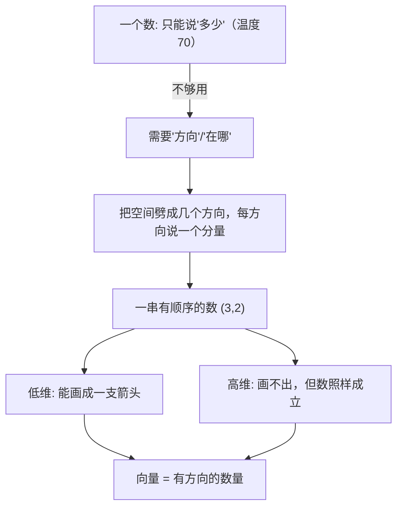

# 第 10 章 · 向量——有方向的数量

> 本章从哪个问题出发：我上一章学会量"一个量随另一个量怎么变"，可这个世界常常是"一堆输入一起变"——一辆车同时有方向、位置、速度。一个数描述不了这些，那"两个并排的数"又是什么？
> 推导到哪个结论：向量就是"一串有顺序的数"，是"有方向的数量"；低维的它能画成箭头、高维的画不出来但数照样成立；点积是"投影"的钥匙，把"两个方向有多像"变成一把尺子。

> 核心认知：你前七章一直在和"一个数"打交道——x 进来，f(x) 出去。可现实里几乎没有哪样东西能被一个数说清楚：调一杯酒，除了"加多少"，还有"偏甜还是偏酸"两个方向；导航去一个地方，光说"走三公里"没用，你还得说"往哪个方向"。**一个数只能说"多少"，说不清"往哪"。** 把几个数并排绑在一起、约定好顺序，就成了"一串有顺序的数"——这就是向量。它低维时能画成箭头，高维时画不出来，但那串数照样成立、照样能算。而两个向量"有多像"，靠的是点积——它是"投影"的钥匙，后面所有高维世界的聪明办法，都从这一把钥匙里长出来。

## 引子

吧台后头的灯光是暖的，我把雪克壶在手里转了两圈，量酒器卡在杯沿，先倒了四十毫升金酒，又倒了二十毫升西柚汁，最后补了一点青柠汁，盖上盖子，哐哐晃了十几下。

"这杯呢，西柚味足一点。"我自言自语，把酒倒进杯里，推给吧台那头的一个人。

老谟没接杯，就那么盯着杯子看。"你是调酒师，那我问你——**这杯酒，你要怎么跟人说清楚它是什么味？**"

"说清楚？"我端着量酒器的手微微一缓，"西柚味啊，我放了四十金酒、二十西柚、五青柠，度数大概十几度。这不就说明白了？"

"四十、二十、五——三个数。可你怎么知道这三个数摆在这儿，调出来的就是西柚味，而不是'喝了一口腌黄瓜'？"

我咂了下嘴。"……因为比例啊。这三个数得按对的量放，放错了味就变了。可你问的是'怎么跟人说明白'，我总不能让人按着三个数自己去猜。"

"那要是让你把'这杯酒的配方'传给一个没喝过它的人，你会怎么传？"

"……传三个数呗，四十、二十、五，告诉他按这个来。"

老谟终于端起了那杯酒，抿了一口。"三个数，按顺序摆好，就是个配方。那我现在问你——**这三个数，和'温度 70 度'那个数，是同一个东西吗？**"

我张了张嘴，愣是没憋出一句。温度一个数就够了；可这杯酒，三个数并排摆着，少了哪个、换了个顺序，就完全是另一杯酒。

"一个数，只够说'多少'。"老谟把杯子放回桌面，"可这个世界，太多东西光说'多少'不够——你还得说'往哪个方向'、'哪几样放在一起'。**一个数描述不了的世界，就该轮到'两个并排的数'上场了。** 这一章，我们就从这杯酒开始，造一个能'指着方向'的新家伙。"

## 对话引擎

### 第 1 轮：一个数说不清的事——光有"多少"，没有"方向"

**老谟**："你调酒，光说'四十'、'二十'、'五'三个数，人家还是不知道是什么味。现在我给你一个更简单的例子——**你站在广场中央，想走回住处。你对别人说'我走了三公里'。你觉得，这话能把别人带到你家吗？**"

**造物主**："……带不到。'三公里'只说走了多远，没说往哪个方向。往东三公里和往西三公里，差得远了。"

**老谟**："那你得补上什么？"

**造物主**："补上方向。'往东走三公里'，这就对了。一个是'多远'，一个是'往哪'。"

**老谟**："好。那我把话说全——'往东走三公里'，这里头其实有**两个**信息：'三'（走多少），和'东'（往哪）。可'东'不是个数。你打算怎么把它变成'两个数'？"

**造物主**："……把它分解？东是水平方向，那我可以分成'东西走了多少'和'南北走了多少'。往东三公里，就是'东西方向 +3，南北方向 0'。要是往东北斜着走呢，就得两个都不为零。"

**老谟**："你自己把一个方向，拆成了'两个方向各自的分量'。那我问你，你站的地方，东西、南北这两条线，是你定的，还是天生就该这样？"

**造物主**："……是我定的吧？我要是把广场地图转个九十度，原来的'东西'就变成'南北'了，可我还是走到了同一个地方。方向轴是我选的，不是天上掉下来的。"

**老谟**："你发现了一个要紧的约定：**'往哪走'不是一件事，是你把空间劈成几个方向、再往每个方向各说一个'走了多少'。** 而你选的这根轴、怎么定正负，全是你和人约好的。那你说——'我的住处'，现在要几个数才说得清？"

**造物主**："两个！一个'东西走了多少'，一个'南北走了多少'。两个数并排摆着，就能把我的住处，从广场上所有点里挑出来。"

---

**📐 知识锚点：一个数 vs 一串数——"多少"与"在哪"的分野**

【概念深挖】你上七章一直用"一个数"描述世界：温度是 70，速度是 2t，路程是 9。但"一个数"只够回答"**多少**"，回答不了"**在哪**""**往哪**"。要把一个"点"从一整个平面上挑出来，一个数做不到——你得同时给出"东西方向走了多少"和"南北方向走了多少"。这俩数并排摆着、约定好先后顺序，就是一个"点"的完整身份。

打个比方：**一个数像杆秤，只告诉你"多重"；两个并排的数像门牌号，告诉你"第几排第几号"。** 光有"多重"，你找不出一户人家；有了"第几排第几号"，你才能从整栋楼里把它拎出来。

这里有个你必须此刻就刻进脑子的约定：**"东西/南北"这根轴，不是天经地义的。** 是我（和观察者）自己选的正方向、自己定的刻度。换个坐标系，"你的住处"还是那个住处，可表示它的两个数会变。**数字变、位置不变——这就是"表示"和"本质"的区别，而这一章全在跟这个区别打交道。**

【历史溯源】"把空间劈成几个方向、每个方向一个数"这个念头，是**笛卡尔（René Descartes，17 世纪）**干的大事业。传说他在床上躺着，看着天花板上有只苍蝇爬来爬去，突然意识到：**要告诉别人苍蝇在哪，只要说"离这条墙缝多远、离那条墙缝多远"两个数就够了。** 他发明的这套"用数对描述平面上的点"的办法，就是今天我们说的**直角坐标系（Cartesian coordinate system）**。它把几何和代数第一次绑在了一起——从此，"两个数"不再是两个孤零零的数，而是平面上一个点的"住址"。

---

### 第 2 轮：两个数不是随便摆——顺序本身就是信息

**老谟**："你说两个数就能挑出你的住处。那我问你——我把这两个数**换个顺序**，还是同一个住处吗？"

**造物主**："……当然不是。'东西 3、南北 2' 和 '东西 2、南北 3'，是地图上两个不同的点。"

**老谟**："可它们都是'3'和'2'这俩数啊。你没觉得奇怪吗？同样两个数字，就因为摆的前后不一样，就指着两个不同的地方。你说，这两个数之间，凭什么'顺序'这么金贵？"

**造物主**："因为……第一个数约定的意思是'东西'，第二个是'南北'。这顺序是我们说好的，换了我俩之间那套'约定'就崩了。"

**老谟**："那你想想，温度 70 度，跟这个'约定顺序'有关系吗？"

**造物主**："没有。70 就 70，它不靠跟谁站在一起、不靠排第几才有意义。"

**老谟**："所以你看清了吗？**一个数，孤零零就成立；可两个并排的数，一离开顺序、离开位置，就成了一堆废数字。** '3 和 2'到底指着哪，你只看这俩数字根本说不出来，你得知道'第一个代表东西、第二个代表南北'这个约定。那我把这个'带着约定、有顺序的一串数'，给它一个名字——你想叫它什么？"

**造物主**："……一串有顺序的数？它们并排站着，指着同一个方向、同一个点，像一支箭头。"

**老谟**："'像一支箭头'——你自己说中了它最直观的长相。这种'一串有顺序的数'，数学里叫**向量（vector）**。低维时它长成一支箭：箭头的长短是'走多少'，箭头指向是'往哪'。而它真正'硬'的地方，是你刚才说的——**它是一串有顺序的数，不是孤零零一个**。"

---

**📐 知识锚点：向量——一串有顺序的数，长得像一支箭**

【概念深挖】**向量（vector）**，就是"一串有顺序的数"，通常竖着写或用括号括起来。例：你的住处在地图上是 (3, 2)，意思是"东西方向 +3、南北方向 +2"；它同时也能看成一支箭头——从原点出发，水平伸 3、竖直伸 2，指到 (3,2) 那个点。

两个关键点，你刚才都亲手摸到了：

1. **顺序是约定**：(3,2) 和 (2,3) 是不同向量。第一个数代表哪个方向，是约定好的；换约定，同一个点的向量写法就变。
2. **数多少，不依赖能不能画出来**：(3,2) 好画，因为它是二维。但如果你要描述一个"有 5 个属性"的东西——比如一个人的"身高、体重、血压、心率、体温"——那就是一个 **5 维向量** (175, 70, 120, 72, 36.5)。你画不出"5 维的箭头"，可这串数照样成立、照样能算。**"高维画不出"不是向量失效了，而是"画"这件工具不够用了，那串数还稳稳站着。**


读图说明：最左边"一个数"只够说多少；要描述"方向/位置"，就得把空间劈成几个方向、每个方向给一个分量，拼成"一串有顺序的数"。这串数低维时能画成箭头（直观），高维时画不出箭头但那串数照样能算——两条路最终都通向同一个结论：**向量就是"有方向的数量"，而它的本质是一串有顺序的数。**

【历史溯源】"向量"这个词，最早和"速度""力"这些**带方向的物理量**绑在一起。物理里早就知道：光说"一个力是 5 牛顿"没用，你得说"往哪推"——所以力、速度、位移天然是"带方向的数量"。**把"带方向的量"抽象成"一串数"，是 19 世纪的事**：哈密顿（William Rowan Hamilton）研究四元数、格拉斯曼（Grassmann）研究"扩张"（外代数）时，把"一个量 + 一个方向"从物理里剥出来，变成了纯粹数学的对象。而今天，你手机导航里那个"离你 300 米、偏东 20 度"的小箭头，就是一个三维向量的直观模样。

---

### 第 3 轮：向量怎么"算"——加法是首尾相接，放大是拉扯箭杆

**老谟**："向量是串数，可它跟温度那种数不一样，它'会动'、'会指方向'。那你想想——**两个向量，凭什么能'相加'？** 温度 20 加温度 30 等于 50，那向量 (1,2) 加 (3,1)，你打算怎么加？"

**造物主**："……一个一个对应着加？东西和东西加、南北和南北加。1+3=4，2+1=3，所以是 (4,3)？"

**老谟**："你把这个'对应相加'给我用地图解释一下——如果 (1,2) 是你先走的，再走 (3,1)，你最后到哪？"

**造物主**："先走东西 1、南北 2，再走东西 3、南北 1……那我累计一共东西 4、南北 3，到 (4,3)。这跟我一个个加出来一模一样！"

**老谟**："所以向量加法的意思，是'**先走这支箭，再走那支箭，结果就是它们的合**'。两支箭首尾相接，新箭头从起点直指终点。你现在摸到一个重要的东西——**两个向量相加，是一个'走的过程'，不是一个'背公式'。** 那放大呢？我把向量 (1,2) 的每个数都乘上 3，变成 (3,6)，在图上是什么效果？"

**造物主**："……箭变长了？原来的箭水平伸 1 竖直伸 2，现在水平伸 3 竖直伸 6，是原来的三倍长，方向没变。"

**老谟**："长度×3，方向不变。那要是乘上 -1 呢？"

**造物主**："乘 -1 得 (-1,-2)……方向反过来了？原来往东往北，现在往西往南，长度还是一样。"

**老谟**："你自己把向量放大、反转这两件事都做出来了。放大箭头、反转箭头、首尾相接走一圈——这三件事，就是你处理'一串数'最基础的三把刀。可你注意到没有，我们还剩一把最锋利的刀没用：**两个向量，到底'像不像'？**"

---

**📐 知识锚点：向量的三种基本"算"——加法、放大、点积的铺垫**

【概念深挖】刚才造物主自己推出的是向量运算的**两条基本规则**：

- **加法（vector addition）**：按位置对应相加，即 (a,b)+(c,d) = (a+c, b+d)。几何含义是**首尾相接**——先走第一支箭、再走第二支箭，结果就是从起点直指终点的合箭头。它是"两个方向同时作用"的记账方式（你同时往东走、往北走，最后的效果就是这两个方向的分量相加）。
- **标量乘（scalar multiplication）**：把每个数都乘上同一个数 k，即 k·(a,b) = (ka, kb)。几何含义是**拉扯箭杆**——k 的绝对值把箭变长（k>1）或变短（0<k<1），k 的符号把箭反转方向。这里的"标量（scalar）"就是"单个的数"——它负责"放大多少倍"，是"多少"的世界。

这两个动作合起来，就能把一支箭"拉扯 + 平移"到任意位置。而"两个向量像不像"，是另一把刀（下一轮用），靠的不是箭头长得像不像，而是**一个向量在另一个方向上的"投影"有多长**。

【工程实践】"按位置对应相加"这条朴素规则，在程序里就是一个 `for` 循环或 numpy 的一行：**加法在工程里永远是一个组件一个组件地对应加，放大是一个组件一个组件地乘。** 你在处理一张图的几千个像素、一个模型的几百个参数时，"加"和"乘"都是在这些"一串数"上逐位进行的——速度是向量的"放大"，位移是向量的"加法"，两个传感器读数融合是向量的"相加"。**你亲手推出的这三把刀，就是后面所有高维算法的地基。**

---

### 第 4 轮：高维——画不出的箭头，数还在

**老谟**："你把 (3,2) 画成箭头很爽。现在我要你描述一个人的**五种**身体数据：身高 175、体重 70、血压 120、心率 72、体温 36.5。你把这个也画成一支箭头，画给我看。"

**造物主**："……画不出来。五种数据，我总不能往纸上画五根轴吧？三根我都画不利索，五根更没戏。"

**老谟**："那这串数 (175, 70, 120, 72, 36.5)，还是不是个向量？"

**造物主**："……是。它是一串有顺序的数，五种数据各占一个位置，顺序就是我们约好的：身高、体重、血压、心率、体温。它就是个 5 维向量。"

**老谟**："5 维的向量，画不出箭头。可你能说它'不存在'吗？"

**造物主**："不能。画不出只是我脑子没有'五维空间'的画面，可那五个数就实实在在地摆着，还能照前面的规则算——五个人放在一起，比身高就比身高、比体重就比体重，一样能加、能放大。"

**老谟**："你把'画不出'和'不存在'分开了，这是这一章最要紧的一刀。**低维画得出来是幸运，高维画不出来是常态；但'数还在'，才是向量真正的家底。** 那你想没想过——既然一个人能用一串数描述，那一屋子人的'身高'这一项，我是不是也能合成一个新向量？"

**造物主**："……一屋子人？那每一个人的'身高'、'体重'……它们各自也是一串数。我要是想'同时'看这一屋子人的所有数据，那不就是——一堆向量，每支箭头都有好几个分量？"

**老谟**："你这句话，把一个'单个向量'的世界，推进到了'**一堆向量**'的世界。你可想好了，这一屋子人几百个向量，你要是想'同时'把他们挪一挪、转一转、压一压，靠一支一支慢慢调，你得调到猴年马月。下一章，我们就来对付'**一堆向量一起动**'这件事。先别急，你还有一把钥匙没捡——两个向量'像不像'，你还没弄明白。"

---

**📐 知识锚点：【实现思考】用 numpy 造一个向量、一堆向量**

【实现思考】"看懂向量"到"能造向量"，中间就差 numpy 的一行。工程师不手算 (1,2)+(3,1)，因为一旦向量有几百维、几十万个，手算就是自杀。我们把"一串数"交给 numpy 的数组（array）：

```python
import numpy as np

# 一个人 = 一个 5 维向量：身高、体重、血压、心率、体温
person_a = np.array([175, 70, 120, 72, 36.5])
person_b = np.array([180, 75, 125, 70, 36.8])

print("加法（两人数据逐位相加）:", person_a + person_b)   # 对应位置相加
print("放大（乘 0.9 模拟瘦身）:", person_a * 0.9)          # 每个分量乘同一个数

# 一屋子人 = 一堆向量，numpy 把它当一张"表"（矩阵的雏形）
crowd = np.array([
    [175, 70, 120, 72, 36.5],   # 第一个人
    [180, 75, 125, 70, 36.8],   # 第二个人
    [165, 55, 110, 76, 36.6],   # 第三个人
])
print("\n一屋子人（3行×5列）:")
print(crowd)
print("所有人的身高那一列:", crowd[:, 0])
```

**为什么这么造**：我们把"一串有顺序的数"装进数组，加法/乘法交给 numpy 一次做一整批，不用手写循环。**代价**：高维数组"看不懂"，你没法像看二维箭头一样"看见"它——这是向量变高维后不可避免的取舍。**换条路会怎样**：你要是坚持用普通 Python 列表手写循环，也能算，但一屋子几万人、每人几十个维度的数据，手写循环会慢到怀疑人生。**工程师把"一串数"抽象成数组，是为了让"一堆向量一起算"成为可能——而这正是下一章矩阵要干的事。**

【工程实践】向量把"一个东西的多种属性"变成"一串数"，这让**"比较两个东西像不像"第一次变得可以计算**：两个人像不像，就比"身高差多少、体重差多少"；两个商品像不像，就比"价格、销量、评分"这些维度各差多少。你把世界上几乎所有东西——人、商品、文章、图像——都拆成一串数，于是**"找相似"这个没法用一句话描述的问题，就变成"比两串数的距离"，而距离，是用你这一章的向量算出来的。**

---

### 第 5 轮：点积——"两个方向有多像"的钥匙

**老谟**："你现在会加、会放大一堆向量了。可我最开始问你'这杯酒怎么跟人说清楚'，你到现在还没真正回答。两个向量'像不像'，你还没捡到那把钥匙。来——**你站在地图上，我要你往'正东北'方向走。可你只能沿'东西'和'南北'两条路走，你怎么办？**"

**造物主**："……东西走一半、南北走一半？正东北，那东西、南北各走相同的量。"

**老谟**："那我要你往东北走的"分量"——你在'东西方向'上实际贡献了多少？"

**造物主**："……如果东北那支箭长度是 L，那它在东西方向的'影子'，是它往东西轴上'投'下去的那一段。"

**老谟**："你刚才说出了一个词——'投下去'。这支箭头在东西轴上'投'下一条影子，那条影子就叫它在这个方向上的**投影**。现在我问你——**两个向量像不像，能不能用'一个向量在另一个方向上的投影有多长'来衡量？**"

**造物主**："……能？要是两个方向几乎一样，那甲往乙的方向一投，几乎全长都落上去，投影很长；要是两个方向垂直，那甲往乙的方向一投，影子缩成一个点，长度是 0。"

**老谟**："你把'像不像'和'投影长短'挂钩了。投影越长，越顺着对方的方向；投影为 0，说明两方向垂直、八竿子打不着。那我再问你，'投影的长短'，要不要考虑'箭头有多长'？"

**造物主**："……要吧？两支一样方向的箭，一支长一支短，长的在对方方向的投影当然更长。可这不能说明它俩'方向不像'啊。"

**老谟**："所以你发现了：**投影长短是"长度 × 方向像不像"两件事的乘积。** 你得把它拆开。数学家就把'两个向量各取分量、对应相乘再全加起来'这个数，叫**点积（dot product）**——它既含有"长度"，也含有"方向像不像"的信息。我们把它具体算一遍，你就全懂了。"

---

**📐 知识锚点：点积——"投影的钥匙"**

【概念深挖】**点积（dot product）**，是把两个向量的**对应分量相乘、再全部相加**：对 (a₁,a₂) 和 (b₁,b₂)，点积 = a₁·b₁ + a₂·b₂。它读作"a 点 b"。对三维 (a₁,a₂,a₃)·(b₁,b₂,b₃) = a₁b₁+a₂b₂+a₃b₃，一维一维对应乘、加起来。

点积最深刻的身份是**投影**：**甲向量在乙方向上的投影长度，就是"点积 ÷ 乙的长度"**。于是——

- **方向几乎一致**：甲往乙方向一投，影子很长，点积为正且很大。
- **方向垂直**：甲在乙方向上投影为 0，点积为 0（这是"垂直"最漂亮的计算判据：**点积 = 0 ⇔ 两向量垂直**）。
- **方向相反**：投影为负，点积为负。

注意点积的"约定"成分：它"对应分量相乘再相加"，这套乘法是我和人约好的——为什么乘完要加、而不乘完再乘？因为"一个方向的贡献"和"另一个方向的贡献"本来就是**相互独立、可以相加**的（还记得这一章开头的"方向轴是人选的"吗）。**点积 = 投影的钥匙**，这句话的意思是：有了它，你就把"两个方向有多像"这种抽象感受，变成了一把可以算的数。

```mermaid
flowchart TD
    A["两个向量 a, b"] --> B["求 a 在 b 方向的投影"]
    B --> C{"投影有多长？"}
    C -->|"很长，顺着 b"| D["点积为正（方向接近）"]
    C -->|"缩成一个点"| E["点积为 0（垂直）"]
    C -->|"投到反方向"| F["点积为负（方向相反）"]
    D --> G["点积 = 对应分量相乘再相加 = 投影的钥匙"]
    E --> G
    F --> G
```


读图说明：要衡量两个向量像不像，先看"甲在乙方向的投影"。投影顺着乙（正）、缩成点（0）、投到反方向（负）三种情况，分别对应点积的正、零、负。而点积的具体算法，就是"对应分量相乘、再全加起来"——这就是这把"投影的钥匙"的齿。

【历史溯源】点积把"方向像不像"变成"一个数"，这个念头来自 19 世纪**哈密顿**对四元数的研究——他发明了两种"相乘"：一种结果还是向量（叉积），一种结果是"一个数"（点积）。**"两个方向有多像"被量化成一个数**，是线性代数从几何走向计算的转折点：从此"相似""垂直""长度"这些几何词，全都能变成一个可以喂给机器算的数。**你这一章造的这把钥匙，后面 PCA、推荐系统、甚至人脸识别，全是靠"算两个向量像不像"起家的。**

---

### 第 6 轮：落点——向量是一串有顺序的数，是"一堆输入"世界的第一件武器

**老谟**："绕了一圈，回到你这杯酒。你现在告诉我，'怎么跟人说清楚一杯酒'，答案是什么？"

**造物主**："不能光说'西柚味'，那是个词不是数。我得给这杯酒编一串有顺序的数——四十金酒、二十西柚、五青柠，还得告诉他这顺序是我们约好的。**这串有顺序的数，就是个向量。** 而且我还能告诉他，这杯酒和另一杯酒像不像——把两个向量'点'一下，看投影有多长。"

**老谟**："那你还记得，'一个数'和'一串数'的分界在哪吗？"

**造物主**："一个数只说'多少'，说不清'在哪''往哪'。要描述一个点、一个方向、一个'带着多种属性'的东西，就得用一串有顺序的数——向量。**低维它能画成箭头，高维画不出来，但那串数照样成立、照样能算。**"

**老谟**："你把这章的地基说全了。那你这杯酒的配方向量、一屋子人的身体向量——当这些向量多起来，你还打算一支一支地照顾它们吗？"

**造物主**："……那也太累了。一屋子人几百个向量，每个还带五六个分量，我要是一支一支去加、去放大，得弄到半夜。"

**老谟**："所以你撞上下一章的门口了。**当你手里不是一两个向量，而是一大堆向量，而且你要'同时'把它们挪动、旋转、拉伸——靠一支一支慢慢调就完蛋了。** 你需要一个家伙，能一次把'一整批向量'一起变换。下一章，我们就造它。"

**造物主**："一批向量一起动……那就像我调这一整柜子的酒，不是一杯一杯调，而是'一下'让它们全都变成想要的样？"

**老谟**："你这杯酒，从'一个数'一路走到'一串数'，又从'一串数'走到了'一堆数一起动'的门口。先把向量这支箭收好——下一章，我们要对付的是**一整袋箭**。"

---

## 知识点总结

### 知识点（本章推出的核心概念）
- **一个数 vs 一串数**：一个数只说"多少"，说不清"在哪/往哪"；要描述位置、方向、多种属性，得用一串有顺序的数。
- **向量（vector）**：一串有顺序的数，是"有方向的数量"。低维（2、3 维）能画成箭头（长短=走多少，指向=往哪）；**高维画不出箭头，但那串数照样成立、照样能算**。方向轴是人选的，是约定。
- **向量加法**：按位置对应相加，几何含义是**首尾相接**（先走一支箭再走另一支，合成从起点直指终点）。
- **标量乘（scalar multiplication）**：每个分量乘同一个数，几何含义是**拉扯箭杆**（k 的绝对值定长短、符号定正反）。
- **点积（dot product）**：两个向量对应分量相乘、再全部相加；它的身份是**投影的钥匙**——点积为正≈方向接近、为 0≈垂直、为负≈方向相反。

### 历史结论（本章涉及的史料）
- 笛卡尔（17 世纪）发明直角坐标系，用"数对"描述平面上的点——把几何和代数绑在一起，一个"点"从此有了两个数的住址。
- "带方向的量"（力、速度、位移）被抽象成向量，是 19 世纪哈密顿（四元数）、格拉斯曼（外代数）的事。
- 点积把"方向像不像"量化成一个数，也出自哈密顿（他同时定义了叉积）；这让"垂直""相似"第一次可以被计算。

### 工程实践结论（本章知识在真实工程里怎么用）
- **numpy 数组**：把"一串数"装进数组，加/乘交给 numpy 一次做一整批；高维数组"看不懂"是代价，但换来"一堆向量一起算"的可能。
- **找相似 = 比距离**：把世界上的东西（人/商品/文章/图像）拆成一串数（向量），"找相似"就变成"比两串数的距离"，由向量算出来。
- **导航/物理**：导航里"离你 300 米、偏东 20 度"的小箭头、物理里的力/速度，都是向量（带方向的数量）。

## 向导便签

> 这一章咱们干了什么：从吧台一杯西柚味的酒，一路逼到"一串有顺序的数"。你亲手发现"一个数只够说多少、说不清在哪"，把空间劈成几个方向、每个方向一个分量，拼出了向量；摸出加法是首尾相接、放大是拉扯箭杆；用 numpy 把"一串数"装进数组；最后捡到点积这把"投影的钥匙"，把"两个方向有多像"变成能算的数。
>
> 钉死一句话：**向量就是一串有顺序的数，是"有方向的数量"。** 一个数只能回答"多少"，回答不了"在哪""往哪"；低维能画成箭头、高维画不出来，但那串数照样成立。而两个向量像不像，靠点积——它是"投影"的钥匙。
>
> 记住：方向轴是人选的、顺序是约定、点积的乘法是约定——**向量这一整章，全在跟"表示"与"本质"的区别打交道。** 你手里的武器，从"一支箭"升级到了"一串有方向的数"。而下一章，你要对付的，是一整袋箭一起动。

## 造物主手记

**我曾踩的坑**：

我以为"两个数并排摆着"就是向量了，结果老谟把 (3,2) 换成 (2,3)，我才发现顺序本身就是约定、是信息——换了个顺序，同一个"3 和 2"就指着不同的点。我还差点把"高维向量"当成"不存在的向量"，老谟一句"画不出和不存在是两回事"把我拉了回来：5 维向量的五个数就实实在在摆着，照样能加能算，只是我脑子里没有五维空间的画面。最大的坑是点积——我一直以为"像不像"是件没法算的事，直到发现"投影长短 = 长度 × 方向像不像"，才明白点积这把钥匙在干嘛。

**顿悟时刻**：

真正开窍是"把空间劈成几个方向"那一下。我发现"往哪走"从来不是一件事，是我先选好轴、再往每根轴各说一个分量——那个"轴是我选的"让我突然懂了，向量里全是约定，不是天经地义。更让我震动的是高维：175、70、120、72、36.5 这五个数，画不出箭头，可它照样是个人、照样能和别人比"像不像"。原来"画得出"只是我眼睛的幸运，"数还在"才是向量真正的家底。

## 自测题

1. **辨析**：有人说"温度 70 度和向量 (3,2) 都是'一个数'，没区别"。错在哪？
   *简答要点*：温度一个数就成立，不依赖顺序和位置；向量是一串有顺序的数，(3,2) 换顺序成 (2,3) 就指不同点，它的意义依赖"约定好的顺序"。

2. **换算**：你从起点先走向量 (2,3)，再走 (4,-1)，最后在哪个点？如果每步都放大 2 倍再走呢？
   *简答要点*：加法首尾相接，(2+4, 3-1)=(6,2)；放大 2 倍后每支箭翻倍，(2,3)→(4,6)、(4,-1)→(8,-2)，和起点为 (12,4)，等价于原和 (6,2)×2。

3. **找茬**：有人说"向量 (3,4) 和 (3,4,0) 是一回事，因为多一个 0 没影响"。对吗？
   *简答要点*：不对。(3,4) 是二维、(3,4,0) 是三维，维度不同是不同向量；多一个分量的"顺序"信息不同，属于不同空间，不能混为一谈。

4. **推算**：向量 (2,3) 和 (4,-1) 的点积是多少？这两支箭方向上是接近、垂直、还是相反？
   *简答要点*：点积 = 2×4 + 3×(-1) = 8-3 = 5，为正，说明方向接近（投影为正）。若想验证垂直，需找一个点积为 0 的例子。

5. **判断**：两个向量点积为 0，说明什么？为什么？
   *简答要点*：说明两向量垂直——一个向量在另一个方向的投影长度为 0（影子缩成一个点），即二者方向八竿子打不着，这是"垂直"的计算判据。

6. **实现题**：用 numpy 把三个人（5 维身体数据）合成一张表，并算出"所有人的平均身高"和"第一个人与第二个人的点积"。
   *简答要点*：`crowd[:,0].mean()` 得平均身高；`np.dot(person_a, person_b)` 或手动对应乘加得点积；关键是把"一串数"当数组、把"一堆向量"当表，一次算一整批。

7. **开放推导**：两个商品各用"价格、销量、评分"三个维度表示成向量。如何用点积判断"这两个商品像不像"？这样做忽略了什么？
   *简答要点*：算两向量点积看投影长短；但点积混入了"长度"（各维度数值大小），未归一化时"贵的商品"自然点积大，所以真做相似度要先把向量归一化成单位方向（长度都变为 1）再比——这正是下一章"抓主轴、去掉冗余方向"的直觉入口。

## 预告

你从"一个数"走到了"一串有顺序的数"——向量。可这一章你一直是**一支箭一支箭**地在照顾它们：加一支、放大一支、点一支。

但现实从来不是这样。一辆车同时有方向、位置、速度，是三个向量一起动；一张图几百万像素，是几百万个向量一起亮暗；一屋子人的身体数据，是一大堆向量叠在一起。**当你手里是一整袋箭、而你要"同时"把它们挪动、旋转、拉伸时，一支一支慢慢调，是会被累死的。**

你需要一个家伙，能**一次就把一整批向量一起变换**——它不用管每一支箭，它只管"怎么统一地挪、转、拉"。下一章，我们就造这个"批量变换器"。你先把向量这支箭收好——它会是那个大家伙手里，最普通的一个零件。
