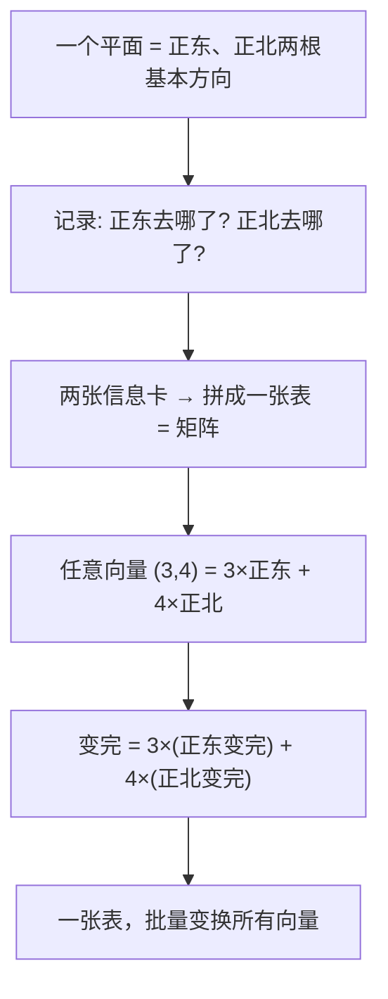
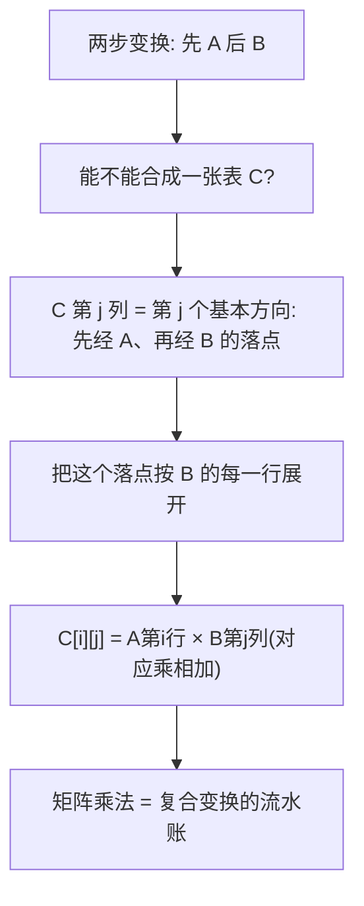

# 第 11 章 · 矩阵——批量变换一批向量

> 本章从哪个问题出发：我上一章学会把世界拆成"一串有顺序的数"（向量），可现实是一大堆向量一起动——一辆车的方向、位置、速度，一张图的几百万像素。当我要"同时"把它们挪动、旋转、拉伸时，怎么一次做完？
> 推导到哪个结论：矩阵就是"批量作用于向量的变换"；矩阵乘法"行×列"是"复合变换"的记账方式；有逆矩阵才能"反着走"——把一个变换倒回去。

> 核心认知：你上一章把一支箭（向量）练熟了。可这个世界不给你一支箭，它给你**一整袋箭**——一辆车有三个方向一起动，一张图几百万像素一起亮暗。你要"同时"把它们挪、转、拉，靠一支一支慢慢调就完蛋了。**矩阵，就是"一次改变一整批向量"的批量变换器**：它像一张"操作说明表"，规定"每个向量进来，会变成什么样"。而矩阵乘法为什么是"行×列"——那不是背公式，是"**先做一次变换、再做一次变换**"的记账方式：两次变换套在一起，怎么合并成一张表。最后，你变完想变回去，就需要**逆矩阵**——它是"反着走"的按钮。这一章，把"批量变换一堆向量"这套家底，一次造全。

## 引子

仓库的日光灯嗡嗡响，我正把一整层货架的箱子往推车上码。货架太高，我踮着脚，把最上头一箱米拎下来，又横着挪了三箱面粉，最后把一整排油瓶并排推过来。

"累死了。"我把袖子往上一撸，"这一层货架，光搬下来就要搬十几趟。"

老谟抱着一箱罐头从隔壁通道转出来，没放下来，就那么站着。"你说搬十几趟。那我问你——**你想不想一次就把这一整层货架，全都给挪到另一个地方？**"

"一次？"我咬住下唇，"这一层几百个箱子，每个又高又矮又方又圆，位置全不一样，怎么可能一次全挪？"

"每个箱子位置不一样，可你想想——**你挪这一层货架的时候，是不是所有的箱子，都跟着同一个动作在动？** 你往右推，全层都往右；你抬高，全层都抬高。几百个箱子，共享的是同一个'挪动方式'。"

我手里码货的动作滞了滞。"……好像是的。我不用管每个箱子自己怎么动，我只要管'整层货架'怎么动，每个箱子自然就跟着那个动作走了。"

"你抓到关键了。"老谟把罐头往台子上一放，"几百个箱子，每个都是一个'位置'——按上一章的话说，就是几百个向量。可它们全都跟着'同一个变换'在动。那你想想——**给这几百个向量找一张'统一的操作说明'，让他们全都照同一套规矩变，是不是就不用一个一个搬了？**"

"……操作说明？"我停下码货的手，"那不就是一张表吗？写着'每个向量进来，会变成什么样'。"

"你这一句话，就把本章的大家伙给请出来了。"老谟顿了顿，"几百个向量，一张操作表，一次全变。这张'批量变换表'，就是这一章的主角。我们先从最简单的说起——**这张表，到底长什么样？**"

## 对话引擎

### 第 1 轮：一张表怎么"同时"改几百个向量——从"一列一列"看起

**老谟**："你说几百个向量共享一个'挪动方式'。那我们先别贪心，就看一个最简单的向量，一支二维的箭 (1,0)——它指的是正东，长度 1。你说，如果我要把'整个平面'往东拉长 2 倍、往北拉长 3 倍，这支 (1,0) 会变成什么？"

**造物主**："往东拉 2 倍，那东西分量 ×2；往北拉 3 倍，南北分量 ×3。(1,0) 的东西是 1、南北是 0，所以变完是 (1×2, 0×3) = (2,0)。"

**老谟**："好。那另一支箭 (0,1)——它指的是正北，长度 1。它又会变成什么？"

**造物主**："(0,1) 的东西是 0、南北是 1，变完是 (0×2, 1×3) = (0,3)。"

**老谟**："你现在有两张信息卡了：'正东这支箭 (1,0) 变成了 (2,0)'，'正北这支箭 (0,1) 变成了 (0,3)'。那我现在给你一支斜的箭，比如 (3,4)——**它既不正东也不正北，你说它会被变成什么？**"

**造物主**："……斜的箭，我得先把它拆开？(3,4) 可以看成 3 支'正东' + 4 支'正北'？那变完就是 3×(2,0) + 4×(0,3) = (6,0)+(0,12) = (6,12)？"

**老谟**："你自己把'任意一支箭会变成什么'，从'正东正北两支箭会变成什么'给推出来了。你发现没有——**我根本不用盯着几百支箭，我只要知道'正东这支'和'正北这支'会变成什么样，剩下的所有箭，都是把这两支箭的结果'拼'出来。**"

**造物主**："……所以那张'操作说明表'，其实只要记两件事？记'正东去哪了'、'正北去哪了'？"

**老谟**："你再往前想一步——平面有两条基本方向（正东、正北），所以操作表记 2 列；**那如果空间是三维的，有正东、正北、正上三条基本方向，操作表该记几列？**"

**造物主**："……3 列？记'正东去哪了'、'正北去哪了'、'正上去哪了'。几维空间，就记几列基本方向去哪了。"

**老谟**："你亲手把这张表'造'出来了。**这张'把每个基本方向变成了什么'的表，就是矩阵。** 我们给它一个正式称呼——它把'一堆向量'按同一套规矩批量变换，而它自己，只用'基本方向去哪了'这几列就能描述。我们先别急着往下，把这张表的结构看仔细。"

---

**📐 知识锚点：矩阵——批量变换的"操作说明表"**

【概念深挖】**矩阵（matrix）**，就是把"每个基本方向会变成什么"记成的一张表。对一个二维空间，正东 (1,0) 变成 (a,c)、正北 (0,1) 变成 (b,d)，这张表就记成：

```
[a  b]
[c  d]
```

第一列是"正东去哪了"（变到 (a,c)），第二列是"正北去哪了"（变到 (b,d)）。**n 维空间 → 一个 n×n 的矩阵**：每一列，是一个基本方向的新位置。

为什么"只要记基本方向"就够了？因为**任意向量都可以拆成基本方向的组合**：一支箭 (3,4) = 3×正东 + 4×正北。于是它被矩阵变完的结果，就等于"3×(正东变完) + 4×(正北变完)"。**所以矩阵作用于任意向量，等于：把向量拆成基本方向，看每个基本方向去哪了，再按原来的分量拼回来。** 这就是"矩阵·向量"的真相。


读图说明：平面由两根基本方向（正东、正北）撑起来，矩阵只记"这两根基本方向各自去哪了"两张卡。任意向量（如 (3,4)）先拆成基本方向的组合，再按"每个基本方向变到哪"重新拼回来——这就是"矩阵把一批向量批量变换"的完整路径：**一列列地记基本方向，一张表就统治了整个平面。**

【历史溯源】矩阵这个词，来自拉丁语 matrix（**母体、子宫**），意为"能孕育出别的东西"。19 世纪英国数学家**凯莱（Arthur Cayley）**把它从"解方程组的一个记号"提升为一门独立学科——他发现"一张数表"可以像"一个数"一样参与运算。**把"一堆变换"塞进一张表里、让这张表能统一地作用在一大批向量上**，是凯莱和同时代的西尔维斯特（Sylvester，他给"矩阵"命了名）打下的地基。而"一张表批量变换"的真正威力，要等计算机出现后才完全爆发——因为机器最擅长跑的就是"同一套规矩作用在成千上万个数上"。

【工程实践】矩阵之所以叫"批量变换器"，是因为工程师几乎从不拿它去变"一个"向量——**它一出手，就是几百万个向量一起变**：把一张照片的几百万个像素（每个像素是个向量）统一旋转、缩放；把一整个点云（几百万个三维点）统一摆正；把一屋子人的数据一起做标准化。**矩阵是"让一大堆东西共享同一套变化"的容器**，你后面学 PCA、学神经网络，全是"一张大表，作用在一大堆数据上"。

---

### 第 2 轮：矩阵到底怎么"乘"——行×列不是背公式，是"记账"

**老谟**："矩阵你知道了，就是'正东去哪了、正北去哪了'这张表。那我现在让你干件事——**我先把平面拉伸一下，再把拉伸后的平面整个旋转 90 度。你告诉我，这一套'先拉后转'，总共把一支箭变到了哪？**"

**造物主**："先拉后转……那我不是得先拿'拉伸矩阵'作用一遍，再拿'旋转矩阵'作用一遍？两支箭，得两步走。"

**老谟**："两步走是两步走。可我想问你——**这一套'先拉后转'，能不能也合并成'一张表'，好让我后面几百支箭，一次就变完？**"

**造物主**："……合并？我先拉伸（拿到新表 A），再旋转（拿到新表 B），那"先 A 后 B"这套组合，能不能自己也变成一张表 C，让任意箭一次就过？"

**老谟**："那你想想，这张合成的表 C，它的每一列该怎么算？——**C 的第一列，是'正东去哪了'。正东先被 A 拉伸到某处，再被 B 旋转，最后落到哪，那一列就是它。**"

**造物主**："……所以 C 的每一列，就是'正东（或正北）先走 A、再走 B 的最终落点'。我得拿 A 去变正东，拿结果再喂给 B。"

**老谟**："你把这个'先 A 后 B'的合并过程，一步一步写出来，你会在纸上看见一个机械的规律——**C 的某个格子，是 A 的某一行和 B 的某一列，对应相乘再加起来。** 你现在亲手算一支，把这规律摸出来。"

**造物主**："我算……设 A = [[1,0],[0,3]]（东不变、北拉3倍），B 是旋转90度。C 第一列 = 正东经 A 得 (1,0)，再经 B 得……反正我得把'正东的最终落点'算出来，而这个落点的东西分量，是拿 A 的第一行去和正东的分量乘加，再套进 B……"

**老谟**："你已经在'行×列'的门口打转了。别怕，我们把这个'行×列'的记账规则，单独给你讲透——它一点都不神秘，它就是'两步变换怎么合并'的流水账。"

---

**📐 知识锚点：矩阵乘法为什么是"行×列"——复合变换的记账**

【概念深挖】为什么两个矩阵相乘，是"**左边矩阵的每一行，去和右边矩阵的每一列，对应相乘再相加**"？这不是背的公式，是"两步变换合并成一步"的**自然流水账**。

设你要"先 A 变换、再 B 变换"。合成表 C 的**第 j 列**，是"第 j 个基本方向，先经 A、再经 B 的最终落点"。而要算这个落点，你需要：
1. 先看这个基本方向经 A 变到了哪（A 的第 j 列）；
2. 再把这个结果经 B 变到哪（用 B 去作用这个结果）。

把"经 B 作用"展开成"B 的每一行 × 这个结果的每个分量、再相加"，你就得到了"**A 的一列 × B 的一行**"式的相乘。所以矩阵乘法定义为：**C[i][j] = A 的第 i 行 × B 的第 j 列（对应乘、再相加）**。它精确记录了"先 A 后 B"这一整套复合变换。

这里有个**必须记住的约定**：乘法**顺序敏感**。矩阵 AB 和 BA 一般不一样——因为"先拉后转"和"先转后拉"，结果通常完全不同（先拉再转的椭圆，和先转再拉的椭圆，朝向不一样）。**你上一章知道"向量顺序是约定"，这一章要知道"矩阵乘法的顺序更是约定"——换顺序，整个变换就变了。**


读图说明：要把"先 A 后 B"合并成一张表，就看每个基本方向两步的最终落点。落点的每个分量，等于"B 某行 × A 某列、对应乘再相加"——这就是矩阵乘法"行×列"的来历。它不是背出来的乘法表，而是**把"两步变换"一笔一笔记下来的流水账**。

【历史溯源】矩阵乘法的"行×列"，不是数学家凭空约定的。它来自**线性变换的复合**——当凯莱研究"一个变换套在另一个变换上"时，他发现合并后的表，其每个格子恰好是"前一表某行 × 后一表某列"。**"复合变换 → 行×列乘法"是推导出来的必然，不是拍脑袋的规定。** 而"乘法顺序敏感"这件事，让当时的数学家颇不适应——因为普通数的乘法 3×4=4×3 是可交换的，矩阵却不行。**"一种不满足交换律的乘法"第一次出现，逼着数学家重新思考'乘法'到底是什么**，这是矩阵理论在 19 世纪掀起波澜的原因之一。

【工程实践】为什么工程师这么在乎"矩阵乘法是复合变换的记账"？因为**把一连串变换合并成一张表，能省下海量计算**。比如渲染一帧 3D 画面：一个物体要"先缩放、再旋转、再平移、再透视"，如果一步步做，要作用四遍；但把四步**预先合并成一张矩阵**，每一个点只需乘一次。**游戏、CAD、机器人控制里，"把多次变换合并成一次矩阵乘法"是性能命脉**——你手机上每一帧 3D 游戏，都在吃这一章的"复合变换记账"红利。

---

### 第 3 轮：变完了，怎么变回去——"反着走"与逆矩阵

**老谟**："你现在能拿矩阵把一整批向量变换过去了。可我反着问你——**我变完了一批向量，现在想把它'变回原样'，我该怎么办？**"

**造物主**："……变回去？那得再找一张表，作用上去能把刚才的变换抵消掉？"

**老谟**："怎么抵消？比如我拿矩阵 A = [[1,0],[0,3]]（北向拉 3 倍），把一支箭的北分量乘了 3。你要怎么把它拉回去？"

**造物主**："……再乘一个'北分量除以 3'的矩阵？就是把 (0,1) 变到 (0, 1/3) 那种，正好把拉 3 倍抵消掉。"

**老谟**："那你把这两张表'乘'起来——先拉 3 倍、再缩回 1/3，合起来是什么效果？"

**造物主**："先乘 3 再乘 1/3……北分量 3×(1/3)=1，什么都没变！合起来那张表，是把每个向量都送回原样。"

**老谟**："一张表作用完，让所有向量都'回到原样'——这张'什么都不变的表'，你认识吗？"

**造物主**："……那不就是'正东还是正东、正北还是正北'的表吗？[[1,0],[0,1]]，每个向量进去，原封不动出来。"

**老谟**："这就是**单位矩阵**——矩阵世界里的'1'，作用上去等于没变。那你刚才说的那张'能把拉 3 倍抵消'的表，它跟 A 乘起来，正好得到这个'单位矩阵'。**能给 A 找一张这样的'抵消表'，A 就能'反着走'；这张抵消表，就叫 A 的逆矩阵。** 那我现在问你——是不是每张矩阵，都能找到这种'抵消表'？"

**造物主**："……应该都能吧？我拉 3 倍就能缩回 1/3，我转 90 度就能转回来……"

**老谟**："那我给你一张表：它把'正东'和'正北'**都压到同一条线上**——比如都压到正东上。你自己想想，这张表能'反着走'吗？"

**造物主**："……压到一条线上？那原本两支不同方向的箭，变完都贴到正东上，我分不清谁是谁了。这……没法变回去！信息被我压没了！"

**老谟**："你把'能不能反着走'的答案找出来了。**一张矩阵能不能找到逆，取决于它有没有'把不同方向压成同一个'——要是把两件本来不同的东西压成一样了，信息就丢了，就再也反不回去。** 这个'能不能反着走'的性质，是矩阵最要紧的分水岭，我们下一轮专讲它。"

---

**📐 知识锚点：逆矩阵——"反着走"的按钮，以及"压扁了就回不去"**

【概念深挖】**单位矩阵（identity matrix）** 是"什么都不变"的表：二维是 [[1,0],[0,1]]，对角线上都是 1、其余是 0。任何向量乘它都原样返回，它是矩阵世界的"1"。

**逆矩阵（inverse matrix）** 的定义：如果存在一张矩阵 B，使得 A·B = B·A = 单位矩阵，那 B 就叫 A 的逆矩阵，记作 **A⁻¹**（读"A 的逆"）。几何含义：**A⁻¹ 是把 A 干的事"反着走回去"的按钮**——先 A 后 A⁻¹，等于什么都没做。

但**不是每张矩阵都有逆**。关键判据，你刚才自己推出来了：

- **如果 A 把不同方向压成了同一个方向**（比如把正东、正北都压到正东），那它"把多维信息压缩成了一维"，信息丢了，**没有逆矩阵**——因为你无法从"变完都一样"的结果里，还原出"原本是谁"。
- **如果 A 只是拉长、缩短、旋转、平移（不压扁）**，每个向量都还留着完整的身份，那就**有逆矩阵**，能原样反着走回去。

这个"有没有逆"的分水岭，在数学里有个正式名字叫**行列式（determinant）**：行列式不为 0 ⇔ 矩阵不压扁 ⇔ 有逆矩阵；行列式为 0 ⇔ 把空间压扁/压缩了 ⇔ 没有逆矩阵。**你这一章先记住"压扁了就反不回去"这个直觉，"行列式"的正式计算是它背后的一把量尺。**

【历史溯源】"逆矩阵"的概念，脱胎于解方程组。19 世纪解"一个方程组"时，数学家发现：**如果能找到系数矩阵的逆，方程组的解就能一步写出来**——就像"5x=20，x=20/5"一样干脆。而"有的矩阵没有逆"这个发现，对应着"有的方程组无解或解不唯一"——当你给的约束互相打架、或给的约束不够时，你就没法"干净地"求出唯一答案。**"能不能反着走"从解方程一路延伸到现代算法，成了判断"一个变换是否可逆"的通用判据。**

【工程实践】逆矩阵在工程里是"解方程"的开关：**Ax = b（A 是一个矩阵变换、b 是结果、x 是未知），要求 x，只要等式两边都左乘 A⁻¹，就得到 x = A⁻¹b。** 无数现实问题——电路的电流、力学的受力、统计里最小二乘的系数——最后都归结成"解这样一个 Ax=b"，而解法的钥匙就是 A⁻¹。**代价：** 求逆矩阵计算量不小（n×n 矩阵求逆，是立方级复杂度），而且当 A 接近"压扁"（行列式很小）时，数值上极不稳定——工程师常常**避免真的求逆**，而是用更稳的办法（解线性系统）替代。**"能不能反着走"是一把双刃剑：能反着走很爽，但代价是计算和稳定性。**

---

### 第 4 轮：亲手造——让机器一次变换一整批向量

**老谟**："你讲了这么多，可'能造出来'才是这书的标准。你想想——**给你一张 2×2 的矩阵，和一整批向量，你要怎么用机器一次把它们全变了？**"

**造物主**："……一张表乘一堆向量？那不就是拿矩阵，一个一个去乘每一个向量，再收集结果？可那还是一个一个乘啊，跟一个一个搬箱子没区别。"

**老谟**："你觉得没区别，是因为你还没找到'批量'的真谛。你想想——如果这一批向量，本身就是排成**一张表**（每个向量一行），那你拿'矩阵'去乘'这张表'，是不是一次就全乘完了？"

**造物主**："……拿矩阵去乘一整张表？那中间那个'行×列'的乘法，不就是'矩阵的一行 × 表的每一行'……好像不用一个一个来，可以整张表一起算！"

**老谟**："你摸到'numpy 批量变换'的门了。我们动手，把'一次变一整批'造出来。"

---

**📐 知识锚点：【实现思考】用 numpy 一次变换一整批向量**

【实现思考】"看懂矩阵"到"能造批量变换"，中间就差 numpy 的 `@`（矩阵乘法）和数组形状。我们把"一整批向量"排成一张表（每行一个向量），用矩阵去乘这张表，一次全变：

```python
import numpy as np

# 一张矩阵：北向拉 3 倍
A = np.array([[1, 0],
              [0, 3]])

# 一整批向量，每行是一个二维向量（3 个箱子，3 个位置）
batch = np.array([
    [1, 2],   # 箱子1
    [2, 0],   # 箱子2
    [0, 4],   # 箱子3
])

# 用矩阵 A 批量变换一整批向量（3×2 乘 2×2）
new_batch = batch @ A.T        # 注意：向量是行，矩阵要转置
print("变换后的一整批向量:")
print(new_batch)
# 期望：北分量 ×3 → [1,6], [2,0], [0,12]

# 找逆矩阵，反着变回去
A_inv = np.linalg.inv(A)
back = new_batch @ A_inv.T
print("\n反着变回去（应还原）:")
print(back)

# 试试"压扁了"的表，还能反着走吗？
flat = np.array([[1, 1],
                 [1, 1]])      # 把两个方向都压到同一条线上
try:
    np.linalg.inv(flat)
except Exception as e:
    print("\n压扁的表求逆失败:", type(e).__name__)   # 信息丢了，没有逆
```

**为什么这么造**：我们把"一批向量"排成一张表（每行一个），用矩阵去乘整张表，numpy 自动把"行×列"批量做掉——不用手写循环，一次处理一整批。**代价**：你要小心**转置**——numpy 里"矩阵 @ 列向量"和"行向量 @ 矩阵"方向不同，代码里 `A.T` 就是"换行列为列"的约定（又是约定）。**换条路会怎样**：你若坚持手写 `for` 循环一个向量一个向量乘，能行但慢且啰嗦；numpy 的 `@` 让"一次变一整批"变成一行代码，这正是矩阵作为"批量变换器"的工程价值。最后那个 `flat` 矩阵求逆报错，就是"**压扁了 → 信息丢了 → 反不回去**"在你手上的铁证。

【工程实践】"矩阵 @ 整批向量 = 批量变换"这一招，是几乎一切现代算法的发动机：
- **神经网络的一层**：输入是一整批样本（每行一个样本的特征向量），权重是一张矩阵，`输入 @ 权重` 一次把整批样本都"变换"到了下一层——这就是"深度学习"每天在跑的矩阵批量乘法。
- **3D 图形**：一整个模型的几万个顶点，一次 `顶点表 @ 变换矩阵` 就全部旋转平移。
- **数据标准化/PCA**：把一堆样本整体"变换"到新的坐标系。

**"一次变一整批"不是矩阵的附加功能，而是它存在的理由**——你上一章还在为一支箭发愁，这一章已经能让一整袋箭一次起飞。

---

### 第 5 轮：矩阵折腾来折腾去——有没有"不动的方向"？

**老谟**："你现在能拿矩阵批量变换了。那我问你一个有点怪的问题——**我用一张矩阵，反复去折腾一批向量（拉、转、压），这里面，有没有哪个向量，方向是'不动'的？**"

**造物主**："方向不动？……矩阵一般都会改变方向啊，我拉 3 倍，北向箭虽然变长了，但方向还是北啊。"

**老谟**："那支北向箭 (0,1)，被 '北向拉3倍' 的矩阵作用完，变成 (0,3)——**它长度变了，可它的方向（还是朝北）没变。** 这不就是一支'方向不动'的箭吗？"

**造物主**："……还真是。它在矩阵折腾下，只被拉长/缩短了，方向压根没偏。可普通箭 (3,4) 被折腾完，方向就变了。"

**老谟**："那你现在发现了什么？——**一张矩阵折腾来折腾去，总有几个方向是'钉子户'：它们不被扭弯，只被拉长/缩短一个固定倍数。** 这几个方向，是这张矩阵的'骨架'。下一章，我们专门来挖这张骨架。你先记住：**矩阵不光会批量变换，它肚子里，还藏着一组'不肯弯'的方向。**"

**造物主**："不弯的方向……那它肯定不是我随便就能看见的，得专门找。下一章，我就去把这'骨架'扒出来。"

---

**📐 知识锚点：【概念深挖】"不动的方向"——为下一章铺路**

【概念深挖】一张矩阵在反复作用时，绝大多数向量都会**方向改变**（被扭弯）。但有极少数方向，矩阵作用上去后**只改变长度、不改变方向**——这种箭叫"矩阵的骨架"。它为什么重要？

因为**骨架是矩阵最省事的"把手"**：只要找到这些"不弯的方向"和各自"被拉长的倍数"，这张矩阵的大部分行为就能被看懂、被拆开。你后面要做的降维、压缩、推荐系统，全都要"抓住矩阵的骨架"。这一轮你只需要记住两件事：

1. 矩阵作用在绝大多数向量上，会改变方向；
2. 但总有少数"钉子户方向"，只被拉长/缩短、不被扭弯——它们就是矩阵的骨架（下一章的主角）。

**这就是"批量变换"这一章埋给下一章的伏笔**：矩阵不只会"批量改变一堆向量"，它自己还藏着一组"不变的方向"。找到它们，你就找到了"矩阵折腾来折腾去时，哪个方向是它的主心骨"。

【工程实践】预告一下"抓骨架"在现实里怎么用：一张照片有几十万像素（几十万维），可真正的信息往往集中在一小撮"主方向"上。**矩阵的骨架，就是数据最本质的少数几个方向**——人脸识别只需抓几百个主方向，就能区分几十万人；推荐系统只需抓几个"品味主轴"，就能预测你喜欢什么。**"抓住骨架、扔掉冗余方向" = 降维 = 压缩 = 推荐系统**，这一整套，都从"矩阵有没有不动的方向"这一问开始。

---

### 第 6 轮：落点——矩阵是"批量变换"，乘法是"复合记账"，有逆才能"反着走"

**老谟**："回到你这仓库。你最初想'一次挪一整层货架'。现在你告诉我，答案是什么？"

**造物主**："不用一个箱子一个箱子搬。我把每个箱子的位置当一个向量，几百个向量拼成一张表；再找一张矩阵——它规定'正东去哪了、正北去哪了'——拿矩阵乘这张表，一整层货架就'一次'全挪完了。"

**老谟**："那要是我先挪再转，怎么办？"

**造物主**："先把两个变换合并成一张表——矩阵乘法行×列，就是'先 A 后 B'的记账。合并完，几百个箱子还是只乘一次。"

**老谟**："挪完你后悔了，想原样搬回去呢？"

**造物主**："找它的逆矩阵，拿逆矩阵再乘回去。**只要矩阵没把不同方向压成同一个（信息没丢），就能反着走；要是压扁了，就再也回不去了。**"

**老谟**："你把这章三件大事说全了：**矩阵是批量变换，乘法是复合记账，有逆才能反着走。** 那你还记得，这一切是从哪问起的吗？"

**造物主**："起点是'一堆向量一起动'——我上一章只会照顾一支箭，这一章学会让一整袋箭一次起飞。而它真正的骨架，是那几个'方向不动、只被拉长缩短'的钉子户方向。"

**老谟**："你把下一章的引信也点着了。**矩阵折腾来折腾去，总有几个方向不肯弯——那支被'北向拉3倍'只变长不变向的箭，就是第一根线索。** 下一章，我们就去把矩阵这身'骨架'，一块一块扒出来。"

**造物主**："不动的方向……那不就是矩阵真正的主心骨吗？我得去找它。"

---

## 知识点总结

### 知识点（本章推出的核心概念）
- **矩阵（matrix）**：一张"批量变换"的操作表，记录"每个基本方向变成了什么"。n 维空间 → 一个 n×n 矩阵，每列是一个基本方向的新位置。**任意向量 = 拆成基本方向 → 看每个方向去哪 → 拼回来**，所以一张表能统治整个平面/空间，批量变换一堆向量。
- **矩阵乘法（行×列）**：C[i][j] = A 第 i 行 × B 第 j 列（对应乘、再相加）。它不是背的公式，而是"**先 A 后 B 的复合变换**"的流水账。**乘法顺序敏感**（AB ≠ BA 通常），因为"先拉后转"和"先转后拉"结果不同。
- **单位矩阵**：[[1,0],[0,1]]，作用上去等于没变，是矩阵世界的"1"。
- **逆矩阵（inverse）**：A⁻¹ 满足 A·A⁻¹ = 单位矩阵，是"反着走回去"的按钮。**不是每张矩阵都有逆**：若矩阵把不同方向压成同一个（压扁了/信息丢了），就反不回去、没有逆；**"有没有逆"的分水岭是行列式**（行列式 ≠ 0 ⇔ 有逆）。
- **不动的方向（骨架伏笔）**：矩阵作用时，绝大多数向量方向改变，但总有少数方向"只被拉长/缩短、不被扭弯"——它们是矩阵的骨架（下一章主角）。

### 历史结论（本章涉及的史料）
- 矩阵一词来自拉丁语 matrix（母体），19 世纪英国数学家凯莱把它提升为独立学科；西尔维斯特给"矩阵"命名。
- 矩阵乘法"行×列"来自线性变换的复合——凯莱发现复合变换合并后的每个格子恰好是"前表某行 × 后表某列"，是推导而非规定。
- "不满足交换律的乘法"首次出现，逼数学家重新思考"乘法"的本质；逆矩阵脱胎于解方程组。

### 工程实践结论（本章知识在真实工程里怎么用）
- **矩阵批量变换**：神经网络的一层 `输入 @ 权重` 一次处理整批样本；3D 图形把几万顶点 `顶点表 @ 变换矩阵` 一次旋转平移。
- **复合变换合并**：渲染把"缩放→旋转→平移→透视"预合并成一张矩阵，每个点只乘一次，是性能命脉。
- **解方程 Ax=b**：求 x = A⁻¹b；但求逆计算量大、接近压扁时数值不稳定，工程师常用更稳的解线性系统替代。
- **抓骨架（预告）**：降维、压缩、推荐系统都是"抓住矩阵的骨架、扔掉冗余方向"。

## 向导便签

> 这一章咱们干了什么：从仓库里累死累活搬一整层货架，一路逼到"批量变换器"。你亲手发现"只要记'正东去哪了、正北去哪了'，一张表就能统治整个平面"，拼出了矩阵；摸出"行×列"是"先 A 后 B 复合变换"的流水账；找到逆矩阵是"反着走"的按钮，还发现"压扁了的信息就反不回去"；最后用 numpy 让一整批向量一次变换。
>
> 钉死一句话：**矩阵 = 一次改变一整批向量的批量变换器。** 矩阵乘法"行×列"是复合变换的记账（顺序敏感，AB≠BA）；有逆矩阵才能"反着走"，而压扁了（信息丢了）就没有逆。
>
> 记住：矩阵不只会批量变换，它肚子里还藏着一组"不肯弯的方向"。那支被"北向拉 3 倍"只变长、不变向的箭，就是下一章的引信——**下一章，我们去扒矩阵的骨架。**

## 造物主手记

**我曾踩的坑**：

我以为"批量变换"就是把矩阵一个一个乘到每个向量上，跟一个箱子一个箱子搬没区别——老谟一句话点醒我：把整批向量排成一张表、拿矩阵乘整张表，才叫真批量。我还会把矩阵乘法当成"像普通数一样乘"，直到发现"先拉后转"和"先转后拉"结果不一样，才明白顺序敏感是矩阵的天性。最大的坑是逆矩阵——我一开始以为"任何矩阵都能反着走"，被老谟一个"把正东正北都压到正东"的反例打醒：压扁了、信息丢了，就再也回不去了。写 numpy 时我还栽在转置上——向量是行还是列，numpy 的约定不同，结果就全错。

**顿悟时刻**：

真正开窍是"只要记基本方向去哪了"那一下。我发现不用盯着几百个箱子，只要知道"正东去哪、正北去哪"两张卡，剩下的所有向量都能"拼"出来——一张表统治整个平面，这个"批量"的力量让我很震动。更震撼的是逆矩阵：那支被拉 3 倍却不弯向的箭，让我隐约看见"矩阵的骨架"——原来折腾来折腾去的矩阵，肚子里还藏着不肯弯的方向。我突然很想看看，下一章这身骨架长什么样。

## 自测题

1. **辨析**：有人说"矩阵就是把一堆数排成方阵，跟把数字填进表格没区别"。错在哪？
   *简答要点*：矩阵不是静态的数表，而是"批量变换向量"的操作表——记录每个基本方向变成什么，能作用在一整批向量上；它的意义在于"能变换"，而非"排成方阵"。

2. **换算**：一张矩阵把正东 (1,0) 变到 (2,0)、正北 (0,1) 变到 (0,3)。这支矩阵是什么？向量 (3,4) 被它变换后到哪？
   *简答要点*：矩阵 = [[1,0],[0,3]]（第一列是正东落点 (2,0) 展开，第二列正北落点 (0,3)）；(3,4) = 3×正东+4×正北 → 3×(2,0)+4×(0,3)=(6,12)。

3. **找茬**：有人说"矩阵乘法 AB 和 BA 一定相等，因为乘法和加法一样，谁先谁后无所谓"。对吗？
   *简答要点*：错。矩阵乘法顺序敏感，AB≠BA 通常成立；"先拉后转"和"先转后拉"结果不同，因为复合变换的顺序不能交换。

4. **推算**：矩阵 A = [[1,0],[0,3]]（北向拉3倍），它的逆矩阵是什么？为什么这张矩阵有逆？
   *简答要点*：A⁻¹ = [[1,0],[0,1/3]]（北向缩回1/3），因为 A 不压扁、不丢信息，先乘3再乘1/3回到单位矩阵；只有当矩阵把不同方向压成同一方向（压扁、信息丢失）才没有逆。

5. **判断**：为什么"把正东、正北都压到正东"的矩阵没有逆？这跟"信息"有什么关系？
   *简答要点*：它把两个不同方向变成同一条线，原本不同身份的向量变完后无法区分，信息被压缩丢失，无法还原——所以没有逆。行列式为 0 对应这种"压扁"。

6. **实现题**：用 numpy 把一整批向量排成表、用矩阵一次变换，再求逆反着变回去；并验证一个"压扁"的矩阵求逆会报错。
   *简答要点*：`new_batch = batch @ A.T` 一次变整批；`A_inv = np.linalg.inv(A)` 求逆、`back = new_batch @ A_inv.T` 还原；对 [[1,1],[1,1]] 这种压扁矩阵，`np.linalg.inv` 会抛异常，证明信息丢失无法反着走。

7. **开放推导**：游戏里一个 3D 物体要"先缩放、再旋转、再平移"。如何用这一章的矩阵乘法，让每个顶点只乘一次就完成全部变换？这样做省了什么？
   *简答要点*：把缩放、旋转、平移三个矩阵按顺序用矩阵乘法**预合并成一张矩阵**（复合变换的记账），再拿合并后的一张矩阵去乘所有顶点，每个顶点只乘一次。省下的是一次次单独变换的海量计算，是渲染性能命脉。

## 预告

你学会了"批量变换一整批向量"——矩阵，以及它的"复合记账"和"反着走"的逆矩阵。可这一章你一直在折腾矩阵，却没问过一个藏在暗处的问题：

**一张矩阵折腾来折腾去，有没有哪个方向，是"不动"的？**

还记得那支被"北向拉 3 倍"的箭吗？它被矩阵作用完，长度变了，可方向**还是朝北**——它没被扭弯，只被拉长/缩短。这样的"钉子户方向"，就是这张矩阵的骨架。

绝大多数向量被矩阵一折腾，方向就歪了；可总有极少数方向，怎么折腾都不弯。**这几个不肯弯的方向 + 各自被拉长的倍数，几乎决定了这张矩阵的一切**——抓住它们，你就能看懂矩阵、拆开矩阵、甚至把它"压缩"成几个最要紧的方向。

下一章，我们去扒矩阵的骨架——那一组"怎么折腾都不肯弯"的方向。而你会惊讶地发现，人脸识别、照片压缩、还有你手机上那个"猜你喜欢"，全都靠抓这几个方向起家。
