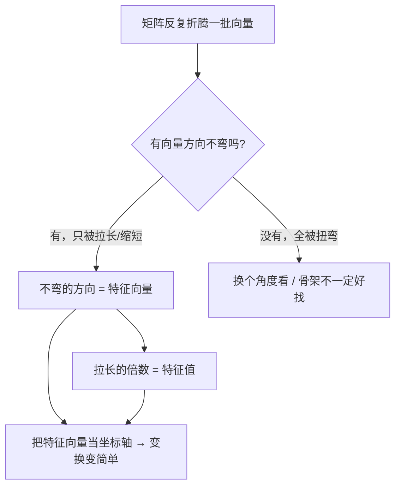
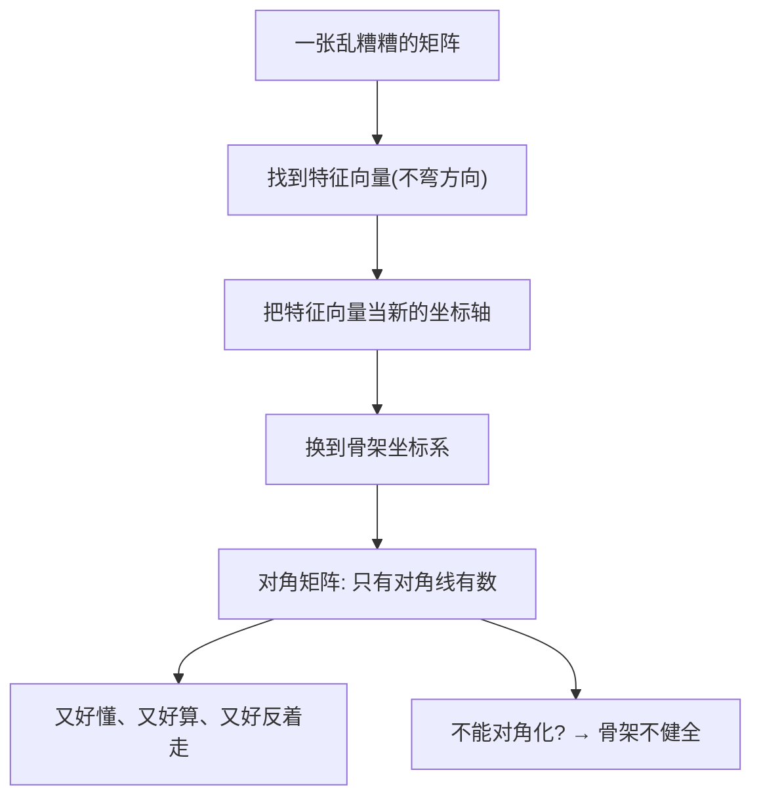

# 第 12 章 · 主轴——矩阵的"骨架"

> 本章从哪个问题出发：我上一章学会拿矩阵批量变换一整批向量，却从没问过：一张矩阵折腾来折腾去，有没有哪个方向是"不动"的？那支被"北向拉3倍"只变长、不变向的箭，就是线索。
> 推导到哪个结论：矩阵的"骨架"是它不变的方向（特征向量）+ 各方向被拉长的倍数（特征值）；把这组方向当成新的坐标轴，矩阵就"对角化"成一张简单到极致的表；而降维、压缩、推荐系统，全是"抓主轴"。

> 核心认知：你上一章让一整袋箭一次起飞，可你从没问过：**这袋箭里，有没有几支是"怎么折腾都不肯弯"的？** 绝大多数向量被矩阵一折腾，方向就歪了；可总有极少数方向，只被拉长/缩短、不偏一丝一毫。这几支"钉子户箭"就是矩阵的**骨架**——它们叫特征向量，各自被拉长的倍数叫特征值。你一旦把这组方向当成**新的坐标轴**，那张乱糟糟的矩阵就会变成一张**只有对角线上有几个数、其余全是 0 的极简表**——这就是对角化。而把"矩阵的骨架"用到数据上，就是**降维、压缩、推荐系统**：真正要紧的永远不是几万个方向，而是那少数几个"主心骨方向"。

## 引子

画室的窗边摆了一排颜料管，我正拿小铲子把颜料往调色盘上挤——土黄、赭石、一点朱红，又挤了点钴蓝，用笔搅在一起，打算调一片暖色调的暗部。

"这颜色，凑合。"我举着调色盘，对着光看了看，"就是感觉不够'干净'，有点灰。"

老谟正蹲在墙角看一幅画了一半的静物，头也没回。"你觉得灰，是因为你只会在'挤了三管颜料'这个层面上想。那我问你——**这片暗部，到底是哪几个'方向'在主导它的颜色？**"

"方向？"我拧眉，"颜色就是颜色，什么叫方向……你是说，这片颜色其实不是'三管颜料混一块儿'，而是可以拆成几个'基本色方向'，比如——偏暖偏亮、偏冷偏暗，这种大的走向？"

"你自己把'颜色'往'方向'上想了。"老谟终于转过头，"那我要问你——**是不是每个颜色，都有这么几个'主导方向'？你调来调去，有没有哪种调法，是'只往一个主导方向上走，别的方向一个不动'的？**"

我眼皮一跳。"……只往一个方向走，别的方向不动？那就像我只加暖、不加冷也不加亮，暗部就纯纯地暖一点，其他全不跟着变。这种'调色',好像特别'纯'，特别干净。"

"你这句话，已经摸到本章的门了。"老谟站起来，"你上一章让一整批向量一次起飞，可从没问过：**这批向量里，有没有几支是'怎么折腾都不肯弯'的？** 颜色有它偏好的'主导方向'，矩阵也有。这一章，我们就去找矩阵的'骨架'——那几支不管你怎么折腾，都只被拉长、从不被扭弯的箭。"

## 对话引擎

### 第 1 轮：找"不动的方向"——从一支只被拉长、不被扭弯的箭开始

**老谟**："上一章结尾，你记住了那支'北向拉3倍'的箭——矩阵 A = [[1,0],[0,3]] 作用上去，它 (0,1) 变成 (0,3)，方向没变、只是被拉长 3 倍。那我现在问你——**这张矩阵里，是不是只有这一支'不弯'的箭？还有没有别的方向，也是只被拉长、不被扭弯？**"

**造物主**："……另一支？那支正东的箭 (1,0) 被 A 作用完是 (1,0)，方向没变、长度也没变（被拉长 1 倍）。所以正东这支也是'不弯'的，只是它的'拉长倍数'是 1。"

**老谟**："那你现在有两条'钉子户'了：正东，被拉长 1 倍；正北，被拉长 3 倍。那斜着的箭呢？比如 (1,1)——它被 A 作用完，方向还朝原来的斜向吗？"

**造物主**："(1,1) 被 A 作用：东西不变、北向×3，变完是 (1,3)。原来的 (1,1) 是 45° 斜向右上，变完的 (1,3) 明显更偏北、更陡了——**方向歪了！**"

**老谟**："所以你看清了吗？这张矩阵，**绝大多数斜着的箭都被扭弯了，只有正东、正北这两支，是从头到尾不肯弯的。** 这两支不弯的方向，就是这张矩阵的'骨架'。你先别急着高兴——这两支不弯的箭，跟矩阵的'批量变换'，到底有什么关系？"

**造物主**："……关系？我要是不用这两支'骨架箭'当坐标，而用随便什么斜着的方向当坐标，那我描述这个变换，就得又扭又拉，乱得很。可要是**用正东、正北当坐标轴**……这个变换就特别简单：东分量乘 1、北分量乘 3，各管各的，一点都不乱。"

**老谟**："你把这一章最值钱的一句话，给说出来了——**找到不弯的方向，把它们当坐标轴，变换就变简单了。** 我们接下来，就专门挖这个'简单'到底有多简单。"

---

**📐 知识锚点：不动的方向——"钉子户箭"与"拉长倍数"**

【概念深挖】上一章结尾你已经发现：矩阵折腾来折腾去，绝大多数向量会**方向改变**。这一章我们要找的，是那批例外——**方向不被扭弯、只被拉长/缩短一个固定倍数**的向量。老谟用 A=[[1,0],[0,3]] 带我们发现：正东 (1,0) 不弯（拉长 1 倍）、正北 (0,1) 不弯（拉长 3 倍），而斜的 (1,1) 会被扭弯。

我们把这两个要素给一个正式名字（等造物主自己推到门口，再落锤）：

- **不弯的方向**（那支只被拉长、不被扭弯的箭）——数学上叫**特征向量（eigenvector）**。希腊语 eigen 意为"**本征的、固有的**"，强调这是矩阵"天生自带"的方向，不是外部强加。
- **对应的拉长倍数**——叫**特征值（eigenvalue）**。它告诉你：沿这个方向，矩阵把它拉长了多少倍。

一个"不弯的方向"箭头，数学上满足：**矩阵作用在这支箭上 = 特征值 × 这支箭本身**（方向没变，只是被乘上了一个倍数）。**"特征向量 + 特征值"合起来，就是矩阵的骨架。**


读图说明：矩阵折腾向量时，先问"有没有不弯的方向"。有，就把"不弯的方向"命名为特征向量、把"拉长倍数"命名为特征值；把这两样当成新的坐标轴，这张矩阵就变得简单好懂。**"不弯的方向 + 拉长倍数"就是矩阵的骨架**——右边那条"换个角度"提醒你：不是每张矩阵都有漂亮骨架（有的矩阵只旋转、找不到只被拉长的方向），但绝大多数"折腾"里，骨架是存在的。

【历史溯源】"特征向量/特征值"这个概念，萌芽于 18-19 世纪的天体力学和振动问题。**欧拉（Euler，18 世纪）**在研究刚体转动、**拉格朗日和柯西**在研究振动时，都遇到同一件事：某些"固有方向"在变换下特别省事。**"eigen"这个词是希尔伯特（Hilbert）在 1904 年左右确立的**，德语原意"本征的、固有的"——因为这些方向是矩阵"天生带着的"，不是人为加进去的。**发现矩阵肚子里有"不肯弯的方向"，是把"一个变换"从"乱糟糟的批处理"看懂成"几个独立主方向"的关键一跃。**

【工程实践】"找骨架"在工程里意味着"从一团乱麻里抓最重要的几个方向"。一张照片几十万像素，可真正有用的信息往往集中在少数几个"主方向"上；一个人的几十个健康指标，本质也常由少数几个"综合因素"主导。**把一堆高维数据，找它最要紧的少数几个"不弯方向"，就是降维的核心**——这一章的骨架，正是后面 PCA 的直系祖先。

---

### 第 2 轮：把骨架当坐标轴——"换坐标系"与对角化

**老谟**："你说用正东、正北当坐标轴，变换就简单。那我问你——**凭什么正东、正北能当坐标轴？我要是不想用它们，改用别的方向当坐标轴，行不行？**"

**造物主**："……应该行吧？上一章我就知道，坐标轴是人选的、是约定。我用正东正北能用，用别的斜向当轴，只要约定好了，也能描述同一个平面。"

**老谟**："那你想想——**我为什么偏偏要挑'不弯的方向'来当坐标轴？** 用斜向当轴，这个变换会是什么样？"

**造物主**："用斜向当轴……那变换就又要扭又要拉，表里到处都是非零的数，乱得没法看。可要是我把坐标轴，**换成那两根不弯的骨架方向**，东分量乘1、北分量乘3，各管各的——这张表就……只剩下对角线上两个数，其他全是 0？"

**老谟**："你发现了！**把坐标轴换成特征向量（不弯的方向），那张矩阵就变成一张'只有对角线有数、其余全是 0'的极简表。** 每个坐标方向，只管自己被拉长的倍数，互不干扰。这张极简表，就是矩阵'对角化'后的样子。那你说——这样一张极简表，好干什么？"

**造物主**："……好算！它乘一个向量，就是东分量乘1、北分量乘3，一眼就看懂。而且我想'反着走'，也特别容易——每个方向除以它的倍数就行，不用像上一章那样折腾一整张乱表。"

**老谟**："你摸到对角化的价值了。**不是每张矩阵都能找到漂亮骨架，但只要找到了，把它当坐标轴一换，那张乱表就变成极简的对角表——又好懂、又好算、又好反着走。** 这就是'换坐标系'的力量。"

---

**📐 知识锚点：对角化——换到"骨架坐标系"里的极简表**

【概念深挖】**对角化（diagonalization）**，就是把矩阵"换到由它的特征向量组成的坐标系"里，让那张乱糟糟的表，变成**一张只在主对角线上有数、其余全为 0 的极简表**（叫对角矩阵）。对角矩阵之所以金贵，是因为它"各管各的"：

- 它作用在向量上，**每个坐标方向只乘自己那个特征值**，互不干扰。
- 它求"反着走"（逆矩阵）特别容易：**每个对角元取倒数**即可。
- 它求"变很多次"（矩阵幂）特别容易：**每个对角元取 n 次方**即可。

而普通矩阵做不到这些——这就是为什么工程师都盼着把矩阵"对角化"：**一换坐标系，复杂的变换就变成几个独立主方向的简单叠加。**

要注意对角化的**条件**：并不是所有矩阵都能对角化。只有当你找得到"足够多、互相独立"的不弯方向，能把整个空间撑起来时，才能换到骨架坐标系。**有骨架但不完整、或只有旋转（找不到只被拉长的方向）的矩阵，对角化就做不成**——所以"能不能对角化"本身，是判断一张矩阵"骨架健不健全"的试金石。


读图说明：找到特征向量，把它当新坐标轴，矩阵就"换坐标系"成对角矩阵——只剩对角线上的几个特征值，各管各的。这张极简表又好懂又好算又好反着走；若对角化失败，说明这张矩阵骨架不健全（特征向量不够撑起空间）。

【历史溯源】"把复杂对象换到简单坐标系里"是数学最经典的一招。**对角化的思想，最早来自线性方程组和二次型的研究**——19 世纪数学家发现，很多看似复杂的二次式，换一组合适的坐标轴，就能变成"平方和"这种极简形式（这就是对角化的雏形）。**"换坐标系让问题变简单"的信念，贯穿了线性代数、傅里叶分析、一直到今天的机器学习**——你后面学的 PCA，本质就是"把数据换到它的骨架坐标系里，扔掉不重要的方向"。

【工程实践】为什么工程师做梦都想要对角矩阵？因为**对角矩阵的各种运算都是 O(n)（只扫对角线）**，而普通矩阵是 O(n²) 甚至 O(n³)：
- **求逆**：对角矩阵每个对角元取倒数即可，O(n)；普通矩阵求逆是 O(n³)。
- **求幂/模拟变换多次**：对角矩阵每项取 n 次方，O(n)；普通矩阵要乘 n 次，O(n³·log)。
- **理解行为**：对角矩阵一眼看懂"每个方向被拉长多少"；普通矩阵要半天。

**"能不能对角化、对角化后什么样"因此成了矩阵分析的黄金入口**——它把"一个变换"翻译成"几个独立主方向的简单叠加"，这一翻译，几乎是所有现代矩阵算法的共同第一步。

---

### 第 3 轮：骨架对不上号怎么办——不是每张矩阵都有漂亮骨架

**老谟**："你找到正东、正北两根不弯的箭，对角化得特别漂亮。那我现在给你一张麻烦的矩阵——**一张纯粹旋转 90 度的矩阵**：它把正东 (1,0) 转到正北、把正北 (0,1) 转到负东。你自己找找，这张矩阵有没有'不弯的方向'？"

**造物主**："……旋转 90 度？那它把正东转到正北、正北转到负东、负东转到负北……**几乎所有方向都被转走了，哪还有不弯的？** 一支箭被转 90 度，方向肯定变了，找不到只被拉长不变向的。"

**老谟**："所以呢？这张旋转矩阵，找得到不弯的方向吗？"

**造物主**："……找不到。它光转不拉，任何方向都被扭弯了，一个'钉子户'都没有。"

**老谟**："那它能不能像刚才那样对角化？"

**造物主**："……不能吧？对角化要拿'不弯的方向'当坐标轴，可它连一个不弯的方向都没有，我怎么换坐标？"

**老谟**："你亲手撞上'不是每张矩阵都能对角化'这堵墙了。**纯旋转的矩阵，连一个只被拉长不变向的方向都找不到，所以它没法对角化。** 那我们退一步——虽然它没有'不弯的方向'，但它有没有'差不多不弯'的方向？或者，我能不能把'旋转'这件事，也算成一种'骨架'？"

**造物主**："……旋转也算骨架？可它确实没有不弯的方向啊……除非，我不在普通的'数'世界里找，而是换一个'能让旋转变成拉伸'的世界？"

**老谟**："你把一个很深的洞戳开了——**为了让更多矩阵有骨架，数学家把'数'从实数扩到了复数。** 在复数的世界里，旋转这种'找不到不弯方向'的矩阵，也能找到'虚拟的不弯方向'。这一层，我们这一章先不深挖，但你得知道：**'没有不弯方向'不是矩阵的错，是我们找的方向不够。** 先把'能找到骨架的对角化'这条主线走扎实。"

---

**📐 知识锚点：【概念深挖】对角化的边界——不是每张矩阵都有漂亮骨架**

【概念深挖】上一轮的对角化很漂亮，但你必须知道它的**边界**：不是每张矩阵都能对角化。刚才那张"旋转 90 度"的矩阵就是反例——它只旋转、不拉伸，任何方向都被转走，**一个"只被拉长不变向"的特征向量都找不到**，所以没法对角化。

这里有一句你必须记住的话：**"没有不弯方向"不是矩阵的错，是我们找的方向不够。** 数学家为了给更多矩阵找骨架，做了一件事——**把"数"从实数扩展到复数**。在复数的世界里，旋转矩阵也能找到"不弯方向"（只是方向带虚数成分），于是"旋转"这种纯实数里没法对角化的矩阵，在复数里也能找到骨架。

这个"找方向不够就扩大数的世界"的思路，给了我们两个启示：
1. **对角化是有条件的**：要在实数世界里完成，你得找得到"足够多、互相独立、只被拉长不变向"的特征向量。
2. **找不到不等于不存在**：换个更大的数的世界（复数），很多"没骨架"的矩阵又能找到骨架了——**数学的边界，常常是"我们允许用什么数"这条约定决定的。**

（这一章我们先不展开复数，你只要知道：矩阵的骨架里，"找不到方向"和"方向不够"是两回事，后者往往可以通过扩大数的世界来解决。）

【工程实践】"找不到不弯方向"在工程里是常态，但工程师有对策：**很多实际矩阵虽然没法完美对角化，但能"近似对角化"——找到一组接近对角、其余数很小（但不为 0）的骨架。** 这种"近似骨架"在数值计算里几乎总能找到，它让工程师**不必追求完美的对角化**，只要"够用"就行。**这和你上一章"数值积分 vs 精确积分"的取舍一脉相承：能精确对角化就上精确刀，不能就上近似的刀。**

---

### 第 4 轮：一组向量里"真正不冗余的方向数"——秩与基

**老谟**："上一轮你说'对角化要找足够多、互相独立的不弯方向'。那我得先问清楚——**什么叫'互相独立'？什么叫'足够多'？** 我给你三个向量：(1,0)、(0,1)、(2,3)。你说，它们'独立'吗？"

**造物主**："……(1,0) 是横的方向、(0,1) 是竖的方向，两个够独立。(2,3) 呢？2×(1,0) + 3×(0,1) 就是 (2,3)——**它是前两个拼出来的，没带来任何新方向。** 所以这三个里，真正'新'的方向其实只有两个。"

**老谟**："你把'真正不冗余的方向数'摸出来了。**一组向量里，'真正独立、谁也拼不出别人'的方向数，叫秩（rank）。** 那你判断一下——我怎么快速知道，一组向量里有没有'冗余'？"

**造物主**："……看有没有一个向量，能被其它几个'拼出来'（线性组合）。**能拼出来，就是冗余——它没带来新方向；拼不出来，就是真正独立的。** 所以'判断冗余'，就是在问'能不能被别的拼出来'。"

**老谟**："你把'独立/冗余'也说全了。**一组向量里，彼此谁都拼不出别人、刚好把空间撑起来的，叫一组基（basis）——它们是空间的'最小骨架'。** 那我现在问你一个要紧的——**你上一章学过'满秩的方阵才有逆（没被压扁）'。你现在知道'秩'了，你说'满秩'是什么意思？**"

**造物主**："……满秩，就是'秩 = 行数（或列数）'，也就是这一组向量的'真正独立方向数'达到了上限，一个都不少、没被压扁。**被压扁了，就是有些方向是冗余的、秩不够，矩阵就没有逆。** 这也解释了上一轮——为什么对角化要'足够多独立方向'：独立方向不够，秩不满，骨架就撑不起整个空间。"

**老谟**："你这一句，把'秩'跟'逆矩阵''对角化'全焊在一起了。下面这段，把它钉死，顺手用一个例子算给你看。"

---

**📐 知识锚点：秩与基——一组向量里"真正不冗余"的方向数**

【概念深挖】造物主刚刚推出了图论里（其实是线性代数里）最要紧的一个"记账"概念——**秩**：

- **线性相关 / 线性无关（linearly dependent / independent）**：一组向量里，如果某个能由其它几个"线性组合拼出来"（如 (2,3)=2·(1,0)+3·(0,1)），就说它们**线性相关**（有冗余）；如果谁都拼不出别人，就说**线性无关**（真正独立）。
- **基（basis）**：一组彼此线性无关、刚好把整个空间撑起来的向量。它们是空间的"最小骨架"——空间里任何向量，都能由这组基拼出来，且拼法唯一。
- **秩（rank）**：一组向量里"真正独立的方向数"。它回答"这堆向量到底撑起了几维"。

**为什么秩如此关键**：它把三个地方焊在了一起——
1. **逆矩阵**（承接第11章）：一个方阵要有逆，必须"满秩"（秩 = 行数）——否则它就"把空间压扁了"（有些方向是冗余的），压扁了就找不回原样。
2. **对角化**（承接本章）：对角化需要"足够多、互相独立"的特征向量撑起空间——独立方向不够、秩不满，骨架就撑不起，没法对角化。
3. **数据的维度**：一屋子人十几个指标，真正独立的"方向数"（秩）往往远小于十几个——这正是下一轮"降维"能成立的数学前提。

用 numpy 把一个"有冗余"的例子算出来：

```python
import numpy as np

# 三个向量：两个独立，(2,3) 是 (1,0)、(0,1) 的线性组合（冗余）
V = np.array([[1, 0],
              [0, 1],
              [2, 3]])
print("秩:", np.linalg.matrix_rank(V))        # 输出 2 —— 真正独立的方向只有两个

# 满秩 vs 不满秩：方阵有没有逆
A_full  = np.array([[1, 0], [0, 1]])          # 满秩
A_flat  = np.array([[1, 2], [2, 4]])          # 第二行 = 2×第一行，被压扁
print("满秩可逆:", np.linalg.matrix_rank(A_full) == 2)   # True
print("压扁后行列式为0,可逆?", np.linalg.matrix_rank(A_flat) == 2)  # False
```

**为什么这么造**：`matrix_rank` 直接数出"真正独立的方向数"。三个向量里 (2,3) 冗余，所以秩是 2 而不是 3；那个"压扁"的方阵（第二行是第一行的 2 倍）秩只有 1，不是满秩，所以没有逆——**"压扁了没逆"的数学根源，就是"秩不满"**。换条路会怎样：若三个向量全互相独立（比如 (1,0)、(0,1)、(1,1)，其实第三个仍可由前两个拼出……要真独立得换一组），秩会等于个数；若给的向量挤在一个平面上，秩就最多是 2。**"秩"是一把最诚实的尺子——它直接数出你手里到底有几个真方向。**

【历史溯源】"秩（rank）"这个词，是**德国数学家弗罗贝尼乌斯（Frobenius）在 1879 年**正式引入线性代数的——尽管"线性相关/基/维数"的思想在 18-19 世纪已在使用。**把"一组向量撑起几维"这件事用一个数字钉死，是线性代数从"一堆计算"变成"一套几何语言"的关键一步。** 今天每个做数据、做机器学习的人都在用 `np.linalg.matrix_rank` 判断数据到底"有几维是真、几维是冗余"——这个"数真实维度"的念头，一百多年前就被钉死了。

【工程实践】"秩"在工程里是判断"信息到底有几份"的尺子：
- **数据去冗余**：一堆高度相关的特征（身高、腿长、体重、腰围），秩远小于特征数——真正的独立信息没几个，这正是降维的前提。
- **数值病态检测**：一个矩阵秩不满（或接近不满），求逆就会炸、数值极不稳定——工程师先查"秩"，就能预判"这个系统是不是病态的"。
- **满秩=可控**：控制论里判断系统"能不能完全操控"，看的正是相关矩阵是否满秩。
**"先数一数真方向有几个（秩），再决定要不要降维、能不能求逆"**——这是所有矩阵工程的第一道工序。

---

### 第 5 轮：两个向量夹一个矩阵——二次型与正定

**老谟**："你现在会抓骨架了。那我换一种问法——**给你一个对称矩阵 A，我问你一个数：xᵀAx，其中 x 是一个向量、ᵀ 表示转置。** 这个'两个向量夹一个矩阵'的东西，你展开看看，它是个啥？"

**造物主**："……xᵀAx？把它展开，是个含 x₁²、x₁x₂、x₂² 的多项式——**一个二次函数，一个数。** 比如 A=[[1,2],[2,5]]，那 xᵀAx = x₁² + 4x₁x₂ + 5x₂²，就是个关于 x 的二次式。"

**老谟**："你把它叫二次型，这名字很贴切——**一个二次函数，本质是个'数'。** 那我现在要你关心一件事——**对任何 x（除了 0），这个数是不是永远 > 0？什么时候它才能永远 > 0？** 你回想一下对角化——把 x 换成特征向量坐标，xᵀAx 会变成什么？"

**造物主**："……把 x 用特征向量当坐标（u₁、u₂），那对角化后 xᵀAx = λ₁u₁² + λ₂u₂² + …，**一堆平方和，每个平方乘它自己的特征值。** 那'永远>0'就等价于——**所有特征值 λ 都 > 0！** 只要有一个特征值 ≤ 0，我就能挑一个顺着那个方向的 x，让它 ≤ 0。"

**老谟**："你把'正定'的判定自己推出来了——**特征值全正的对称矩阵，叫正定矩阵**（对应'永远 > 0'）；特征值全 ≥ 0 的叫半正定（可以等于 0）。**那我把这事，接到你第6章学的'极值'上。** 第6章说'导数为 0 处是极值点'。可对一个多元函数，我知道了一个点导数为 0，怎么判断它是极大还是极小？"

**造物主**："……多元？那我不能只看一阶导了……得看二阶导？**把二阶导（∂²f/∂xᵢ∂xⱼ）拼成一个矩阵，叫……叫 Hessian 吧。那判断极大还是极小，是不是就看这个 Hessian 矩阵正不正定？正定就是极小？**"

**老谟**："你自己把 Hessian 也推出来了——**多元函数在某点导数为 0 时，看它的二阶导矩阵（Hessian）：正定就是局部极小、负定就是局部极大、半正定（或不定）就要再看。** 这正是第6章'二阶导 > 0 是极小'在多元世界里的版本。**机器学习里，目标函数在最优解附近要凸（Hessian 半正定），梯度下降才稳——下面这段，把二次型、正定、Hessian 一次给你钉死。**"

---

**📐 知识锚点：二次型与正定矩阵——"两个向量夹一个矩阵"与"Hessian 判定极值"**

【概念深挖】造物主刚刚推出了线性代数里最常被用来"判断好/坏"的一件家伙——**二次型**：

- **二次型（quadratic form）**：**xᵀAx** 这个"两个向量夹一个对称矩阵"的数，展开是一个二次多项式（含 x₁²、x₁x₂、x₂² 等项）。对任意向量 x，它输出一个数。
- **正定（positive definite）**：一个对称矩阵 A，如果**对任何非零 x，都有 xᵀAx > 0**，就叫**正定矩阵**。**判定（造物主自己推出）**：把 A 对角化，xᵀAx 变成 Σλᵢuᵢ²（平方和），所以"永远 > 0" ⟺ **所有特征值 λᵢ > 0**。
- **半正定（positive semi-definite）**：特征值全 ≥ 0（允许等于 0），对应"永远 ≥ 0"。
- **Hessian 矩阵（Hessian matrix）**：一个多元函数 f 在某点所有二阶偏导拼成的矩阵，第 i 行 j 列 = ∂²f/∂xᵢ∂xⱼ。

**Hessian 判定极值（多元版第6章）**：
> 多元函数在某点**一阶导全为 0**（平稳点）时，看它的 **Hessian 矩阵**：**正定 → 局部极小；负定 → 局部极大；既不正定也不负定（不定）→ 鞍点，需进一步看。**

这正是第6章"二阶导 > 0 是极小、< 0 是极大"在多元世界的版本——**一元看一个数（f''>0），多元看一张矩阵（Hessian 正定）**。

**为什么它对机器学习如此关键**：
- 训练模型 = 找一个让损失函数最小的参数。损失函数在某参数处**导数为 0**，且 **Hessian 正定**（在该点附近是"凸"的），才是真正的局部极小——否则可能是鞍点或极大。
- **凸性**：若目标函数处处 Hessian 半正定（是凸函数），那局部极小就是全局极小，梯度下降一路下去必然找到最优——这是无数优化算法的底气。

用 Python 把"正定判定"和"Hessian 判极值"算出来：

```python
import numpy as np

# 1) 正定判定：特征值是否全 > 0
A1 = np.array([[2.0, 0.0], [0.0, 5.0]])   # 特征值 2、5，全正 → 正定
A2 = np.array([[1.0, 2.0], [2.0, 1.0]])   # 特征值一正一负 → 不定
for A in (A1, A2):
    ev = np.linalg.eigvalsh(A)
    print("特征值:", ev.round(2), " 正定:", all(ev > 0))

# 2) Hessian 判极值：f(x,y)=x²+2y² 在原点
#    f 的 Hessian = [[2,0],[0,4]]，特征值 2、4 全正 → 局部极小
H = np.array([[2.0, 0.0], [0.0, 4.0]])
ev = np.linalg.eigvalsh(H)
print("f=x²+2y² 在(0,0)的 Hessian 特征值:", ev.round(2),
      " 正定(局部极小):", all(ev > 0))
```

**为什么这么造**：判断"正定"就用特征值是否全正（造物主刚推的判定）；判断"局部极小"就看 Hessian 特征值是否全正。f(x,y)=x²+2y² 在原点导数全为 0，Hessian 特征值 2、4 全正，所以是**局部极小**——和直觉（开口向上的碗，底在原点）完全一致。换条路会怎样：若换成 f(x,y)=x²−2y²（鞍点），Hessian 特征值一正一负（不定），就不是极小——**"Hessian 正定"是判断极小的一把硬尺子**。

【历史溯源】"正定矩阵"的概念，由**法国数学家拉格朗日（Lagrange）和柯西（Cauchy）在 19 世纪初**研究二次型、二次曲面时引入；**正定 ⟺ 特征值全正**的判定，则在 19 世纪末线性代数成熟后确立。而把"Hessian 正定判极小"系统化的，是**19 世纪的数学家**在多元微积分里完成的——它是"二阶导判极值"从一元到多元的推广。**到了 20 世纪，正定/半正定和凸性一起，成了优化理论和机器学习"能不能保证找到最优"的核心语言。**

【工程实践】二次型与正定在工程里是"判断好坏"的看家尺子：
- **机器学习优化**：训练时看损失函数的 Hessian 是否（半）正定，判断收敛到的是极小还是鞍点；凸优化的前提就是目标函数 Hessian 半正定。
- **线性最小二乘**：解正规方程时，那个 Gram 矩阵（XᵀX）是半正定的——这保证了最小二乘有唯一解、数值稳定。
- **控制系统**：判断一个系统稳不稳定，常看某个矩阵是否正定（李雅普诺夫稳定性）。
- **二次规划 / 求解器**：目标函数的二次项矩阵必须半正定，求解器才保证找到全局最优。
**"目标矩阵正不正定"直接决定"优化能不能收敛、解稳不稳定"**——这是机器学习工程师每天都会踩到的判断。

---

### 第 6 轮：从骨架到降维——为什么"抓主轴"能压缩、能推荐

**老谟**："你现在知道矩阵的骨架 = 特征向量 + 特征值。那我把它用到数据上。**假设你有一屋子人，每人十几个身体指标——十几维的数据。你说，这十几维里，是不是每一维都同等重要？**"

**造物主**："……不是吧？有些指标高度相关，比如'身高'和'腿长'、'体重'和'腰围'，它们其实反映的是同一个'方向'。真正独立的'骨架方向'，可能没几个。"

**老谟**："那要是这一屋子人的数据，真正的主导方向只有两三个——**其余十几个方向都是这两三个的'影子'（高度相关、重复的信息）——你说，我能不能只保留这两三个主导方向，就能差不多描述这一屋子人？**"

**造物主**："……只留两三个，扔掉十几个？那不就压缩了吗？可扔掉的不是'没用的方向'，是'重复的方向'——真正要的信息，全在那两三个主导方向里。"

**老谟**："你这句话，就是降维的发动机。**把高维数据，找它最要紧的少数几个'骨架方向'（也叫主成分），扔掉重复的、次要的方向，数据就从十几维压到两三维，而信息几乎不丢。** 这个'抓骨架'的过程，工程上有个专门的名字——你把它推到门口了，这一轮我先不急着命名，我们先把这个'抓主轴'的直觉钉死。"

**造物主**："抓主轴……那跟我上一章找'不弯方向'，是一回事？都是找数据/矩阵'最要紧的方向'？"

**老谟**："正是。**矩阵的骨架是特征向量，数据的主轴是主成分——本质都是'抓住最要紧的方向、扔掉冗余'。** 人脸识别抓几百个主方向就能区分几十万人；推荐系统抓几个'品味主轴'就能预测你爱看什么；照片压缩抓少数主方向就能还原得八九不离十。**这一切，都是'抓主轴'三个字。** 下一轮，我们亲手把'抓主轴'用 numpy 造出来。"

---

**📐 知识锚点：【概念深挖】从特征值到降维——"抓主轴"的直觉**

【概念深挖】矩阵的骨架（特征向量 + 特征值）一旦用到数据上，就是**降维（dimensionality reduction）**的核心直觉。关键思想：

1. **数据也是矩阵**：一屋子人十几维指标，就是一张"几百行 × 十几列"的矩阵。
2. **找主导方向**：就像找矩阵的特征向量一样，找出数据里"最能解释差异"的少数几个方向（叫**主成分**，principal components）。
3. **扔掉冗余**：那些"高度相关、基本是别人影子"的方向，信息重复，可以扔。
4. **压缩**：把十几维数据投影到两三个主方向上，数据变矮了，但信息几乎没丢。

**特征值在这里有个妙用**：每个特征值的大小，告诉你在那个主方向上"数据散得多开"——**特征值大的方向，信息量大，是主轴；特征值小的方向，信息少，可以扔。** 所以"按特征值从大到小取前几个方向"，就是降维的标准动作。

**为什么这个直觉如此重要**：因为现实数据几乎总是"高维但稀疏"——维度多，但真正独立的方向少。**抓住少数主轴、扔掉冗余，就是压缩（照片/音频）、降噪（信号）、推荐（猜你喜欢）和可视化（把高维画成 2D/3D）的共同祖先。**

【历史溯源】"抓主轴"这一整套，就是 **PCA（主成分分析，Principal Component Analysis）**。它最早由 **皮尔逊（Karl Pearson，1901）**提出——他当时在研究生物学数据，发现"很多变量其实是少数几个综合因素的影子"，于是发明了"找主导方向"的方法。后来 **霍特林（Hotelling，1933）**把它系统化，**洛厄（Loève）和卡拉南（Karhunen）**在 1940 年代把它推广到随机信号（K-L 变换）。**PCA 的思想比计算机早半个世纪，但直到机器出现，它才真正爆发出力量**——因为"几百行 × 十几列的矩阵找主方向"，手算是要人命的。

【工程实践】"抓主轴"在真实工程里遍地开花：
- **人脸识别（特征脸 Eigenfaces）**：几千张人脸照片里抓几百个"主脸方向"，就能高效区分几十万人。
- **图像/音频压缩（如 JPEG 的离散余弦变换思想）**：抓少数主方向、扔掉高频细节。
- **推荐系统**：抓几个"品味主轴"，预测你会喜欢什么。
- **数据可视化**：把几十维数据投影到 2D/3D 主方向上，让人眼能看懂。

**"抓主轴"是让"高维但稀疏"的现实数据变得可用的万能钥匙**——这一章的特征向量与特征值，正是这把钥匙的第一道齿。

---

### 第 7 轮：亲手造——用 numpy 把"抓主轴"做出来

**老谟**："你讲了这么多'抓主轴'，可造不出来等于没讲。你想想——**给你一堆高维数据，你要怎么让机器自己找出那少数几个'主导方向'？**"

**造物主**："……我自己找？那得一个一个方向去试，看哪个最能解释数据……手都要断。是不是可以让机器算一个'协方差'之类的东西，一次把主导方向全找出来？"

**老谟**："你不用管机器内部怎么算，你只要告诉我——**你打算把'找主轴'这件事，用哪一行 numpy 命令一步搞定？**"

**造物主**："……上一章我学了 `np.linalg.inv` 求逆、`@` 批量乘。找主轴……是不是也有个现成的，比如 `np.linalg.eig` 或 `np.linalg.eigh` 这种，能一次把特征向量和特征值都算出来？"

**老谟**："你把名字都猜到了——`eig` 就是 eigenvalue（特征值）的缩写。我们动手，把'抓主轴 + 降维'用 numpy 造出来，亲眼看看信息怎么被压进少数几个方向。"

---

**📐 知识锚点：【实现思考】用 numpy 抓主轴 + 降维**

【实现思考】"看懂特征向量"到"能造降维"，中间就差 numpy 的 `np.linalg.eigh`。我们把"找矩阵骨架"和"按主轴压缩数据"两步一起做出来：

```python
import numpy as np

# 1) 一张矩阵，求它的骨架（特征向量 + 特征值）
A = np.array([[1.0, 0.2],
              [0.2, 3.0]])
evals, evecs = np.linalg.eigh(A)     # eigh 用于对称矩阵，返回特征值、特征向量
print("特征值（各方向拉长倍数）:", evals)
print("特征向量（不弯的方向，一列一个）:")
print(evecs)
# 期望：一个大特征值（~3.04，对应"北主导"方向）、一个小特征值（~0.96）
# 特征值大的方向 = 主轴（信息多的方向）

# 2) 降维：生成一堆"高维但其实是两个主轴撑起来"的数据
rng = np.random.default_rng(0)
# 500 个点，每个 2 维，但主要在"一个主导方向"上变化
base = rng.normal(size=(500, 2)) @ np.array([[2.0, 1.0],
                                              [0.5, 1.5]])
print("\n数据的方差（各维波动多大）:", base.var(axis=0))
cov = np.cov(base, rowvar=False)
e2, v2 = np.linalg.eigh(cov)          # 对协方差矩阵求主轴 = PCA 的核心
print("协方差矩阵的特征值:", e2)
print("第一个主轴（方差最大方向）:", v2[:, -1])   # 特征值最大的那个方向

# 3) 只保留第一个主轴，把二维数据压成一维
proj = base @ v2[:, -1]
print("\n降维后的一维数据长度:", len(proj), "（原来每点是二维，现在是一维）")
print("保留主轴后的方差占比: %.2f%%" % (100 * e2[-1] / e2.sum()))
```

**为什么这么造**：我们让 `np.linalg.eigh` 一次算出特征向量和特征值；对数据求协方差矩阵（度量各维一起波动的表），再对协方差矩阵找主轴——这正是 PCA 的标准做法。**特征值大的方向就是主轴**，按特征值从大到小取前几个方向、把数据投影上去，就完成了降维。**代价**：我们丢掉了一些方差（信息），但换来了"几百行 × 十几列"变"几百行 × 两三列"，压缩了数据。**换条路会怎样**：若不舍得丢任何方向，数据还是高维、冗余、难可视化；若全按特征值取最大方向，可能丢太多。**"抓多少个主轴"是个取舍——要够压缩，又要保住主要信息**，这正是降维工程里反复权衡的事。

【工程实践】这一小段 `eigh` 背后，就是现实里"特征脸""推荐系统""数据可视化"每天都在跑的 PCA。**你不需要理解每个数学细节，只要记住这一章的核心：数据高维但稀疏，真正的信息集中在少数主轴方向；`np.linalg.eigh`（或 `PCA()` 封装）一次帮你把主轴抓出来，投影上去就完成降维。** 从"看懂特征向量"到"让机器帮你降维压缩"，中间就隔着这短短几行——这就是"能造出来"和"只能看懂"的分野。

---

### 第 8 轮：落点——矩阵的骨架，是"抓主轴"的钥匙

**老谟**："把这盘颜色端到你眼前。你最初想调一片'干净'的暗部，现在你告诉我，这片颜色，到底是什么？"

**造物主**："它不是三管颜料乱混的浆糊。它是由少数几个'主导方向'撑起来的——偏暖偏亮、偏冷偏暗这种大的走向。真正决定它'干不干净'的，是这几个主导方向，而不是挤了多少管颜料。"

**老谟**："那矩阵呢？它的'骨架'是什么？"

**造物主**："矩阵的骨架，是它那几支'怎么折腾都不肯弯'的方向——特征向量，加上各自被拉长的倍数——特征值。**把它们当坐标轴，矩阵就对角化成一张极简表；而把它们用到数据上，就是降维、压缩、推荐——都是'抓主轴'。**"

**老谟**："你把这章的地基说全了。那你还记得，这一切是从哪问起的吗？"

**造物主**："起点是上一章末尾那支'北向拉3倍'的箭——我学会批量变换一整批向量后，突然想知道：**这批向量里，有没有几支是'怎么折腾都不肯弯'的？** 有。它们就是矩阵的骨架。抓住它们，矩阵就简单了，数据就压缩了。"

**老谟**："你从'批量变换'一路走到了'抓骨架'。可我想问你一个更往前的问题——**你这一路，一直在跟'确定'的东西打交道：知道了全部数据、全部向量、全部变换。可现实世界，你往往只看到一部分，还带着噪声。** 那你这套'抓主轴'的本事，到了'只有一部分、还有噪声'的世界，还够用吗？"

**造物主**："只有一部分……还有噪声？那我抓出来的'主轴'，会不会是噪声抓出来的假骨架？我得先弄清楚'到底有多少是真、有多少是碰巧'……"

**老谟**："你开始往'不确定性'的世界里走了。**你学会了在确定的世界里抓主轴，可现实偏偏是随机的、只给你一部分、还带着噪声。** 下一章，我们就要进那个'赌场从不亏'的世界——**概率**。你先把矩阵的骨架收好，它会在那个随机世界里，帮你分辨'什么是真方向、什么是噪声'。"

**造物主**："抓主轴……到了随机世界，还得防着噪声冒充真方向。这可比调色难多了。"

---

### 📐 知识锚点·计算速查：特征值/特征向量 与 SVD 简化版

**特征值 / 特征向量怎么手算**（det(A−λI) 求解法）：
1. 对矩阵 A，写特征方程：**det(A − λI) = 0**
2. 展开行列式，得到一个关于 λ 的多项式（n 阶矩阵是 n 次方程）
3. 解这个方程，得到 n 个特征值 λ₁、λ₂、…、λₙ
4. 对每个 λᵢ，解线性方程组 **(A − λᵢI)x = 0**，得到对应的特征向量 x

**2×2 快速公式**：
```
A = [a b]
    [c d]
det(A−λI) = (a−λ)(d−λ) − bc = 0
展开：λ² − (a+d)λ + (ad−bc) = 0
特征值：λ = [ (a+d) ± √((a+d)² − 4(ad−bc)) ] / 2
（a+d = 迹 trace，ad−bc = 行列式 det）
```

**numpy 一键求解**：
- `np.linalg.eig(A)`：返回 (特征值数组, 特征向量矩阵)，用于一般方阵（结果可能含复数）
- `np.linalg.eigh(A)`：用于**对称矩阵**，更快、保证实数特征值（PCA 常用它）
- 记忆：eigh 的 h 指 Hermitian（对称/厄米），专给对称矩阵用

**SVD 简化版**（承接对角化/降维）：
```
A = U Σ Vᵀ
- Σ 是对角阵，对角上的数是奇异值（singular values）
- 奇异值 = 对 AᵀA（或 AAᵀ）求特征值再开根号：σᵢ = √λᵢ(AᵀA)
- U 的列 = AAᵀ 的特征向量；V 的列 = AᵀA 的特征向量
```
- numpy：`U, s, Vt = np.linalg.svd(A)`，s 就是奇异值数组
- 用途：**低秩近似（图像/矩阵压缩）**——只留前 k 个最大奇异值，就能用更少数据还原出主要信息

---

### 🔧 工程实践·计算案例：用 SVD 把一张图"压扁再还原"（低秩近似）

AI/计算机里 SVD 最常见的用法是**低秩近似**——用最大的 k 个奇异值逼近原矩阵，省存储、去噪。我们用 numpy 演示"压图"：

```python
import numpy as np

# 造一张 6×6 的"图像"（数字越大越亮）
img = np.array([
    [1, 2, 3, 3, 2, 1],
    [2, 4, 6, 6, 4, 2],
    [3, 6, 9, 9, 6, 3],
    [1, 2, 3, 3, 2, 1],
    [0, 1, 2, 2, 1, 0],
    [2, 3, 4, 4, 3, 2],
])

U, s, Vt = np.linalg.svd(img)     # 奇异值分解
print("奇异值:", s.round(2))        # 前几个大，后面小

# 只保留前 k=2 个奇异值，重构近似图
k = 2
img_k = (U[:, :k] * s[:k]) @ Vt[:k, :]     # U_k·Σ_k·V_kᵀ
print("用前2个奇异值重构（应接近原图）:")
print(img_k.round(1))

# 对比：保留前 2 个奇异值能还原多少"能量"
energy = (s[:k]**2).sum() / (s**2).sum()
print("前2个奇异值保留的能量占比: %.1f%%" % (100*energy))
```

**为什么这么造**：`np.linalg.svd(img)` 一次返回 U、奇异值 s、Vᵀ；`img_k = (U[:, :k] * s[:k]) @ Vt[:k, :]` 就是"只保留前 k 个奇异值的低秩近似"。跑出来你会看到：奇异值前几个很大、后面趋近 0；用前 2 个奇异值重构，已经和原图几乎一样——**"少数几个大奇异值"就抓住了图的主要信息**，这正是 SVD 压缩（JPEG 的数学亲戚）的原理。代价：把小奇异值扔了，会丢一些高频细节（噪声/锐利边缘），换取的是数据量大减。**"留前 k 个大奇异值"是省存储和去噪的通用开关。**

---

### 💡 造物主手记·计算踩坑：把特征向量当"行"还是"列"

我最开始用 `np.linalg.eig(A)` 拿到特征向量矩阵 V，想取"第一个特征向量"就写了 `V[0]`（第一行）——结果方向全错。老谟扫了一眼："你取的是行，它给的是列。" 原来 **numpy 的特征向量矩阵，每一列是一个特征向量**，不是每一行。我该用 `V[:, 0]` 取第一个特征向量、`V[:, 1]` 取第二个。**踩完这个坑我才顿悟：库的"约定"不写在名字里，得看文档/形状——`eig` 返回 (特征值, 特征向量)，特征向量"一列一个"，跟我的"一行一个"直觉刚好反过来。** 写 numpy 时先 `print(V.shape)` 确认方向，别想当然。

---

### 📝 自测题·计算类

1. **场景化**：老谟要给调色软件写个"找主色调"的小工具，拿到矩阵 A=[[2,0],[0,5]]。请你用 det(A−λI) 手算它的特征值和特征向量。
   *简答要点*：det(A−λI)=(2−λ)(5−λ)−0=0 → λ=2 或 5。λ=2 时 (A−2I)x=0 得 (0,0;0,3)x=0 → x=(1,0)；λ=5 时得 x=(0,1)。特征值 2、5，特征向量 (1,0)、(0,1)。

2. **场景化**：造物主要判断一张协方差矩阵 A=[[3,0],[0,3]]（两个方向散得一样开）能不能分出"主"次。它有几个不同的特征值？能分成几个主轴？
   *简答要点*：det(A−λI)=(3−λ)²=0 → λ=3（重根，只有一个不同特征值）。两个方向拉长倍数相同，分不出主次——只有一根主轴，说明这两方向信息量一样，谁当主轴都行（没有明显主心骨）。

3. **场景化**：AI 要把一张 200×200 的图片压小，用 SVD 只保留前 20 个奇异值。大致需要存多少数据（和原图比）？
   *简答要点*：SVD 后写成 U_k·Σ_k·V_kᵀ，规模约从"200×200"变成"200×20 + 20 + 20×200"，约 (200×20+200×20)/40000 ≈ 20%；保留前 20 个大奇异值通常能保住绝大多数能量，实现大幅压缩而基本不糊。

---

## 知识点总结

### 知识点（本章推出的核心概念）
- **特征向量（eigenvector）**：矩阵作用上去**只被拉长/缩短、不改变方向**的向量，是矩阵"怎么折腾都不肯弯"的骨架方向。希腊语 eigen 意为"本征的、固有的"。
- **特征值（eigenvalue）**：对应的拉长倍数，告诉你沿该方向矩阵拉伸了多少倍。**特征向量 + 特征值 = 矩阵的骨架。**
- **对角化（diagonalization）**：把坐标轴换成特征向量后，矩阵变成**只在主对角线上有数、其余全为 0** 的极简表；对角矩阵各方向"各管各的"，求逆（取倒数）、求幂（取 n 次方）都极快。**不是每张矩阵都能对角化**（纯旋转矩阵在实数里找不到不弯方向）；找不到不等于不存在，扩大到复数往往能找到。
- **线性相关 / 无关（linearly dependent / independent）**：一组向量里，若某向量能由其它几个"线性组合拼出来"（如 (2,3)=2·(1,0)+3·(0,1)）则相关（冗余），谁都拼不出别人则无关（独立）。
- **基（basis）**：一组彼此无关、刚好把空间撑起来的向量，是空间的"最小骨架"（空间任意向量都能唯一拼出）。
- **秩（rank）**：一组向量里"真正独立的方向数"。**秩不满 = 被压扁 = 方阵没有逆**（承接第11章）；对角化也要"足够多独立方向（秩满）"。用 `np.linalg.matrix_rank` 直接数。
- **二次型（quadratic form）与正定（positive definite）**：**xᵀAx**（两个向量夹一个对称矩阵）展开是一个二次多项式；**正定 ⟺ 对任何非零 x 有 xᵀAx>0 ⟺ 特征值全 >0**（对角化成 Σλᵢuᵢ² 平方和推得）。半正定 = 特征值全 ≥0。
- **Hessian 矩阵与极值判定（多元版第6章）**：多元函数在某点一阶导全为 0 时，看二阶导矩阵 Hessian：**正定 → 局部极小，负定 → 局部极大，不定 → 鞍点**。机器学习中"损失函数局部极小"与"凸性（Hessian 半正定）"由此判定。
- **降维 / 抓主轴**：把高维数据找最要紧的少数几个主导方向（主成分），扔掉重复、次要的方向；特征值大的方向信息多（是主轴），小的可扔。**人脸识别、图像压缩、推荐系统、可视化都是"抓主轴"。**

### 历史结论（本章涉及的史料）
- 特征向量/特征值的萌芽在 18-19 世纪：欧拉研究刚体转动、拉格朗日和柯西研究振动都遇到"固有方向"；**"eigen"由希尔伯特（1904 左右）确立**，德语意"本征的、固有的"。
- 对角化思想来自 19 世纪线性方程组与二次型研究——"换坐标轴让问题变简单"是数学最经典的一招。
- **秩（rank）**由弗罗贝尼乌斯（1879）正式引入线性代数；线性相关/基/维数思想在 18-19 世纪已在使用。**"数真实维度"的念头，是线性代数从计算变成几何语言的关键。**
- **正定矩阵**由拉格朗日、柯西（19 世纪初）在二次型/二次曲面研究中引入；"正定 ⟺ 特征值全正"在 19 世纪末线性代数成熟后确立；"Hessian 正定判极小"是多元微积分的标准结果，后来成了凸优化与机器学习"保证收敛"的核心语言。
- **PCA（主成分分析）**由皮尔逊（1901）提出，霍特林（1933）系统化，洛厄与卡拉南（1940s）推广到随机信号（K-L 变换）；比计算机早半个世纪。

### 工程实践结论（本章知识在真实工程里怎么用）
- **对角矩阵运算都是 O(n)**（只扫对角线），普通矩阵是 O(n²)/O(n³)：求逆取倒数、求幂取 n 次方，是矩阵分析的黄金入口。
- **近似对角化**：很多实际矩阵没法完美对角化，但能找到"接近对角"的近似骨架，够用就行（和数值积分 vs 精确积分的取舍一脉相承）。
- **秩 = 信息去冗余 / 病态检测**：`np.linalg.matrix_rank` 判断数据"真有几维"、矩阵是否满秩可逆；秩不满预示数值病态（求逆会炸）。控制论里满秩=可控。
- **二次型 / 正定 = 优化判断**：机器学习看损失函数 Hessian 是否（半）正定判断收敛到极小还是鞍点；线性最小二乘的 Gram 矩阵（XᵀX）半正定保证解唯一稳定；凸优化的前提是 Hessian 半正定；控制系统用正定判稳定。
- **PCA 降维**：`np.linalg.eigh` 对协方差矩阵求主轴，按特征值从大到小取前几个方向投影；人脸识别（特征脸）、图像/音频压缩、推荐系统、数据可视化全靠"抓主轴"。

## 向导便签

> 这一章咱们干了什么：从画室一块偏灰的暗部、一次"只往一个方向调色"的执念，一路逼到"矩阵的骨架"。你亲手发现"不弯的方向 = 特征向量、拉长倍数 = 特征值"，把它当坐标轴让矩阵对角化成极简表；撞上"纯旋转矩阵没有不弯方向"的墙；又补上了两组家底——一组向量里"真正不冗余的方向数"（秩/基）和"两个向量夹一个矩阵"（二次型/正定），并摸出"Hessian 正定 = 局部极小"的多元版极值判断；最后用 numpy 把"抓主轴 + 降维"一行行造出来，亲眼看见信息被压进少数几个方向。
>
> 钉死一句话：**矩阵的骨架，是它不变的方向（特征向量）和各自的拉长倍数（特征值）。** 把骨架当坐标轴，矩阵对角化成极简表；把骨架用到数据上，就是降维、压缩、推荐——全是"抓主轴"三个字。而"秩"告诉你一组向量到底有几个真方向，"正定"告诉你一个矩阵（Hessian）是不是"开口向上的好碗"。
>
> 记住：不是每张矩阵都有漂亮骨架，找不到不等于不存在（扩大到复数往往能找到）。而你这一章练就的"抓主轴"，到了"只看到一部分、还带着噪声"的世界，还要先分辨"什么是真方向、什么是噪声"——那是下一幕的事。

## 造物主手记

**我曾踩的坑**：

我以为矩阵的骨架一定好找，被老谟一个"旋转 90 度"的矩阵怼回来——它光转不拉，一个"只被拉长不变向"的方向都没有，根本没法对角化。我一度以为"没方向就是矩阵错了"，老谟却说"是我们找的方向不够，扩大到复数就能找到"——原来数学的边界常常是"我们允许用什么数"这条约定决定的。写 numpy 时我又栽了一次：特征值要从大到小排，我一开始没按特征值大小取主轴，结果拿了个"小方向"当主轴，压缩出来的东西全糊了。

**顿悟时刻**：

真正开窍是"把不弯方向当坐标轴，矩阵就变简单"那一下。我发现一张乱糟糟的表，一旦换成"正东乘1、正北乘3"这种各管各的坐标，就变成极简的对角表——又好懂又好算又好反着走。更震撼的是"抓主轴"用到数据上：一屋子人十几个指标，真正的主导方向没几个，抓住它们、扔掉重复，十几维就压到两三维，信息几乎不丢。原来人脸识别、照片压缩、猜你喜欢，全都在干我这一章推出来的这一件事。还有两个让我瞪眼的家底：一是"秩"——一组向量 (1,0)、(0,1)、(2,3) 看着是三个，可真独立的方向只有两个，秩就是 2，这也解释了为什么"被压扁的矩阵没逆"；二是"正定"——xᵀAx 对角化后是 λ₁u₁²+λ₂u₂²，所以"永远>0"就是"特征值全正"，而多元函数在导数为 0 处，Hessian 正定就是极小——第6章那个"二阶导>0 是极小"，在多元世界长成了看一张矩阵。

## 自测题

1. **辨析**：有人说"特征向量就是矩阵作用后不变的向量"。这句话严谨吗？
   *简答要点*：不严谨。特征向量是"方向不变、只被拉长/缩短一个固定倍数"的向量——长度一般会变（乘特征值），只是方向不弯；只有特征值为 1 时才真的"不变"。

2. **换算**：矩阵 A = [[1,0],[0,3]]，它的特征向量和特征值各是什么？为什么斜的 (1,1) 不是特征向量？
   *简答要点*：特征向量是正东 (1,0)（特征值 1）和正北 (0,1)（特征值 3）；(1,1) 被 A 作用成 (1,3)，方向变陡歪了，不是"只被拉长不变向"，故不是特征向量。

3. **找茬**：有人说"任何矩阵都能对角化"。对还是错？举一个反例。
   *简答要点*：错。纯旋转矩阵（如把 (1,0) 转到 (0,1)、(0,1) 转到 (-1,0)）在实数里找不到任何"只被拉长不变向"的特征向量，无法对角化；找不到不等于不存在，扩大到复数常能找到。

4. **推算**：对角矩阵 [[2,0],[0,5]] 的逆矩阵是什么？为什么对角矩阵求逆特别快？
   *简答要点*：逆矩阵 = [[1/2,0],[0,1/5]]，每个对角元取倒数；因为对角矩阵各方向"各管各的"，求逆只需扫对角线（O(n)），不用像普通矩阵那样 O(n³)。

5. **判断**：为什么"特征值大的方向"通常是"主轴"、信息量大？这对降维意味着什么？
   *简答要点*：特征值大的方向说明数据/变换在这个方向上"散得开"、信息量大（是主轴），小的方向信息少可扔；降维就是按特征值从大到小取前几个方向、投影过去，保住主要信息、丢掉冗余。

6. **实现题**：用 numpy 生成一堆高维数据，用 `np.linalg.eigh` 求协方差矩阵的特征向量与特征值，找出主轴，并把数据投影到主轴上前几个方向完成降维，观察保留的方差占比。
   *简答要点*：`cov = np.cov(data, rowvar=False)`，`evals, evecs = np.linalg.eigh(cov)`，按特征值从大到小取主轴方向，`proj = data @ 主轴列`；保留方差占比 = 选中的特征值之和 / 全部特征值之和。

7. **开放推导**：一张照片有几十万像素（几十万维），为什么"抓少数主轴"能压缩它而不严重失真？这背后用了这一章的什么结论？
   *简答要点*：照片像素高度相关，真实独立方向很少；抓少数主轴（特征向量）、扔掉冗余高频方向（特征值小的方向），把几十万维投影到少数主轴上，信息仍集中在主轴里，故能压缩而不严重失真——这正是"特征值大的方向信息多、可抓主轴降维"的直接应用。

8. **辨析**：有人说"一组向量有三个，那它的秩就是 3"。对吗？
   *简答要点*：不对。秩是"真正独立的方向数"，不是"向量个数"。如 (1,0)、(0,1)、(2,3) 三个向量，第三个是前两个的线性组合（冗余），秩只有 2。秩 = 线性无关向量组的最大个数。

9. **推算**：方阵 A=[[1,2],[2,4]] 的秩是多少？它有逆吗？为什么？
   *简答要点*：第二行是 2×第一行（线性相关），秩 = 1（不满秩）；没有逆。因为矩阵"把空间压扁了"（某个方向冗余），压扁了就找不回原样——"秩不满 ⟹ 无逆"（承接第11章）。

10. **判断**：矩阵 A=[[3,0],[0,7]] 是正定矩阵吗？为什么？它的 xᵀAx 长什么样？
    *简答要点*：正定。特征值 3、7 全 > 0，所以正定；xᵀAx = 3x₁² + 7x₂²（对角矩阵的二次型是平方和），对任何非零 x 恒 > 0。

11. **找茬**：有人说"一元函数二阶导 > 0 是极小，那多元函数只要看二阶导就行"。对吗？
    *简答要点*：不完全对。多元函数在某点一阶导全为 0 时，要看**二阶导矩阵（Hessian）**：Hessian 正定才是局部极小，负定是极大，不定是鞍点。不能只看某个二阶偏导，要看整张 Hessian 矩阵的特征值是否全正。

12. **实现题**：用 numpy 判断 A=[[2,1],[1,2]] 是否正定，并求 f(x,y)=x²+4y² 在原点处的 Hessian，判断它是极大还是极小。
    *简答要点*：`np.linalg.eigvalsh(A)` 得特征值 1、3 全正 → 正定；f 的 Hessian = [[2,0],[0,8]]，特征值 2、8 全正 → 原点处局部极小（开口向上的碗底）。

## 预告

你学会了让一整批向量一起变换（矩阵），又学会了抓矩阵的骨架（特征向量 + 特征值）、用它降维压缩。可这三章你一直待在**确定的世界**里——你握住了全部数据、全部向量、全部变换，一步步算得清清楚楚。

可现实不是这样的。**现实只给你一部分数据，还带着噪声。** 你调色，同一个配方，每次调出来颜色总差那么一点；你抓主轴，如果数据是碰巧聚成一片的噪声，你抓出来的"主方向"可能是假的。

你下一章要进的，是一个"赌场从不亏"的世界。你掷骰子，永远猜不准下一次是几；可你开了几万家赌场，却总能稳赚不赔。**单个事件不可预测，大量事件的规律却异常稳定**——这就是概率。

你先把矩阵的骨架收好。到了那个充满不确定的世界，你要用它分辨一件事：**我看到的"规律"，到底是数据的真方向，还是只是噪声碰巧聚成的假象？**
