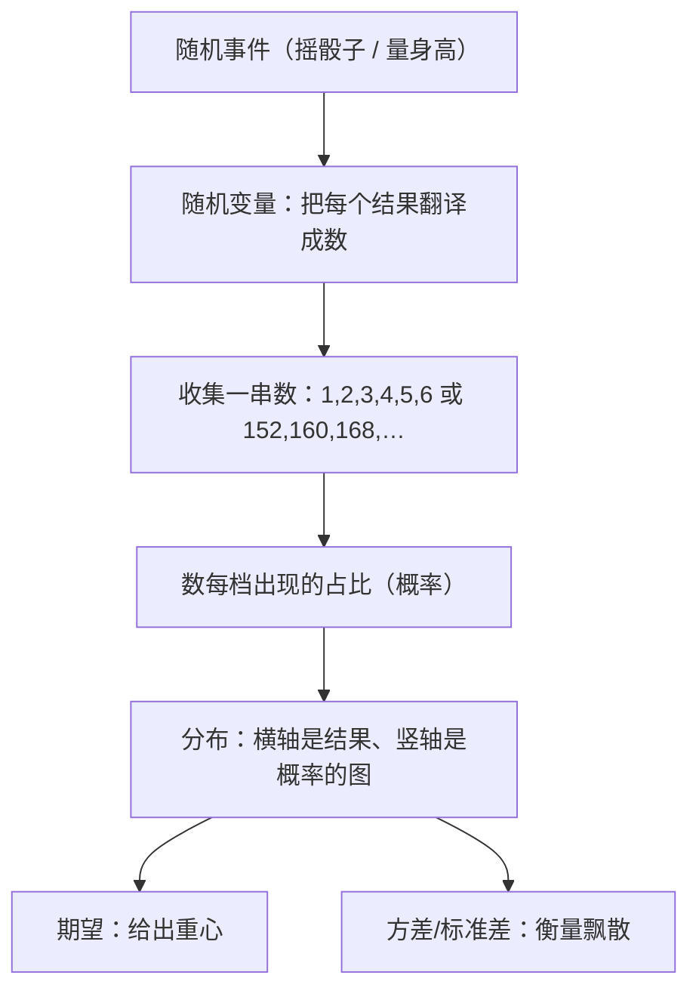

# 第 15 章 · 概率分布——把"随机"画成一张图

> 本章从哪个问题出发：上一章你说概率是"标价签"——可你手里那堆价签，长什么样？一颗骰子的六张价签挨个排开，是平平的六个六分之一；可你去体检量一百个孩子的身高，那些"价签"却不是平的——高的少、矮的少、中间一坨最高。同样是随机，为什么有的价签排起来像一层薄板，有的却鼓成一座山？
> 推导到哪个结论：随机变量把"随机"变成一串能算的数；把这串数按"每一档出现的概率"画出来，就得到一张图——这张图叫分布。分布不是玄学，是"现实反复出现的标价模式"：有的散成一摊，有的堆成一团，有的贴着一边往下滑。而每一张分布，都能用两个数字给它"定身"：期望是它的中心，方差是它的散开程度。**随机变量把随机翻译成数，分布把数画成形状，期望和方差把形状浓缩成两个数。**

> 核心认知：你上一章学会了给"不确定"标价（概率）、算长期平均（期望）。可你从没问过：**价签贴完，一整件事的所有价签，摆在一起是什么样？** 掷骰子，六个价签各六分之一，平平整整；量身高，价签却高矮不平——绝大多数孩子挤在中间，越往两头越少。原来"随机"不止有一种长相：有的随机天生是"数轴上的任意一点"（连续），有的只能"一格一格跳"（离散）。把这些数按概率画出来，就是**分布**——它是随机世界的"地形图"。而每张地形图，都靠两个数字"定身"：**期望给出重心，方差衡量飘散**。这一章我们只深入讲一座最常出现的"山"——**正态分布**，它之所以到处都有，是因为"大量独立小随机叠加"自然就长成这座钟；至于二项、泊松、均匀、指数，你只需记住它们各管哪类场景。

## 引子

秋天校医室的门口排着长队，是全校例行体检。我帮忙维持秩序，手里攥着一沓刚量完的身高记录纸。

"下一个。"校医喊。

一个瘦高的男生走进去，量完出来，在纸上写下 174。隔两个，一个矮些的女生，152。再往后，160、168、155、171……我低头扫了一眼手里那沓纸，忽然怔住了。

"老谟你看。"我把纸递给他，"这十几个孩子，高的少、矮的少，全挤在中间——161、165、158、163……怎么都往 160 这个数附近凑？"

老谟没接纸，只是扫了一眼："你觉得奇怪？"

"奇怪啊。"我指了指最顶上一行，"你看，175 的只有两个，150 左右的也就两三个，剩下全在一米六出头晃。**同样是'量身高'这件随机的事，为什么偏偏中间那一档的孩子最多？** 我上一章刚弄明白概率是标价签，可这些价签摆在一起……怎么不是平的？"

老谟这才把纸接过去，翻了翻："你上一章只问了'一张价签怎么贴'，从没问过'一整批价签摆在一起，长什么样'。**一颗骰子，六个价签各六分之一，平平整整；可这些身高的价签，却鼓成一座中间高两头低的山。** 你说——同样是随机，为什么有的像一层薄板，有的却像一座山？"

我把纸翻来覆去看了两遍，一时语塞。骰子的价签平，是因为六个面机会均等；身高却明摆着不均等——可我上一章学的，不都是"六分之一"这种平平的吗？

"这一章，"老谟把纸往桌上一放，"咱们就把'一整批随机价签摆在一起的样子'，给它画出来、说清楚。你先把这沓身高记好，我们从'怎么把'随机'变成能画的数'开始。"

## 对话引擎

### 第 1 轮：随机变量——把"随机"先翻译成"数"

**老谟**："你说身高这些价签'鼓成一座山'。可你有没有想过——'身高'这件事，你画图的时候，横轴上放的是什么？"

**造物主**："横轴……放身高呗。152、160、168 这种数。可骰子呢？骰子的价签我在上一章都是写'摇出 6''摇出 1'这种——那不是一个数啊，是一个'事件'。"

**老谟**："你注意到差别了。掷骰子，你关心的是'摇出几'，可你写的是'事件'；量身高，你关心的是'多高'，它天生就是一个数。那我问你——**你能不能让掷骰子这件事，也'变成一个数'？**"

**造物主**："……变个数？骰子摇出来是 6，那我就记个 6？摇出来是 3，就记个 3？那'摇出 6'这个事件，不就变成了'数字 6'？"

**老谟**："你把'事件'变成了'数'。**这就是随机变量（random variable）的起点：把一次随机试验的每个结果，都对应成一个数。** 摇骰子，结果 6 对应数 6；量身高，结果 174 对应数 174。现在你手里，就有一串'数'了。那我问你——这串数，和你上一章那串'概率价签'，是不是一回事？"

**造物主**："……不是一回事。价签是我贴的'概率'，而这一串数，是事件本身变成的数。骰子摇出 6，那这个'6'不是概率，是结果本身。**随机变量给我的是'结果'，不是'这个结果的概率'。**"

**老谟**："你把两者分清了——**随机变量给你'结果'，概率给你'这个结果有多可能'。** 那接下来，你说要把'这串数'画出来，你想怎么画？"

**造物主**："……我想数一数，这一百个孩子里，152 的有几个、160 的有几个、170 的有几个，把'每个身高出现的次数'摆出来？"

**老谟**："好。你先别急着画，我想先听你说——**你为什么觉得，得数'每个数出现几次'，而不是直接看那一串数字本身？**"

**造物主**："因为直接看一串数字，一百个乱糟糟的，什么也看不出来。我得把它们'归堆'——把同样身高的归到一起，数个数。个数多的地方，说明这档身高的人多，也就是……这档身高的概率大？"

**老谟**："你这句话，已经把下一轮的门撞开了。**你数'每个数出现几次'，是在看每个结果的'占比'——占得多，就是这档概率大。** 你把这个'数个数、看占比'的动作做出来，就能画出你说的那座'山'了。"

---

**📐 知识锚点：随机变量——给随机先装个"数"的壳**

【概念深挖】在画分布之前，得先有一个前提：**随机这件事，得先能变成一个数。** 这个"把随机结果翻译成数"的动作，叫**随机变量（random variable）**。

- **随机变量不是"变量"本身**，它是一种"翻译规则"：把随机试验的每个可能结果，对应成一个数。掷骰子，把"摇出 6"对应成数字 6；量身高，把"这个孩子 174"对应成数字 174。
- 关键区别：**随机变量给你的是"结果"（结果是什么数），概率给你的是"这个结果有多可能"（是几）。** 两者是两样东西——一个说"这次会出几"，一个说"这个几占多大比例"。
- **为什么要这一步**：因为"事件"没法排序、没法加减、没法画坐标轴；只有变成"数"，你才能把它放到横轴上、才能问"它落在哪一档、占比多少"。**随机变量，是"随机"和"能算的数"之间的翻译官。**

为什么叫"随机**变量**"而不是"随机数"？因为它"会变"——每一次试验，它取的值都可能不一样。但"会变"不代表"没规律"：它取每个值的**概率**是固定的，这正是下一轮要画的。

【历史溯源】"随机变量"这个概念，是在**19 世纪末、20 世纪初**才被严格化的。早期数学家研究概率，都盯着"事件"（摇出 6 这件事），因为最直观。可**俄国数学家切比雪夫（Chebyshev）、马尔可夫（Markov），以及后来的柯尔莫哥洛夫（Kolmogorov）**发现：只有把"事件"翻译成"能计算的数"，才能用上微积分那套强大的工具。柯尔莫哥洛夫在 1933 年用集合论严格定义概率时，就明确把"随机变量"定义成"把每个随机结果映射成一个实数"的函数。**这一步"翻译"，让概率从"数数"升级成"可以求导、可以积分、可以逼近"的现代数学。**

【工程实践】工程里，随机变量遍地都是：**你量的每一个传感器读数**（温度、股价、网络延迟）是一个随机变量；**一个模型输出的预测值**是一个随机变量；**你抽测的每个零件尺寸**也是。而**所有"把现实世界塞进计算机算"的第一步，都是先选好随机变量**——因为你只能对数做运算。**"先定随机变量，再谈分布"**，是所有统计建模的第一步棋。

---

### 第 2 轮：分布——把"随机"画成一张图

**老谟**："你说要数'每个身高出现几次'。那我现在给你一个更干净的——**抛 100 枚硬币，数正面朝上的枚数。** 你说，这个试验，正面朝上的枚数，可能是 0 枚、1 枚、2 枚……一直到 100 枚。我要你把'每种枚数出现的概率'画出来，你打算怎么画？"

**造物主**："……我把 0 到 100 每个数放横轴上，然后在每个数上面，画一根竖线，竖线的高度就是'正面恰好是这个数'的概率。0 枚几乎不可能，50 枚左右最高，两边越来越矮。"

**老谟**："你已经在画了。这根'横轴是结果、竖线高度是概率'的图，就叫**分布（distribution）**。那你看看你画的这个——**正面 50 枚的概率是不是最高？为什么？**"

**造物主**："因为……正面朝上差不多一半一半？抛 100 枚，最常出现的结果就是'大约 50 枚正面'，因为每枚硬币偏向正面的机会都一样大。完全偏到 0 枚或者 100 枚，那太难了，概率特别小。所以中间高、两头低。"

**老谟**："你把'中间高两头低'画出来了。可我现在问你一个尖锐的——**'抛 100 枚硬币，正面 50 枚'的概率，和'正面 51 枚'的概率，是同一个数吗？**"

**造物主**："……不是同一个数吧？51 枚比 50 枚差一点，概率应该也差一点？可我又说不清差多少……反正不会正好相等。"

**老谟**："对，不会正好相等。可你发现没有——**你画出来的这些竖线，一根一根挨着，是个离散的一格一格的形状。** 那你再想想，身高的那张图，也是这样一格一格的吗？"

**造物主**："……身高？身高是连续的啊！152、153、154……中间永远还可以有 152.5、152.7，无穷多个数塞在中间。**身高这张图，不能是一根一根的竖线，得是连成一片的、平滑的一座山。**"

**老谟**："你这一句，把随机世界劈成了两半——**离散和连续。** 抛硬币的枚数是离散的（只能一格一格跳），身高是连续的（中间永远还有半个）。我们说这两种'随机'，长着两种不一样的图。那我们先搁下连续，回到离散——你那根'每格一根竖线'的图，画好了吗？"

**造物主**："……画好了。可它有什么用？它不就告诉我'哪档概率大、哪档概率小'吗？"

**老谟**："你觉得'就知道哪档大哪档小'太简单了？那你等着——**下一轮，我们给这张图'定身'，找两个数字，把整张图浓缩进去。** 你会发现，两张完全不同的图，可能被同一个数字压得死死的。"

---

**📐 知识锚点：分布——随机的"地形图"**

【概念深挖】**分布（distribution）**，就是把"随机变量取每个值的概率"画出来的那张图。它回答了"这个随机的东西，通常落在哪、有多散"。

- **横轴**：随机变量能取的"结果值"。
- **纵轴**：取到那个值的概率。
- 一根竖线（离散）或一条曲线（连续）的高度，就是"这一档结果有多可能"。

**离散 vs 连续**——这是随机世界的两大阵营：

| 类型 | 结果的样子 | 图的样子 | 例子 |
|------|-----------|---------|------|
| **离散（discrete）** | 只能一格一格跳着取 | 一根根竖线 | 抛硬币的正面枚数、骰子点数、电话铃响次数 |
| **连续（continuous）** | 数轴上任意一点 | 一条平滑曲线 | 身高、体重、降雨量、股价 |

**关键直觉**：连续时，单个点（恰好 152.00000 厘米）的概率几乎是 0——因为两点之间有无穷多个点可落。**连续的分布，我们看的不是"某一点"的概率，而是"落在某一段区间"的概率**（落在 160 到 165 之间的概率 = 那段曲线下的面积）。这一点和上一章"积分就是曲线下的面积"完美接上了。

**"中间高两头低"是分布最常见的长相**，但它不是唯一的长相：有的分布贴着一边往下滑（比如"寿命""等待时间"），有的均匀摊平（骰子、等可能）。**分布是一张地形图：有的地方是山脊，有的地方是悬崖，有的地方是一马平川。** 随机世界的所有"长相"，都藏在这些形状里。

用一张图，把"从随机事件到分布"这条主干道画清楚：


读图说明：最上面是现实里的"随机事件"，先经过随机变量翻译成"一串能算的数"，再统计每档占比，就画成了分布这张"地形图"。而这张地形图，最后用两个参数"定身"——期望给出整体的重心，方差/标准差给出结果离重心飘多远。**从随机到图、再到两个参数，这套走法是描述一切随机系统的通用主干。**

【历史溯源】把概率画成"分布"这件事，是**19 世纪的数学家**慢慢攒出来的。**法国数学家拉普拉斯**最早在 18 世纪末研究"大量重复观测的平均值"时，发现那些误差总是"中间多、两头少"——这就是正态分布的雏形。而**德国数学家高斯（Gauss）**在 19 世纪初处理天文观测误差时，把这条"中间高两头低"的曲线精确地画了出来，于是这条曲线后来被叫作**高斯分布（Gaussian）**，也就是**正态分布（normal distribution）**。**德莫弗（De Moivre）**更早（1733 年）就用它来逼近二项分布——他抛硬币时发现，正面枚数那根根竖线，多了以后会"平滑成一条钟形曲线"。**"随机看起来乱，可它画出来的形状却极其规则"——这个发现，是概率论从"赌桌小技"走向"描述整个随机世界"的分水岭。**

【工程实践】分布是工程里的"地形图"，用来给不确定性"定位"：
- **质量检测**：一批零件的尺寸分布，如果中心偏了或散得太开，就知道生产线出问题了。
- **风险评估**：网络流量的波动分布、股价的涨跌分布，决定你要准备多少余量。
- **AI 的输出**：一个模型输出的预测，不是"一个数"，而是一个**分布**——它告诉你不只"最可能是啥"，还告诉"有多不确定"（这正是第9章"熵"在分布上的体现）。
**"先把随机画成分布"**，是几乎所有数据分析、机器学习的第一步：**只有看清地形，你才知道该往哪走、要备多少余量。**

---

### 第 3 轮：给分布"定身"——中心在哪、散得多开

**老谟**："你画好了分布。现在我要你给它'定身'——用最少两个数，把整张图的大致样子说出来。先问第一个：**这张图，'中心'在哪？** 全班一百个孩子的身高，你要用一个数'代表'这堆身高，你会选哪个？"

**造物主**："……选一个代表？那肯定是选'中间那一坨'——就是最多孩子挤在的那档，一米六出头那个数。用老话说，就是**平均数**呗。把所有身高加起来除以一百，就是它们的中心。"

**老谟**："你选平均数，对不对先放一边。我问你——**这个'平均数'，跟你上一章学的'期望'，是不是同一个东西？**"

**造物主**："……期望是'把概率×结果加总'。平均数……把所有结果加起来除以个数。好像不太一样？可它们不都是'中心'吗？"

**老谟**："你上章学期望，是把每种结果的概率当权重；平均数是把每种结果当成出现一次。可要是我们不用'身高除以一百'，而用'每个身高 × 它出现的比例'再加总——你算算，跟平均数一样不一样？"

**造物主**："……每个身高 × 它占的比例，再全加起来？那等于每个孩子的身高都被算了一遍，加起来除以一百……算出来的数，跟平均数一模一样！**原来期望和平均数，用的是同一个'乘一下再加起来'的算法——可平均数是我拿这堆样本估出来的，期望是分布本身定死的中心。一个是估的，一个是它本来的样子。**"

**老谟**："你把期望和平均数分得很清——**算的算法一样，可一个是'从样本估出来'的估计，一个是'分布本身'的理论中心。** 那我现在问你第二个问题，也是更容易被忽略的——**两张分布，中心一样，就说明它们'一样'吗？**"

**造物主**："……中心一样？那还有哪里能不一样？"

**老谟**："我给你两个东西。**A 班平均身高 160，所有孩子都挤在 159 到 161 之间；B 班平均也是 160，可有的孩子 140、有的孩子 180，散得极开。** 你说，这两个班的'身高分布'，能说一样吗？"

**造物主**："……不能！虽然平均都是 160，可 A 班整整齐齐，B 班乱七八糟。**光看中心根本分不出来——我还得知道它'散得多开'！**"

**老谟**："你抓到关键了。**分布只有中心不够，还要有'散开程度'。** 那我要你把'散得开不开'变成一个数——你觉得，该怎么算？"

**造物主**："……看每个孩子离'中心'多远？离得远的越多，说明越散。可'离多远'有正有负……我得先不管方向，只看'差多少'，再平均一下？"

**老谟**："你先别急着算。我们把'到底怎么把散开度变成一个数'，放到下一轮，亲手把它造出来。这一轮你先记住一句——**分布有两个数字：中心（期望）和散开度。** 光有中心，你会被'平均 160'骗过去，不知道底下其实散成了一锅粥。"

---

**📐 知识锚点：期望——分布的中心**

【概念深挖】**期望（expected value，数学上常写作 E[X]）**，这一章要给它的新身份：**分布的中心**。

你上一章学的期望，是"押一块平均拿回多少"；这一章要看到它的另一面——**当你有一整张分布图时，期望告诉你"这个随机的东西，平均会落在哪"**。

```
E[X] = Σ (结果值 × 该结果的概率)
     = 把所有结果按概率加权求和
```

- 离散时，期望 = 每个可能值 × 它出现的概率，加总。
- 连续时，期望 = 把"值 × 概率密度"在整条数轴上积分（又是积分的用武之地）。

**关键澄清：期望和平均数是同一套算法，但不是同一个东西。** 平均数是"把所有结果加起来除以个数"，期望是"把所有结果按概率加权求和"——**当每个结果被抽中的机会相同时，这两个算式恰好给出同一个数。** 但严格说：**期望是分布本身的理论中心（总体属性），样本平均数是你从抽样里估出来的估计值**——样本越多、抽样越随机，平均数才越逼近期望（这正是大数定律）。期望的表述更通用：它明确把"概率"当权重，所以就算结果出现的概率不一样（比如骰子灌铅），你也能算期望。**期望是"分布的重心"**：如果把分布图当成一个实物，在它底下垫个支点，期望就是让这张图能平衡的那个点。

【历史溯源】"期望=分布中心"这个想法，延续了第16章讲的**惠更斯（1657）**对期望的定义——每个结果用概率加权求和。而真正把期望和"分布"绑在一起、当成"描述一整张随机图"的参数，是**拉普拉斯和高斯在 19 世纪**系统化的。**拉普拉斯**还发现：大量独立随机的和，它的分布会越来越集中到期望附近（这就是下一章会讲的大数定律的延伸）。**"随机虽然乱，可它的期望极其稳定"——这是概率论最深刻的发现之一。**

【工程实践】期望 = 中心的含义，在工程里极其重要：
- **传感器标定**：测一百次温度，期望（平均）就是"最接近真值的读数"，因为随机噪声在平均中被抵消。
- **预测**：模型预测值 = 预测分布的期望，是"最合理的单点预测"。
- **保险定价**：期望 = 平均赔付，保险公司就用它定保费（呼应第16章）。
**"先算期望，找中心"** 是分析一切随机数据的默认第一步。

---

### 第 4 轮：亲手造方差——把"散得开不开"变成一个数

**老谟**："你说要看'每个结果离中心多远'。那咱们就真造。**A 班五个孩子身高：159、160、160、161、160；B 班：140、160、160、160、180。** 两个平均都是 160。你来——'散开度'，你想怎么算？"

**造物主**："……先看每个人离平均 160 多远。A 班：-1、0、0、+1、0。B 班：-20、0、0、0、+20。可我直接把'离多远'加起来……A 班 -1+0+0+1+0=0，B 班 -20+0+0+0+20=0，**都变成 0 了！** 因为正的负的抵消了，根本看不出谁散。"

**老谟**："你撞上了一个经典陷阱——**离中心的差有正有负，直接相加会抵消，等于啥也没说。** 那你打算怎么绕过去？"

**造物主**："……那我不让它们抵消？要么看'差的绝对值'，要么……把差的平方？**负的平方变正的，就不抵消了。** A 班：1+0+0+1+0=2，B 班：400+0+0+0+400=800。B 班的'平方和'大得多——它散得开！"

**老谟**："你自己选了'平方'——这是个好选择，等下我会告诉你为什么数学偏爱平方。现在你把'平方和'再'平均'一下（除以人数），得到 A 班 0.4、B 班 160。**这个'平均的平方差'，就叫方差（variance）。** 你说，它现在能分出 A、B 班的差别了吗？"

**造物主**："能了！A 班方差 0.4，B 班方差 160——**B 班散得多，方差就大；A 班整整齐齐，方差就小。** 原来'散不散'，就用这个'平均的离中心平方距离'来量！"

**老谟**："那你发现没有——方差是个'平方'的数，可我们平时说身高是厘米、说体重是公斤。**如果一个量是厘米，那它的方差就是'平方厘米'，单位都怪怪的。** 你想不想把这个'平方'再开回去？"

**造物主**："……开回去？把方差开平方，得到 B 班 √160≈12.6 厘米。**这个数和'厘米'同单位了，好读多了！** 那它是不是就叫'标准差'，意思就是'平均离中心多少厘米'？"

**老谟**："行，这名字你没白起——**方差开平方，就是标准差（standard deviation），它告诉你'平均来说，结果离中心多远'。** 你现在手里，有了给任意分布'定身'的两个数：期望锚定中心，方差（或标准差）衡量散开。"

---

**📐 知识锚点：方差与标准差——分布的"散开度"**

【概念深挖】**方差（variance）**，是给"分布散得多开"定量的家伙。造物主亲手推出了它：

```
方差 = E[ (X − E[X])² ] = 把所有结果的"离中心距离的平方"按概率加权平均
标准差 = √方差 = "平均离中心多远"
```

几个关键点：

1. **为什么用平方，不用绝对值？** 绝对值也行，但平方有两个工程上的好处：一是**数学上好算**（可导、好优化，呼应第6章"求极值看导数"）；二是**惩罚大偏差**——偏离得越远，平方放得越大，所以方差对大波动更敏感。这是工程师偏爱平方的真实原因，不是凑数。
2. **为什么开平方成标准差？** 因为方差是"平方单位"，没法直接读。标准差回到原始单位，"平均离中心多远"，直观。**工程里更多用标准差，因为它好读；数学里更多用方差，因为它好算。**
3. **期望和方差是分布的两个"定身参数"**：期望告诉你"整体重心落在哪"，方差告诉你"结果离重心多飘"。**但要注意：它俩只描述了分布的两个维度，不能还原整张图**——两张形状完全不同的图，可能有完全相同的期望和方差。它们是最有用的两个参数，但不是全部。

【历史溯源】用"离中心距离的平方"来量离散，是**19 世纪统计学家的共识**。**法国数学家拉普拉斯**在 18 世纪末就用平方和来拟合误差；**高斯**在最小二乘法里反复用到平方；而"方差""标准差"这两个名字，主要归功于**英国统计学家皮尔逊（Pearson）**——他在 1890 年代到 1900 年代，把"标准差"这个概念推广成了统计学的标准工具。皮尔逊是"现代统计学之父"之一，**他第一个把'期望、方差、标准差'这套参数，当成描述'一整张分布'的统一语言**。

【工程实践】方差/标准差是工程里衡量"稳不稳定"的尺子：
- **生产一致性**：零件尺寸的标准差小，说明生产线稳定；标准差大，说明该查设备了。
- **金融风险**：一只股票收益率的标准差大，就是"波动大、风险高"——呼应第16章伯努利的教训"期望为正不等于稳赚，还要看方差"。
- **模型不确定性**：一个模型对同一输入给出多个预测，它们的标准差大，说明模型"没把握"。
- **算法调参**：跑一个算法 100 次，看结果的标准差，判断它稳不稳定、要不要调。
**"期望看准不准，方差看稳不稳"** ——这两把尺子，是所有随机工程的基础。

---

### 第 5 轮：正态——为什么"加多了就长这样"

**老谟**："你现在有期望、方差两把尺子了。可你还没给这座'中间高两头低'的山正式起过名。我先问你——**它凭什么长这样？为什么偏偏是中间高、两头低，而不是别的高？**"

**造物主**："……中间高，因为大多数孩子身高都差不多，凑在中间那档；两头低，是因为特别高、特别矮的孩子都少。可这也说明不了'为什么偏偏这个形状'吧？为什么不是……方块形状，或者别的？"

**老谟**："你问得好。**如果你把'身高'这件事，看成是很多很多独立的小因素叠出来的——遗传、营养、睡眠、运动……每个小因素都在'拉高'或'拉低'一点，最后总的身高是它们全加起来。** 那我问你，这么多个独立的小随机加在一起，最后会变成什么形状？"

**造物主**："……很多独立小随机加起来？有的拉高、有的拉低，会互相抵消，最后绝大多数应该都落在中间附近，只有极少数恰好全被往一个方向拉，才跑得远。**所以加得越多，越往中间挤、越像那座钟？**"

**老谟**："你这句话，就是正态分布的全部秘密——**很多很多独立的小随机加起来，总和会越来越像一座中间高、两头低的钟。** 这座钟，叫**正态分布（normal distribution）**。**它不是数学家规定它'好看'，是'大量独立小随机叠加'的自然结果**——身高、测量误差、很多生理指标，全是无数小因素叠加，所以都像正态。那你说，这座钟，能用我们刚学的哪两个数'定身'？"

**造物主**："……也是期望和方差？期望定它中心在哪（平均身高），方差定它有多宽（散得多开）。可这座钟中间高两头低、对称，光这两个数够吗？"

**老谟**："这座钟对称、中间高，但它的'宽窄'——同样期望和方差的两座钟，宽度可能差很远。**正态这座钟，恰好'中间往两边扩散的样子'有非常固定的规律**：距离中心一个标准差内，落着大约 68% 的数据；两个标准差内约 95%；三个标准差内约 99.7%。**你把这句'68-95-99.7'记住——它是正态最实用的'经验法则'。** 至于别的分布长什么样，下一轮我们造完正态，在知识点里给你列个清单，先不展开。"

---

**📐 知识锚点：正态分布——"大量独立小随机叠加"的钟**

【概念深挖】这一章只深入讲一座"名山"——**正态分布（normal distribution）**，因为它是现实里出现最频繁、也最能体现"分布思想"的那座钟。

**正态的"由来"（最重要）**：正态不是数学家画出来好看的，是**"大量独立小随机因素叠加的总和"的自然结果**（中心极限定理）。身高是遗传、营养、环境等无数小因素叠加；测量误差是很多微小误差叠加——**加得越多，越像正态。** 这就是"为什么正态到处都有"的根因。

**正态的两个参数**：
- **μ（mu，均值）**：决定钟的中心在哪（对称轴的位置）。
- **σ（sigma，标准差）**：决定钟有多宽多矮（σ 大则又矮又宽、结果散；σ 小则又高又瘦、结果集中）。

**对称性**：正态以 μ 为对称轴，左右完全对称——距离中心同样远的两侧，概率一样。**这也是为什么"平均身高 160"这堆数据，往上偏的和往下偏的会互相抵消、最后稳定在中间。**

**68-95-99.7 法则（经验法则）**：
- 落在 μ±σ（一个标准差内）：约 **68%**
- 落在 μ±2σ 内：约 **95%**
- 落在 μ±3σ 内：约 **99.7%**

这条法则极其好用：**只要知道均值 μ 和标准差 σ，就能立刻估计"绝大多数数据落在哪一段"**——工程里"六西格玛（6σ）"质量控制，正是基于"±3σ 内几乎涵盖全部（99.7%）"这一条。

**预告清单：现实里常见的其他几座"山"**（本章不逐一展开，你只需知道"存在、管什么"）：

| 分布 | 类型 | 什么时候出现 |
|------|------|-------------|
| **二项（binomial）** | 离散 | 固定做 n 次成败试验，数成功几次（如抽 n 个零件看合格几个） |
| **泊松（Poisson）** | 离散 | 只知道平均速率，稀罕事发生几次（如书店每分钟来几个顾客） |
| **均匀（uniform）** | 连续/离散 | 所有结果机会均等（如骰子、随机抽样） |
| **指数（exponential）** | 连续 | "等多久"的事（如设备寿命、排队等待时间） |

**正态与它们的关系**：正态是"大量独立小随机之和"；二项是"固定次数成败计数"（n 大、成功概率小时，二项会逼近泊松）；指数管"等待时间"。**分布之间会互相转化、互相逼近，不是孤立的。**

【历史溯源】**正态分布的"由来"**，是概率论最动人的一段史。**法国数学家拉普拉斯（18 世纪末）**研究大量重复观测误差时，发现误差总是"中间多、两头少"；**德莫弗（1733）**在抛硬币时发现"正面枚数"的竖线，多了以后会平滑成一条钟形曲线；而**德国数学家高斯（1809）**处理天文观测误差时，把这条曲线精确写出来用于最小二乘拟合，于是它被称为**高斯分布（Gaussian）**。**中心极限定理**——"大量独立小随机之和趋近正态"——是概率论最深刻的结果之一，19 世纪末到 20 世纪初由**林德伯格、列维**等严格证明。**"随机看似乱，可只要它是很多独立小随机的和，就逃不出正态这座钟。"**

【工程实践】正态在工程里是"度量误差与波动的默认尺子"：
- **质量控制的 6σ**：假设零件尺寸正态分布，均值 μ±3σ 内约含 99.7% 的良品，超出即算缺陷——这就是"六西格玛"管理的数学基础。
- **测量与标定**：对同一物理量重复测很多次，读数近似正态，均值（期望）最接近真值，标准差衡量测量精度。
- **假设检验**：统计检验大量使用"数据是否落在某几个标准差内"来判断是否异常。
- **机器学习**：很多模型（如高斯混合模型）假设数据"服从正态"，也是因为现实数据常近似正态。
**"先假设正态、用 μ 和 σ 描述它"** 是工程里最常用的简化，但它有个前提——**得确认数据真的是"大量独立小因素叠加"**，否则会误判。

---

### 第 6 轮：亲手造——用 Python 模拟，亲眼看见正态长出来

**老谟**："你说正态是'大量独立小随机叠加'的结果。那咱们别光说——**你写代码，让机器真的'叠'出一个正态分布来给我看。** 我给你一个任务：**模拟 10000 次'测量一个真实身高'，每次测量值 = 真值（比如 160）+ 一大堆独立的小随机噪声（比如 50 个小误差加起来）。** 你说，把这些测量值画出来，该是什么形状？"

**造物主**："……那我把每个测量值当成 160 + 50 个随机小误差的和？每个小误差在 -0.5 到 0.5 之间随便取，50 个加起来就是总噪声。然后重复 10000 次，统计每次算出来的身高落在哪，画成直方图——**理论上应该叠出一座中间高两头低的钟？**"

**老谟**："思路对。**可你想想，如果噪声不是 50 个小误差、而是只有 2 个，叠出来还是钟吗？** 你试试 2 个和 50 个对比，看看'加得越多越像钟'这句话到底成不成立。顺便，把'落在 μ±σ、±2σ、±3σ 内的比例'也算一算，看是不是接近 68%、95%、99.7%。动手吧。"

---

**📐 知识锚点：【实现思考】用 Python 模拟，亲眼"叠"出正态**

【实现思考】"看懂正态"到"亲手造出正态"，差一段随机模拟。我们让机器把"大量独立小随机"叠成一座钟，并验证 68-95-99.7 法则：

```python
import random, statistics

def measure(true_h, n_noise):
    """每次测量 = 真值 + n_noise 个独立小随机噪声"""
    noise = sum(random.uniform(-0.5, 0.5) for _ in range(n_noise))
    return true_h + noise

for n_noise in (2, 50):          # 只有 2 个小因素 vs 50 个小因素
    data = [measure(160, n_noise) for _ in range(20000)]
    mu = statistics.mean(data)
    sd = statistics.stdev(data)
    # 统计落在 μ±σ、±2σ、±3σ 内的比例
    for k in (1, 2, 3):
        frac = sum(1 for x in data if abs(x - mu) <= k * sd) / len(data)
        print(f"{n_noise}个小因素: μ±{k}σ 内比例 = {frac:.3f}")
```

**为什么这么造**：我们把"身高 = 真值 + 一堆小误差"直接翻译成代码——每个小误差取 [-0.5, 0.5] 的均匀随机数，n 个加起来就是总噪声。重复 2 万次，统计结果：
- **n_noise=2**（只有 2 个小因素）时，分布还比较"钝"、不是标准的钟形；
- **n_noise=50** 时，分布明显长成平滑的钟形，且 **μ±1σ、±2σ、±3σ 内的比例接近 68%、95%、99.7%**——这正是 68-95-99.7 法则。

**代价**：模拟要跑很多次才稳（次数少，比例会乱跳，呼应第16章大数定律）；而且这里用的是"均匀小噪声"，叠多了照样趋近正态——**这恰恰证明了中心极限定理的威力：不要求每个小随机是正态，只要独立、足够多，总和就趋向正态。** 换条路会怎样：若把真值 160 去掉、只看噪声本身，你会发现噪声的分布也趋向正态（中心 0）——**"中心极限定理"说的就是这件事**；若只叠 2 个小因素，就看不到钟形，所以"足够多"很关键。

【工程实践】这段代码，是**蒙特卡洛模拟（Monte Carlo）**的又一次露面（呼应第16章）：**算不出的分布，就跑大量随机、统计频率看形状。** 现实里，**金融公司模拟股价波动的极端情况、保险模拟几十年大灾的损失、气象模拟降雨分布**，全是在"跑大量随机、看分布长什么样"。而 **"大量独立小随机叠加趋近正态"** 这句，正是"为什么现实数据常近似正态、可以直接用 μ 和 σ 描述"的工程依据。**"看不懂一个随机系统，就把它模拟一万遍"** 是工程师的看家本领。

---

### 第 7 轮：落点——随机变量翻译随机，分布画出形状，期望方差定身

**老谟**："把体检室那沓身高纸收进抽屉之前，你还有最后一道题没答完。你当初问的是'为什么身高价签鼓成一座山，而不是平的'。现在，你能自己回答了吗？"

**造物主**："……能了。因为身高是很多独立小因素（遗传、营养、环境）叠加出来的——我用**随机变量**把它变成一串数，再用**分布**把'每个身高出现的概率'画出来，就得到那座中间高两头低的钟，也就是**正态分布**。它鼓成山，不是因为它'想'鼓成山，是因为它是大量独立小随机的和。"

**老谟**："那这座钟，能用几个数字'定身'？"

**造物主**："两个。**期望**告诉我它的重心——平均身高落在哪（160 附近）；**方差**（或标准差）告诉我它散得多开——是挤在一米六左右，还是 140 到 180 满天飞。**期望锚定重心，方差衡量飘散。**"

**老谟**："你把这章的三件家伙都说全了：**随机变量把随机翻译成数，分布把数画成形状，期望和方差把形状浓缩成两个数。** 那你再往前想一步——你上章算期望，是把'每种结果的概率 × 结果'加起来。**可你有没有想过，如果这个'和'里的项数是无限多，甚至是一个连续的数轴，这个'加总'还怎么做？**"

**造物主**："……无限多项？那我不是加不完了？总不能一项一项加到天荒地老。"

**老谟**："你撞上一个新问题了——**'无限多个数加起来，到底等于几'。** 你上章学过'把无限个无限小的变化拼回整体'（积分），可那是'连续地拼'。这一章你面对的是'把一串数的每一项加起来'——当项数变无限时，这套加法，得有一套自己的规矩。下一章，我们就给'无限多个数相加'立规矩。"

**造物主**："我刚学会把随机画成山、用两个数定身，可一转身，又撞上'无限多个数怎么相加'这个大坑。看来每学会一件家伙，就会撞出一件新的。"

---

### 📐 知识锚点·计算速查：正态采样、期望/方差、68-95-99.7

**① 期望（均值）与方差/标准差怎么算**
- 期望（中心）：`mu = x.mean()`（或 `np.mean(x)`）。
- 方差（散开）：`var = x.var(ddof=1)`——**注意 ddof=1（样本方差，贝塞尔校正）**；标准差 `sd = x.std(ddof=1)`。
- 记忆：**期望看中心，方差看散开；标准差的单位和数据一样，好读。**

**② 生成正态分布样本**
```python
import numpy as np
mu, sigma = 160.0, 5.0
x = np.random.normal(mu, sigma, size=20000)   # 20000 个正态样本
print("样本均值 %.3f，样本标准差 %.3f" % (x.mean(), x.std(ddof=1)))
# 应接近 160 和 5（样本越多越准，呼应大数定律）
```

**③ 验证 68-95-99.7 法则**
```python
for k in (1, 2, 3):
    frac = (np.abs(x - x.mean()) <= k * x.std(ddof=1)).mean()
    print("落在 μ±%dσ 内的比例 = %.3f" % (k, frac))   # 应约 0.68 / 0.95 / 0.997
```
- 记忆：**正态数据约 68% 落在一个标准差内、95% 在两个内、99.7% 在三个内**——这就是"六西格玛"的 99.7% 来源。

**④ 已知 μ、σ，估计"落在某区间"的概率**
- 用 `scipy.stats.norm`（理论正态）或查表：
```python
from scipy.stats import norm
# P(155 < X < 165)，X~N(160, 5²)
p = norm.cdf(165, loc=160, scale=5) - norm.cdf(155, loc=160, scale=5)
print("P(155<X<165) = %.3f" % p)     # 约 0.683
```

---

### 🔧 工程实践·计算案例：模拟"传感器测量噪声"，验证期望与方差

场景：一台秤测同一件货物，读数有随机噪声，反复测 20000 次。我们假设每次读数 = 真值 500g + 正态噪声（标准差 2g），用 numpy 生成样本，验证"期望≈真值、标准差≈噪声水平、68-95-99.7"：

```python
import numpy as np
from scipy.stats import norm

rng = np.random.default_rng(42)          # 固定随机种子，结果可复现
true_mass = 500.0
noise_sd  = 2.0
readings = rng.normal(loc=true_mass, scale=noise_sd, size=20000)

est_mu = readings.mean()
est_sd = readings.std(ddof=1)
print("估计均值 %.3f g（真值 500）  估计标准差 %.3f g（噪声 2）" % (est_mu, est_sd))

for k in (1, 2, 3):
    frac = (np.abs(readings - est_mu) <= k * est_sd).mean()
    print("μ±%dσ 内比例 = %.4f" % (k, frac))     # ≈ 0.6827 / 0.9545 / 0.9973
```

**为什么这么造**：`rng.normal(loc, scale, size)` 直接生成正态样本；`readings.mean()` 估真值、`std(ddof=1)` 估噪声大小。跑出来你会看到：**均值几乎贴住真值 500（期望看准不准），标准差几乎等于噪声 2（方差看稳不稳），且 ±1/2/3σ 内比例逼近 68%/95%/99.7%**——这就是"大量独立小随机叠加 → 正态 + 68-95-99.7"在工程里的用法。代价：`ddof=1` 是样本方差（估计总体），若写成 `var(ddof=0)` 会偏小一点；噪声不真的是正态时，68-95-99.7 就不成立——**先确认数据真是正态，再套经验法则**。

---

### 💡 造物主手记·计算踩坑：`var()` 忘了加 `ddof=1`，方差被低估

我算一组长数据的方差时，直接 `x.var()`，结果算出的标准差明显偏小，套 68-95-99.7 也不对。老谟瞄了一眼："你算的是'除以 n'还是'除以 n−1'？" 我这才想起——**`np.var(x)` 默认是"总体方差"（除以 n），而我们从样本估总体时该用"样本方差"（除以 n−1，即 `ddof=1`）**，少除一个会让估计偏小，尤其是样本少时。踩完这个坑我顿悟：**numpy 的默认值（ddof=0）是"拿全量当总体"的算法约定，而现实里我手里往往只是样本——必须显式写 `ddof=1` 才算得准**（贝塞尔校正）。`x.std(ddof=1)` 也一样。以后凡是从样本估方差/标准差，先检查 ddof。

---

### 📝 自测题·计算类

1. **场景化**：某工厂零件长度服从正态 N(100mm, σ=2mm)。用 68-95-99.7 法则估计：大约多少比例的零件落在 96~104mm？落在 94~106mm 呢？
   *简答要点*：96~104 = μ±2σ，约 95%；94~106 = μ±3σ，约 99.7%。68-95-99.7 直接给区间概率。

2. **场景化**：造物主用 numpy 生成了 10000 个 N(50, 3²) 的样本，要算样本均值、样本方差、样本标准差。写出用 `x` 表示的三行代码（注意自由度）。
   *简答要点*：`x.mean()`；`x.var(ddof=1)`；`x.std(ddof=1)`。三者应接近 50、9、3（样本越多越准）。

3. **场景化**：AI 模型对同一张图跑了 100 次预测，得到 100 个分数，均值 0.82、标准差 0.05。请用 68-95-99.7 法则说：多数预测分数落在哪个范围？这反映了模型稳定吗？
   *简答要点*：68% 落在 0.82±0.05 即 [0.77, 0.87]，95% 落在 [0.72, 0.92]。标准差小（0.05），说明模型预测很稳定（方差看稳不稳）——若这是正态分布的话，可套该法则。

---

## 知识点总结

### 知识点（本章推出的核心概念）

- **随机变量（random variable）**：把随机试验的每个结果翻译成一个数。它给的是"结果"，不是"概率"。**随机变量是"随机"和"能算的数"之间的翻译官。**
- **分布（distribution）**：把"随机变量取每个值的概率"画成的图（横轴是结果、竖轴是概率）。**它是随机的"地形图"，回答"通常落在哪、有多散"。**
- **离散 vs 连续**：离散只能一格一格跳（竖线图，如二项、泊松），连续是数轴上任意点（平滑曲线，如正态、指数）。**连续时单点概率≈0，要看"落在某区间"的概率（曲线下面积）。**
- **期望（expected value）= 分布的中心**：把所有结果按概率加权求和，告诉你"平均会落在哪"。**严格说，期望是分布本身的理论中心（总体属性），样本平均数是从抽样估出来的估计值**——算法相同，但一个是"本来的样子"、一个是"估出来的"，样本越多越接近（大数定律）。
- **方差（variance）与标准差（standard deviation）**：方差 = 所有结果"离中心距离的平方"的加权平均；标准差 = √方差 = "平均离中心多远"。**期望锚定重心，方差衡量飘散。** 用平方是为了好算+惩罚大偏差，开平方是为了回到原单位好读。
- **正态分布（normal distribution）**：唯一深入讲的"名山"，是**"大量独立小随机叠加"的自然结果**（中心极限定理）。参数 μ 定中心、σ 定宽窄，左右对称，**68-95-99.7 法则**：μ±σ、±2σ、±3σ 内分别约含 68%、95%、99.7% 的数据。
- **分布"预告清单"（本章不逐一展开）**：二项（固定 n 次成败计数）、泊松（平均速率下的稀罕事计数）、均匀（机会均等）、指数（等待/寿命时间）。**分布之间会互相转化**（n 大 p 小时二项→泊松）。

### 历史结论（本章涉及的史料）

- **切比雪夫、马尔可夫、柯尔莫哥洛夫（19 世纪末-1933）**把"事件"升级为"随机变量"（映射成实数的函数），让概率能用上微积分。
- **拉普拉斯（18 世纪末-19 世纪初）**研究大量重复观测误差，发现"中间多、两头少"，并系统化期望与拟合。
- **高斯（1809）**用最小二乘法拟合天文误差，完善了**正态分布（高斯分布）**；**德莫弗（1733）**更早用它逼近二项分布。
- **雅各布·伯努利（1713）**《猜度术》研究成败试验，奠定**二项分布**（本章预告清单项）。
- **泊松（1837）**研究稀有事件计数，提出**泊松分布**，后成排队论基石（本章预告清单项）。
- **皮尔逊（1890-1900 年代）**把期望、方差、标准差推广成描述分布的统计标准语言。
- **中心极限定理**（大量独立小随机之和趋近正态）是概率论最深刻的结果之一，19 世纪末-20 世纪初被林德伯格、列维等严格证明。

### 工程实践结论（本章知识在真实工程里怎么用）

- **先定随机变量，再谈分布**：所有"把现实塞进计算机"的第一步，都是选好随机变量。
- **分布是地形图**：质量检测看零件尺寸分布有没有偏移、风险评估看波动分布、AI 输出看预测分布的确定度（呼应第9章熵）。
- **期望看准不准，方差看稳不稳**：传感器标定取期望抵消噪声；金融看收益率标准差判断风险；算法跑多次看结果标准差判断稳不稳。
- **正态的 6σ 质量控制**：假设尺寸正态，μ±3σ 内约含 99.7% 良品，超出即缺陷——"六西格玛"的数学基础。**但前提是数据真的是"大量独立小因素叠加"，否则别乱套正态。**
- **分布预告清单**：A/B 测试/质检用二项，呼叫中心/网络流量用泊松，设备寿命/等待时间用指数，随机抽样用均匀——先判断是哪种"山"，再用对的分析工具。
- **蒙特卡洛模拟**：算不出分布就跑大量随机统计频率看形状——保险、金融、物流都在用。

## 向导便签

> 这一章咱们干了什么：从体检室一沓身高纸、一座"中间高两头低"的山，一路逼到"分布"。你亲手把"随机"翻译成数（随机变量），把数画成图（分布），发现随机分离散/连续两大家族；亲手造出方差和标准差，给分布定身（期望锚定重心、方差衡量飘散）；最后用 Python 模拟"大量独立小随机叠加"，亲眼看见正态那座钟自己长出来，并验证了 68-95-99.7 法则。
>
> 钉死一句话：**随机变量把随机翻译成数，分布把数画成形状，期望锚定重心、方差衡量飘散——正态是"大量独立小随机叠加"自然长出的钟。**
>
> 记住：期望只告诉你"平均落哪"，方差才告诉你"散得多开"，光有中心会被"平均 160"骗过去。而正态不是考试术语，是"加多了就长这样"的自然结果；其它分布（二项、泊松、均匀、指数）你只需记住它们各管哪类场景。

## 造物主手记

**我曾踩的坑**：

我最开始以为"分布就是数一数谁多谁少"，结果老谟一句"那它和概率价签是不是一回事"点醒我——随机变量给我的是"结果"（这次出几），概率才是"结果多可能"（是几），我把两者混了。算散开度时我差点直接加"离中心多远"，结果正的负的抵消成 0，啥也没看出来；幸好想到"平方"让负的变正。我还差点以为"平均 160"就说明两个班一样，被老谟用"A 班挤一块、B 班散满天"的例子打脸——**光有中心根本不够，还得有散开度。**

**顿悟时刻**：

真正开窍是"期望就是分布中心、方差就是散开度"那一下。我一直以为身高那堆数字就是一堆乱数，可老谟把"每个身高按概率加权求和"一说，我才发现期望就是把重心找出来；而"光有中心会被平均骗"那句，让我第一次意识到**分布要两个数才能定身**。更震撼的是 Python 模拟：我只写了"真值 + 一堆均匀小随机"，可当小随机加到 50 个时，那座平滑的钟形就自己长出来了，而且落在 ±σ、±2σ、±3σ 内的比例真的逼近 68%、95%、99.7%——**原来正态不是公式，是"大量独立小随机叠加"的自然结果，连每个小随机不是正态都不妨碍。** 分布是随机的"地形图"，这句话我算是刻在脑子里了。

## 自测题

1. **辨析**：有人说"随机变量就是那个随机的结果"。严谨吗？
   *简答要点*：不严谨。随机变量是"把每个随机结果翻译成一个数"的规则，它给的是"结果"；概率才给"这个结果多可能"。两者是两回事——一个说"这次出几"，一个说"出几的概率是几"。

2. **换算**：抛 100 枚硬币，正面枚数这个随机变量，是离散还是连续？它的分布大致长什么样？
   *简答要点*：离散（枚数只能取整数 0-100，一格一格跳）。分布是"中间高两头低"的钟形（二项分布），50 枚附近概率最大，0 和 100 概率极小。

3. **找茬**：有人说"只要中心（期望）一样，两个分布就一样"。对吗？
   *简答要点*：不对。期望只定"中心"，还要看"散开度"（方差/标准差）。平均都 160，可能一个挤在 159-161、另一个散在 140-180，形状完全不同。

4. **推算**：A 班身高 159、160、160、161、160；B 班 140、160、160、160、180。分别算方差，说明哪个更"散"。
   *简答要点*：都先算平均 160。A 班离中心平方和 =1+0+0+1+0=2，方差=2/5=0.4；B 班 =400+0+0+0+400=800，方差=160。B 班方差大得多，更散。

5. **判断**：为什么"方差"要用"离中心距离的平方"，而不是直接加"离中心多远"？
   *简答要点*：直接加正负会抵消成 0，看不出散开度；平方让负的变正不抵消，而且**惩罚大偏差**（偏得越远平方越大）、数学上好算（可导、好优化，呼应求极值看导数）。

6. **实现题**：用 Python 模拟"测量 10000 次身高，每次 = 真值 160 + 50 个均匀小随机（[-0.5,0.5]）的和"，统计结果分布，验证它是否长成钟形、且落在 μ±σ、±2σ、±3σ 内的比例接近 68%、95%、99.7%。
   *简答要点*：`measure = 160 + sum(random.uniform(-0.5,0.5) for _ in range(50))` 循环 1 万次，算均值 μ 与标准差 σ，统计 `abs(x-mu)<=k*sd` 的比例——应接近 68%、95%、99.7%，验证正态与 68-95-99.7 法则。

7. **开放推导**：为什么身高、测量误差这类量"几乎都是正态分布"？这对工程意味着什么？
   *简答要点*：因为它们是**大量独立小随机因素叠加的总和**，而中心极限定理保证"大量独立小随机之和趋近正态"。工程上意味着：**只要一个量是许多小因素凑出来的，就可以放心用正态分布去描述它**（算它的期望方差、估计落在某区间的概率）。

## 预告

你学会了把"随机"画成分布——随机变量翻译成数，期望锚定重心、方差衡量飘散，正态是"加多了就长这样"的钟。可这一章，你始终在和"一个点一个点"的随机打交道：掷多少次骰子、采多少个样本。

但你有没有想过：**随机和随机之间，往往不是独立的**——一场流行病在人际网络里传播，一个信号在通信网络里跳跃，你手机里的推荐在"谁和谁相连"的关系里流动。**"点"只是孤立，而这个世界真正的结构，藏在"点与点的连接"里。** 谁是朋友、哪条路最近、信息怎么传开——这些关系，能不能用数学画出来、甚至算出"怎么走最快"？

下一章，我们从"一堆独立随机的点"，走向"一张连接成网的图"——然后顺着这张图，一路走到那个最根本的边界：**是不是所有问题，机器都能算？**
