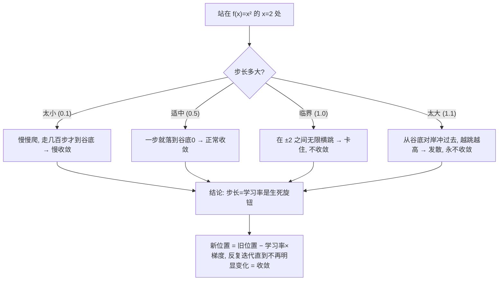
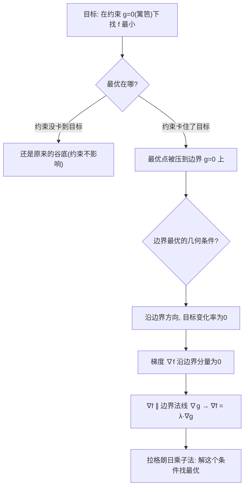

# 第 17 章 · 最优化基础——怎么找到"最好"的那个

> 本章从哪个问题出发：上一章我学会了"多变量函数"和它最陡的方向（梯度），还隐约猜到"逆着梯度走就是下坡最陡"。可看清方向，和"真的走到谷底"是两回事。一堆候选里，怎么一步步摸到"最优"的那个？
> 推导到哪个结论：优化是"沿着下降方向一步步逼近谷底"；梯度下降靠"沿最陡下降走一小步 + 反复迭代"摸到局部最优，而"走多大步"（学习率）直接决定会不会收敛；当目标被约束绑住时，拉格朗日乘子法告诉你"在边界上找最优点"。这是训练神经网络的核心动作。

> 核心认知：上一章你学会了看"函数山"的方向，知道逆着梯度就是下坡最陡。可"知道往哪走"不等于"真能走到谷底"——你得真的迈开腿，一步步走。**梯度下降**就是那个最朴素的走法：每走一步，看脚下的梯度，往"下降最陡"的方向迈一小步，到了新地方再看新梯度再走，一步一步逼近谷底。但这里藏着一个致命的旋钮——**你这一步迈多大（学习率）**：迈小了，走一千年到不了；迈大了，一步从谷底对岸冲过去，反而越走越高，永远"收敛"不了。而当你的目标被一道"不能越过的篱笆"（约束条件）绑住时，光顺着梯度走会撞墙——**拉格朗日乘子法**告诉你：在约束的边界上，最优的那个点，恰好是"目标下坡方向"和"篱笆边界"对齐的地方。**"沿着下降方向一步步逼近谷底 + 在边界上找最优"，这两件事，正是让神经网络学会一切的核心动作。**

## 引子

老屋的客厅里，那台落满灰的老收音机正"刺啦刺啦"地响，声音忽大忽小，中间还夹着"滋滋"的杂音。我蹲在它跟前，伸手去拧那个调台的旋钮。

"怪了。"我边拧边说，"我拧到一个位置，声音清楚了一点，可再往右拧一点点，又糊了；往左拧，更糊。**感觉这旋钮有个'最清楚'的位置，可我怎么也说不准它到底在哪儿。**"

老谟靠在窗边，手里端着一杯凉茶，看戏似的瞧了我一眼："你先告诉我，你现在是怎么找那个'最清楚'的位置的？"

"还能怎么找？"我叹了口气，"就是凭耳朵，**往声音变清楚的方向拧一点，发现更糊了就退回来，发现更清楚了就继续拧。** 一来一回，慢慢逼近。可这法子笨死了，每次都得试来试去，还老怕拧过头。"

"你嫌它笨。"老谟把茶杯放下，"可你知道吗——**你这个'笨办法'，就是让所有机器学会东西的那个核心动作。** 你把'声音清不清楚'当成一个要'最大'的目标，把'旋钮位置'当成要调的参数，你'凭耳朵往更清楚的方向拧、还怕拧过头'，这件事翻译成数学，就是这章的整个课题。上一章你学会了看'函数山'的方向，这一章，我们就来较真那个'迈开腿一步步走'的过程——**一堆候选里，怎么一步步摸到'最好'的那个？**"

我握旋钮的手顿在半空，看着那台老收音机，一时没接上话。

## 对话引擎

### 第 1 轮：先别急着说"走到"，先把"往哪走、走几步"这两件事拆开

**老谟**："你说你是'往声音更清楚的方向拧'。那我问你——**你凭什么知道'哪个方向是更清楚'？** 你是不是得先试一下：拧往左一点，听听，发现糊了，知道'左不是方向'；拧往右一点，听听，清楚了，知道'右是方向'？"

**造物主**："……对！我得先试。**我不知道旋钮往哪是更清楚，得先拧一下、对比一下'这一边是变好还是变坏'，才能判断方向。** 就像下山，我得先探探脚下哪个方向是往下。"

**老谟**："好，你摸到'先判断方向'这一步了。那你再想想——**方向知道了，你接下来最怕什么？** 你刚才自己说的，'怕拧过头'。"

**造物主**："怕拧过头！**我知道该往右拧，可我拧太大一步，直接从'最清楚'那边冲过去了，反而又糊了。** 所以我不光要知道往哪走，还得管住'这一步走多大'——走太大冲过头，走太小半天挪不到。"

**老谟**："你把'优化'这件事，自己拆成了两半：**一半是'往哪走'（方向），一半是'走多大步'（步子）。** 上一章你已经有方向了——逆着梯度就是下坡最陡。那这一章的头一个问题就冒出来了：**方向有了，这个'步子'该怎么定？** 你先别急着回答，我先让你走一遍看会出什么事。"

---

**📐 知识锚点：优化的两件套——"方向"与"步长"**

【概念深挖】老谟逼着造物主把"找最好"拆成两件事，这是本章的骨架：
- **方向（direction）**：往哪个方向走，能更快靠近最优。上一章已给出——**沿梯度反方向（下降最陡）**。
- **步长（step size）**：这一步迈多大。步长太小，走得慢；步长太大，会从谷底另一头冲过去，反而更差。

一个"目标函数" f，我们要找它的最小值。最优化（optimization）就是回答：**怎么调整输入（参数），让 f 尽可能小。** 而"调参"这件事，永远绕不开"往哪调、调多少"这两个问题。

**为什么"最优化"这么重要**：因为几乎所有"让机器变聪明"的动作，底层都是"找一个函数的最小/最大值"——训练神经网络是"让误差函数最小"，曲线拟合是"让偏差平方和最小"，物流是"让成本最小"。**优化，就是"找最好"这门手艺的通称。** 而这一章的主角——梯度下降——是其中最朴素、也最通用的一招。

【历史溯源】"找函数的最大/最小值"，是微积分诞生时就被盯上的目标——**牛顿用导数找行星轨道极值，费马更早用"切线水平"找最值点**（第6章已经提过）。但"手算找极值"（解 f′=0）有个致命前提：**你得会求导、能解方程。** 到了现实世界，误差函数常常复杂到没法求导、没法解方程，于是 19-20 世纪的数学家开始思考"不用解方程、用一步步迭代逼近"的路子。**"迭代逼近最优点"的思想，早在 1847 年就被法国数学家柯西（Cauchy）用来解方程，而把它变成"沿着最陡下降一步步走"的标准算法，则是近代优化理论的事——它最终在深度学习时代，成了让机器学会一切的同义词。**

---

### 第 2 轮：亲手走一遍梯度下降——看"步子太小"和"步子太大"各自的下场

**老谟**："咱们不空谈，亲手走一遍。**假设目标函数就是最简单的 f(x) = x²，它的谷底在 x=0。** 你现在站在 x=2 那里。上一章你学过，f 的导数 f′(x)=2x，所以谷底在 x=0、x>0 时导数>0。**你现在要往下走到谷底，第一步该往哪走？**"

**造物主**："……f′=2x，在 x=2 处是 4，正的。**下降最陡是逆着导数走，所以往负方向走——往左挪。** 我挪一小步，比如 x 从 2 变成 1.5？"

**老谟**："好，你把'新位置 = 旧位置 − 导数×步长'这套走法，自己走几遍。**我先给你定个'小步长'（比如每次只挪 0.1），你从 x=2 开始，一步步给我算出走几步后到哪儿了。**"

**造物主**："……从 x=2 开始，步长 0.1，每次新位置 = 旧位置 − 2×旧位置×0.1。
第 1 步：2 − 2×2×0.1 = 2 − 0.4 = 1.6
第 2 步：1.6 − 2×1.6×0.1 = 1.6 − 0.32 = 1.28
第 3 步：1.28 − 0.256 = 1.024
第 4 步：1.024 − 0.2048 ≈ 0.8192
……老谟，这走得也太慢了！走了四步才从 2 挪到 0.82，要凑到谷底 0，得走不知道多少步。"

**老谟**："慢就对了，你看到'步长太小'的下场了。那我把步长加大——**改成 1.1，你从 x=2 再走一遍，给我看看会发生什么。**"

**造物主**："步长 1.1……新位置 = 旧位置 − 2×旧位置×1.1 = 旧位置 − 2.2×旧位置 = −1.2×旧位置。
第 1 步：2 × (−1.2) = −2.4
第 2 步：−2.4 × (−1.2) = +2.88
第 3 步：2.88 × (−1.2) = −3.456
……老谟！**这不但没往谷底走，反而在 0 的两边越跳越远、越来越大！** 这步长也太大了，直接从谷底冲过头，冲过头又接着冲过头，完全发散、永远收敛不了！"

**老谟**："你自己亲手撞上了'步长太大→发散、步长太小→太慢'这两堵墙。那现在你猜——**中间有没有一个步长，既不发散、又走得够快？** 你手里的算式是'新位置 = 旧位置 × (1 − 2×步长)'，你自己挑一个'不大不小'的步长，走一遍看看。"

**造物主**："……我挑 0.5？那 1 − 2×0.5 = 0，所以新位置 = 旧位置 × 0 = **直接落到 0**！一步就到谷底了！咦，还有比这更神的？"

**老谟**："0.5 对 x² 这种函数是'一步到谷底'，算是个'正中靶心'的步长。那我把步长推到 1.0 呢？你算算会发生什么。"

**造物主**："步长 1.0……1 − 2×1 = −1，新位置 = 旧位置 × (−1)。从 2 出发：第 1 步到 −2、第 2 步回 +2、第 3 步再到 −2……**永远在 ±2 之间来回横跳，既不往谷底走、也不发散，就这么卡在那儿动不了了！**"

**老谟**："你自己又撞上一堵更微妙的墙——**步长 1.0 是个'临界点'：它不发散，可它也不收敛，只在谷底两侧无限横跳。** 所以你现在知道了吧，'合适'的步长不是拍脑袋的：太小慢慢爬，太大直接发散，1.0 这种卡在中间的不上不下——**真正的'适中'，得在 0 和 1 之间挑一个能收敛的，比如你刚试的 0.5。**"

---

**📐 知识锚点：梯度下降——"沿最陡下降走一小步、反复迭代"**

【概念深挖】造物主亲手走完了"太小、适中、临界、太大"四种步长的下场，摸到了梯度下降的骨架。正式的动作是：

**新位置 = 旧位置 − 学习率 × 梯度**

- **学习率（learning rate）**，就是你那个"步长"的专业名字——它决定每一步迈多大。
- **梯度** 给"方向"（往哪走最陡下降），**学习率**给"步子"（走多大）。

造物主四种步长的对比，一图看懂：



读图说明：站在函数山 x=2 处，选择步长（学习率）是关键。太小（0.1）：慢慢爬、收敛慢；适中（0.5）：一步就落到谷底、正常收敛；临界（1.0）：在 ±2 之间无限横跳、卡住不收敛；太大（1.1）：从谷底对岸冲过去、越跳越高、发散。反复执行"新位置 = 旧位置 − 学习率×梯度"，直到位置不再明显变化，就说**收敛（converge）**了。

**为什么"发散"和"临界"会发生**：更新式是"新位置 = 旧位置 × (1 − 2×学习率)"。当学习率太大（1.1），因子 −1.2 的绝对值大于 1，每一步都在谷底两侧横跳且越跳越远，彻底发散；当学习率恰为 1.0，因子是 −1，绝对值恰好等于 1，于是永远在 ±2 之间无限横跳、既不靠近也不远离——这就是"临界震荡、不收敛"。**只有当因子绝对值小于 1（即 0<学习率<1）时，它才真的往谷底收敛。** 学习率是梯度下降的生死旋钮——太大发散、临界卡住、太小太慢，得挑那个"正好能收敛"的值。

【工程实践】真实世界里，学习率是机器学习工程师最常调的"超参数"之一。**太大 → 损失不降反升（发散了）；太小 → 训练半天 loss 纹丝不动（太慢）。** 工程上常用**"学习率衰减"**：先大步快走（快速接近），再逐步缩小步长（精细逼近谷底），避免最后在谷底附近来回震荡。还有各种自适应学习率的算法（Adam 等），本质都是"让不同参数走不同大小的步"。**但无论包装得多花哨，骨架永远是这一句：新位置 = 旧位置 − 学习率×梯度。**

---

### 第 3 轮：谷底不止一个——"局部最优"的坑，和"这能收敛到哪"

**老谟**："你现在会走梯度下降了，走得挺顺。那我给你挖个坑——**假设这座函数山不是光滑的一个碗，而是有很多个坑坑洼洼：一个浅坑、一个深谷，还有个不太深的洼地。** 你站在某个山坡上往下走，你的梯度下降，最后会停在哪？"

**造物主**："……停在最低那个深谷？我一路下坡，不就该滚到最深的谷底吗？"

**老谟**："那要是你出发的位置，恰恰在一座'小山包'顶上，而山包四周是个**浅坑**呢？你一路沿着下坡走，会走到浅坑底部——**可这个浅坑，根本不是整座山最低的地方，深谷在另一头，你还隔着好几座山包呢。** 你说，你的梯度下降能爬到那边那个深谷去吗？"

**造物主**："……不能！下坡只会走到我脚边最近的那个低洼处，就是那个浅坑。**除非我先往'上坡'方向爬过山包，才能到深谷——可梯度下降只会下坡，不会主动上坡，所以它到不了深谷。** 它停在那儿，就以为那儿是最低了。"

**老谟**："你自己撞上'局部最优（local minimum）'这堵墙了。**梯度下降找到的，是'从你出发位置附近能一路下坡到的那个低洼'——它可能是全山最低（全局最优），也可能只是个浅坑（局部最优）。** 它不是魔法，它只保证'你在往下走'，不保证'你停的地方是全世界最低'。** 那你说，现实里怎么办？"

**造物主**："……那我是不是得多试几个不同的出发点？从不同的地方下山，看哪个落点最低？"

**老谟**："你这句话，是工程里最朴素也最有效的招——**多点随机初始化，多试几个起点，取落点最低的那个。** 先别急着往下走，这个'局部最优'的坑，你记住了它，就算没白撞。"

---

**📐 知识锚点：局部最优 vs 全局最优——梯度下降的边界**

【概念深挖】造物主自己发现了"下坡只会到最近的低洼"，这正是**局部最优（local minimum）**的坑：
- **全局最优（global minimum）**：整个定义域里函数最小的点。
- **局部最优（local minimum）**：只是"附近这一片"最小的点，周围一步走出去都是上坡，但翻过山包还有更低的谷。

**梯度下降的真相**：它只沿着下坡方向走，所以**一旦掉进某个局部最低点，就再也出不来**——因为从那儿往任意方向走都是上坡，而梯度下降从不主动上坡。因此：
- **梯度下降不保证找到全局最优**，它只保证"你在往下走、最终停在某个局部最低点附近"。
- 工程上应对"局部最优"的常用招：**多取几个随机出发点分别跑，取落点最低的那个**（多起点/随机初始化）；或引入"动量"、"随机扰动"让过程有机会跳出浅坑。

**为什么这在机器学习里很要紧**：深度神经网络的误差函数，是极其复杂、布满坑洼的"函数山"，几乎不可能保证全局最优。**但工程实践发现：对很多问题，"找到一个够好的局部最优"就够用了**——你不需要绝对最低，只要误差低到"能用"就行。**"够好"而非"绝对最好"，是优化工程里清醒的取舍。**

【历史溯源】"梯度下降只能到局部最优"这个坑，是优化理论的老问题。**最早研究这个的是 19-20 世纪的优化数学家，他们发现纯下坡迭代极易卡在局部最低点。** 而在深度学习爆发后，这个问题变得尤其尖锐——神经网络误差面高维而崎岖。**有意思的是，后来的研究又发现：在高维空间里，"所有局部最优都很接近全局最优"这类现象并不少见**，这也让工程师敢大胆用梯度下降训练庞大的网络——**"多试几个起点 + 找到一个够好的局部最优"就成了实战标准。**

【工程实践】应对局部最优，工程里这几招最常用：
- **随机初始化 / 多起点**：从不同的随机出发点跑多次，取效果最好的。
- **动量（momentum）**：让优化"带着惯性"滚，有机会冲过浅坑。
- **随机梯度下降（SGD）**：每次只用一小批数据估计梯度，天然的随机扰动让过程不容易卡死在某一个浅坑。
**"找够好"而不是"找绝对最好"，是几乎所有真实优化问题的工程态度。**

---

### 第 4 轮：撞上"不能越过的篱笆"——约束优化，怎么在边界上找最优

**老谟**："你一路顺坡下，走得挺顺。可我还要给你添一道麻烦——**假设你下山走到一半，前面横着一道篱笆，这道篱笆你不能越过去。** 而那道'篱笆'，代表现实里的一条'约束'：比如预算不能超、材料只能用这么多、体重不能低于零。**你的目标（往下走、找谷底）被这条'篱笆'绑住了。你说，现在'最优'的那个点，该在哪？**"

**造物主**："……被篱笆挡住了？那我不能走到没被挡住的深谷里去了。**那我只能停在篱笆边上——顺着篱笆找，看篱笆上哪个点，是我能到的最低的那个。** 也就是说，最优解被压到'边界'上来了。"

**老谟**："你发现一个关键转折——**约束把'自由找谷底'变成了'在边界上找最优点'。** 那我现在问你个更细的：**假设你的目标是往下走（让 f 最小），而篱笆是'不能越过这条线'（g=0 是边界）。你站在边界上的某一点，怎么判断'这个点是不是边界上最低的'？**"

**造物主**："……我得看，沿着篱笆往两边挪，是不是都只会变高？如果沿着篱笆走，不管往左往右，目标都在变大，那这个点就是边界上最低的？"

**老谟**："你这判断太粗糙。我给你把话说精确——**在边界上那个'最优'的点，有一个非常特殊的几何性质：目标函数的'下坡方向'，跟篱笆的'切线方向'，是'对齐'的——也就是，目标函数在这一点，沿着篱笆方向'不走下坡也不走上坡'（变化率为 0）。** 你想想，为什么会这样？"

**造物主**："……因为如果沿着篱笆方向走，目标还能再降，那我就能顺着篱笆往下走，那个点就不是最低的了！**所以边界上最低的点，一定是'沿着篱笆方向走，目标变化率为 0'——想沿着边界再降也降不下去了。**"

**老谟**："你刚才那句'想沿着边界再降也降不下去了'——你自己倒回去想想，它是不是已经悄悄把答案说完了？我不多夸你，你自己掂量。那这句话，翻译成'梯度'的语言，该怎么说？你上章学的梯度，在这儿怎么登场？"

**造物主**："……目标函数 f 沿着篱笆切线方向的变化率为 0，意思就是'梯度投影到篱笆切线方向的分量为 0'？也就是……梯度跟篱笆的'法线方向'（垂直篱笆的那个方向）平行？"

---

**📐 知识锚点：拉格朗日乘子法——在"篱笆边界"上找最优的公式**

【概念深挖】造物主自己推出"边界最优 = 沿边界方向目标变化率为 0 = 梯度与篱笆法线平行"，这正是**拉格朗日乘子法（Lagrange multiplier method）**的几何真相。老谟在这里落锤命名：

- 目标：在约束 g(x,y)=0（那道"篱笆"）下，找 f 的最小值。
- 边界上最优点的条件：**目标函数的梯度 ∇f，与约束边界的法线 ∇g 平行**，即 **∇f = λ·∇g**（λ 叫拉格朗日乘子）。
- 几何直觉：在边界最优处，**目标函数 f 在"沿边界方向"上不升不降**——想沿着边界继续降，已经降不动了；此时 f 的梯度恰好垂直于边界（指向"篱笆外"或"篱笆里"），于是跟边界的法线 ∇g 对齐。

**为什么这条等式成立**：如果最优处 ∇f 不跟 ∇g 平行，那么 ∇f 就有一个"沿边界方向"的分量——那分量要么让 f 沿边界继续降（那就不该停在这儿），要么让 f 沿边界继续升（那可以走回更低的点）。**只有当 ∇f 沿边界方向分量为 0（即 ∇f ⊥ 边界、∇f ∥ ∇g）时，沿边界无论怎么走都降不下去，那才是边界最优。**



读图说明：在约束 g=0 下找 f 最小。若约束没卡到谷底，最优还是原谷底；若约束卡住了，最优点被压到边界上。边界最优的几何条件是"沿边界方向目标变化率为 0"，翻译成梯度就是"∇f 与边界法线 ∇g 平行"，即 ∇f = λ·∇g——这就是拉格朗日乘子法的核心。

【历史溯源】**拉格朗日乘子法由意大利-法国数学家拉格朗日（Joseph-Louis Lagrange）在 18 世纪提出**——他研究力学里的约束系统（比如"绳子系着的小球只能在固定轨迹上运动"）时，发现"受约束的最值"可以这样处理。**它的意义在于：把"带约束的最优化"这个看起来无从下手的难题，变成"解一组方程（∇f=λ·∇g）"的机械步骤。** 直到今天，这个"引入一个乘子 λ、把约束折进目标"的思路，仍是优化理论最经典、最优雅的工具之一。

【工程实践】拉格朗日乘子法在工程里是"在限制下求最优"的标准工具：
- **经济/运筹**：预算固定时，怎么分配资源让利润最大——约束是"预算不能超"。
- **机器学习**：带正则化的模型（如限制权重大小的 L2 正则），本质就是"在权重不能太大的约束下，让误差最小"；**支持向量机（SVM）的推导，更是拉格朗日乘子法的招牌应用**。
- **物理**：在"只能沿着某条轨迹动"的约束下，求系统的最稳状态（最小势能）。
**"目标 + 约束"是现实里最常见的最优化问题形态，而拉格朗日乘子法，就是为它而生的刀。**

---

### 第 5 轮：动手造——用 Python 模拟梯度下降，亲眼看学习率怎么决定收敛

**老谟**："你讲了这么多，咱们按老规矩，把它造出来。**给你一个函数 f(x)=x²，从 x=2 出发做梯度下降。我想让你用 Python 分别用学习率 0.1、1.0、1.1 跑一遍，看看三种情况下'每一步的 x 值'分别长什么样。**"

**造物主**："……那我就是写个循环：新位置 = 旧位置 − 学习率×2×旧位置，重复很多步，把每步的 x 打出来。小步长 0.1 慢慢逼近 0，步长 0.5 一步落到 0，步长 1.0 在 ±2 横跳卡住，步长 1.1 会……越来越大、发散。"

**老谟**："你自己把四种结果都预判到了。动手，把它跑出来，亲眼看它长什么样。"

---

**📐 知识锚点：【实现思考】用 Python 模拟梯度下降，观察学习率对收敛的影响**

【实现思考】"看懂梯度下降"到"能造梯度下降"，就差一个循环。把四种学习率跑一遍，学习率对收敛的影响一目了然：

```python
def gradient_descent(lr, start=2.0, steps=10):
    """对 f(x)=x² (导数 f'=2x) 做梯度下降, 返回每一步的 x 值"""
    x = start
    trace = [x]
    for _ in range(steps):
        x = x - lr * (2 * x)   # 新位置 = 旧位置 − 学习率×梯度
        trace.append(x)
    return trace

for lr in [0.1, 0.5, 1.0, 1.1]:
    trace = gradient_descent(lr)
    print(f"学习率={lr:<4} 各步 x:", [round(v,3) for v in trace])
# 学习率=0.1  各步 x: [2.0, 1.6, 1.28, 1.024, 0.819, 0.655, 0.524, 0.419, 0.336, 0.268, 0.215]  → 慢吞吞逼近0
# 学习率=0.5  各步 x: [2.0, 0.0, 0.0, 0.0, ...]                                                 → 一步落到谷底0, 正常收敛
# 学习率=1.0  各步 x: [2.0, -2.0, 2.0, -2.0, 2.0, -2.0, ...]                                   → 临界: 在±2横跳, 卡住不收敛
# 学习率=1.1  各步 x: [2.0, -2.4, 2.88, -3.456, 4.147, -4.977, ...]                            → 太大: 越跳越大, 发散
```

**为什么这么造**：对每个学习率，反复执行"新位置 = 旧位置 − 学习率×梯度"这个循环，把轨迹记下来。**四组对比**：0.1 是"太小"——x 在一点点逼近 0 但很慢；0.5 是"适中"——一步就落到谷底 0、正常收敛；1.0 是"临界"——在 ±2 之间无限横跳、既不靠近也不远离、永远不落地（因子 1−2×lr 恰为 −1）；1.1 是"太大"——x 绝对值每一步都变大，彻底发散。**代价**：真实问题里目标函数复杂得多、维度高得多，数值梯度又要算很多次函数值，开销大；而且函数不光滑时，这个朴素的梯度下降很容易卡在局部最优。**换条路会怎样**：如果加"学习率衰减"（步子逐步变小），1.0 那种横跳也能被压下来慢慢收敛；如果加"动量"，能更快冲过浅坑。**但核心还是那句——学习率是生死旋钮，而这个循环是它背后的全部动作。**

【工程实践】这一小段循环，就是真实神经网络训练的心脏。**每一个"把误差往下降"的训练过程，底层都是这个"新位置 = 旧位置 − 学习率×梯度"的循环**，只是梯度换成用反向传播（backpropagation）算出来、参数成千上万、每一步跑在小批数据上。工程师调"学习率"这个旋钮，就是在调这个循环的生死；观察"损失函数随步数的曲线"（loss curve），就是在看它收敛还是发散。**你亲手写出的这几行，正是让机器学会一切的最小引擎。**

---

### 第 6 轮：落点——优化是"沿下降方向一步步逼近谷底"；约束优化是"在边界上找最优"

**老谟**："收音机那个旋钮，你现在能告诉我，你怎么找'最清楚'那个位置了吗？"

**造物主**："……我凭耳朵判断'往哪个方向拧声音更清楚'（判断方向），然后**往更清楚的方向拧一小步，但控制好别拧太大（控制学习率），反复拧（迭代），直到声音不再明显变化（收敛）。** 可我还得小心，可能拧进的是一个'局部最清楚'的坑，旁边也许还有更清楚的台（局部最优）；要是还撞上'只能在这个频段里调'的约束，我就只能在边界上找最清楚的那个点（拉格朗日乘子法）。"

**老谟**："你把你这个'找最好'的动作，从头到尾说全了。那你还记得这一切的起点吗？"

**造物主**："起点是上一章那支梯度箭——我学会了看'函数山'的最陡方向。**这一章我把'看清方向'变成了'真的走到'：顺着最陡下降走一小步、反复迭代逼近谷底（梯度下降），管住步子大小（学习率），认命于'可能只是局部最优'，遇到约束就在边界上找最优（拉格朗日乘子法）。**"

**老谟**："你说到根上了。那我要问你一个往前的事——**你这一章找的，都是'给定一个函数，找它的最值'。可你有没有想过：训练一个神经网络，那个'要找最小的函数'（误差函数），它本身长什么样、又是谁构造出来的？**"

**造物主**："……误差函数？就是预测跟真实的差距？可我没想过它具体是什么样、怎么来的……这好像连着下一章的事。"

**老谟**："你摸到下一章的门了。**你学会了'怎么找最好'（优化），下一章我们就来学'要找的东西到底是什么、它从哪来'——把一堆数据喂进去，构造出那个误差函数，再用你这一章的手艺去最小化它。** 优化是'怎么找'，而把数据和要找的目标连起来，就是机器学习真正落地的第一步。你先把'沿梯度下坡'这套手艺收好，它要在下一章派上大用场了。"

**造物主**："……原来'找最好'只是个开头。真正的大戏，是'要找的东西从哪来'。"

---

### 📐 知识锚点·计算速查：梯度下降与拉格朗日怎么算

【适用场景】要"让某个函数最小"，或"在一条约束下找最优点"。

【梯度下降迭代步骤】（求 f 的最小值）：
1. 选起点 x₀、选学习率（步长）lr。
2. 反复执行：**新位置 = 旧位置 − lr × 梯度**（梯度给方向、lr 给步子）。
3. 直到位置不再明显变化（梯度≈0），即**收敛**到某个（局部）最低点。

【学习率四档速查】（对 f(x)=x²、从 x=2 出发，更新式"新位置=旧位置×(1−2×lr)"）：

| 学习率 | 因子 1−2·lr | 表现 |
|--------|-------------|------|
| 太小（0.1） | 0.8 | 慢吞吞逼近 0，收敛慢 |
| 适中（0.5） | 0 | 一步落到谷底 0，正常收敛 |
| 临界（1.0） | −1 | 在 ±2 之间无限横跳，卡住不收敛 |
| 太大（1.1） | −1.2 | 越跳越远，发散 |

**收敛条件**：因子 |1−2·lr| < 1，即 0<lr<1。记忆口诀：**步子太大冲过头，临界正好来回跳，适中才落谷底。**

【拉格朗日乘子法计算步骤】（在约束 g(x,y)=0 下求 f 的最小值）：
1. 写"边界最优"条件：**∇f = λ·∇g**（梯度与约束边界法线平行）。
2. 把它拆成方程组：∂f/∂x = λ·∂g/∂x，∂f/∂y = λ·∂g/∂y。
3. 再加上约束方程 g(x,y)=0，一起解出 x、y（和 λ）。
4. 例：min x²+y² 约束 x+y=2 → 得 x=y=1，最小值 f=2。
5. 记忆口诀：**梯度平行法线，联立约束解出最优。**

### 🔧 工程实践·计算案例：用 numpy 模拟梯度下降四种学习率 + 拉格朗日解约束

把"学习率决定收敛"和"拉格朗日解约束"两个动作都写成代码，亲眼看结果：

```python
import numpy as np

def gradient_descent(lr, start=2.0, steps=8):
    """对 f(x)=x² (导=2x) 从 x=start 做梯度下降, 返回每步 x"""
    x = start
    trace = []
    for _ in range(steps):
        x = x - lr * (2 * x)
        trace.append(round(x, 4))
    return trace

# 1) 四种学习率对比
for lr in [0.1, 0.5, 1.0, 1.1]:
    print(f"lr={lr}: {gradient_descent(lr)}")
# lr=0.1: 慢吞吞逼近0          [1.6,1.28,1.024,0.819,...]
# lr=0.5: 一步落到0            [0,0,0,...]
# lr=1.0: 在±2横跳,卡住        [-2,2,-2,2,...]
# lr=1.1: 越跳越大,发散        [-2.4,2.88,-3.456,...]

# 2) 拉格朗日解约束: min f(x,y)=x²+y² 使 g(x,y)=x+y-2=0
#    条件 ∂f/∂x=λ∂g/∂x, ∂f/∂y=λ∂g/∂y → 2x=λ, 2y=λ → x=y; 代入约束 x+y=2 → x=y=1
x_opt, y_opt = 1.0, 1.0
print("\n约束最优解:", (x_opt, y_opt), " 最小值 f =", x_opt**2 + y_opt**2)
# 期望: 最优解 (1,1), 最小值 2
```

期望输出：
- 四种学习率的轨迹：`lr=0.1` 慢收敛、`lr=0.5` 一步落 0、`lr=1.0` 在 ±2 横跳卡住、`lr=1.1` 越跳越大发散——**亲眼看见学习率是生死旋钮**。
- 拉格朗日解：最优解 (1,1)，最小值 f=2——**在约束线上离原点最近的点，正是梯度与法线平行处**。

**为什么这么造**：梯度下降那段，把"新位置=旧位置−lr×梯度"这个循环跑四遍，四种学习率的生死一清二楚；拉格朗日那段，把"∇f=λ∇g"拆成方程组、结合约束 x+y=2 解得 (1,1)。**代价**：手解拉格朗日对复杂约束会很难，真实场景用 scipy.optimize.minimize 等工具带约束求解；但理解"边界最优=梯度平行法线"才能看懂那些工具在干嘛。**换条路会怎样**：若只跑一种学习率看不出收敛/发散；若不懂拉格朗日，遇到带约束的优化就只能瞎猜。**两条都握在手里，才算真的会"找最好"。**

### 💡 造物主手记·计算踩坑：拉格朗日漏写约束方程

解 `min x²+y² 约束 x+y=2` 时，我列出"∂f/∂x=λ∂g/∂x、∂f/∂y=λ∂g/∂y"两条，解出 x=y，然后得意地写下"x=y=0，最小值 0"就交卷——老谟一挑眉："那你 x+y=0，可你的约束是 x+y=2，你把它扔了？" 我这才想起**光有"梯度平行"还不够，还得联立那条"篱笆"约束 g=0 才定得出具体位置**。把 x=y 代进 x+y=2，才得 x=y=1。**这个坑让我记住：拉格朗日是'梯度平行 + 约束方程'两件事的联立，漏了约束，你就只能得到'一堆平行方向'，却找不到'边界上那个具体的点'。**

### 📝 自测题·计算类

1. **场景**：f(x)=x²，从 x=2 出发，学习率取 0.5，走第一步后 x 到哪？这属于四档里哪一档？
   *简答要点*：新位置=2−0.5×2×2=2−2=0，一步落到谷底，属"适中/正常收敛"。

2. **场景**：f(x)=x²，从 x=2 出发，学习率取 1.0，走两步后 x 分别是多少？为什么收敛不了？
   *简答要点*：第1步 2−1×2×2=−2，第2步 −2−1×2×(−2)=2，在 ±2 之间横跳；因子 |1−2×1|=1，临界震荡，不收敛。

3. **场景**：要在"x+y=4"约束下最小化 f(x,y)=x²+y²。用拉格朗日条件求最优解。
   *简答要点*：∇f=λ∇g → 2x=λ、2y=λ → x=y；代回约束 x+y=4 得 x=y=2，最小值 f=8。（梯度平行法线 + 联立约束。）

---

## 知识点总结

### 知识点（本章推出的核心概念）
- **最优化（optimization）**：调整输入/参数，让目标函数尽可能小（或大）。它永远绕不开两件事——**往哪调（方向）** 和 **调多少（步长）**。
- **梯度下降（gradient descent）**：沿"下降最陡"的方向迈一小步、反复迭代逼近谷底。动作只有一句：**新位置 = 旧位置 − 学习率×梯度**，反复执行直到位置不再明显变化，即**收敛（converge）**。
- **学习率（learning rate）**：每一步迈多大，是梯度下降的"生死旋钮"。**太小收敛慢、适中正常收敛、临界（如对 x² 取 1.0）无限横跳不收敛、太大越跳越高发散**；只有让"因子 |1−2×lr|<1"才真正收敛。
- **局部最优 vs 全局最优**：梯度下降只下坡，所以一旦掉进"浅坑"（局部最优）就出不来，不保证找到全局最优；工程上用多起点、动量、随机梯度下降来应对，接受"找到够好的局部最优"。
- **拉格朗日乘子法（Lagrange multiplier method）**：在约束 g=0（"篱笆"）下找 f 的最小值。**边界最优点的条件是 ∇f = λ·∇g**（梯度与边界法线平行），即"沿边界方向目标变化率为 0"。几何含义：**约束把"自由找谷底"压成"在边界上找最优"。**
- **优化是训练神经网络的核心动作**：训练模型 = 构造误差函数 + 用梯度下降让它最小。

### 历史结论（本章涉及的史料）
- 找函数最值萌芽于牛顿、费马（用切线水平找极值、解 f′=0）；但解方程前提太苛刻，现实误差函数没法求导解方程。
- **迭代逼近最优点**的思想，1847 年柯西已用于解方程；"沿最陡下降一步步走"在近代优化理论成型，最终成为深度学习的核心算法。
- **拉格朗日乘子法**由拉格朗日（18 世纪）提出，源于力学约束系统研究，把"带约束最优化"变成解方程 ∇f=λ·∇g。
- 局部最优问题随深度学习爆发变尖锐，后续研究又发现高维里"局部最优常接近全局最优"，让工程师敢大胆训练大网络。

### 工程实践结论（本章知识在真实工程里怎么用）
- **学习率**是机器学习最常调的"超参数"：太大 loss 不降反升（发散）、太小纹丝不动（太慢）；常用"学习率衰减"（先大步后小步）和自适应算法（Adam）避免震荡。
- **观察 loss 曲线**：收敛（下降后平稳）vs 发散（震荡或升高），是判断训练是否正常的第一眼。
- **局部最优应对**：随机初始化/多起点、动量、随机梯度下降（SGD），接受"够好的局部最优"。
- **拉格朗日乘子法**：预算约束下利润最大、带 L2 正则的模型（限制权重）、SVM 推导，都是"目标+约束"形态的招牌应用。
- **数值梯度**：训练时可用 `(f(x+h)-f(x-h))/(2h)` 验证反向传播算出的梯度是否正确。

## 向导便签

> 这一章咱们干了什么：从一台老收音机、一个"怎么调最清楚"的旋钮，一路逼到"怎么找到最好"。你亲手拆出"方向 + 步长"两件套，用 f(x)=x² 亲手走完"太小→慢、适中→一步到谷底、临界→横跳卡住、太大→发散"四种下场，撞上"局部最优"的墙，又推出"约束下最优在边界上"的几何条件，最后用 Python 模拟梯度下降，亲眼看学习率怎么决定收敛。
>
> 钉死一句话：**优化 = 沿下降方向一步步逼近谷底；学习率是生死旋钮（太小太慢、太大发散）；约束把"自由找谷底"压成"在边界上找最优"——拉格朗日乘子法 ∇f=λ·∇g 就是那把刀。**
>
> 记住：**你这一章造出来的"沿梯度下坡"手艺，正是训练神经网络的核心动作。** 而你还没问的是——那个"要找最小的函数"（误差函数），到底长什么样、从哪来？那是下一章的事。

## 造物主手记

**我曾踩的坑**：

我最开始以为"找最好"就是把所有候选都试一遍，被老谟一句话点破——**很多函数根本试不过来，得靠"判断方向 + 控制步长"一步步迭代。** 还有一次我差点以为梯度下降保证能找到"全世界最低"，结果老谟让我想"从一个浅坑旁出发会怎样"，我才意识到**它只下坡、不会主动上坡，所以可能卡在局部最优**。写 Python 模拟时，我一开始没把学习率分开测，混在一起看不出差别，后来分四组一对比，"0.5 一步落到谷底、1.0 卡在 ±2 横跳、1.1 越跳越高"看得清清楚楚——**原来学习率真的是生死旋钮，连"临界卡住"这种不上不下的坑都有。**

**顿悟时刻**：

真正开窍是"步长 1.1 会从谷底对岸冲过去、越跳越大"那一下——我亲手算出 2 → −2.4 → 2.88 → −3.456，才发现"步子太大"不是"走过头一点"，是"彻底发散、永不落地"。而步长 1.0 那个"在 ±2 之间横跳、既不靠近也不远离"的临界，比发散还让我后背发凉——**原来除了"走太慢、走太快"，还有个"刚好卡住"的临界坑。** 更震动的是拉格朗日那一下：**"边界最优 = 沿边界方向目标变化率为 0 = 梯度与篱笆法线平行"**，我把"约束下怎么找最优"从一团乱麻，想成了一句漂亮的几何条件。原来"在限制下求最好"不是猜，是有公式的。

## 自测题

1. **辨析**：有人说"梯度下降就是一直往下走，走到底就是全局最优"。严谨吗？
   *简答要点*：不严谨。梯度下降只保证"沿下坡走、停在某个局部最低点附近"，可能卡在局部最优（浅坑）；不保证全局最优。应对靠多起点、动量、随机扰动。

2. **换算**：对 f(x)=x²，从 x=2 出发，学习率取 1.0，走第一步后 x 到哪？为什么这个学习率"卡住"了？
   *简答要点*：x = 2 − 1.0×2×2 = −2；再走又回 2，在 ±2 之间反复横跳、永远不落地——学习率过大（临界值），不收敛。

3. **找茬**：有人说"学习率越大，收敛越快，所以尽量往大里调"。错在哪？
   *简答要点*：学习率太大，会从谷底对岸冲过去、越跳越高，导致发散、永不收敛；恰为临界值（对 x² 取 1.0）则无限横跳、不收敛；太小则收敛慢。要取"正好能收敛"的值，过大反而坏事。

4. **推算**：梯度下降的更新公式是什么？"收敛"指的是什么现象？
   *简答要点*：新位置 = 旧位置 − 学习率×梯度；收敛指反复迭代后位置不再明显变化（停在了某个局部最低点附近），loss 下降后趋于平稳。

5. **判断**：为什么约束优化里，最优解常出现在"边界"上？边界最优的梯度条件是什么？
   *简答要点*：因为若约束卡住了目标，就只能在边界上找最低；边界最优处"沿边界方向目标变化率为 0"，即 ∇f 沿边界分量为 0、∇f 与边界法线 ∇g 平行，即 ∇f = λ·∇g。

6. **实现题**：用 Python 对 f(x)=x² 从 x=2 出发，分别用学习率 0.1、0.5、1.0、1.1 做梯度下降，打印每步 x，说明四种结果。
   *简答要点*：0.1 慢吞吞逼近 0（收敛慢）；0.5 一步落到谷底 0（适中收敛）；1.0 在 ±2 横跳卡住（临界不收敛）；1.1 绝对值逐增、发散。体现学习率对收敛的决定性。

7. **开放推导**：你想在"总预算 100 元"的约束下，分配买 A、B 两种原料让利润最大。如何用这一章的思路找最优解？
   *简答要点*：把利润当目标函数 f(A,B)、预算当约束 g(A,B)=100；最优点在边界 g=100 上，用拉格朗日乘子法解 ∇f=λ·∇g，找到"沿预算线方向利润变化率为 0"的那个分配点。

## 预告

你这一章学会了"怎么找到最好"——顺着梯度一步步下山，管住步长，认命局部最优，撞上篱笆就上拉格朗日。至此，《数学基础》这一册，你也走到了收官。

你回头看看这一路，会发现一条清晰的主线：**我们一直在做两件事——把世界翻译成数学，再用数学找到"最好"。** 数的编码，让机器能表示；逻辑、集合、函数，让机器能描述规则；导数、积分、级数、多元微积分，让机器能量"变化"；向量、矩阵、特征值，让机器能处理"高维"；概率、统计、分布，让机器能面对"不确定"；图与可计算性，让机器知道"什么能算"；而最优化，让机器能"从无数个可能里挑出最好的那个"。

这几块拼起来，就是一件完整的事——**让一台只会加减乘除的机器，从数据里"学"出规律**：数据被翻译成函数（矩阵、概率、分布），误差被定义成目标（期望、方差、拟合），最优化负责把它压到最小（梯度下降、拉格朗日）。你这一册打下的，正是**机器学习的全部数学地基**。

下一册，我们要把这些抽象的数，走回最实在的机器——**从逻辑到芯片**：看一台真实的电脑，怎么把"逻辑"变成"门电路"、把"二进制"变成"电流"、把"一步一步的规矩"变成真的跑起来的程序。你带着"翻译能力"、"边界意识"和"找最好的手艺"，去亲手揭开那台机器。

数学的地基，你已经打牢了。
